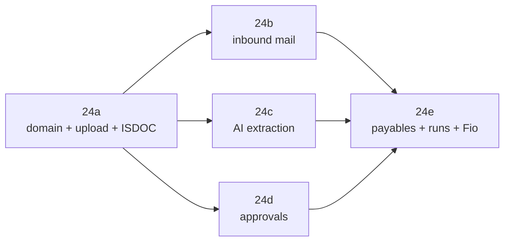

# Plan — Incoming invoices (přijaté faktury)

**Status:** Planned — ready for implementation

**Branch:** `feat/incoming-invoices`

**ADRs:** [0031](../../docs/decisions/0031-incoming-invoice-payable-ledger.md) ·
[0032](../../docs/decisions/0032-inbound-email-capture-resend.md) ·
[0033](../../docs/decisions/0033-fio-payment-initiation-bank-signed.md)

**Specs:** [incoming invoices](../../docs/specs/incoming-invoices.md) ·
[inbound email capture](../../docs/specs/inbound-email-capture.md) ·
[payables, payment runs, Fio](../../docs/specs/payables-payment-runs-fio.md) ·
[research](../../docs/research/incoming-invoices.md)

## Goal

Own the supplier invoice end to end: collect it from a mailbox or an upload,
read it, confirm it, route it through approval, plan its payment, submit the
batch to Fio for the customer to authorize, and reconcile the debit back onto
the payable.

## Read before starting

1. [`docs/specs/incoming-invoices.md`](../../docs/specs/incoming-invoices.md) —
   the domain contract. Records, statuses, invariants, rules, permissions.
2. The ADR for the sub-plan you are on. The decisions in them are settled; a
   change needs a new ADR, not an edit.
3. `packages/db/src/payments-repo.ts` and
   `packages/payment-core/src/matcher.ts` — the payables side mirrors these
   deliberately. Match their shape rather than inventing a parallel style.

## Non-negotiables

- **Three gates stay three gates.** Accept, approve, and pay are separate
  decisions by separate actions. Nothing may collapse them.
- **Nothing marks a payable paid except a confirmed allocation.** Not a
  submission, not an approval, not a run.
- **Invoicey never authorizes a payment.** Every string the user reads about a
  submitted batch says it is waiting for their authorization in Fio.
- **Extraction never produces a trusted record.** ISDOC may pre-fill everything;
  a person still passes gate 1 on anything that is not deterministic.
- **A new beneficiary account blocks a payment run** until someone confirms it.
- Server Actions are the only mutation surface (ADR 0016); workspace scope is
  always re-derived from the session.
- Money is `numeric(_, 2)` decimal strings with minor-unit arithmetic in
  `@invoicey/payment-core`. No new money representation.
- Czech-first copy, `cs` + `en` catalogues, both filled in the same commit.
- Schema changes ship as checked-in SQL under `packages/db/sql/`. Never run an
  unattended `db:push` against production.

## Delivery order

24b, 24c, and 24d are independent once 24a lands and may run in parallel. 24e
needs all of them.

---

### Plan 24a — Domain foundation, upload, ISDOC, accept

The vertical slice that makes everything else possible: a document goes in, a
reviewed incoming invoice comes out.

**Build**

- [ ] Schema: `inbox_items`, `inbox_aliases`, `incoming_documents`, `suppliers`,
      `supplier_bank_accounts`, `incoming_invoices`, `incoming_invoice_lines`,
      `incoming_invoice_documents` — Drizzle definitions plus
      `packages/db/sql/2026-08-16-plan24a-incoming-invoices.sql`
- [ ] Partial unique indexes: supplier IČO / name identity, document `sha256`,
      the invoice duplicate-identity index from the spec
- [ ] `parseIsdocAsIncoming` in `@invoicey/invoice-core/isdoc` — inverted party
      mapping, VAT breakdown, payment means, lines
- [ ] Reuse `extractIsdocFromPdf` for the PDF/A-3 rung
- [ ] Supplier resolution: normalize IČO, upsert, enrich from ARES on first
      sight, record every beneficiary account seen with `confirmed_at = null`
- [ ] Validation module producing the exception codes in the spec
- [ ] Accept service: invariant checks, duplicate block, supplier upsert,
      `retain_until`, audit event
- [ ] UploadThing route `incomingInvoiceDocument` + `/incoming-invoices/upload`
- [ ] `/incoming-invoices` queue (Ke zpracování / Vše) on the ReUI Data Grid
      shell
- [ ] `/incoming-invoices/[id]` two-pane detail: document viewer, editable
      fields, exception panel, audit trail
- [ ] `/suppliers` list and detail with known accounts and invoice history
- [ ] Sidebar entry with a pending badge; `cs` + `en` catalogues
- [ ] Short-lived server-issued document URLs — no public links in list payloads

**Do not build:** mail capture, AI extraction, approval rules, payment runs,
Fio submission, debit ingestion.

**Exit**

- [ ] Uploading a week of PDFs and ISDOCs produces one reviewable row each
- [ ] An ISDOC invoice arrives with every header field, VAT breakdown, and line
      already filled, and its customer IČO routes it to the right issuer
- [ ] Re-uploading the same file attaches to the existing invoice rather than
      creating a sibling
- [ ] A second invoice with the same supplier and number is blocked and links to
      the original
- [ ] Accepting is refused while a required field is empty, with the field named
- [ ] Deleting an accepted invoice inside its retention window is refused with an
      explanation

**Gate:** the duplicate index and the accept invariants are enforced in the
database and in tests before any other sub-plan starts writing rows.

---

### Plan 24b — Inbound email capture

**Operator prerequisites** (block the sub-plan, not the coding):

- [ ] Receiving domain `inbox.invoicey.ditrich.me` added in Resend
- [ ] MX record on that subdomain, priority 10, lowest on the name
- [ ] `email.received` webhook created; secret in `RESEND_INBOUND_WEBHOOK_SECRET`
- [ ] `INVOICEY_INBOUND_EMAIL_DOMAIN` set per environment
- [ ] Privacy policy and processor list updated for inbound content

**Build**

- [ ] `inbox_aliases` management: create on first visit, copy, rotate,
      per-issuer aliases, audit on rotation
- [ ] `/api/webhooks/resend-inbound` — Svix verification with the dedicated
      secret, alias resolution, daily cap, idempotent insert, fast `200`
- [ ] Ingest job: fetch body and attachments, MIME allow-list, byte caps,
      `sha256`, dedupe, UploadThing storage, `auth_results`, forward-sender
      parsing
- [ ] Cron sweep for items stuck in `received` / `processing`, with backoff and
      a terminal `failed`
- [ ] Deterministic classifier; `unknown` parks for a human
- [ ] `/incoming-invoices/inbox` with reclassify and a manual "create invoice
      from this document" action
- [ ] Per-workspace limits and visible rejection rows
- [ ] Settings page section explaining forwarding, with the address and a
      warning that it is a bearer capability

**Exit**

- [ ] A supplier mail sent to the alias appears as a reviewable invoice with the
      original stored, with nobody touching a file
- [ ] A forwarded mail resolves the original sender for display and still stores
      the attachment correctly
- [ ] A bank statement PDF and a marketing mail are parked as non-invoices and
      never enter the review queue
- [ ] Replaying the same webhook delivery changes nothing
- [ ] An unknown alias is ignored without storing anything
- [ ] Over-cap mail produces a visible rejected item, never a silent loss

**Gate:** signature verification, alias resolution, and idempotency are covered
by tests against a faked Resend boundary before the webhook is enabled in any
deployed environment.

---

### Plan 24c — AI extraction and the exception queue

**Build**

- [ ] `INVOICEY_AI_EXTRACT_MODEL` env plumbed through `@invoicey/env`
- [ ] Extraction service: AI Gateway `generateObject`, strict Zod schema, the
      PDF as a file part, per-field confidence, a prompt that forbids guessing
      IČO / account numbers / dates
- [ ] Token metering: `assertHasTokens` before, `recordLlmUsage` after, product
      tag `incoming_invoice_extract`; out-of-tokens degrades to `skipped` with a
      prompt, never a hard failure
- [ ] AI classifier fallback for documents the deterministic rules cannot place
- [ ] Full validation pass wired to the exception codes
- [ ] Accept screen: confidence styling, low-confidence fields focused first,
      re-extract action with a diff against the previous attempt
- [ ] Exception bucket on the queue with counts per code

**Exit**

- [ ] A plain supplier PDF with no ISDOC lands with the header fields filled and
      the uncertain ones visibly marked
- [ ] An illegible or non-invoice document produces nulls and an exception, not
      invented values
- [ ] VAT arithmetic and IBAN/IČO checks catch a deliberately corrupted fixture
- [ ] A workspace with no AI tokens still captures, stores, and classifies
- [ ] Extraction usage appears in Settings → Usage under its own product tag

**Gate:** no AI-extracted invoice can reach `accepted` without a human action,
proven by a test.

---

### Plan 24d — Approval rules and tasks

**Build**

- [ ] `approval_rules` and `approval_tasks` schema plus SQL
- [ ] Versioned conditions/path JSON schemas in Zod, validated on save
- [ ] Evaluator: priority ordering, first match, currency-guard rejection at
      save time, `auto_approve` cap, `new_beneficiary_account` override,
      four-eyes exclusion, unreachable-path fallback
- [ ] Task lifecycle: `one_of` sibling cancellation, `all_of` completion,
      `sequence` progression, rejection cascade, request-changes return
- [ ] `/incoming-invoices` → Ke schválení tab, scoped to my tasks and all open
- [ ] Approve / reject / request changes with mandatory reasons on the negative
      paths
- [ ] Notification emails on task assignment via `@invoicey/emails`, both
      locales, bank details masked
- [ ] `/settings/incoming-invoices` rules table with priority reordering, a
      dry-run preview against recent invoices, and the workspace fallback path
- [ ] Approvals off by default: a workspace with no rules uses a fallback that
      auto-approves, so a solo user never meets a gate they did not ask for

**Exit**

- [ ] An accepted invoice creates tasks for exactly the people a rule names
- [ ] The user who accepted cannot be the sole approver
- [ ] A capped `auto_approve` rule passes a small trusted-supplier invoice and
      refuses the same invoice once its beneficiary account is new
- [ ] A `sequence` path creates step 2 only after step 1 completes
- [ ] Rejecting cancels outstanding tasks and records the reason
- [ ] A workspace with zero rules behaves exactly as it did before this sub-plan

**Gate:** the evaluator has unit coverage for every guardrail in the spec before
any rule can be created in a deployed environment.

---

### Plan 24e — Payables, payment runs, Fio submission, reconciliation

**Build**

- [ ] `payment_runs`, `payment_run_lines`, `payable_payment_allocations`,
      `payable_match_proposals` schema plus SQL
- [ ] Payable calendar with buckets, filters, balances, and projected balance
- [ ] Run assembly: create from selection, add, drop with reason, edit amount,
      eligibility reasons rendered per row
- [ ] Confirmation freezing beneficiaries onto lines
- [ ] `bank_connections` payment-token columns, `access_mode` transition,
      settings UI with expiry warnings and an explicit "Invoicey cannot
      authorize payments" statement
- [ ] `packages/payment-core/src/fio-import.ts` — XML builder with strict
      element ordering, escaping, truncation, 2 MB split
- [ ] `submitFioImport` transport plus response parser for every `errorCode` /
      `status`, `sumDebet` assertion
- [ ] Submission service: compare-and-swap to `submitting`, retry only from
      `failed`, ambiguous-timeout handling, full audit per attempt
- [ ] Post-submission UI and email: batch id, totals, masked accounts, the
      authorization instruction
- [ ] Debit ingestion via `import_scope`, leaving credit matching untouched
- [ ] `proposePayableMatches` + `isExactAutoMatchPayable`, auto-confirm off by
      default
- [ ] Allocation service mirroring `payments-repo.ts`, with reversal and run
      closure
- [ ] Dashboard: cash due by bucket beside connected-account balances

**Exit**

- [ ] A run assembled from a week's payables, confirmed, and submitted appears
      as a batch in Fio's orders-to-sign queue with a matching total
- [ ] A payable with an unconfirmed beneficiary account cannot enter a run
- [ ] Editing a supplier after confirmation does not change what gets sent
- [ ] A rejected batch shows Fio's own message and can be retried after a fix;
      a successful one cannot be resubmitted
- [ ] The debit from the authorized payment matches back to its payable and
      moves it to `paid`
- [ ] Nothing in the product reads "paid" or "sent" between submission and the
      matched debit
- [ ] Re-running a sync neither duplicates nor loses a debit

**Gate:** one controlled live pilot — a single small real payment, authorized in
Fio by the account owner — before the submit token can be entered by anyone
else. Keep payable auto-confirmation disabled through the pilot.

---

## Verification, every sub-plan

- [ ] `bun run typecheck`
- [ ] `bun run lint`
- [ ] `bun run test`
- [ ] `bun run build` for web-touching work; Playwright for the queue, accept,
      approval, and run flows
- [ ] Prettier over touched docs
- [ ] Both `cs` and `en` catalogues updated in the same commit
- [ ] Deslop pass before commit or PR
- [ ] Diff contains no token, real IBAN, real IČO, or unredacted supplier
      document
- [ ] Migration SQL reviewed by hand and applied per environment; roadmap entry
      updated with what actually shipped

## Sequencing note for parallel agents

24b, 24c, and 24d touch mostly disjoint files, but all three add rows to
`incoming_invoices` and all three add catalogue keys. Land 24a's schema and
locales first, then coordinate on:

- `packages/db/src/schema.ts` — one owner per sub-plan's tables, appended, never
  reordered
- `apps/web/locales/{cs,en}.json` — namespace per sub-plan
  (`incomingInvoices.inbox`, `.extract`, `.approvals`, `.runs`)
- `apps/web/app/(app)/(gated)/incoming-invoices/page.tsx` — tabs added, not
  rewritten
