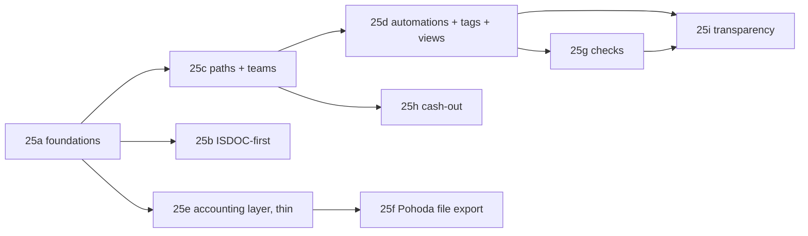

# Plan 25 — Payables lifecycle

**Status:** Planned — ready for implementation

**Branch:** `feat/payables-lifecycle`

**ADRs:** [0035](../../docs/decisions/0035-isdoc-first-parsing.md) ·
[0036](../../docs/decisions/0036-accounting-dimension-layer.md) ·
[0037](../../docs/decisions/0037-pohoda-xml-as-the-reference-rail.md) ·
[0038](../../docs/decisions/0038-three-orthogonal-projections.md)

**Specs:** [payables lifecycle](../../docs/specs/payables-lifecycle.md) ·
[accounting layer](../../docs/specs/accounting-layer.md) ·
[invoice checks](../../docs/specs/invoice-checks.md) ·
[workflow paths and automations](../../docs/specs/incoming-approval-workflows.md) ·
[Pohoda integration](../../docs/specs/pohoda-integration.md) ·
[cash-out planning](../../docs/specs/cashout-planning.md)

## Goal

Take the supplier invoice from a mailbox to a settled entry in POHODA, with the
accounting layer, both gates, the accounting system, and the payment plan the
process actually needs — and with a product surface that lets a customer
configure all of it without reading a schema.

Plan 24 built the skeleton: capture, ISDOC, an approval engine, payment runs,
Fio submission, and the payables matcher. Plan 25 makes it a usable product.

**Priority order, decided 2026-08-25.** The flows come first: the two gates,
multi-actor paths, automations, checks, tags and views, and payment planning.
The accounting system is **one optional layer**, and it lands as a **file export
the accountant imports by hand**. No mServer, no REST API, no live coupling to
anyone's POHODA in this plan.

## Read before starting

1. [`docs/specs/payables-lifecycle.md`](../../docs/specs/payables-lifecycle.md) —
   the master. Five gates, three projections, the configuration surface.
2. The child spec for the slice you are on, and its ADR. The decisions are
   settled; changing one needs a new ADR, not an edit.
3. `packages/db/src/incoming-repo.ts`, `packages/db/src/approvals-repo.ts`,
   `packages/payment-core/src/matcher.ts` — plan 24's shapes. Extend them; do
   not build a parallel style beside them.

## Non-negotiables

- **G1 and G2 stay separate**, in every workspace size. An unconfigured gate
  auto-passes and says so in the trail; it never disappears.
- **Nothing is exported to the accounting system before it is approved.**
  Confirmed with the pilot customer: there is no case where an invoice needs to
  be booked ahead of approval to catch a VAT period.
- **Nothing marks a payable paid except a confirmed allocation.** Not a
  submission, not an export, not an approval.
- **Invoicey never authorizes a payment.** Every string about a submitted batch
  says it is waiting for authorization in the bank.
- **Likvidace defaults to off.** Turning on `statement_import` requires an owner
  to confirm they will stop importing statements by hand.
- **Three projections, three writers.** `status`, `payment_state` and
  `accounting_state` are never conflated into one badge.
- **A new beneficiary account blocks a payment run** until someone confirms it.
- Server Actions are the only mutation surface (ADR 0016); workspace scope is
  re-derived from the session, never trusted from a client.

---

## Slices

Each slice is independently shippable and leaves the product working. The order
is chosen so that the pilot gets value early and so that nothing is built twice.

### 25a — Foundations: projections, statuses, corrections

**Why first:** every later slice writes to these columns.

- Migration: `accounting_state`; rename `accepted_at`/`accepted_by_user_id` to
  `validated_at`/`validated_by_user_id`; add `supersedes_id`,
  `superseded_by_id`, `correction_round`, `accounting_date`.
- Status vocabulary: `parsing`, `unsupported`, `needs_validation`,
  `in_validation`, `validated`. Migrate `needs_review` → `needs_validation`,
  `accepted` → `validated`.
- Correction linking on ingest: an identity collision against a **rejected**
  predecessor creates a successor with `supersedes_id` instead of a duplicate
  finding. The existing partial unique index already permits this — verify, do
  not widen it.
- Correction diff view: changed fields only, old beside new, and carry the
  predecessor's accounting layer forward as defaults.
- Lists render the three projections separately, never conflated into one
  badge; `accounting_state` is hidden while `not_applicable`. **Only the badge
  in 25a** — columns, filters and sorting on all three land in 25d with the data
  grid, because the hand-rolled table is replaced there and doing it twice is
  waste.

**Done when** a rejected invoice, re-sent under the same number, arrives linked
to its predecessor and opens on the diff.

### 25b — ISDOC-first parsing (ADR 0035)

- `unsupported` as a first-class state with a manual-entry screen beside the
  document.
- **Požádat dodavatele o ISDOC** — a prepared reply to the original sender,
  through the existing `EmailTransport`.
- AI parsing behind a workspace switch, default off; output never better than
  `needs_validation`.
- `supplier_profiles.isdoc_ratio`, and the supplier list ranked by manual-entry
  cost.

**Done when** a PDF with no ISDOC lands in `unsupported`, is enterable by hand
in one screen, and the supplier can be asked for ISDOC in one click.

### 25c — Workflow paths and teams

Carries [workflow paths and automations](../../docs/specs/incoming-approval-workflows.md) §5–6.

- `teams`, `team_members`.
- `workflow_paths`, `workflow_path_steps`, `workflow_path_step_approvers`, with
  `stage` ∈ `validation` | `approval`.
- Step modes `any_one` / `all_of` / `quorum`; approver kinds `user` / `team` /
  `role` / `dynamic`.
- Step builder with drag-and-drop, SLA reminders, escalation, four-eyes.
- Manual path assignment on one invoice and in bulk; add approvers to a running
  path.
- Task actions: approve, reject, return to start, **return to previous level**,
  delegate, comment with @mentions. Bulk approve.
- Migrate every `approval_rules.path` into a generated named path.
- **Fix the two plan-24 defects**: the `UNIQUE (workspace_id, priority)`
  collision, and the fabricated `assigneeRole: "admin"` task in
  `decideIncomingApprovalAction`.

**Done when** NFCtron's `all_of[Filip, Václav]` path exists as an object, is
assignable by hand, and Ivan can send one invoice to an extra approver.

### 25d — Automations, tags, views, and the data grid

- `automations`, `automation_actions`; conditions v2 (OR-of-ANDs) with the v1
  migration; four triggers; the action catalogue.
- Additive-accumulate / exclusive-stop evaluation, drag-to-reorder priority.
- `tags`, `invoice_tags`; manual and automated assignment; bulk add/remove.
- System and custom views on a real filter model, with sidebar count badges.
- Replace the hand-rolled table in `incoming-invoice-queue.tsx` with the ReUI
  Data Grid used by invoices and clients.
- The three projections as first-class grid columns — sortable, filterable,
  each with its own severity styling (carried over from 25a's badges).

**Done when** "invoices over 100k → Cesta A, under 20k → Cesta B, supplier X →
Cesta X" is three automations a customer wrote themselves.

### 25e — Accounting layer, thin (ADR 0036)

Enough to capture and carry the dimensions, not a deep integration. The model in
[accounting layer](../../docs/specs/accounting-layer.md) stays; the _sourcing_ of
codelist values is manual for now.

- `accounting_codelists`, `accounting_codelist_items`,
  `accounting_requirements`; header and line dimension columns.
- Codelist values by **manual entry and CSV import only**. No sync — that needs a
  live connection and is deferred with the mServer rail.
- The six-level resolution chain; rendered line inheritance with detach and
  reattach; provenance markers on prefilled values.
- The **Zaúčtování** section at G1, collapsed when every line inherits.
- `supplier_profiles` learned dimensions, unanimity-gated, with admin pinning.

The learned defaults are the part that earns its keep even with no integration at
all: the second invoice from a supplier arrives with předkontace, středisko and
činnost already filled from the first.

### 25f — Pohoda XML file export (ADR 0037)

Deliberately the thinnest thing that removes Ivan's retyping. **One rail:
`xml_file`.** We generate a dataPack; the accountant imports it in POHODA under
Soubor → Datová komunikace → XML import.

- `accounting_connections` (rail fixed to `xml_file`), `accounting_export_jobs`.
- The dataPack builder: **UTF-8** (not Windows-1250 — see integration spec §3.3),
  schema-length truncation recorded not silent, per-line dimensions, `extId`
  identity plus the duplicate-note backstop, golden files per §8.
- The export screen: **Připravit dávku** over approved, not-yet-exported
  invoices → **Stáhnout XML** → **Potvrdit import**, with `<rsp:responsePack>`
  parsing when the accountant pastes POHODA's response back.
- Post-export locking with **Upravit a znovu odeslat**.

Read [`nfctron-api` `packages/helpers/src/pohoda/`](../../../NFCtron/nfctron-api/packages/helpers/src/pohoda)
before writing the builder — `issued-invoice-xml.ts` already settles the dataPack
envelope, the `rateVAT` mapping, the truncation constants and the date and money
formatting, and `mserver-response.ts` settles response parsing. Take those and
change the invoice type.

**Explicitly deferred to a later plan:** the `xml_mserver` rail and its static-IP
relay, the `mpohoda_api` rail, codelist sync, likvidace in either direction, and
settlement read-back. The analysis for all of them is in the integration spec so
nobody redoes it.

**Done when** Ivan downloads one file, imports it, and every approved invoice
appears in POHODA with the right předkontace, středisko and DUZP — without him
typing any of it.

### 25g — Checks and findings

- `invoice_checks`, `invoice_findings`; severities; `applies_when` reusing the
  automation condition grammar; staleness on edit.
- The catalogue, in the spec's four groups.
- `supplier_profiles` statistical columns and the deviation checks.
- MFČR VAT register lookups for `unreliable_vat_payer` and
  `account_not_published`, cached per IČO in the `@invoicey/ares` shape.
- The card stack with **Vyřešit**; the merged fraud card; the severity column in
  lists.
- `/settings/checks` with per-check fired-on-_n_-of-last-100 counts.

**Done when** a supplier's first invoice, a doubled amount, and a changed bank
account each produce the right card at the right severity, and a workspace can
scope any of them to an amount threshold.

### 25h — Cash-out planning

- `planned_payment_date` and the policy defaults; `payment_calendars` with pay
  days, cutoff, holiday shifting.
- **Odložit platbu** with reason, badge, bulk, and undo.
- `/payables` with pay-day buckets, projected balance, blockers shown not
  hidden.
- The proposed-run window; `not_exported` as a run eligibility blocker.
- Three dashboard tiles.

**Done when** Monday's proposed run contains exactly what is due that week, and
postponing an invoice to Friday takes one action and leaves a trail.

### 25i — Transparency and notifications

The slice that is easiest to defer and most expensive to skip.

- The automation trace: every automation evaluated at every trigger, which
  condition failed first, which guardrail overrode the result.
- The approval timeline: stepper, current step, pending approvers, elapsed time,
  inline comments, escalation countdowns.
- Live match preview and test-against-an-invoice in the automation builder;
  path preview warning on a step that resolves to nobody.
- Notifications per event with an immediate-or-digest choice; SLA reminders and
  escalation.

**Done when** an admin can answer "why did this invoice go to Václav?" from the
invoice, without asking anyone.

---

## Sequencing



**Critical path:** 25a → 25c → 25d → 25g → 25h. That is the product: two gates,
multi-actor paths, configurable rules, tags and views, and a payment plan.

**25e and 25f are a side branch.** They can land any time after 25a and are not
on the path to a working product. Sequence them when the flows are solid, or
earlier if Ivan's retyping is the loudest pain — but not before 25c, because an
accounting layer with no gate around it is just a form.

**25b** runs in parallel from the start; it touches only the capture path.

**25i** is last and is the easiest to defer and most expensive to skip. Without
it, every slice above ships a system the customer cannot reason about.

## Acceptance — the NFCtron scenario, end to end

The epic is done when this runs without anyone retyping an invoice:

1. A supplier sends an ISDOC invoice to the workspace inbox. It parses, the
   checks run, and it lands in **Ke kontrole**.
2. Ivan opens it. Předkontace, středisko and DUZP are prefilled from the
   supplier's history. One check warns that the amount is 40 % above this
   supplier's usual; he acknowledges it with a note.
3. He passes G1. An automation assigns the approval path
   `all_of[Filip, Václav]`.
4. Filip and Václav approve from their **Moje schválení** view. Václav's
   comment lands on the timeline.
5. Ivan downloads the export dávka, imports it into POHODA, and confirms.
   Every invoice in it carries its full accounting layer.
   `accounting_state = exported`. _(25f — optional layer; the flow works without
   it.)_
6. It appears in `/payables` planned for its due date, in the bucket for the
   Monday before.
7. On Monday, Ivan opens the proposed run — seven invoices — creates the batch,
   and Filip signs it in Fio.
8. Fio's debit is ingested and matched. `payment_state = paid`. Settlement in
   POHODA stays Ivan's own statement import — Invoicey does not touch it.

And the rejection branch:

9. Ivan rejects an invoice with a reason and replies to the supplier in one
   click. The corrected invoice arrives under the same number, links to its
   predecessor, and opens on a diff of the three fields that changed, with the
   accounting layer already carried forward.

## Verification

```bash
bun install
bun run typecheck && bun run lint && bun run test && bun run build
```

Per-slice test coverage is specified in each child spec's testing section. No
test may carry a real IČO, a real IBAN, live credentials, or an unredacted
supplier document.

## Docs to keep aligned

`docs/roadmap.md`, `docs/specs/README.md`, `README.md`, and
`apps/web/content/docs/` all drift when this ships. Update them in the slice
that changes the behaviour, not afterwards.
