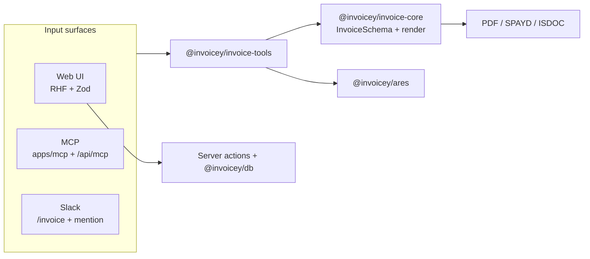
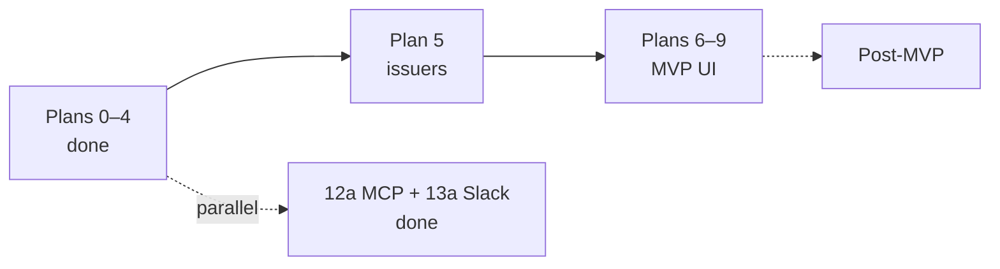

<h1 align="center">Invoicey</h1>

<h4 align="center">Czech-first invoicing — schema-first data, PDF + ISDOC + SPAYD QR</h4>

<p align="center">
  
  
  
  
</p>

<p align="center">
  <a href="#overview">Overview</a> ·
  <a href="#whats-working-now">What's working</a> ·
  <a href="#why-this-project">Why</a> ·
  <a href="#mvp-scope">MVP scope</a> ·
  <a href="#architecture-at-a-glance">Architecture</a> ·
  <a href="#tech-stack">Tech stack</a> ·
  <a href="#getting-started">Getting started</a> ·
  <a href="#mcp-local-cursor">MCP (Cursor)</a> ·
  <a href="#project-structure">Project structure</a> ·
  <a href="#documentation">Documentation</a> ·
  <a href="#roadmap">Roadmap</a> ·
  <a href="#contributing">Contributing</a>
</p>

## Overview

Invoicey is a modern invoicing tool for Czech freelancers and small teams. It treats each invoice as **structured data first** (one Zod `InvoiceSchema`, validated everywhere) and **rendered documents second** (PDF via `@react-pdf/renderer`, ISDOC XML, SPAYD QR for bank apps).

The same payload flows through the web app, **MCP tools** (Cursor / Claude), and the **Slack** demo — without duplicate types.

**Current focus:** MVP UI continues with **Plan 5 (issuers)**. Automation is already usable: local MCP create/render + ARES + presets (Plan 12a), Slack slash/`@mention` demo (Plan 13a). Full checklist: [`docs/roadmap.md`](docs/roadmap.md).

## What's working now

| Surface | Status |
| --- | --- |
| Domain + PDF / SPAYD / ISDOC (`@invoicey/invoice-core`) | Done |
| ARES + clients UI (`@invoicey/ares`, `apps/web`) | Done |
| JSON → PDF demo (`/invoices/from-json`, `POST /api/demo/invoice-pdf`) | Done |
| Shared tool handlers (`@invoicey/invoice-tools`) | Done |
| Local MCP stdio (`apps/mcp`) — create, ARES, presets | Done |
| Remote MCP (`/api/mcp` + required `MCP_API_KEY`) | Deployed on Vercel |
| Slack `/invoice` + `app_mention` (stateless AI loop) | Done (demo issuer) |
| Issuer management UI / full invoice builder / list | Planned (Plans 5–7) |

## Why this project

1. UX that feels like a 2026 finance product, not a legacy admin panel.
2. Czech VAT baked in: rates, reverse charge, OSS, DUZP, supplies abroad.
3. **ARES** lookup by IČO for issuer and client parties.
4. **SPAYD** QR so Czech banking apps pre-fill payment fields.
5. **ISDOC** export so accounting tools can import without retyping.
6. Multi–issuer-business support (separate numbering and banks).
7. **AI-first create path** — prompt + validated JSON beats a control-heavy builder for day-to-day use.

Inspired by [Midday.ai](https://midday.ai) and [fakturaonline.cz](https://fakturaonline.cz). Differentiators: schema-first design, MCP/Slack as first-class surfaces, snapshots so historical invoices stay stable after registry edits.

## MVP scope

| Area | What ships |
| --- | --- |
| **Documents** | Invoice, proforma, advance, credit note — Czech VAT modes and DUZP |
| **Parties** | Multiple issuer businesses; shared client registry; ARES prefetch |
| **Numbers** | Per-issuer, per-doc-type templates (`{YYYY}{####}`, yearly reset) |
| **Lifecycle** | Draft → issue → paid / overdue / cancelled (status **derived**) |
| **UI** | Next.js 16, shadcn + ReUI, dashboard |
| **Exports** | PDF + embedded QR; ISDOC 6.0.2 |
| **Automation** | Local MCP + Slack demo (stateless); DB-backed tools post-MVP |

Post-MVP: recurring, email, MCP+DB, Slack persistence, Clerk auth, multi-currency. Details: [`docs/roadmap.md`](docs/roadmap.md).

## Architecture at a glance



ADRs: [`docs/decisions/README.md`](docs/decisions/README.md). Runtime detail: [`docs/architecture.md`](docs/architecture.md).

## Tech stack

| Layer | Choice |
| --- | --- |
| Repo | Turborepo + [Bun](https://bun.sh) workspaces |
| Web | Next.js 16 App Router (RSC + Server Actions) |
| UI | shadcn/ui + [ReUI](https://reui.io/docs/get-started), Tailwind v4 |
| Domain | TypeScript 6 + Zod (`@invoicey/invoice-core`) |
| Tools | `@invoicey/invoice-tools` (normalize, presets, MCP registration) |
| MCP | `@modelcontextprotocol/sdk` + [`mcp-handler`](https://github.com/vercel/mcp-handler) |
| DB | Neon Postgres + Drizzle ORM |
| PDF / QR / ISDOC | `@react-pdf/renderer`, `qrcode`, `xmlbuilder2` |
| Hosting | Vercel (`apps/web`) |

## Prerequisites

| Tool | Role |
| --- | --- |
| Git | Clone |
| [Bun](https://bun.sh) ≥ 1.x | Install + scripts |
| Node.js | Next.js / ESLint engines |
| Neon (or Postgres URL) | Before `bun db:push` — copy `.env.example` → `.env` / `.env.local` |

## Getting started

```bash
git clone <repository-url>
cd inveoiceyai
cp .env.example .env.local   # fill DATABASE_URL (+ optional vars)
bun install
bun dev                      # Next.js @invoicey/web
```

Useful scripts:

| Script | What it does |
| --- | --- |
| `bun dev` | Web app (Turbo filter `@invoicey/web`) |
| `bun run typecheck` / `lint` / `test` / `build` | Monorepo checks |
| `bun db:push` | Drizzle push (`@invoicey/db`) |
| `bun run --cwd apps/mcp src/stdio.ts` | Local MCP server (stdio) |

Web env loading: repo-root `.env` then `.env.local` (see `apps/web/next.config.ts` and `AGENTS.md`).

## MCP (local Cursor)

1. Copy [`.cursor/mcp.json.example`](.cursor/mcp.json.example) → `.cursor/mcp.json` and set absolute paths.
2. Optional: `cp apps/mcp/presets.example.json ~/.invoicey/presets.json` (or set `INVOICEY_PRESETS_PATH`).
3. Reload MCP in Cursor — tools: `create_invoice`, `lookup_business`, preset CRUD.
4. Prompt example: *lookup NFCtron IČO, use issuer preset X, create invoice with these lines, return PDF*.

Full guide: [`docs/specs/mcp.md`](docs/specs/mcp.md). Remote go-live (Vercel `/api/mcp` + `MCP_API_KEY`) is documented there; not required for local use.

## Project structure

```text
├── apps/
│   ├── web/                 # Next.js 16 — UI, Slack routes, /api/mcp, demo PDF
│   └── mcp/                 # Local stdio MCP server (@invoicey/mcp)
├── packages/
│   ├── invoice-core/        # Zod schema, totals, numbering, status, PDF/QR/ISDOC
│   ├── invoice-tools/       # Shared handlers + presets + MCP tool registration
│   ├── ares/                # ARES REST client
│   ├── db/                  # Drizzle + Neon
│   ├── env/                 # Env schema helpers
│   ├── config-eslint/
│   └── config-ts/
├── docs/                    # PRD, architecture, domain, ADRs, specs
├── .cursor/
│   ├── plans/               # Per-phase plans
│   └── mcp.json.example     # Cursor MCP snippet
├── turbo.json
├── package.json
├── commitlint.config.mjs
├── .env.example
└── bun.lock
```

## Documentation

| Doc | Purpose |
| --- | --- |
| [`docs/README.md`](docs/README.md) | Docs hub |
| [`docs/PRD.md`](docs/PRD.md) | Requirements, MVP vs non-goals |
| [`docs/roadmap.md`](docs/roadmap.md) | Plans 0–14 + exit criteria |
| [`docs/architecture.md`](docs/architecture.md) | Runtime, env vars, diagrams |
| [`docs/specs/mcp.md`](docs/specs/mcp.md) | MCP tools, Cursor + Vercel |
| [`docs/specs/slack-bot.md`](docs/specs/slack-bot.md) | Slack stateless demo |
| [`docs/domain/invoice-schema.md`](docs/domain/invoice-schema.md) | Central Zod contract |
| [`docs/decisions/`](docs/decisions/README.md) | ADRs |

## Roadmap

| Phase | Goal | Status |
| --- | --- | --- |
| Plans 0–4 | Docs, bootstrap, invoice-core, PDF/QR/ISDOC, ARES + clients | Done |
| Plan 5 | Issuers (my businesses) | **Next** |
| Plans 6–9 | Builder, list, dashboard, polish (**MVP**) | Planned |
| Plan 12a | Local MCP + `/api/mcp` prep | Done |
| Plan 13a | Slack bot (stateless) | Done |
| Plans 10–11, 12b, 13b, 14 | Recurring, email, MCP+DB, Slack+DB, auth | Post-MVP |



## Contributing

1. **Docs-first:** Contracts live under [`docs/`](docs/). Behavior changes update the doc and/or an ADR.
2. **Commits:** Conventional commits via `commitlint` — see [`commitlint.config.mjs`](commitlint.config.mjs) (scopes include `invoice-core`, `invoice-tools`, `mcp`, `web`, `docs`, …).
3. **Plans:** Trace work to [`.cursor/plans/`](.cursor/plans/) and roadmap exit criteria.
4. **Secrets:** Never commit `.env`, `.cursor/mcp.json` (local paths), or API keys. Prefer `.env.example` + gitignored locals.

## License

TBD — likely permissive OSS once MVP ships.
