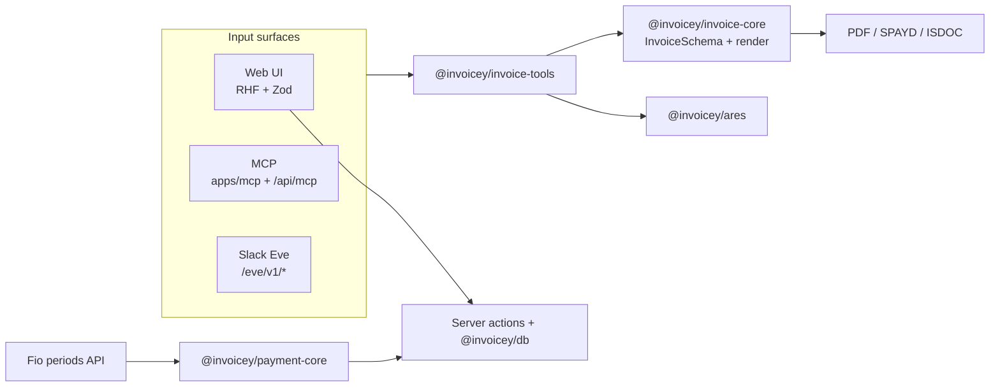
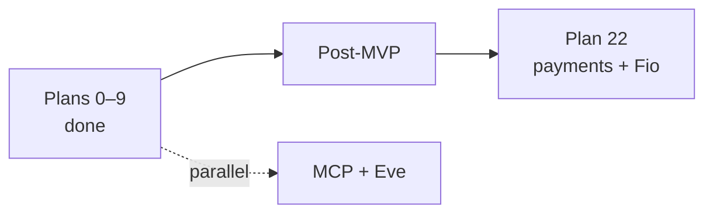

<h1 align="center">Invoicey</h1>

<h4 align="center">Czech-first invoicing — schema-first data, PDF + ISDOC + SPAYD QR, payment ledger</h4>

<p align="center">
  
  
  
  
  
</p>

<p align="center">
  <a href="#overview">Overview</a> ·
  <a href="#whats-working-now">What's working</a> ·
  <a href="#why-this-project">Why</a> ·
  <a href="#architecture-at-a-glance">Architecture</a> ·
  <a href="#tech-stack">Tech stack</a> ·
  <a href="#getting-started">Getting started</a> ·
  <a href="#mcp-local-cursor">MCP (Cursor)</a> ·
  <a href="#project-structure">Project structure</a> ·
  <a href="#documentation">Documentation</a> ·
  <a href="#roadmap">Roadmap</a> ·
  <a href="#contributing">Contributing</a>
</p>

## Overview

Invoicey is a modern invoicing tool for Czech freelancers and small teams. It treats each invoice as **structured data first** (one Zod `InvoiceSchema`, validated everywhere) and **rendered documents second** (PDF via `@react-pdf/renderer`, ISDOC XML, SPAYD QR for bank apps).

The same payload flows through the web app, **MCP tools** (Cursor / Claude), and the **Slack** agent — without duplicate types.

**Current focus:** Plan 22 payment ledger with **Fio banka** as the first read-only bank feed (human-confirmed matches; live pilot pending). Product docs: [`/docs`](https://invoicey.ditrich.me/docs) · living ledger: [`docs/roadmap.md`](docs/roadmap.md).

## What's working now

| Surface                                                        | Status               |
| -------------------------------------------------------------- | -------------------- |
| Domain + PDF / SPAYD / ISDOC (`@invoicey/invoice-core`)        | Done                 |
| Issuers, clients, builder, list, dashboard                     | Done                 |
| Better Auth (Google / GitHub) + workspaces                     | Done                 |
| Email (Resend) + recurring drafts + overdue reminders          | Done                 |
| Payment ledger + manual allocations (`@invoicey/payment-core`) | Done                 |
| Fio read-only sync + match proposals + Payments queue          | Done (pilot pending) |
| Local MCP stdio (`apps/mcp`) + hosted `/api/mcp`               | Done                 |
| Slack Eve agent (DB-backed drafts / HITL)                      | In progress          |
| Platform admin, invites, referrals, multi-workspace UX         | Done                 |

## Why this project

1. UX that feels like a 2026 finance product, not a legacy admin panel.
2. Czech VAT baked in: rates, reverse charge, OSS, DUZP, supplies abroad.
3. **ARES** lookup by IČO for issuer and client parties.
4. **SPAYD** QR so Czech banking apps pre-fill payment fields.
5. **ISDOC** export so accounting tools can import without retyping.
6. Multi–issuer-business support (separate numbering and banks).
7. **AI-first create path** — prompt + validated JSON beats a control-heavy builder for day-to-day use.
8. **Payment ledger** — bank evidence → match proposals → confirmed allocations (Fio first).

Inspired by [Midday.ai](https://midday.ai) and [fakturaonline.cz](https://fakturaonline.cz). Differentiators: schema-first design, MCP/Slack as first-class surfaces, snapshots so historical invoices stay stable after registry edits, provider-neutral reconciliation.

## Architecture at a glance



ADRs: [`docs/decisions/README.md`](docs/decisions/README.md). Runtime detail: [`docs/architecture.md`](docs/architecture.md). Payments: [`docs/specs/payment-ledger-fio.md`](docs/specs/payment-ledger-fio.md).

## Tech stack

| Layer            | Choice                                                                               |
| ---------------- | ------------------------------------------------------------------------------------ |
| Repo             | Turborepo + [Bun](https://bun.sh) workspaces                                         |
| Web              | Next.js 16 App Router (RSC + Server Actions)                                         |
| UI               | shadcn/ui + [ReUI](https://reui.io/docs/get-started), Tailwind v4                    |
| Auth             | Better Auth (OAuth Google/GitHub; workspaces = organizations)                        |
| Domain           | TypeScript + Zod (`@invoicey/invoice-core`)                                          |
| Payments         | `@invoicey/payment-core` (Fio adapter, matcher, money helpers)                       |
| Tools            | `@invoicey/invoice-tools` (normalize, presets, MCP registration)                     |
| MCP              | `@modelcontextprotocol/sdk` + [`mcp-handler`](https://github.com/vercel/mcp-handler) |
| DB               | Neon Postgres + Drizzle ORM                                                          |
| Email            | Resend + `@invoicey/emails`                                                          |
| PDF / QR / ISDOC | `@react-pdf/renderer`, `qrcode`, `xmlbuilder2`                                       |
| Hosting          | Vercel (`apps/web`)                                                                  |

## Prerequisites

| Tool                        | Role                                                              |
| --------------------------- | ----------------------------------------------------------------- |
| Git                         | Clone                                                             |
| [Bun](https://bun.sh) ≥ 1.x | Install + scripts                                                 |
| Node.js ≥ 24                | Next.js / ESLint engines                                          |
| Neon (or Postgres URL)      | Before schema apply — copy `.env.example` → `.env` / `.env.local` |

## Getting started

```bash
git clone https://github.com/filipditrich/inveoiceyai.git
cd inveoiceyai
cp .env.example .env.local   # fill DATABASE_URL, BETTER_AUTH_SECRET, OAuth, …
bun install
bun dev                      # Next.js @invoicey/web
```

Useful scripts:

| Script                                          | What it does                                                         |
| ----------------------------------------------- | -------------------------------------------------------------------- |
| `bun dev`                                       | Web app (Turbo filter `@invoicey/web`)                               |
| `bun run typecheck` / `lint` / `test` / `build` | Monorepo checks                                                      |
| `bun db:push`                                   | Drizzle push (`@invoicey/db`) — local only; prod uses checked-in SQL |
| `bun run --cwd apps/mcp src/stdio.ts`           | Local MCP server (stdio)                                             |

Web env loading: repo-root `.env` then `.env.local` (see `apps/web/next.config.ts` and `AGENTS.md`). Bank token encryption needs `BANK_TOKEN_ENCRYPTION_KEY_V1` for Fio connections.

## MCP (local Cursor)

1. Copy [`.cursor/mcp.json.example`](.cursor/mcp.json.example) → `.cursor/mcp.json` and set absolute paths.
2. Optional: `cp apps/mcp/presets.example.json ~/.invoicey/presets.json` (or set `INVOICEY_PRESETS_PATH`).
3. Reload MCP in Cursor — tools: create/issue/paid ops, ARES, presets (see product docs).
4. Prompt example: _lookup NFCtron IČO, use issuer preset X, create invoice with these lines, return PDF_.

Full guide: [`docs/specs/mcp.md`](docs/specs/mcp.md) · product: [`/docs/integrations/mcp`](https://invoicey.ditrich.me/docs/integrations/mcp). Remote go-live (Vercel `/api/mcp` + API key) is documented there.

## Project structure

```text
├── apps/
│   ├── web/                 # Next.js 16 — UI, auth, email, Fio, Slack Eve, /api/mcp
│   └── mcp/                 # Local stdio MCP server (@invoicey/mcp)
├── packages/
│   ├── invoice-core/        # Zod schema, totals, numbering, status, PDF/QR/ISDOC
│   ├── invoice-tools/       # Shared handlers + presets + MCP tool registration
│   ├── payment-core/        # Fio adapter, matcher, money helpers
│   ├── emails/              # Resend templates
│   ├── ares/                # ARES REST client
│   ├── db/                  # Drizzle + Neon (+ checked-in SQL migrations)
│   ├── env/                 # Env schema helpers
│   └── config-ts/
├── docs/                    # PRD, architecture, domain, ADRs, specs (internal)
├── apps/web/content/docs/   # Public product docs (Fumadocs → /docs)
├── .cursor/
│   ├── plans/               # Per-phase plans
│   └── mcp.json.example     # Cursor MCP snippet
├── turbo.json
├── package.json
├── commitlint.config.mjs
├── .env.example
└── bun.lock
```

## Documentation

| Doc                                                                    | Purpose                               |
| ---------------------------------------------------------------------- | ------------------------------------- |
| [`docs/README.md`](docs/README.md)                                     | Internal docs hub                     |
| Product `/docs` (`apps/web/content/docs`)                              | User-facing guides (Fumadocs)         |
| [`docs/PRD.md`](docs/PRD.md)                                           | Requirements, scope, success criteria |
| [`docs/roadmap.md`](docs/roadmap.md)                                   | Plans 0–22 + exit criteria            |
| [`docs/architecture.md`](docs/architecture.md)                         | Runtime, env vars, diagrams           |
| [`docs/specs/payment-ledger-fio.md`](docs/specs/payment-ledger-fio.md) | Payment ledger + Fio                  |
| [`docs/specs/mcp.md`](docs/specs/mcp.md)                               | MCP tools, Cursor + Vercel            |
| [`docs/domain/invoice-schema.md`](docs/domain/invoice-schema.md)       | Central Zod contract                  |
| [`docs/decisions/`](docs/decisions/README.md)                          | ADRs                                  |

## Roadmap

| Phase           | Goal                                                               | Status                                  |
| --------------- | ------------------------------------------------------------------ | --------------------------------------- |
| Plans 0–9       | Docs → polish (**MVP UI**)                                         | Done                                    |
| Plans 10–11     | Recurring drafts + email lifecycle                                 | Done                                    |
| Plans 12–13     | MCP (+ DB) + Slack Eve                                             | MCP done; Eve in progress               |
| Plan 14 + 16–21 | Auth, security, public shell, admin, invites, workspaces, AI usage | Done                                    |
| **Plan 22**     | Payment ledger + Fio bank integration                              | **Implemented; real Fio pilot pending** |



## Contributing

1. **Docs-first:** Contracts live under [`docs/`](docs/). Behavior changes update the doc and/or an ADR. User-facing copy also lives under `apps/web/content/docs/`.
2. **Commits:** Conventional commits via `commitlint` — see [`commitlint.config.mjs`](commitlint.config.mjs).
3. **Plans:** Trace work to [`.cursor/plans/`](.cursor/plans/) and roadmap exit criteria.
4. **Secrets:** Never commit `.env`, `.cursor/mcp.json` (local paths), Fio tokens, or API keys. Prefer `.env.example` + gitignored locals.

## License

TBD — likely permissive OSS once the product is generally available.
