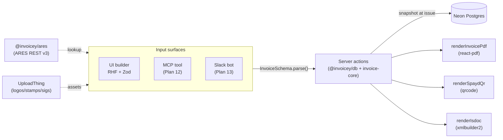
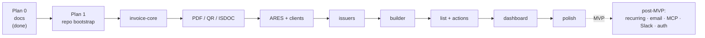

# Invoicey

A modern, Czech-first invoicing tool that treats invoices as **structured data first** and **rendered documents second**. Built so the same invoice can be created from a UI, a JSON document, an MCP tool, or a Slack command — all going through one schema, one validator, one renderer.

> **Status:** Phase 0 — docs and architecture only. No code yet. See [`docs/roadmap.md`](docs/roadmap.md) for what ships when.

## Why

Czech freelancers and small teams want a tool that:

1. Looks like a 2026 finance product, not a 2012 admin panel
2. Speaks fluent Czech VAT (rates, reverse charge, OSS, DUZP, supplies abroad)
3. Plays nice with the registry (ARES lookup by IČO)
4. Generates a PDF that any Czech bank's QR scanner reads correctly (SPAYD)
5. Exports ISDOC so accounting tools can import without retyping
6. Doesn't lock data into a vendor — every invoice is structured, exportable, scriptable

Inspired by [Midday.ai](https://midday.ai) (UX polish, finance-grade feel) and [fakturaonline.cz](https://fakturaonline.cz) (Czech tax compliance, ARES integration). Differentiated by: schema-first architecture, MCP/Slack automation as first-class concerns from day 1 (even if not built in MVP), multi-issuer-business support without a "company switcher" footgun.

## What it does (MVP)

- **Issue invoices** — invoices, proformas, advances, credit notes — with full Czech VAT compliance and a polished PDF template (logo, optional stamp, optional signature, accent color)
- **Manage businesses** — multiple issuer businesses (the "from" side) and a shared client registry, both populated via ARES IČO lookup
- **Per-issuer numbering** — configurable templates with `{YYYY}{####}` etc., yearly reset, per-doc-type counters, atomic increment
- **Track status** — `draft → issued → paid` (or `overdue` / `cancelled`), derived from facts not stored — no clock-tick jobs
- **Find anything** — ReUI Data Grid with filters (status, issuer, client, dates), sort, search, row actions
- **See the pulse** — dashboard with counts and totals per status, recent invoices, monthly issued-vs-paid chart
- **Download** — every invoice as PDF (with embedded SPAYD QR for bank-app payment) and as ISDOC 6.0.2 XML
- **Upload assets** — UploadThing-backed logo / stamp / signature per issuer

Out of MVP, on the roadmap: recurring invoices, email delivery, MCP server, Slack bot, auth + multi-user, multi-currency, bilingual rendering. See [`docs/roadmap.md`](docs/roadmap.md).

## Use cases

The product targets three concrete scenarios. Every feature must serve at least one of them.

### UC1 — Personal invoicing across multiple issuer businesses

> "I invoice 2–3 clients each month. Sometimes from my freelance trade license (ŽL), sometimes from my s.r.o. Each entity has its own bank account, numbering scheme, and possibly a different VAT registration status."

### UC2 — OBO / self-billing

> "Sometimes I issue an invoice in the name of my client to myself (self-billing model — the buyer issues the invoice). The document is legally identical to a normal invoice, but the issuer is the client and the recipient is me."

### UC3 — Intra-company invoicing from Slack (post-MVP)

> "My team should be able to type `@Invoicey invoice NFCtron monthly standard rate` in Slack and have a draft invoice appear, ready to issue."

Full discussion in [`docs/PRD.md`](docs/PRD.md).

## How it works (one picture)



The architecture is **schema-first**: a single Zod `InvoiceSchema` defines what an invoice *is*. Every code path that produces or consumes an invoice — UI, server actions, MCP, Slack, PDF, ISDOC — parses or constructs values that pass that schema. There is no parallel "DTO" type to drift.

## Tech stack

| Layer | Choice |
| --- | --- |
| Repo | Turborepo monorepo, bun workspaces |
| Web | Next.js 15 App Router (RSC + Server Actions) |
| UI | shadcn/ui + ReUI registry (Data Grid, Autocomplete, …), Tailwind v4 |
| Forms | React Hook Form + `@hookform/resolvers/zod` |
| Domain | TypeScript + Zod (`@invoicey/invoice-core`) |
| DB | Neon Postgres + Drizzle ORM |
| PDF | `@react-pdf/renderer` |
| QR | `qrcode` (SPAYD format) |
| ISDOC | `xmlbuilder2` (ISDOC 6.0.2) |
| Files | UploadThing |
| Hosting | Vercel |
| Auth | _none in MVP_; Clerk later (Plan 14) |

Every choice has an [ADR in `docs/decisions/`](docs/decisions/README.md) explaining the *why*.

## Project layout

```
inveoiceyai/
├── apps/
│   └── web/                    Next.js 15 admin app (the MVP UI)
├── packages/
│   ├── invoice-core/           Zod schema, totals, numbering, status, PDF, QR, ISDOC
│   ├── db/                     Drizzle schema + migrations + connection helper
│   ├── ares/                   ARES REST v3 client
│   ├── config-eslint/
│   └── config-ts/
├── docs/                       PRD, architecture, domain, ADRs (this is the source of truth)
└── .cursor/plans/              per-phase implementation plans
```

`apps/mcp` and `apps/slack` are roadmap items (Plans 12 & 13). They will share `invoice-core` and `db` directly — no HTTP shim, no schema duplication.

## Key concepts (and where to read about them)

| Concept | TL;DR | Doc |
| --- | --- | --- |
| **Invoice schema** | One Zod schema is the contract for every input/output | [`docs/domain/invoice-schema.md`](docs/domain/invoice-schema.md) |
| **Czech VAT** | Modes (regular / reverse-charge / OSS), supplies abroad, DUZP, plátce vs neplátce | [`docs/domain/vat-czech.md`](docs/domain/vat-czech.md) |
| **Numbering** | Per-issuer, per-doc-type templates with `{YYYY}{####}` tokens; yearly reset; atomic | [`docs/domain/numbering.md`](docs/domain/numbering.md) |
| **Status engine** | `draft / issued / paid / overdue / cancelled` is **derived** from facts at read time | [`docs/domain/status-engine.md`](docs/domain/status-engine.md) |
| **Snapshots** | Issuer + client are frozen onto each invoice at issue time so history stays correct | [`docs/domain/snapshots.md`](docs/domain/snapshots.md) |

## Where we are (roadmap)



| Phase | Goal | Status |
| --- | --- | --- |
| Plan 0 | Docs scaffold | Done |
| Plan 1 | Repo bootstrap (Turborepo, Next.js, Drizzle, ReUI, commitlint) | Next |
| Plans 2–3 | `invoice-core` domain + PDF/QR/ISDOC rendering | Pending |
| Plans 4–5 | ARES + clients + issuers UI | Pending |
| Plans 6–9 | Builder, list, dashboard, polish (= MVP) | Pending |
| Plans 10–14 | Recurring, email, MCP, Slack, auth | Post-MVP |

Full table with exit criteria per phase: [`docs/roadmap.md`](docs/roadmap.md).

## Out of scope (explicitly)

- Bank-statement reconciliation / payment matching
- Client-side payment portal (pay-by-link)
- Tax-period reporting (kontrolní hlášení / DPH přiznání) — adjacent product
- Custom PDF templates / template editor (one good template > ten mediocre)
- Multi-currency / bilingual invoices in MVP (post-MVP)

The full out-of-scope table with rationale: [`docs/PRD.md`](docs/PRD.md#out-of-scope-mvp).

## Czech terminology

If you're new to Czech invoicing, [`docs/glossary.md`](docs/glossary.md) explains: IČO, DIČ, ARES, DUZP, VS/KS/SS, plátce DPH, přenesená daňová povinnost, OSS, VIES, dobropis, zálohová faktura, ISDOC, SPAYD, …

## Where to start reading

If you're picking this up cold:

1. Start with this README
2. [`docs/PRD.md`](docs/PRD.md) — what we're building and why
3. [`docs/glossary.md`](docs/glossary.md) — vocabulary
4. [`docs/architecture.md`](docs/architecture.md) — how it fits together
5. [`docs/domain/invoice-schema.md`](docs/domain/invoice-schema.md) — the central contract
6. [`docs/decisions/`](docs/decisions/README.md) — why each foundational call was made

If you're going to implement a phase:

1. Read the plan in `.cursor/plans/`
2. Read the docs the plan cites
3. Implement; if a decision changes, write a new ADR and supersede the old one
4. Update relevant living docs in the same PR

## Documentation map

```
docs/
├── README.md                     index + lifecycle + conventions
├── PRD.md                        product requirements
├── roadmap.md                    Plan 0..N with goals + exit criteria
├── architecture.md               stack, monorepo, dataflow, runtime, envs
├── glossary.md                   Czech ↔ English tax/invoice terms
├── domain/                       contracts (schema, VAT, numbering, status, snapshots)
├── decisions/                    16 ADRs in Michael Nygard format
├── specs/                        per-feature specs (written just-in-time)
└── ui/                           per-flow UX specs (written just-in-time)
```

## License

TBD. Likely a permissive open-source license once the MVP ships.
