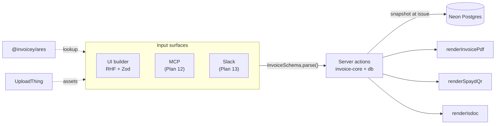
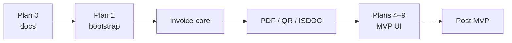

<h1 align="center">Invoicey</h1>

<h4 align="center">Czech-first invoicing — schema-first data, PDF + ISDOC + SPAYD QR</h4>

<p align="center">
  
  
  
</p>

<p align="center">
  <a href="#overview">Overview</a> ·
  <a href="#why-this-project">Why</a> ·
  <a href="#mvp-scope">MVP scope</a> ·
  <a href="#use-cases">Use cases</a> ·
  <a href="#architecture-at-a-glance">Architecture</a> ·
  <a href="#tech-stack">Tech stack</a> ·
  <a href="#prerequisites">Prerequisites</a> ·
  <a href="#getting-started">Getting started</a> ·
  <a href="#project-structure">Project structure</a> ·
  <a href="#documentation">Documentation</a> ·
  <a href="#roadmap">Roadmap</a> ·
  <a href="#contributing">Contributing</a>
</p>

## Overview

Invoicey is a modern invoicing tool for Czech freelancers and small teams. It treats each invoice as **structured data first** (one Zod schema, validated everywhere) and **rendered documents second** (PDF via `@react-pdf/renderer`, ISDOC XML, SPAYD QR for bank apps).

The same payload should eventually flow through the UI builder, JSON/MCP tools, or Slack — without duplicate types or drift.

**Current phase:** Phase 0 — in-repo docs, PRD, architecture, domain contracts, and ADRs. **No application code yet.** Implementation starts at Plan 1 (see [Roadmap](#roadmap)).

## Why this project

1. UX that feels like a 2026 finance product, not a legacy admin panel.
2. Czech VAT baked in: rates, reverse charge (přenesená daňová povinnost), OSS, DUZP, supplies abroad.
3. **ARES** lookup by IČO for issuer and client parties.
4. **SPAYD** QR so Czech banking apps pre-fill payment fields.
5. **ISDOC** export so accounting tools (Pohoda, Money S3, iDoklad, …) can import without retyping.
6. Multi–issuer-business support (invoice “from” ŽL vs s.r.o. with separate numbering and banks).

Inspired by [Midday.ai](https://midday.ai) (polish, finance UX) and [fakturaonline.cz](https://fakturaonline.cz) (Czech compliance). Differentiators: schema-first design, automation-ready surfaces (MCP/Slack on the roadmap), snapshots so historical invoices stay legally stable after registry edits.

## MVP scope

| Area | What ships |
| --- | --- |
| **Documents** | Invoice, proforma, advance, credit note — Czech VAT modes and DUZP |
| **Parties** | Multiple issuer businesses; shared client registry; ARES prefetch |
| **Numbers** | Per-issuer, per-doc-type templates (`{YYYY}{####}`, yearly reset, atomic counters) |
| **Lifecycle** | Draft → issue → paid / overdue / cancelled (status **derived**, not cron-ticked) |
| **UI** | Next.js 15, shadcn + [ReUI Data Grid](https://reui.io/components/data-grid), dashboard |
| **Exports** | PDF + embedded QR; ISDOC 6.0.2 |
| **Assets** | UploadThing for logo / stamp / signature |

Post-MVP (Plans 10–14): recurring invoices, email, MCP server, Slack bot, Clerk auth, multi-currency, bilingual PDFs. Details: [`docs/roadmap.md`](docs/roadmap.md).

## Use cases

**UC1 — Personal invoicing across issuer businesses** — Same operator invoices from ŽL or s.r.o.; each issuer has its own bank, numbering, VAT profile.

**UC2 — OBO / self-billing** — Buyer issues the invoice to the supplier; schema treats issuer and client symmetrically.

**UC3 — Slack-driven invoicing (post-MVP)** — e.g. `@Invoicey invoice NFCtron monthly standard rate` → draft aligned with `InvoiceSchema`.

Full narrative and non-goals: [`docs/PRD.md`](docs/PRD.md).

## Architecture at a glance



ADRs explain each stack choice: [`docs/decisions/README.md`](docs/decisions/README.md).

## Tech stack

| Layer | Choice |
| --- | --- |
| Repo | Turborepo + [Bun](https://bun.sh) workspaces |
| Web | Next.js 15 App Router (RSC + Server Actions) |
| UI | shadcn/ui + [ReUI](https://reui.io/docs/get-started) registry, Tailwind v4 |
| Forms | React Hook Form + `@hookform/resolvers/zod` |
| Domain | TypeScript + Zod (`@invoicey/invoice-core`) |
| DB | Neon Postgres + Drizzle ORM |
| PDF / QR / ISDOC | `@react-pdf/renderer`, `qrcode`, `xmlbuilder2` |
| Files | UploadThing |
| Hosting | Vercel |

## Prerequisites

What you need **today** (docs-only repo):

| Tool | Role |
| --- | --- |
| Git | Clone and branch |
| Markdown viewer / IDE | Read [`docs/`](docs/) |

What you need **after Plan 1** (when `package.json` lands):

| Tool | Role |
| --- | --- |
| [Bun](https://bun.sh) ≥ 1.x | Install deps, run scripts (repo standard; no npm/yarn) |
| Node.js | Matches Next.js / tooling engines once declared in `package.json` |

Optional later: Neon account + Vercel project for deploy (documented in [`docs/architecture.md`](docs/architecture.md)).

## Getting started

**Phase 0 — read the docs**

```bash
git clone <repository-url>
cd inveoiceyai
```

Then open [`docs/README.md`](docs/README.md) for the reading order (PRD → glossary → architecture → `invoice-schema` → ADRs).

**After Plan 1 — bootstrap the monorepo** (commands will match `package.json`; illustrative):

```bash
bun install
bun dev        # apps/web dev server (once scaffold exists)
```

Until Plan 1 merges, those scripts do not exist in this repository.

## Project structure

**Today (Phase 0):**

```text
├── README.md                 # this file — product intro + navigation
├── inveoiceyai.code-workspace
└── docs/                     # source of truth: PRD, architecture, domain, ADRs
    ├── README.md             # docs index + lifecycle rules
    ├── PRD.md
    ├── roadmap.md
    ├── architecture.md
    ├── glossary.md
    ├── domain/
    ├── decisions/
    ├── specs/                # JIT specs per implementation plan
    └── ui/
```

**Target layout after Plan 1+:**

```text
├── apps/
│   └── web/                  # Next.js 15 admin UI
├── packages/
│   ├── invoice-core/         # Zod schema, totals, PDF, QR, ISDOC
│   ├── db/                   # Drizzle + migrations
│   ├── ares/                 # ARES REST client
│   ├── config-eslint/
│   └── config-ts/
├── turbo.json
├── package.json              # Bun workspaces
└── docs/
```

`apps/mcp` and `apps/slack` are planned (Plans 12–13); they reuse `invoice-core` and `db` without duplicating schema types.

## Documentation

| Doc | Purpose |
| --- | --- |
| [`docs/README.md`](docs/README.md) | Docs hub — conventions, lifecycle, ADR rules |
| [`docs/PRD.md`](docs/PRD.md) | Requirements, MVP vs non-goals, success criteria |
| [`docs/roadmap.md`](docs/roadmap.md) | Plan 0–14 goals and exit criteria |
| [`docs/architecture.md`](docs/architecture.md) | Runtime boundaries, env vars, diagrams |
| [`docs/glossary.md`](docs/glossary.md) | Czech ↔ English invoicing terms |
| [`docs/domain/invoice-schema.md`](docs/domain/invoice-schema.md) | Central Zod contract + JSON examples |
| [`docs/decisions/`](docs/decisions/README.md) | Architectural Decision Records |

Per-feature specs under [`docs/specs/`](docs/specs/README.md) and UX flows under [`docs/ui/`](docs/ui/README.md) are filled **just-in-time** before each build plan.

## Roadmap

| Phase | Goal | Status |
| --- | --- | --- |
| Plan 0 | Documentation scaffold | Done |
| Plan 1 | Monorepo bootstrap (Next.js, Drizzle, ReUI, commitlint) | Next |
| Plans 2–3 | `invoice-core` + PDF / QR / ISDOC | Planned |
| Plans 4–9 | ARES, issuers & clients UI, builder, grid, dashboard, polish (**MVP**) | Planned |
| Plans 10–14 | Recurring, email, MCP, Slack, auth | Post-MVP |

High-level diagram:



Full table: [`docs/roadmap.md`](docs/roadmap.md).

## Contributing

1. **Docs-first:** Product and domain contracts live under [`docs/`](docs/). If behavior changes, update the relevant doc and add or supersede an ADR ([`docs/decisions/`](docs/decisions/README.md)).
2. **Commits:** Use [Conventional Commits](https://www.conventionalcommits.org/) (`feat`, `fix`, `docs`, …). If commitlint is added in Plan 1, follow the repo config.
3. **Plans:** Implementation should trace to `.cursor/plans/` or equivalent tracked plans; cross-link PRs to the docs they implement.
4. **Secrets:** Never commit `.env`, API tokens, or UploadThing keys.

## License

TBD — likely permissive OSS once MVP ships.
