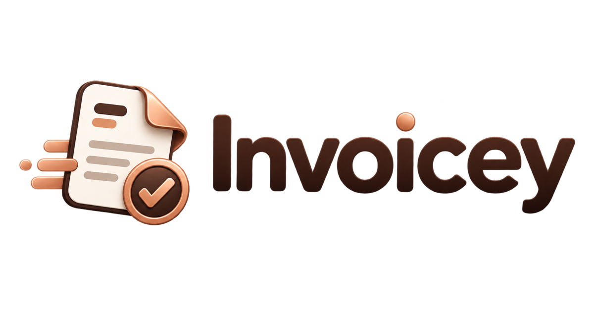
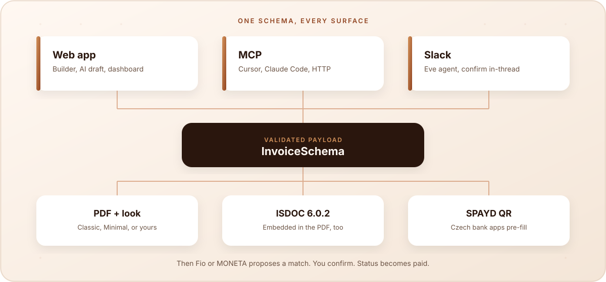
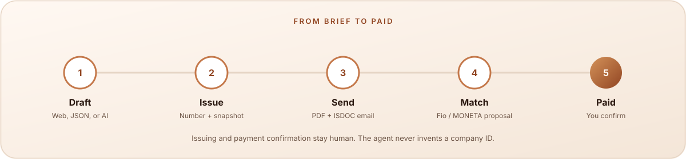
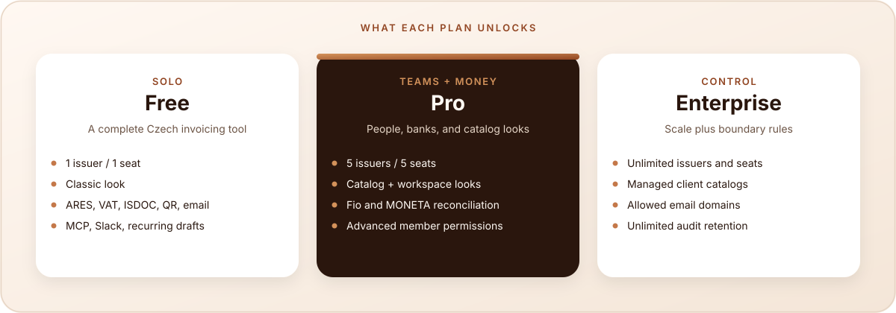

<p align="center">
  <a href="https://invoicey.ditrich.me">
    
  </a>
</p>

<h1 align="center">Invoicey</h1>

<p align="center">
  <strong>Invoice automation.</strong> Data first, documents second.
</p>

<p align="center">
  Issue from the web, JSON, or an agent. Invoicey validates once and renders the same PDF, ISDOC, and payment QR — then proposes a match when the money lands.
</p>

<p align="center">
  <a href="https://invoicey.ditrich.me"></a>
  <a href="https://invoicey.ditrich.me/docs"></a>
  
  <a href="https://github.com/filipditrich/inveoiceyai/releases"></a>
</p>

<p align="center">
  <a href="#how-it-works">How it works</a> ·
  <a href="#what-you-get">What you get</a> ·
  <a href="#create-from-anywhere">Create from anywhere</a> ·
  <a href="#plans">Plans</a> ·
  <a href="#documentation">Docs</a> ·
  <a href="#contributing">Contributing</a>
</p>

<p align="center">
  
</p>

---

## How it works

An invoice in Invoicey is a validated JSON payload — parties, lines, VAT, payment, totals. The PDF, the ISDOC XML, and the SPAYD payment QR are **outputs of that payload**, never the source of truth.

The web app, [MCP](https://invoicey.ditrich.me/docs/integrations/mcp), and [Slack](https://invoicey.ditrich.me/docs/integrations/slack) all assemble the same schema. If it does not validate, it does not ship.

<p align="center">
  
</p>

Issuing freezes issuer and client **snapshots**, so a later registry edit cannot rewrite history. Status is **derived** from the ledger — unpaid, partial, paid, overpaid — not a checkbox you maintain by hand.

<p align="center">
  
</p>

---

## What you get

| Capability                            | Detail                                                                                                                                                              |
| ------------------------------------- | ------------------------------------------------------------------------------------------------------------------------------------------------------------------- |
| **Czech VAT, for real**               | 21 / 12 / 0 %, reverse charge, OSS, exempt supplies, DUZP as a first-class field. Non-payers print _Nejsem plátce DPH_ instead of a fake recap.                     |
| **ARES by IČO**                       | Type an identification number, confirm the legal name, address, and DIČ. Issuers and clients both look up this way.                                                 |
| **PDF that accountants can ingest**   | A look (Classic, Minimal, or a workspace look) plus ISDOC 6.0.2 **embedded in the PDF**. One file a human reads and software imports.                               |
| **SPAYD payment QR**                  | Czech banking apps pre-fill amount, account, and variable symbol from a scan.                                                                                       |
| **Several businesses, one workspace** | Živnost and s.r.o. side by side. Each issuer keeps its own bank, numbering, VAT mode, logo, stamp, and signature. Clients stay shared.                              |
| **Looks, not templates**              | Pick a look. Optionally override theme tokens on one invoice. At issue, the full look is snapshotted so regeneration stays stable.                                  |
| **One payment ledger**                | Connect **Fio** or **MONETA** with a token your bank issues in your name. Invoicey proposes matches by variable symbol, amount, currency, and account. You confirm. |
| **Recurring without auto-issue**      | A cadence produces a reviewable draft with live issuer and client details. You issue and send.                                                                      |
| **History that stays history**        | Bulk-import older PDFs and ISDOCs. Provenance is kept; issued artifacts are immutable.                                                                              |
| **Currencies and language**           | Invoice in CZK or another currency, with or without VAT. Document language (`cs` / `en`) is independent of the app UI.                                              |

Czech standards (ARES, DPH, ISDOC, SPAYD) are capabilities, not a slogan. The product is invoice automation; those are how a Czech invoice actually works.

---

## Create from anywhere

Same tools, same validation, same outputs. AI may draft. It may not invent an IČO, a UUID, or a required field — and issuing, sending, or marking paid always waits for a person.

| Surface   | What it does                                                                                                                                                                                                                             |
| --------- | ---------------------------------------------------------------------------------------------------------------------------------------------------------------------------------------------------------------------------------------- |
| **Web**   | Structured draft, AI prompt → schema, PDF preview, issue, email, payments.                                                                                                                                                               |
| **MCP**   | Hosted at `https://invoicey.ditrich.me/api/mcp` (workspace API key) or local stdio for Cursor. [Cursor](https://invoicey.ditrich.me/docs/integrations/cursor) · [Claude Code](https://invoicey.ditrich.me/docs/integrations/claude-code) |
| **Slack** | Eve drafts in-thread, asks when something would be a guess, confirms before it ships.                                                                                                                                                    |
| **CLI**   | Interactive terminal for list / draft / issue / send / payments. Same PAT as MCP. [CLI](https://invoicey.ditrich.me/docs/integrations/cli)                                                                                               |
| **Banks** | Read-only Fio and MONETA feeds → match proposals on the same ledger as manual payments.                                                                                                                                                  |

```json
{
  "mcpServers": {
    "invoicey": {
      "url": "https://invoicey.ditrich.me/api/mcp",
      "headers": { "Authorization": "Bearer <workspace-api-key>" }
    }
  }
}
```

---

## Plans

Private beta. Plans are assigned by platform admin — there is no self-serve checkout yet.

<p align="center">
  
</p>

|                               | **Free** | **Pro**                         | **Enterprise**                  |
| ----------------------------- | -------- | ------------------------------- | ------------------------------- |
| Seats / issuers               | 1 / 1    | 5 / 5                           | Unlimited                       |
| Invoice looks                 | Classic  | Catalog + workspace + community | Catalog + workspace + community |
| Bank connections              | —        | Fio & MONETA                    | Fio & MONETA                    |
| Recurring, import, MCP, Slack | Yes      | Yes                             | Yes                             |
| Permissions                   | Off      | Advanced                        | Advanced                        |
| Clients                       | Open     | Open                            | Configurable / managed          |
| Monthly AI tokens             | 100k     | 1.5M                            | 5M                              |

Free is a complete solo invoicing tool. Pro adds people, banks, and looks. Enterprise adds boundary rules (domains, managed catalogs, retention).

---

## Documentation

| Doc                                                                                | What it covers                                      |
| ---------------------------------------------------------------------------------- | --------------------------------------------------- |
| [Product docs](https://invoicey.ditrich.me/docs)                                   | Quickstart, VAT, snapshots, MCP, banks, email       |
| [Quickstart](https://invoicey.ditrich.me/docs/getting-started/quickstart)          | Sign in → issuer → client → issue → send            |
| [Invoice as data](https://invoicey.ditrich.me/docs/concepts/invoice-as-data)       | The schema every surface validates against          |
| [Reconcile payments](https://invoicey.ditrich.me/docs/guides/reconciling-payments) | Ledger, proposals, Fio & MONETA                     |
| [`docs/`](docs/README.md)                                                          | Internal source of truth — PRD, ADRs, domain, specs |
| [`CHANGELOG.md`](CHANGELOG.md)                                                     | What shipped                                        |

---

## Stack

Next.js 16 App Router · Bun · Turborepo · Neon Postgres · Drizzle · Better Auth (Google / GitHub) · Zod · `@react-pdf/renderer` · Resend · Vercel.

Shared domain lives in `@invoicey/invoice-core` (schema, totals, PDF / ISDOC / QR) and `@invoicey/invoice-tools` (normalize, MCP, create/issue). Payments are `@invoicey/payment-core`. The web app hosts the UI, remote MCP, and the Slack agent.

<details>
<summary>Repo map</summary>

```text
apps/web/                 Next.js — product, docs, /api/mcp, Eve
apps/mcp/                 Local stdio MCP server
packages/invoice-core/    Schema, numbering, status, PDF / ISDOC / QR
packages/invoice-tools/   Shared handlers + MCP registration
packages/payment-core/    Bank adapters + matcher
packages/ares/            ARES REST client
packages/db/              Drizzle + checked-in SQL
packages/emails/          Transactional templates
docs/                     PRD, architecture, ADRs, specs
```

</details>

<details>
<summary>Local development</summary>

Contributor workflow, not a self-host guide. Production lives at [invoicey.ditrich.me](https://invoicey.ditrich.me).

```bash
git clone https://github.com/filipditrich/inveoiceyai.git
cd inveoiceyai
cp .env.example .env.local
bun install
bun dev
```

`bun run typecheck` · `bun lint` · `bun test` · `bun run gates`. Domain contracts and ADRs live under [`docs/`](docs/README.md). Day-to-day agent notes: [`AGENTS.md`](AGENTS.md).

</details>

---

## Contributing

This is a private-beta product with a public repo. Useful PRs are welcome; scope and sequencing live in [`docs/roadmap.md`](docs/roadmap.md).

1. Change the contract in `docs/` (or add an ADR) when behavior changes.
2. Conventional commits (`commitlint`) — `bun run commit` if you want the wizard.
3. Do not commit `.env`, API keys, bank tokens, or `.cursor/mcp.json`.

<p align="center">
  
</p>

<p align="center">
  <em>I watch the required fields. You watch the business.</em>
</p>

---

## License

Source-available during private beta. A public license lands when the product is generally available.
