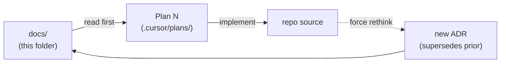

# Invoicey docs

This folder is the **source of truth** for product, architecture, and domain decisions on Invoicey. Code implements against these docs; docs are not generated from code.

If a doc disagrees with the code, the doc is right and the code is a bug — or the doc is stale and a new ADR must supersede it. Either way, do not silently desync.

## Layout

| Path | Purpose | Lifecycle |
| --- | --- | --- |
| [`PRD.md`](./PRD.md) | Product requirements — use cases, MVP scope, non-goals, success criteria | Living |
| [`roadmap.md`](./roadmap.md) | Plan 0..N with goal + exit criteria for each | Living |
| [`architecture.md`](./architecture.md) | Stack, monorepo layout, dataflow, runtime boundaries, env vars | Living |
| [`glossary.md`](./glossary.md) | Czech tax/invoicing terms with English equivalents | Living |
| [`domain/`](./domain) | Domain contracts (invoice schema, VAT rules, numbering, status, snapshots) | Living |
| [`decisions/`](./decisions) | ADRs in Michael Nygard format, numbered, append-only | Append-only |
| [`specs/`](./specs) | Per-feature implementation specs (PDF, ARES, MCP, Slack, …) | Just-in-time, written before each plan |
| [`ui/`](./ui) | UI/UX specs — information architecture, flows, page intents | Just-in-time, written before each plan |

## Lifecycle conventions

- **Living docs** (PRD, roadmap, architecture, domain, glossary) — edit any time. Commit message body should explain *why* it changed, not just *what*.
- **ADRs** — append-only. If a decision changes:
  1. Write a new ADR with the next number (e.g. `0018-…`)
  2. Set the new ADR's `Status` to `Accepted (supersedes 0004)`
  3. Edit the old ADR's `Status` to `Superseded by 0018`
  4. Never rewrite the body of a superseded ADR
- **Specs and UI docs** — written just-in-time before the plan that consumes them. If a feature is dropped, archive its spec under `specs/_archived/` with a one-line explanation at the top.

## Conventions

- **Code blocks** use TypeScript syntax. Reference real package paths (`@invoicey/invoice-core`, `@invoicey/invoice-tools`, `apps/web`, `apps/mcp`, …).
- **Cross-references** use relative markdown links: `[invoice schema](./domain/invoice-schema.md)`.
- **Czech terms** appear in original form first, with English in parentheses on first use per doc, then linked to [`glossary.md`](./glossary.md).
- **TODO markers** use `TODO(plan-N): <question>` so they're searchable and tied to the plan that resolves them.
- **Examples** must round-trip — every JSON example for the invoice schema must validate against the schema described in the same doc.

## How docs and plans relate

Each plan in `.cursor/plans/` cites the docs it implements. Each ADR cites the plan(s) it touches.

## Reading order for newcomers

1. [`../README.md`](../README.md) — repo overview + getting started
2. [`PRD.md`](./PRD.md) — what we're building and why
3. [`glossary.md`](./glossary.md) — vocabulary
4. [`architecture.md`](./architecture.md) — how the system fits together
5. [`domain/invoice-schema.md`](./domain/invoice-schema.md) — the central contract
6. [`specs/mcp.md`](./specs/mcp.md) — AI create path (local Cursor)
7. [`roadmap.md`](./roadmap.md) — what ships when
8. [`decisions/`](./decisions) — why each foundational call was made

## Status

Implementation progress lives in [`roadmap.md`](./roadmap.md).

- **Done:** Plans 0–7 (docs → list UI), Plan 12a (local MCP), Plan 13a (historical Slack demo).
- **In progress:** Plan 13b — Eve Slack agent ([`specs/slack-eve.md`](./specs/slack-eve.md)).
- **Automation:** Prefer MCP / Eve Slack over a heavy builder UI for day-to-day create ([`AGENTS.md`](../AGENTS.md)).

Narrative plans: [`.cursor/plans/`](../.cursor/plans/).
