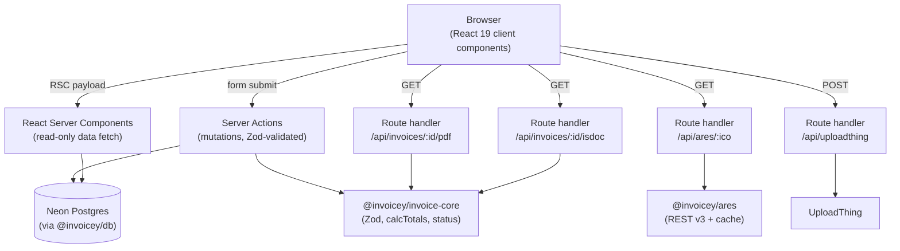
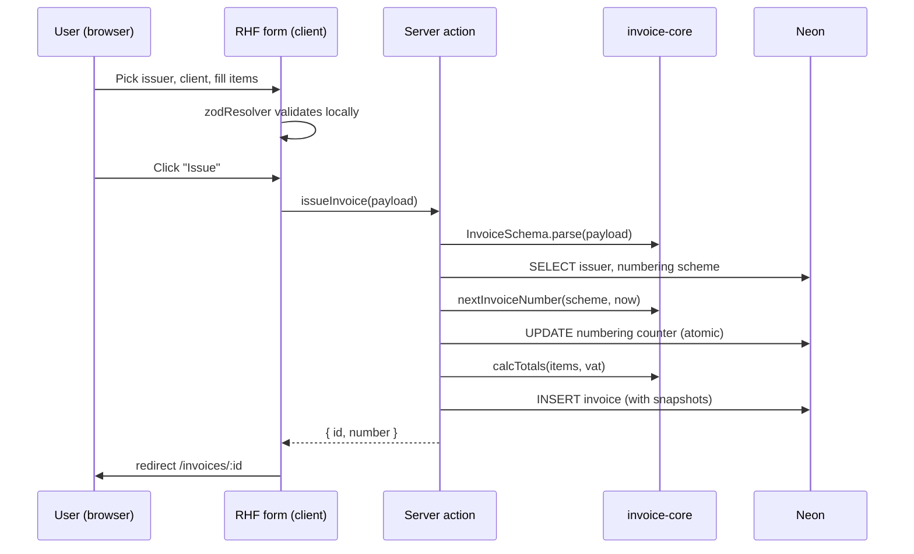
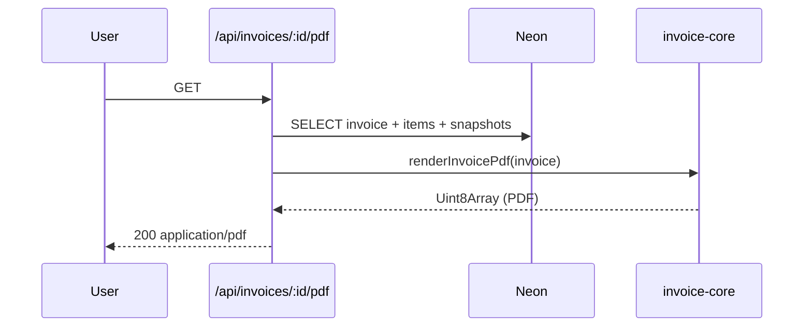
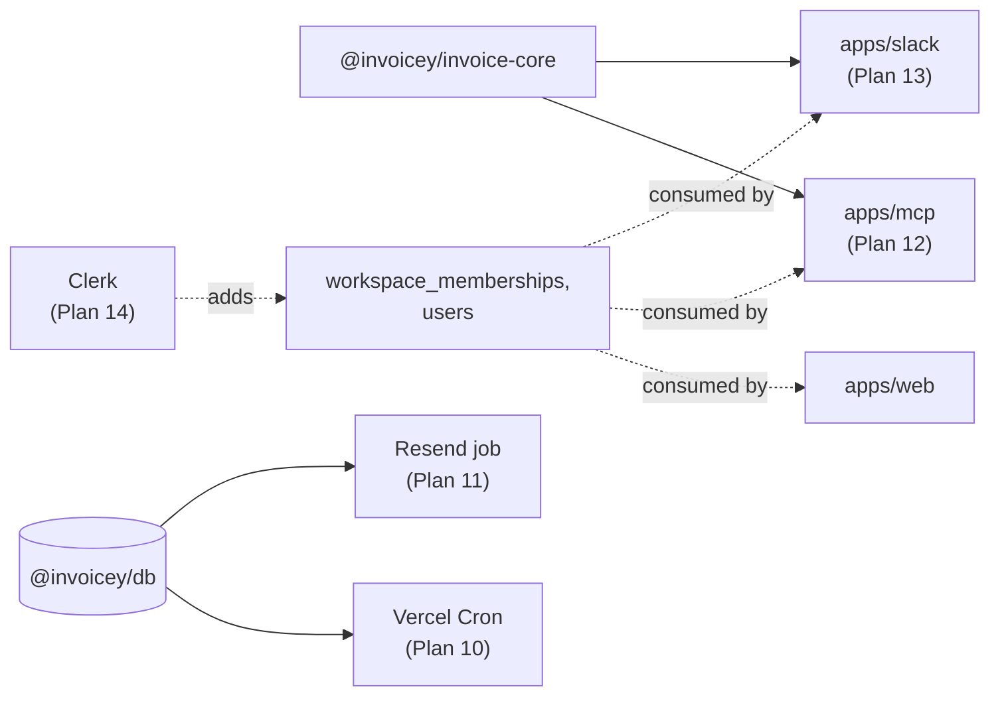

# Architecture

How the pieces fit together. Cross-references the ADRs that justify each choice.

## Stack at a glance

| Layer | Choice | ADR |
| --- | --- | --- |
| Monorepo | Turborepo + bun workspaces | [0001](./decisions/0001-monorepo-turborepo-bun.md) |
| Web framework | Next.js 16 (App Router, RSC, Server Actions) | [0002](./decisions/0002-nextjs15-app-router.md) |
| UI primitives | shadcn/ui base + ReUI registry (`@reui`, `base-nova` style) | [0003](./decisions/0003-shadcn-plus-reui-registry.md) |
| Styling | Tailwind v4 | inherited from shadcn/ReUI |
| PDF rendering | `@react-pdf/renderer` | [0004](./decisions/0004-pdf-react-pdf-renderer.md) |
| Schema / validation | Zod (single source of truth) | [0005](./decisions/0005-zod-as-source-of-truth.md) |
| Form runtime | React Hook Form + `@hookform/resolvers/zod` | [0015](./decisions/0015-rhf-plus-zod-resolver-builder.md) |
| Database | Neon Postgres (Vercel Marketplace) | [0009](./decisions/0009-drizzle-neon-postgres.md) |
| ORM | Drizzle | [0009](./decisions/0009-drizzle-neon-postgres.md) |
| File uploads | UploadThing | [0010](./decisions/0010-uploadthing-for-files.md) |
| QR generation | `qrcode` | inherited from [0004](./decisions/0004-pdf-react-pdf-renderer.md) (PDF-side) |
| ISDOC XML | `xmlbuilder2` | (lazy, finalized in `specs/isdoc.md`) |
| Auth | _none in MVP_ | [0006](./decisions/0006-no-auth-mvp-multi-tenant-ready.md) |
| Hosting | Vercel | inherited from Next.js choice |
| Tests | Vitest (unit) + golden-file fixtures (PDF/ISDOC) | (decided in Plan 2/3) |
| Lint / format | ESLint + Prettier + `commitlint` | (decided in Plan 1) |

## Monorepo layout

```
inveoiceyai/
├── apps/
│   └── web/                    Next.js 16 App Router app
│       ├── app/
│       │   ├── (app)/          authed-style group, sidebar layout
│       │   │   ├── dashboard/
│       │   │   ├── invoices/
│       │   │   ├── clients/
│       │   │   ├── issuers/
│       │   │   └── settings/
│       │   └── api/
│       │       ├── ares/[ico]/route.ts        (proxy + cache)
│       │       ├── uploadthing/route.ts       (UT route)
│       │       └── invoices/[id]/{pdf,isdoc}/route.ts
│       ├── actions/            server actions (mutations)
│       └── components/         app-specific UI (forms, data grid, …)
├── packages/
│   ├── invoice-core/           domain: Zod schema, totals, numbering, status, PDF, QR, ISDOC
│   ├── db/                     Drizzle schema + migrations + connection helper
│   ├── ares/                   ARES REST v3 client
│   ├── ui/                     shared UI primitives (post-MVP, kept empty for now)
│   ├── config-eslint/
│   └── config-ts/
├── docs/                       (this folder)
├── .cursor/
│   └── plans/                  per-phase implementation plans
├── turbo.json
├── package.json                workspaces
└── bun.lockb
```

The empty `apps/mcp` and `apps/slack` are *not* added in MVP; they're roadmap items (Plans 12 and 13). Adding them later requires no restructuring because `invoice-core` and `db` are already independent packages.

## Runtime boundaries (Next.js 16)



### What runs where

- **React Server Components** — read-only fetches via `@invoicey/db`. No mutations. No client-side bundle cost. Default for every page in `apps/web`.
- **Server Actions** — *all* mutations. Each action parses input through the relevant Zod schema before touching the DB. This is the same surface a future MCP tool calls. See [ADR 0016](./decisions/0016-server-actions-as-mutation-surface.md).
- **Route handlers** — only used when streaming binaries (PDF, ISDOC) or proxying external APIs (ARES, UploadThing). Never used for app mutations.
- **Client components** — RHF-driven forms (the invoice builder, the issuer/client editors). Marked `'use client'` only where needed.

## Data flow: creating an invoice



Every mutation goes Zod-first. The DB never sees data that wasn't validated by the same schema the UI/MCP/Slack will use.

## Data flow: rendering a PDF



The PDF is *not* cached — it's cheap to render and we want it to reflect the latest snapshot/QR. Reconsider if perf becomes an issue.

## Multi-tenancy seam (workspace_id everywhere)

Every business-data table carries `workspace_id`. In MVP a single workspace row is seeded and hard-coded server-side; queries always include `WHERE workspace_id = $1`.

When [Plan 14 (auth)](./roadmap.md#plan-14--authentication--multi-user) lands, `workspace_id` becomes a session-derived value (Clerk org → workspace). No table migration is needed beyond adding `users` and `workspace_memberships`.

See [ADR 0007](./decisions/0007-workspace-scoped-data-model.md).

## Environment variables

| Var | Purpose | Where set | When introduced |
| --- | --- | --- | --- |
| `DATABASE_URL` | Neon Postgres connection string | Vercel + `.env.local` | Plan 1 |
| `DATABASE_URL_UNPOOLED` | Neon direct (non-pooled) URL for migrations | Vercel + `.env.local` | Plan 1 |
| `UPLOADTHING_TOKEN` | UploadThing API token | Vercel + `.env.local` | Plan 5 |
| `UPLOADTHING_APP_ID` | UploadThing app ID | Vercel + `.env.local` | Plan 5 |
| `NEXT_PUBLIC_APP_URL` | Public origin (used by SPAYD message templates, future emails) | Vercel + `.env.local` | Plan 1 |
| `INVOICEY_DEFAULT_WORKSPACE_ID` | UUID of the seeded default workspace; until auth, every server action loads this | Vercel + `.env.local` | Plan 1 |
| `RESEND_API_KEY` | Resend API key | Vercel | Plan 11 |
| `CLERK_SECRET_KEY` | Clerk secret | Vercel | Plan 14 |
| `CLERK_PUBLISHABLE_KEY` | Clerk publishable key | Vercel | Plan 14 |
| `SLACK_BOT_TOKEN` | Slack bot OAuth token (`xoxb-…`) | Vercel + `.env.local` | Plan 13a |
| `SLACK_SIGNING_SECRET` | Slack request-signing secret | Vercel + `.env.local` | Plan 13a |
| `AI_GATEWAY_API_KEY` | Vercel AI Gateway API key | Vercel + `.env.local` | Plan 13a |
| `INVOICEY_AI_MODEL` | Gateway model id (e.g. `openai/gpt-4o-mini`) | Vercel + `.env.local` | Plan 13a |
| `INVOICEY_AI_FALLBACK_MODEL` | Fallback gateway model id | Vercel + `.env.local` | Plan 13a |
| `INVOICEY_DEMO_ISSUER_JSON` | Optional JSON override for demo `IssuerSnapshot` | Vercel + `.env.local` | Plan 13a |

`.env.example` lives at repo root with every var commented; `.env.local` is git-ignored.

## Hosting & deploy

- **Vercel** for `apps/web` — Next.js 16 + Server Actions + route handlers run on Vercel Functions
- **Neon** for Postgres — wired via Vercel Marketplace (auto-injects `DATABASE_URL`)
- **UploadThing** for files — configured per-app
- **Plan 13a (Slack demo):** slash command hits `apps/web/app/api/slack/commands/route.ts` (Node runtime). A future `apps/slack` split remains optional.
- **Future:** `apps/mcp` runs as a separate Vercel deployment (or self-hosted box) when introduced.

## Tooling

- **Package manager:** `bun` (no `pnpm-lock.yaml` — see [package-management rule](../.cursor/rules/package-management.mdc) — TODO(plan-1): symlink workspace rules into `.cursor/rules/` if helpful)
- **Type-check:** `tsc --noEmit` per package via Turborepo
- **Lint:** ESLint flat config in `packages/config-eslint`
- **Format:** Prettier + `prettier-plugin-tailwindcss`
- **Commit hygiene:** `commitlint` + Husky `commit-msg` hook, scope enum derived from package names

## Future hooks (designed-in, not built)



Each post-MVP plan reuses `invoice-core` and `db` directly — no HTTP shim, no protobuf, no schema duplication. The Zod `InvoiceSchema` is the inter-app contract.

## Open architectural questions

### TODO(plan-1): Tailwind v4 + ReUI base-nova style compatibility

ReUI ships `base-nova` style on Tailwind v4 ([reui.io/docs/get-started](https://reui.io/docs/get-started)). Confirm the registry config plays nicely with Next.js 16's app-dir CSS handling and that `base-nova` does not conflict with shadcn defaults we override.

