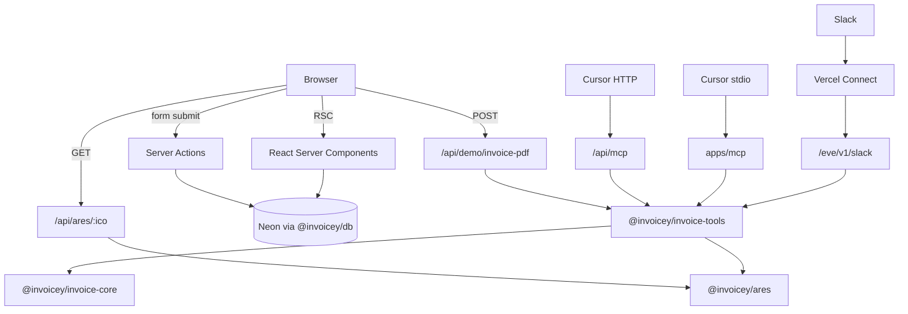
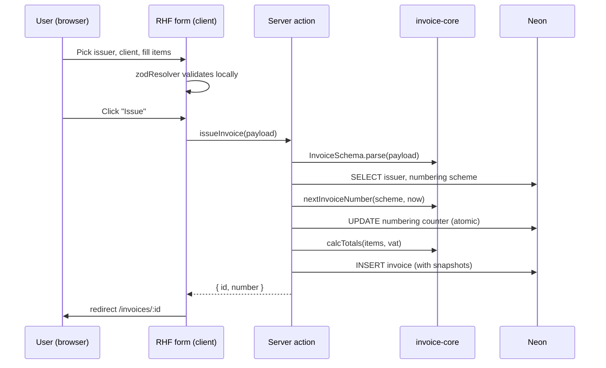
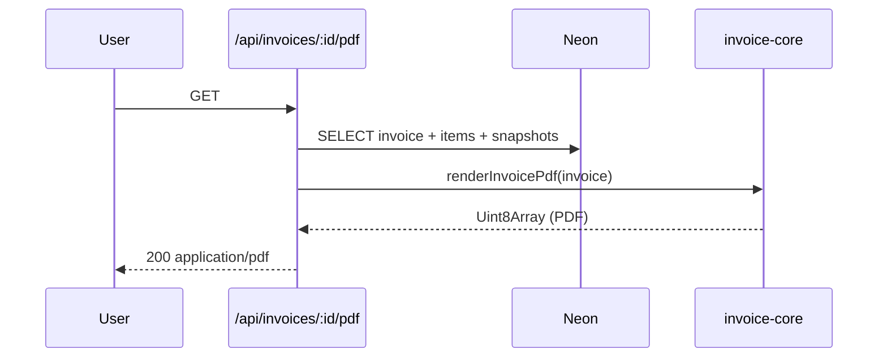
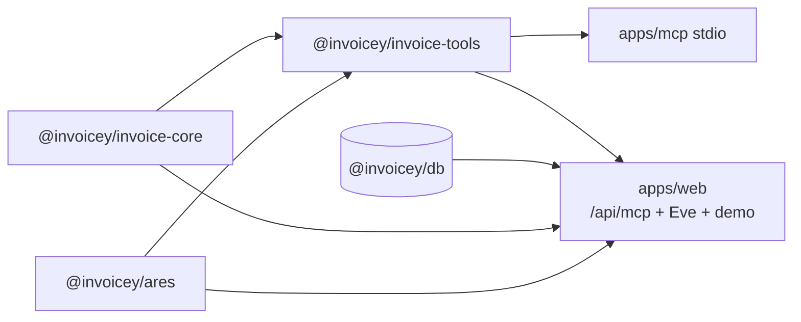

# Architecture

How the pieces fit together. Cross-references the ADRs that justify each choice.

## Stack at a glance

| Layer               | Choice                                                      | ADR                                                                          |
| ------------------- | ----------------------------------------------------------- | ---------------------------------------------------------------------------- |
| Monorepo            | Turborepo + bun workspaces                                  | [0001](./decisions/0001-monorepo-turborepo-bun.md)                           |
| Web framework       | Next.js 16 (App Router, RSC, Server Actions)                | [0002](./decisions/0002-nextjs15-app-router.md)                              |
| UI primitives       | shadcn/ui base + ReUI registry (`@reui`, `base-nova` style) | [0003](./decisions/0003-shadcn-plus-reui-registry.md)                        |
| Styling             | Tailwind v4                                                 | inherited from shadcn/ReUI                                                   |
| PDF rendering       | `@react-pdf/renderer`                                       | [0004](./decisions/0004-pdf-react-pdf-renderer.md)                           |
| Schema / validation | Zod (single source of truth)                                | [0005](./decisions/0005-zod-as-source-of-truth.md)                           |
| Form runtime        | React Hook Form + `@hookform/resolvers/zod`                 | [0015](./decisions/0015-rhf-plus-zod-resolver-builder.md)                    |
| Database            | Neon Postgres (Vercel Marketplace)                          | [0009](./decisions/0009-drizzle-neon-postgres.md)                            |
| ORM                 | Drizzle                                                     | [0009](./decisions/0009-drizzle-neon-postgres.md)                            |
| File uploads        | UploadThing                                                 | [0010](./decisions/0010-uploadthing-for-files.md)                            |
| QR generation       | `qrcode`                                                    | inherited from [0004](./decisions/0004-pdf-react-pdf-renderer.md) (PDF-side) |
| ISDOC XML           | `xmlbuilder2`                                               | (lazy, finalized in `specs/isdoc.md`)                                        |
| Auth                | _none in MVP_                                               | [0006](./decisions/0006-no-auth-mvp-multi-tenant-ready.md)                   |
| Hosting             | Vercel                                                      | inherited from Next.js choice                                                |
| Tests               | Vitest (unit) + golden-file fixtures (PDF/ISDOC)            | (decided in Plan 2/3)                                                        |
| Lint / format       | ESLint + Prettier + `commitlint`                            | (decided in Plan 1)                                                          |

## Monorepo layout

```
inveoiceyai/
├── apps/
│   ├── web/                    Next.js 16 App Router (@invoicey/web)
│   │   ├── app/
│   │   │   ├── (app)/          sidebar shell
│   │   │   │   ├── dashboard/
│   │   │   │   ├── invoices/   # incl. /from-json demo
│   │   │   │   ├── clients/
│   │   │   │   ├── issuers/
│   │   │   │   └── settings/
│   │   │   └── api/
│   │   │       ├── ares/[ico]/
│   │   │       ├── demo/invoice-pdf/
│   │   │       └── [transport]/   # MCP Streamable HTTP (/api/mcp)
│   │   ├── agent/              Eve Slack + HTTP channels (/eve/v1/*)
│   │   └── actions/            server actions (mutations)
│   └── mcp/                    local stdio MCP (@invoicey/mcp)
├── packages/
│   ├── invoice-core/           Zod schema, totals, numbering, status, PDF, QR, ISDOC
│   ├── invoice-tools/          normalize, presets, create/render, MCP registration
│   ├── db/                     Drizzle schema + Neon client
│   ├── ares/                   ARES REST v3 client
│   ├── env/                    env schema helpers
│   ├── config-eslint/
│   └── config-ts/
├── docs/                       (this folder)
├── .cursor/
│   ├── plans/                  per-phase implementation plans
│   └── mcp.json.example
├── turbo.json
├── package.json                workspaces
└── bun.lock
```

Shared domain: `invoice-core` + `invoice-tools` + `ares` + `db`. Slack Eve agent lives under `apps/web/agent/` (Plan 13b); see [`specs/slack-eve.md`](./specs/slack-eve.md).

## Runtime boundaries (Next.js 16 + MCP)



### What runs where

- **React Server Components** — read-only fetches via `@invoicey/db`. Default for app pages.
- **Server Actions** — DB mutations; each parses input through Zod first. See [ADR 0016](./decisions/0016-server-actions-as-mutation-surface.md).
- **Route handlers** — binaries (PDF/ISDOC), ARES proxy, demo PDF, Slack receivers, MCP HTTP (`mcp-handler`). Node runtime required for PDF (`Buffer` / fonts).
- **`@invoicey/invoice-tools`** — framework-agnostic create/render, ARES lookup, file presets; consumed by MCP and Slack (and demo paths).
- **`apps/mcp`** — stdio MCP for local Cursor / Claude Desktop.
- **Client components** — forms and interactive UI only where needed (`'use client'`).

## Data flow: creating an invoice



Every mutation goes Zod-first. The DB never sees data that wasn't validated by the same `InvoiceSchema` the UI / MCP / Slack use. Stateless MCP/Slack create paths validate and render without writing the DB (Plan 12a / 13a).

## Data flow: rendering a PDF



The PDF is _not_ cached — it's cheap to render and we want it to reflect the latest snapshot/QR. Reconsider if perf becomes an issue.

## Multi-tenancy seam (workspace_id everywhere)

Every business-data table carries `workspace_id`. In MVP a single workspace row is seeded and hard-coded server-side; queries always include `WHERE workspace_id = $1`.

When [Plan 14 (auth)](./roadmap.md#plan-14--authentication--multi-user) lands, `workspace_id` becomes a session-derived value (Clerk org → workspace). No table migration is needed beyond adding `users` and `workspace_memberships`.

See [ADR 0007](./decisions/0007-workspace-scoped-data-model.md).

## Environment variables

| Var                                            | Purpose                                                                                                 | Where set                      | When introduced        |
| ---------------------------------------------- | ------------------------------------------------------------------------------------------------------- | ------------------------------ | ---------------------- |
| `DATABASE_URL`                                 | Neon Postgres connection string (also enables durable MCP presets + draft invoices)                     | Vercel + `.env.local`          | Plan 1 / DB foundation |
| `DATABASE_URL_UNPOOLED`                        | Neon direct (non-pooled) URL for migrations                                                             | Vercel + `.env.local`          | Plan 1                 |
| `INVOICEY_PRESETS_BACKEND`                     | Set `file` to force JSON presets even with `DATABASE_URL`                                               | local / optional               | DB foundation          |
| `UPLOADTHING_TOKEN`                            | UploadThing API token                                                                                   | Vercel + `.env.local`          | Plan 5                 |
| `UPLOADTHING_APP_ID`                           | UploadThing app ID                                                                                      | Vercel + `.env.local`          | Plan 5                 |
| `NEXT_PUBLIC_APP_URL`                          | Public origin (used by SPAYD message templates, future emails)                                          | Vercel + `.env.local`          | Plan 1                 |
| `INVOICEY_DEFAULT_WORKSPACE_ID`                | UUID of the seeded default workspace; until auth, every server action loads this                        | Vercel + `.env.local`          | Plan 1                 |
| `RESEND_API_KEY`                               | Resend API key (optional in schema; send fails closed when unset)                                       | Vercel + `.env.local`          | Plan 11                |
| `RESEND_WEBHOOK_SECRET`                        | Svix signing secret for `/api/webhooks/resend`                                                          | Vercel + `.env.local`          | Plan 11                |
| `EMAIL_FROM`                                   | Invoice From header (`Invoicey <invoices@invoicey.ditrich.me>`)                                         | Vercel + `.env.local`          | Plan 11                |
| `EMAIL_SYSTEM_FROM`                            | System From header (`Invoicey <noreply@invoicey.ditrich.me>`)                                           | Vercel + `.env.local`          | Plan 11                |
| `CRON_SECRET`                                  | Bearer for `/api/cron/overdue-reminders` and `/api/cron/recurring-drafts`                               | Vercel + `.env.local`          | Plan 11d / 10          |
| `AI_GATEWAY_API_KEY`                           | Vercel AI Gateway API key (Eve + MCP AI)                                                                | Vercel + `.env.local`          | Plan 13a / 13b         |
| `INVOICEY_AI_MODEL`                            | Gateway model id for Eve (`agent/agent.ts`)                                                             | Vercel + `.env.local`          | Plan 13b               |
| `INVOICEY_DEMO_ISSUER_JSON`                    | Optional JSON override for demo `IssuerSnapshot`                                                        | Vercel + `.env.local`          | Plan 12a / 13b         |
| `INVOICEY_PRESETS_PATH`                        | Absolute path to local MCP presets JSON                                                                 | local MCP / optional           | Plan 12a               |
| `MCP_API_KEY`                                  | Bearer token for `/api/mcp` (optional in schema; route fails closed when unset); also Eve HTTP fallback | Vercel + `.env` / `.env.local` | Plan 12a               |
| `EVE_API_KEY`                                  | Optional Bearer for `/eve/v1/*` HTTP (else `MCP_API_KEY`)                                               | Vercel + `.env.local`          | Plan 13b               |
| ~~`SLACK_BOT_TOKEN` / `SLACK_SIGNING_SECRET`~~ | Hand-managed Slack secrets — **deprecated** for Eve; use Vercel Connect                                 | —                              | Plan 13a only          |

`.env.example` lives at repo root with every var commented; `.env.local` is git-ignored.

## Hosting & deploy

- **Vercel** for `apps/web` — Next.js 16 + Server Actions + route handlers run on Vercel Functions
- **Neon** for Postgres — wired via Vercel Marketplace (auto-injects `DATABASE_URL`); schema in [`docs/specs/db-schema.md`](./specs/db-schema.md)
- **UploadThing** for files — configured per-app
- **Plan 13b (Eve Slack):** `apps/web/agent/` mounted with `withEve()`; Connect trigger → `/eve/v1/slack`; Node 24+. Spec: [`specs/slack-eve.md`](./specs/slack-eve.md). Plan 13a `/api/slack/*` retired.
- **Plan 12a (MCP):** local stdio via `apps/mcp`; remote Streamable HTTP via `apps/web` `/api/mcp` (`mcp-handler`, Node runtime, `MCP_API_KEY` bearer, fail-closed when unset). Shared tool logic in `@invoicey/invoice-tools` (+ `/ops` for issue/paid).

## Tooling

- **Package manager:** `bun` (no `pnpm-lock.yaml` — see [package-management rule](../.cursor/rules/package-management.mdc) — TODO(plan-1): symlink workspace rules into `.cursor/rules/` if helpful)
- **Type-check:** `tsc --noEmit` per package via Turborepo
- **Lint:** ESLint flat config in `packages/config-eslint`
- **Format:** Prettier + `prettier-plugin-tailwindcss`
- **Commit hygiene:** `commitlint` + Husky `commit-msg` hook, scope enum derived from package names

## Package / app dependency map



Post-MVP still designed-in: Vercel Cron (Plan 10 / 11d), Resend (Plan 11), MCP+DB tools (Plan 12b), Better Auth (Plan 14). Slack Eve (Plan 13b) shares the same Zod contract in-process — no HTTP shim between MCP and Slack. Email: [`specs/email.md`](./specs/email.md).

## Open architectural questions

### TODO(plan-5): issuer asset uploads vs demo PDF slots

UploadThing for logo/stamp/signature lands with issuers. Confirm font/image tracing on Vercel stays green for MCP + Slack PDF paths (`outputFileTracingIncludes` already covers invoice-core assets).
