# Invoicey current user flows and UX map

- **Audit date:** 24 August 2026 (Europe/Prague)
- **Product build:** local development build of the Invoicey monorepo
- **Audited user:** `agent@invoicey.local`
- **Evidence:** [screenshots](./screenshots/) and [DOM snapshots](./dom/)

## 1. Scope and audit setup

This is a current-state product walkthrough, not a requirements document. I reset the agent account to a dedicated empty audit workspace, signed in through the test-only agent entry point, and then used the visible web UI as a normal workspace owner.

The reset left the shared/default workspace untouched. The audit workspace started with no issuers, clients, invoices, incoming invoices, recurring schedules, or bank connections. It received the normal AI-token balance so the AI flow could be exercised.

Data created while walking the product is deliberately synthetic/audit-only except for using a public ARES lookup for Alza.cz a.s.:

- issuer: Alza.cz a.s., IČO `27082440`, with a test bank account;
- client: Studio Sever s.r.o.;
- supplier: Dodavatel Audit s.r.o.;
- invoice: issued invoice `20260001`, CZK 42,350 including VAT;
- payment: the full payment was marked paid, reversed, then a CZK 1,000 manual payment was entered to exercise partial-payment behavior;
- AI: one draft request consumed 925 tokens and returned validation feedback instead of inventing missing client data.

No invoice email was sent, no live bank token was entered, no API key was created, and no Slack account was linked.

### Evidence conventions

Screenshots are named by walkthrough order. The matching DOM snapshot is in `dom/<same-name>.txt` when a stable semantic snapshot was saved. A screenshot is a point-in-time visual; the DOM file is the more precise source for labels, field names, and control states.

## 2. End-to-end map

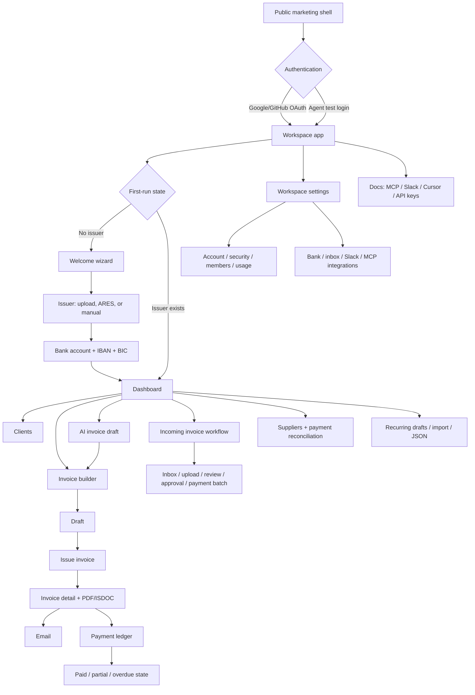

The flow is workspace-centered: the active organization/workspace determines the issuer, client, invoices, usage balance, inbox, settings, and integration authorization.

## 3. Public shell, authentication, and first run

### 3.1 Public marketing shell

The public home page is reachable whether logged out or logged in. It presents the product as invoice automation driven by web forms, JSON, AI, and integrations, with Czech business capabilities such as ARES, VAT handling, PDF/ISDOC, and payment QR. When already signed in, the header changes to a signed-in identity and offers **Continue to app** rather than forcing a redirect.

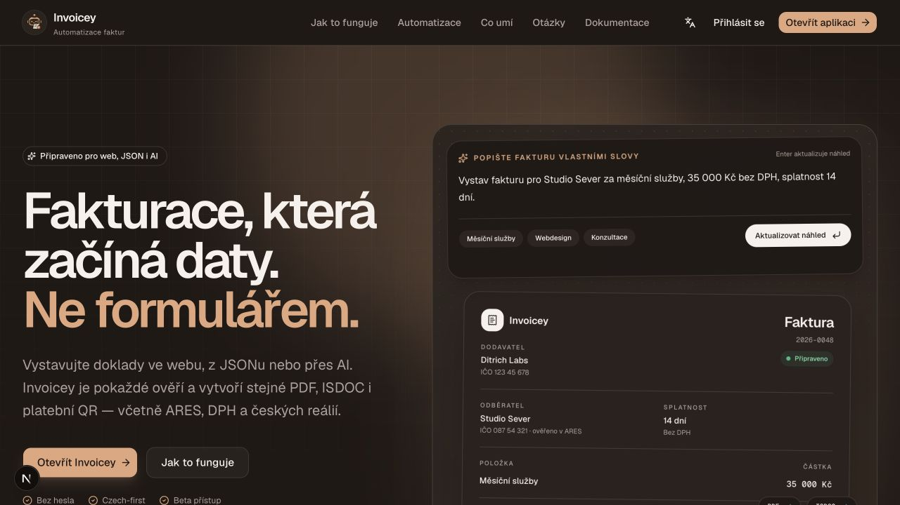

The UI supports Czech and English. The English signed-in shell is shown in [56-public-home-en.png](./screenshots/56-public-home-en.png). The public legal pages are beta copies for privacy, terms, and cookies: [privacy](./screenshots/53-privacy.png), [terms](./screenshots/54-terms.png), and [cookies](./screenshots/55-cookies.png).

### 3.2 Authentication

The normal sign-in surface is OAuth-only (Google and GitHub). The local build also exposes a test-only `/agent-login` entry point that issues a session for the audited agent account; it is not a customer-facing onboarding path. The authenticated entry then lands on the workspace welcome/dashboard decision.

When the already-authenticated agent visited `/sign-in`, the route redirected to the dashboard rather than showing a second sign-in form ([64-sign-in.png](./screenshots/64-sign-in.png)).

The agent is not a platform admin: visiting `/admin` redirected to `/dashboard` ([62-admin-gate.png](./screenshots/62-admin-gate.png)). Visiting `/onboarding` after the workspace was initialized also redirected to `/dashboard` ([63-onboarding-route.png](./screenshots/63-onboarding-route.png)).

The other link-based entry points were also checked without inventing valid tokens:

- an invalid referral code shows a public **Referral link not found** page with a sign-in CTA ([65-referral-invalid.png](./screenshots/65-referral-invalid.png));
- an invalid workspace invitation shows **Invitation not found** with **Back to app** ([66-invite-invalid.png](./screenshots/66-invite-invalid.png));
- an invalid Slack-link code shows the intended account/workspace context and tells the user to message the bot again for a new DM ([67-slack-link-invalid.png](./screenshots/67-slack-link-invalid.png)).

### 3.3 Welcome wizard

With an empty workspace, `/welcome` is a three-step wizard:

1. **Issuer:** upload a PDF containing embedded ISDOC (fast path), or enter an IČO and use ARES, or fill the identity form manually. Fields include name, DIČ, address, contact email, and VAT-payer status. The step can be skipped.
2. **Bank:** account number, IBAN, and optional BIC. The account number populated the IBAN in the audit run. This step can also be skipped/backtracked.
3. **Done:** confirms issuer creation and points to issuer settings or the dashboard. Defaults for numbering and email templates are created with the issuer.

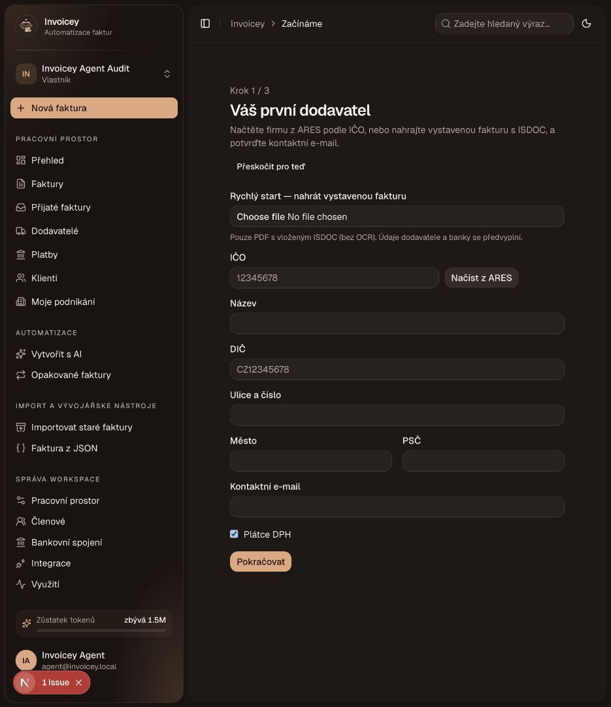

ARES lookup populated Alza.cz a.s., DIČ, address, and city/postcode before the form was completed ([05-onboarding-ares-lookup.png](./screenshots/05-onboarding-ares-lookup.png)). The bank step and completion screen are [06-onboarding-bank-step.png](./screenshots/06-onboarding-bank-step.png) and [07-onboarding-complete.png](./screenshots/07-onboarding-complete.png).

## 4. App shell and dashboard

The gated shell provides the active workspace identity, locale/theme controls, a workspace switcher/settings area, and navigation to the operational surfaces below. The dashboard is the default landing page after the workspace is ready.

The dashboard summarizes invoice states and turnover for the last 12 months. The visible status tiles are **Paid**, **Draft**, **Unpaid**, **Overdue**, and **Future**; charts show monthly turnover/activity. The empty state directs the user to create the first invoice. The primary actions are **Go to invoices** and **New invoice**.

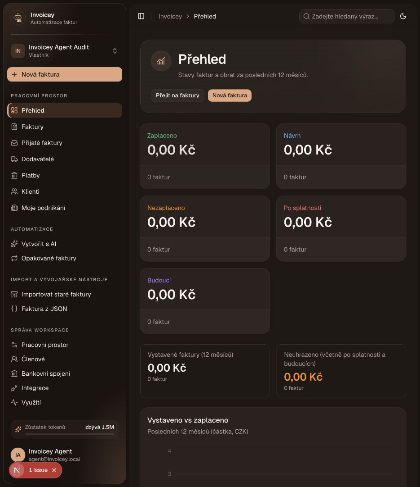

The dashboard began empty after onboarding. After the audit invoice was issued, its status and amount appeared in the related list/ledger surfaces rather than requiring a separate dashboard configuration.

## 5. Issuers

### 5.1 Issuer list and creation

`/issuers` is a table of workspace issuers with a default badge, IČO, DIČ, VAT status, filtering, column selection, and row actions to edit or delete. The audit workspace contained one default issuer.

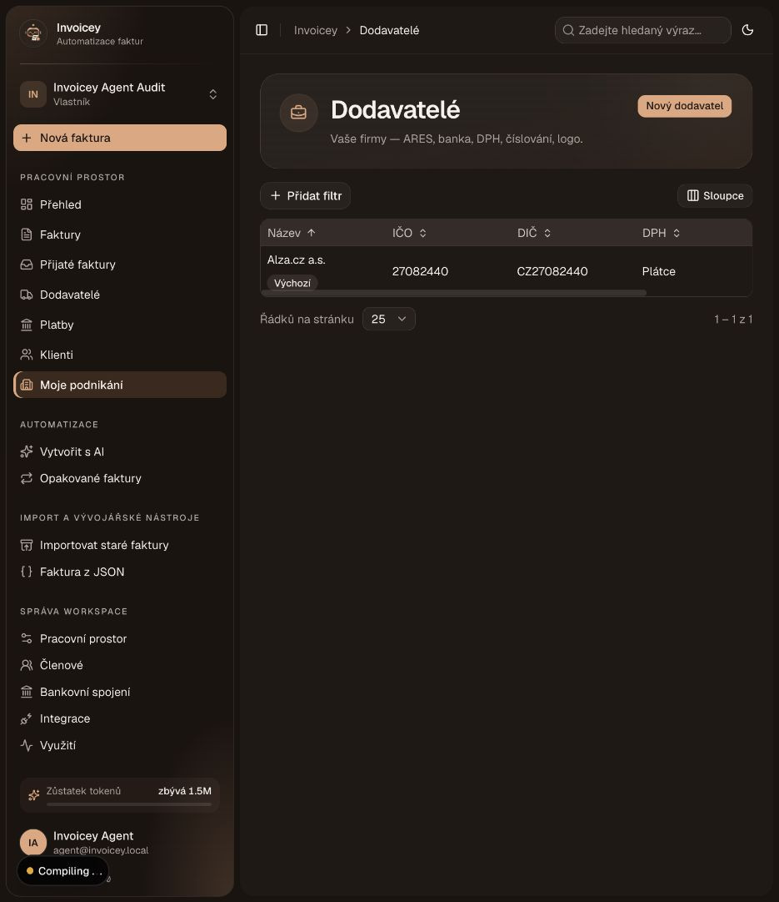

`/issuers/new` combines identity and bank setup in one creation form: ARES lookup by IČO, name/DIČ/address/email, VAT-payer checkbox, account number, IBAN, and BIC. A new issuer receives numbering and email defaults. The English view is [60-issuer-new.png](./screenshots/60-issuer-new.png).

### 5.2 Issuer settings sections

The issuer editor is split into section routes, avoiding one oversized settings form:

| Section   | Current controls and behavior                                                                                                         | Evidence                                                                         |
| --------- | ------------------------------------------------------------------------------------------------------------------------------------- | -------------------------------------------------------------------------------- |
| Identity  | ARES IČO lookup/source, name, DIČ, street, city, postcode, country, contact email, VAT payer, commercial-register text, save          | [10](./screenshots/10-issuer-settings-identity.png), DOM from the identity route |
| Bank      | Account number, IBAN, BIC, payment QR receiver/payer text templates, save                                                             | [11](./screenshots/11-issuer-bank.png)                                           |
| Assets    | Logo, stamp, and signature uploads; PNG/JPG, max 1 MB; save                                                                           | [12](./screenshots/12-issuer-assets.png)                                         |
| Numbering | Separate invoice/proforma/advance/credit-note prefixes, next-number preview, template/padding, yearly/never reset, counter/year, save | [13](./screenshots/13-issuer-numbering.png)                                      |
| Email     | Subject/message/from templates, attach ISDOC by default, overdue reminders, payment-received confirmations, save                      | [14](./screenshots/14-issuer-email.png)                                          |

The identity screen showed the ARES source after the onboarding lookup. Bank data was visible and editable after onboarding; no live bank synchronization was configured.

## 6. Clients

`/clients` combines a client table with ARES lookup/manual-entry positioning. It offers search/filtering, **Merge duplicates**, and **New client**. The initial empty state is [15-clients-list.png](./screenshots/15-clients-list.png).

The new-client form accepts IČO + ARES lookup, then name, DIČ, address, country ISO, and contact email; the source is shown as ARES or manual. The audit client was entered manually and appeared in the list with a **Manual** source ([16-client-new.png](./screenshots/16-client-new.png), [17-client-created.png](./screenshots/17-client-created.png)). The edit page exposes the same identity/contact fields and an irreversible delete action ([18-client-edit.png](./screenshots/18-client-edit.png)).

## 7. Invoice creation lifecycle

### 7.1 Structured invoice builder

`/invoices/new` is a structured form rather than a freeform canvas. The page explains that a saved draft can later be issued and produce PDF/ISDOC outputs. The main fields are:

| Area              | Observed choices/fields                                                                  |
| ----------------- | ---------------------------------------------------------------------------------------- |
| Parties           | Issuer combobox; client combobox; ARES-based client addition                             |
| Document          | Invoice, proforma, advance, credit note                                                  |
| Dates             | Issue date, due date, DUZP/taxable-supply date                                           |
| Language/currency | Per-invoice Czech/English; CZK/EUR/USD (QR payments are CZK-only)                        |
| VAT               | Regular, reverse charge, OSS; supplies abroad none/EU/non-EU; prices with or without VAT |
| Lines             | Description, quantity, unit, unit price, VAT rate; add/remove line items                 |
| Notes             | Free note field                                                                          |
| Actions           | Save draft, issue, PDF preview                                                           |

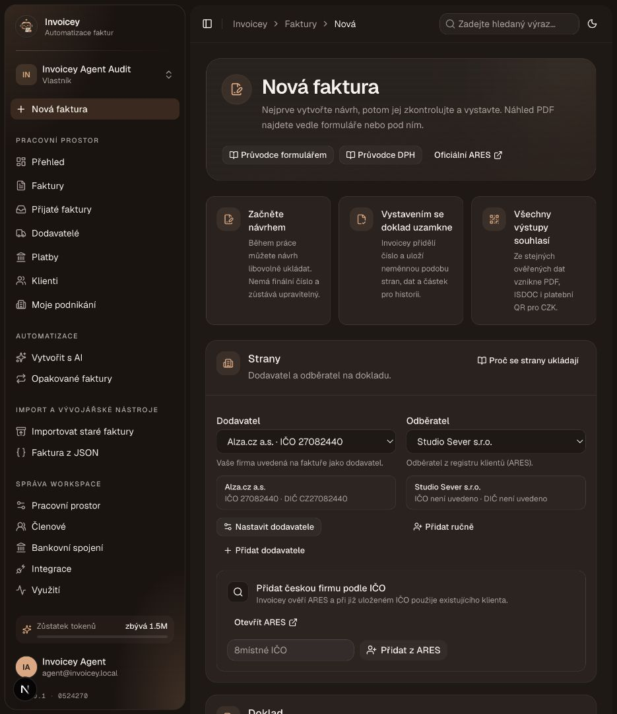

The audit filled one line item (“Měsíční konzultace”, CZK 35,000 before 21% VAT), selected the issuer/client, and saved a draft. The builder then stayed available at `/invoices/<id>/edit` and displayed the calculated total CZK 42,350 ([20-invoice-draft-saved.png](./screenshots/20-invoice-draft-saved.png)).

### 7.2 Issue and detail page

Issuing the draft generated invoice `20260001` and opened its detail page. The detail page exposes lifecycle actions:

- mark paid / undo paid;
- download PDF and ISDOC;
- duplicate;
- repeat/save as recurring;
- send by email;
- cancel.

The page shows document metadata, status, totals, line items, and a payment ledger with allocated/outstanding amounts. The issued view showed **Unpaid** and CZK 42,350 outstanding ([21-invoice-issued-detail.png](./screenshots/21-invoice-issued-detail.png)). After marking paid, it showed **Paid**, CZK 42,350 allocated, and zero outstanding ([22-invoice-paid-detail.png](./screenshots/22-invoice-paid-detail.png)).

The PDF preview iframe did not render in the local audit browser and displayed “localhost refused to connect.” The download/ISDOC actions were still present; no external artifact was sent or downloaded during the walkthrough.

### 7.3 Email modal

The **Send by email** dialog prefilled the client recipient and issuer sender, and exposed Cc, subject, cover text, ISDOC attachment, From, and Reply-to fields. It offered **Send** and **Close**. The send action was intentionally not clicked.

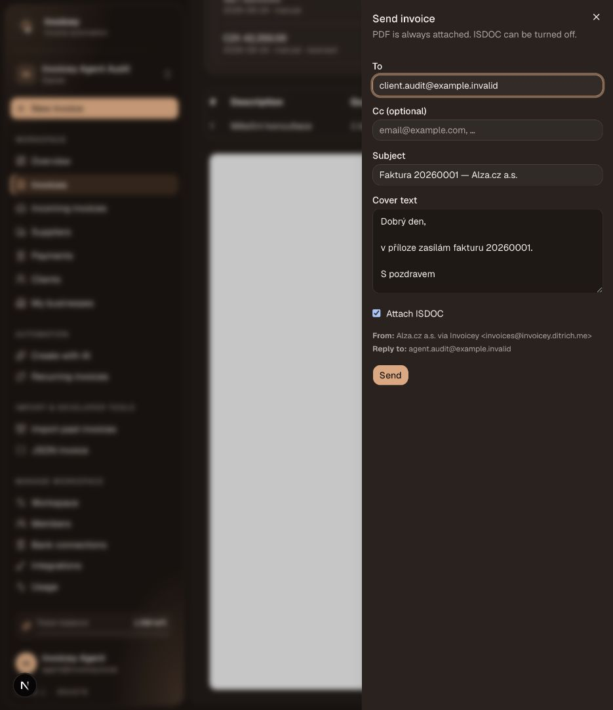

### 7.4 Recurring schedule modal

**Repeat** opens a modal to save the current invoice as a recurring plan. Observed controls were name, cadence (weekly/monthly/quarterly/yearly), day-of-month (first, a chosen date, 15th, last), and save schedule. The schedule was not saved.

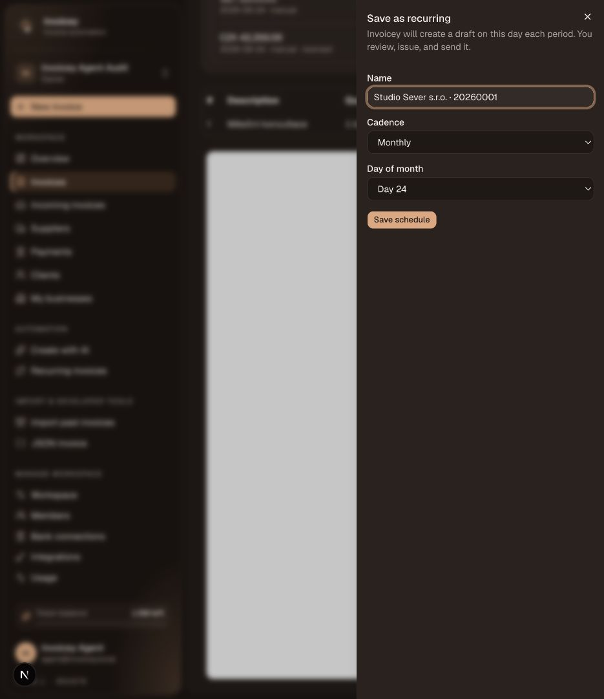

The standalone `/invoices/recurring` page was empty and directed the user to open an invoice and save it as recurring ([42-recurring.png](./screenshots/42-recurring.png)).

### 7.5 Payment and cancellation edge behavior

The paid invoice was reversed and a CZK 1,000 manual payment was entered to exercise the partial-payment state. The invoice then displayed CZK 1,000 allocated and CZK 41,350 outstanding. The payments page showed both the reversed full payment and the current partial payment ([47-partial-payment.png](./screenshots/47-partial-payment.png)).

With this partial-payment state, clicking **Cancel** immediately attempted cancellation and returned the visible error `Error: cannot_cancel`; the invoice remained in the list and was not cancelled ([59-invoice-cancelled-detail.png](./screenshots/59-invoice-cancelled-detail.png)). There was no confirmation dialog before the request.

## 8. Invoice list and statuses

`/invoices` provides status tiles for Draft, Unpaid, Overdue, Paid, Future, and Cancelled, plus date range controls, filters, column selection, and a table of invoice numbers/clients/amounts/statuses.

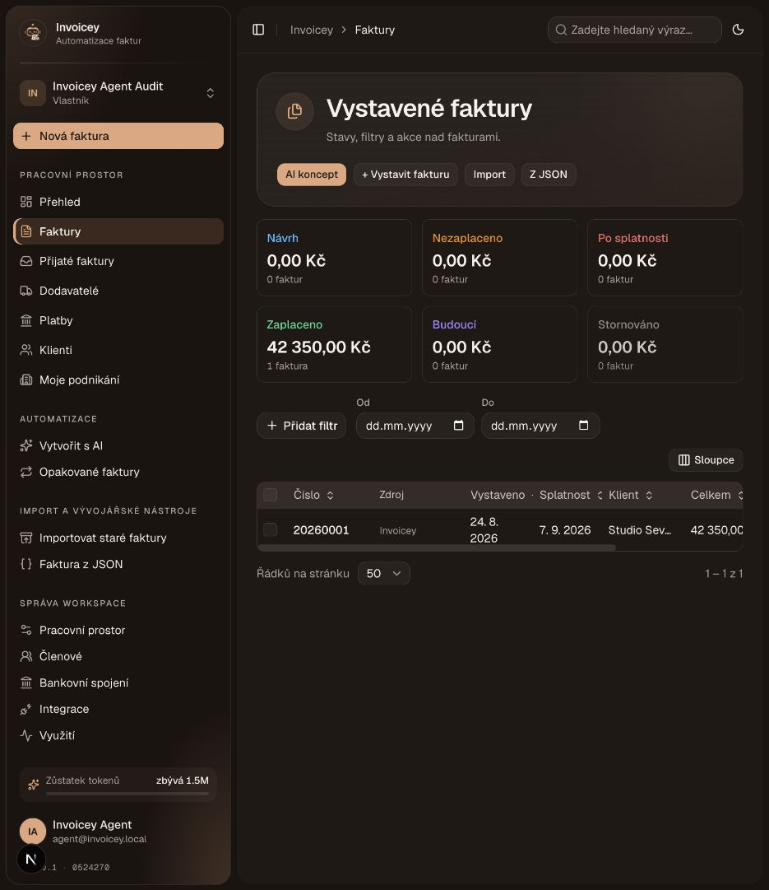

The audit invoice remained Unpaid with a partial allocation after the cancellation attempt. Status and payment amounts are reflected in both the list and detail/payment ledger views.

## 9. AI invoice draft

`/invoices/ai` is a lightweight prompt-to-draft flow. It presents a description input, generation action, token balance, and a PDF preview area. The user enters intent in natural language, then the result either fills a draft or returns validation feedback.

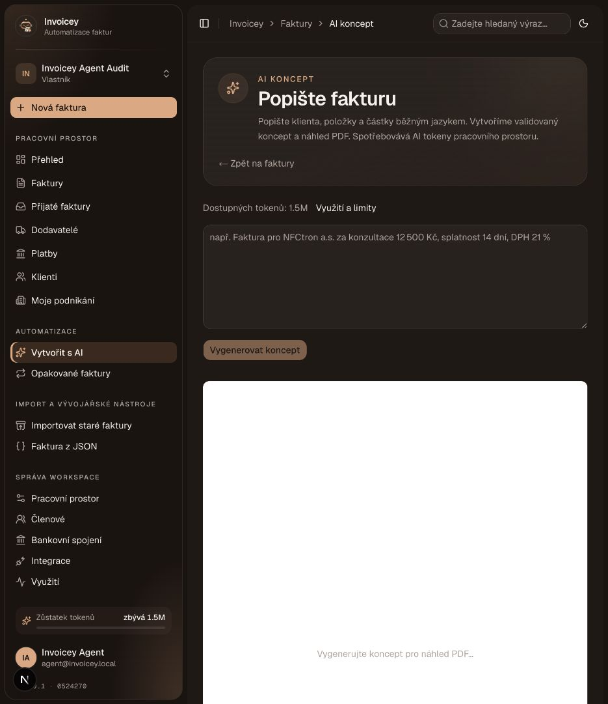

The audit prompt named Studio Sever and requested CZK 35,000 monthly consulting. Because that manually-created client had no ARES-resolvable IČO, the model returned a clear request to check the company name or provide an IČO rather than fabricating client data ([25-ai-validation-feedback.png](./screenshots/25-ai-validation-feedback.png)). The attempt consumed 925 tokens.

Usage is visible at `/settings/usage`: free-plan monthly and gifted balances, remaining balance, 30-day chart, and usage history with product/model/token count. The observed history row was Web AI / `openai/gpt-4o-mini` / 925 tokens ([26-ai-usage.png](./screenshots/26-ai-usage.png)). The page notes that MCP tool calls do not deduct Invoicey tokens.

## 10. Incoming invoice workflow

The incoming-invoice area is a staged processing pipeline rather than an immediate payment action:

1. **Overview:** tabs for upload, processing, approval, payment, all, inbox, and batches; the audit workspace started empty ([36-incoming-invoices.png](./screenshots/36-incoming-invoices.png)).
2. **Inbox:** raw email/upload intake view, empty in the audit ([37-incoming-inbox.png](./screenshots/37-incoming-inbox.png)).
3. **Upload:** select receiving issuer, upload PDF/ISDOC/PNG/JPG up to 16 MB, then process ([38-incoming-upload.png](./screenshots/38-incoming-upload.png)).
4. **Review/approval:** settings expose approval rules with name, priority, currency, action, and amount limit. No rule was created.
5. **Payment batches:** batches wait for bank authorization; the page explicitly says nothing is paid until the debit is authorized ([39-incoming-runs.png](./screenshots/39-incoming-runs.png)).

The inbox alias, rotation, and active toggle are available under **Settings → Incoming invoices**. This was inspected but not used to send an email.

## 11. Suppliers and payment reconciliation

### 11.1 Suppliers

`/suppliers` lets the user add a supplier by name, IČO, and DIČ, then shows a table with trusted status. A supplier detail page adds a trusted checkbox, known bank accounts, and supplier invoices. The audit created one supplier and opened its detail page ([45-supplier-created.png](./screenshots/45-supplier-created.png), [46-supplier-detail.png](./screenshots/46-supplier-detail.png)).

### 11.2 Payments

`/payments` is confirm-first reconciliation. It contains bank connection guidance, proposed matches, a manual payment entry area, incoming transactions, and payment history. It does not silently mark invoices paid from a suggestion.

The partial-payment audit result is shown in [47-partial-payment.png](./screenshots/47-partial-payment.png). Bank connections were not authorized, so no imported transactions or proposals were available.

## 12. Import, JSON, and automation entry points

### 12.1 Historical invoice import

`/invoices/import` is a web-only, three-step wizard: **Settings → Upload → Review**. Settings selects the issuer, source/provenance (Invoicey, FakturaOnline, iDoklad, Fakturoid, Pohoda, Money S3, VyFakturuj, SuperFaktura, Other), version/custom label, and whether imported invoices should be marked paid. The audit did not upload a historical file.

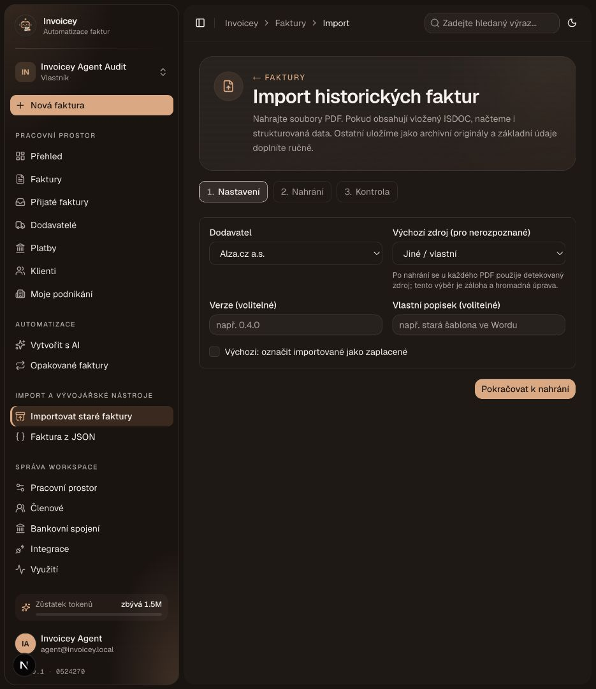

### 12.2 Invoice JSON

`/invoices/from-json` accepts an InvoiceSchema JSON payload and provides preset examples for nonpayer, markdown, VAT, mixed VAT, proforma, advance, reverse charge, OSS, and credit note. It can load a preset, create a PDF preview, or reset the form. The audit did not create an additional invoice from JSON.

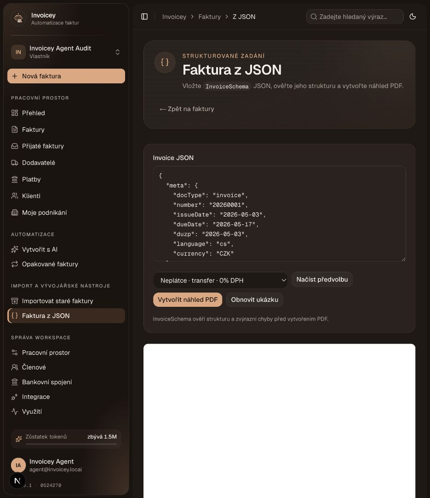

### 12.3 Recurring drafts

The recurring page and detail modal are web-only in this audit. No schedule was persisted, so cron-generated recurring drafts were not observed.

## 13. Workspace settings

The settings area is split into focused routes and promoted as navigation items rather than one mega-page.

| Route             | Observed experience                                                                                             | Evidence                                                                           |
| ----------------- | --------------------------------------------------------------------------------------------------------------- | ---------------------------------------------------------------------------------- |
| Account           | OAuth identity name/email/photo are locked; theme (light/dark/system) and language controls are available       | [27-settings-account.png](./screenshots/27-settings-account.png)                   |
| Security          | Google/GitHub link status, active sessions, revoke-other-sessions action, trusted-device status, recent sign-in | [61-settings-security-loaded.png](./screenshots/61-settings-security-loaded.png)   |
| Referrals         | Personal referral link, copy control, clicks/registrations counters                                             | [29-settings-referrals.png](./screenshots/29-settings-referrals.png)               |
| Workspace         | Workspace name/logo, slug display, save, member-management shortcut                                             | [30-settings-workspace.png](./screenshots/30-settings-workspace.png)               |
| Members           | Current members/roles, invite by email and role, pending invitations, remove member                             | [31-settings-members.png](./screenshots/31-settings-members.png)                   |
| API keys          | Create/revoke key surface, one-workspace/full-access explanation, MCP endpoint/config sample                    | [32-settings-api-keys.png](./screenshots/32-settings-api-keys.png)                 |
| Incoming invoices | Inbox alias/status/rotation, approval-rule editor                                                               | [33-settings-incoming.png](./screenshots/33-settings-incoming.png)                 |
| Bank connections  | Fio and MONETA token-based setup; issuer/account selection; deferred/unplanned bank tiles                       | [34-settings-bank-connections.png](./screenshots/34-settings-bank-connections.png) |
| Integrations      | Slack link flow, Eve approval actions, remote MCP and CLI setup links                                           | [35-settings-integrations.png](./screenshots/35-settings-integrations.png)         |
| AI usage          | Balance, renewal period, chart, product/model history, token accounting                                         | [26-ai-usage.png](./screenshots/26-ai-usage.png)                                   |

Security loaded asynchronously in the final capture; the earlier loading-state capture is retained as [28-settings-security.png](./screenshots/28-settings-security.png).

## 14. Documentation and external automation surfaces

The built-in docs are reachable from the public shell and explain the supported integration contract:

- **MCP:** lookup/search businesses, create/list/get invoices, mark paid, send email, and manage presets. The server injects the workspace default issuer; it does not create issuers/clients or offer historical import. [MCP docs](./screenshots/49-docs-mcp.png)
- **Slack/Eve:** link a Slack identity, mention or DM Eve, look up ARES businesses, draft invoices, receive PDF/ISDOC attachments, and require human approval before issue/payment/email actions. [Slack docs](./screenshots/50-docs-slack.png)
- **Cursor:** documentation for AI-assisted workflows and the Invoicey integration. [Cursor docs](./screenshots/51-docs-cursor.png)
- **API keys:** create a key from workspace settings; the key is shown once, currently has full access to the default workspace, and has no scopes. [API-key docs](./screenshots/52-docs-api-keys.png)

The docs index also advertises Czech VAT modes, ARES, branded PDF with QR, ISDOC 6.0.2, SPAYD, multiple issuers, payment ledger, and automation entry points. [Docs index](./screenshots/48-docs-index.png)

### Programmatic and scheduled surfaces

The repository also exposes non-navigation endpoints for the same product surfaces: remote MCP (`/api/mcp`), AI invoice generation (`/api/ai/invoice`), PDF/ISDOC artifact routes, incoming-document processing, UploadThing, Resend inbound/webhook handlers, ARES lookup, and scheduled renewal, bank-sync, inbound-ingest, overdue-reminder, and recurring-draft jobs. These are backend contracts rather than separate browser screens; the browser audit exercised the AI and artifact flows through their UI and recorded the MCP/Slack contracts from the built-in docs, but did not trigger cron jobs, webhooks, or destructive API calls directly.

## 15. Current UX observations for later review

These are observations, not proposed fixes.

| Area                  | What the walkthrough showed                                                                                                                   | Why it matters for review                                                                            |
| --------------------- | --------------------------------------------------------------------------------------------------------------------------------------------- | ---------------------------------------------------------------------------------------------------- |
| PDF preview           | Issued and draft invoice previews displayed a browser-level “localhost refused to connect” inside the iframe                                  | Core invoice output is not visually verifiable in the local flow even though PDF/ISDOC actions exist |
| Cancellation          | Cancel on a partially paid invoice immediately returned `Error: cannot_cancel`; no confirmation dialog appeared and the invoice stayed active | The user receives a raw error and unclear next action                                                |
| AI validation         | Missing ARES-resolvable client data produced a specific request for IČO/name instead of guessed data                                          | Good fail-closed behavior; the required-data handoff is explicit                                     |
| Payment state         | Reversing a full manual payment then adding CZK 1,000 exposed allocated/outstanding totals and payment history                                | Ledger state is inspectable, including reversals and partial allocation                              |
| First run             | ARES and bank fields are split into a short wizard with skip options, then remain editable in issuer sections                                 | Fast setup is available without hiding the full settings model                                       |
| Settings topology     | Workspace, bank, incoming, members, account, security, usage, and integrations are separate routes                                            | The product favors task-oriented settings navigation                                                 |
| External side effects | Email send, live bank authorization, API-key creation, Slack linking, and recurring-save were all explicit actions and were not executed      | Those surfaces are present but remain unverified for external side effects in this audit             |
| Async loading         | Security initially showed loading placeholders, then resolved to sessions/devices/provider state                                              | Loading behavior should be included in any UI polish review                                          |
| Access gating         | `/admin` and `/onboarding` redirected to dashboard for this ordinary workspace owner                                                          | Platform-admin and first-run-only surfaces are correctly outside the normal agent journey            |

## 16. Coverage matrix

The table below maps the audited route families to captured evidence. “Observed” means the route rendered and was inspected; it does not mean every external mutation was executed.

| Surface                     | Route(s)                                                                       | Evidence                                                                                                                                                                                          |
| --------------------------- | ------------------------------------------------------------------------------ | ------------------------------------------------------------------------------------------------------------------------------------------------------------------------------------------------- |
| Marketing/auth              | `/`, `/agent-login`, authenticated public shell, `/sign-in` entry              | [01](./screenshots/01-public-home.png), [02](./screenshots/02-agent-login.png), [03](./screenshots/03-authenticated-entry.png), [56](./screenshots/56-public-home-en.png)                         |
| Marketing/auth/link entries | `/sign-in`, `/r/[code]`, `/invite/[id]`, `/slack/link/[code]`                  | [64](./screenshots/64-sign-in.png), [65](./screenshots/65-referral-invalid.png), [66](./screenshots/66-invite-invalid.png), [67](./screenshots/67-slack-link-invalid.png)                         |
| Welcome                     | `/welcome`, `/onboarding` redirect                                             | [04–07](./screenshots/04-onboarding-step-1.png), [62](./screenshots/62-admin-gate.png), [63](./screenshots/63-onboarding-route.png)                                                               |
| Dashboard                   | `/dashboard`                                                                   | [08](./screenshots/08-dashboard-empty.png)                                                                                                                                                        |
| Issuers                     | `/issuers`, `/issuers/new`, `/issuers/[id]/edit/*`                             | [09–14](./screenshots/09-issuers-list.png), [60](./screenshots/60-issuer-new.png)                                                                                                                 |
| Clients                     | `/clients`, `/clients/new`, `/clients/[id]/edit`                               | [15–18](./screenshots/15-clients-list.png)                                                                                                                                                        |
| Invoices                    | `/invoices`, `/invoices/new`, `/invoices/[id]/edit`, `/invoices/[id]`          | [19–23](./screenshots/19-invoice-builder-empty.png)                                                                                                                                               |
| Invoice actions             | email, recurring, cancel, payment ledger                                       | [47](./screenshots/47-partial-payment.png), [57](./screenshots/57-invoice-email-modal.png), [58](./screenshots/58-recurring-setup-modal.png), [59](./screenshots/59-invoice-cancelled-detail.png) |
| AI                          | `/invoices/ai`, `/settings/usage`                                              | [24–26](./screenshots/24-ai-invoice-draft.png)                                                                                                                                                    |
| Incoming                    | `/incoming-invoices*`, settings approval rules                                 | [33](./screenshots/33-settings-incoming.png), [36–39](./screenshots/36-incoming-invoices.png)                                                                                                     |
| Suppliers/payments          | `/suppliers*`, `/payments`                                                     | [40–41](./screenshots/40-suppliers.png), [45–47](./screenshots/45-supplier-created.png)                                                                                                           |
| Import/JSON/recurring       | `/invoices/import`, `/invoices/from-json`, `/invoices/recurring`               | [42–44](./screenshots/42-recurring.png)                                                                                                                                                           |
| Workspace settings          | account, security, referrals, workspace, members, API keys, bank, integrations | [27–35](./screenshots/27-settings-account.png), [61](./screenshots/61-settings-security-loaded.png)                                                                                               |
| Docs/legal                  | `/docs*`, privacy, terms, cookies                                              | [48–55](./screenshots/48-docs-index.png)                                                                                                                                                          |
| Platform admin              | `/admin*`                                                                      | redirected to dashboard; [62](./screenshots/62-admin-gate.png)                                                                                                                                    |

### Not exercised by design

The following require an additional account, external system, or a side effect that was outside a safe read-through: Google/GitHub OAuth completion, Slack identity linking and Slack messages, live Fio/MONETA token authorization, API-key creation/revocation, sending an invoice email, uploading a real invoice/import file, creating a recurring schedule, and platform-admin data views. Their UI/documentation surfaces were inspected where accessible; their external mutation/result paths remain open questions for the later product review.
