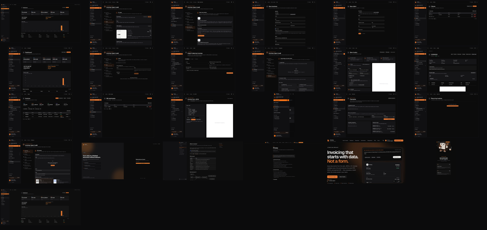

# Invoicey rebrand visual audit

This evidence set records the 2026-09 dark-first Invoicey rebrand across the
public product story, core invoicing workflows, reconciliation, automation, and
workspace administration. All application captures use the dedicated
`Invoicey Agent Audit` workspace and synthetic records.

## Coverage

| Experience           | Captures                                                                                                                                                                                                                                                                                                                                                                 |
| -------------------- | ------------------------------------------------------------------------------------------------------------------------------------------------------------------------------------------------------------------------------------------------------------------------------------------------------------------------------------------------------------------------ |
| Public               | [`marketing-home-desktop.png`](./screenshots/marketing-home-desktop.png), [`marketing-home-mobile.png`](./screenshots/marketing-home-mobile.png), [`marketing-companions-desktop.png`](./screenshots/marketing-companions-desktop.png), [`marketing-brand-center.png`](./screenshots/marketing-brand-center.png), [`legal-privacy.png`](./screenshots/legal-privacy.png) |
| Auth and onboarding  | [`auth-referral-error.png`](./screenshots/auth-referral-error.png), [`onboarding-complete-redirect.png`](./screenshots/onboarding-complete-redirect.png)                                                                                                                                                                                                                 |
| Mobile app           | [`app-mobile-navigation.png`](./screenshots/app-mobile-navigation.png)                                                                                                                                                                                                                                                                                                   |
| Overview and records | [`app-dashboard-desktop.png`](./screenshots/app-dashboard-desktop.png), [`app-invoices-list.png`](./screenshots/app-invoices-list.png), [`app-invoice-detail.png`](./screenshots/app-invoice-detail.png), [`app-clients.png`](./screenshots/app-clients.png), [`app-issuers.png`](./screenshots/app-issuers.png)                                                         |
| Creation             | [`app-invoice-builder.png`](./screenshots/app-invoice-builder.png), [`app-client-create.png`](./screenshots/app-client-create.png), [`app-business-create.png`](./screenshots/app-business-create.png), [`app-json-import.png`](./screenshots/app-json-import.png)                                                                                                       |
| Money                | [`app-payments.png`](./screenshots/app-payments.png), [`app-bank-connections.png`](./screenshots/app-bank-connections.png)                                                                                                                                                                                                                                               |
| Automation           | [`app-recurring.png`](./screenshots/app-recurring.png), [`app-history-import.png`](./screenshots/app-history-import.png), [`app-integrations.png`](./screenshots/app-integrations.png), [`app-ai-usage.png`](./screenshots/app-ai-usage.png)                                                                                                                             |
| Workspace            | [`app-workspace-settings.png`](./screenshots/app-workspace-settings.png), [`app-document-looks.png`](./screenshots/app-document-looks.png)                                                                                                                                                                                                                               |
| Docs and access gate | [`docs-home.png`](./screenshots/docs-home.png), [`admin-non-admin-redirect.png`](./screenshots/admin-non-admin-redirect.png)                                                                                                                                                                                                                                             |

The broader route and state inventory remains in
[`../user-flow.md`](../user-flow.md). This rebrand audit adds representative
evidence for each shared visual-system family instead of duplicating every route
with the same application shell.

## Acceptance notes

- Fresh visitors receive dark mode; light, dark, and system preferences remain
  available.
- Orange is used as an action and location signal on neutral graphite surfaces.
- Primary orange controls use a warm near-black foreground with WCAG AA
  contrast.
- The public desktop and Pixel 7 Playwright checks exercise one main landmark,
  no horizontal overflow, reduced motion, and WCAG 2 AA/2.1 AA axe rules.
- The marketing hero, populated dashboard, populated invoice list, invoice
  detail, client/business flows, payments, and settings were visually reviewed.
  The builder capture intentionally records the structured empty-draft and PDF
  preview guidance state; it is not presented as a populated invoice.
- The companion capture verifies the Mac download treatment and the complete
  checksum-verified CLI install command. The brand-center capture verifies the
  selected wordmark/monogram split and both public download actions.
- The payment capture used a temporary Pro assignment on the dedicated audit
  workspace. The workspace was restored to its original Free plan immediately
  after capture.
- No members or security capture is retained in this set. The former members
  attempt remained on its loading state; the former security attempt showed
  transient session-freshness error toasts. Both were discarded rather than
  being represented as loaded evidence. Their shared shell and form treatments
  are represented by the retained workspace and appearance captures.
- The mobile-navigation capture was taken against a local production build with
  a fresh session for the dedicated synthetic workspace. The drawer is shown
  after its transition settles, without Next development diagnostics.
- The audit identity had already completed onboarding, so `/onboarding`
  redirected to the populated dashboard. `onboarding-complete-redirect.png`
  records that actual route outcome; it is not presented as a first-step capture.
- The audit identity is not a platform administrator, so `/admin` redirected to
  the dashboard. `admin-non-admin-redirect.png` records that authorization gate
  rather than claiming an authorized admin capture.

## External brand rollout

Deploying updates the website, PWA icons, Open Graph card, and email logo.
Provider-hosted identities still require a manual asset upload after deployment:

1. Slack app icon: `apps/web/public/brand/external/invoicey-slack-512.png`
2. Google OAuth branding: `apps/web/public/brand/external/invoicey-google-oauth-120.png`
3. GitHub OAuth badge: `apps/web/public/brand/external/invoicey-github-oauth-200.png`

The complete source kit and five-page identity manual are available from
`/brand` and under `apps/web/public/brand/downloads/`. The Mac companion carries
the same app icon and menu-bar monogram in the sibling `invoicey-mac` repository.

Exact provider paths, sizing requirements, and cautions are maintained in
[`../../ui/brand-assets.md`](../../ui/brand-assets.md).
