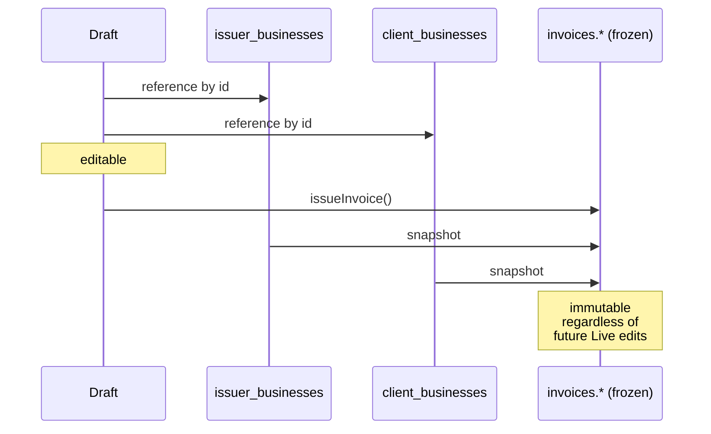

# Snapshots

Issued invoices are **immutable historical records**. They must keep showing the issuer's address, the client's name, and the bank account exactly as they were on the issue date — even if those underlying business records change later.

We achieve this by **snapshotting** the issuer and client into the invoice row itself at issue time. Subsequent edits to the registry do not retroactively rewrite history.

## Why this matters

Concrete failure modes if we _didn't_ snapshot:

- Issuer rebrands → all 2024 invoices retroactively show the new name → tax mismatch
- Client moves → all historical invoices show their new address → ISDOC re-imports break
- Issuer changes bank → old PDFs printed with new IBAN → bank-statement reconciliation fails
- Client gets a new VAT ID → old invoices retroactively show it on documents that legally shouldn't carry it

These are not hypothetical. Czech tax authorities expect the invoice as a static legal document. PDFs and ISDOC files already in the wild (in your client's accounting system, in your archive, in a year-end audit) have to match the database forever.

## What gets snapshotted

Two JSONB columns on the `invoices` row:

- `issuer_snapshot` — a `IssuerSnapshotSchema`-validated payload (see [`invoice-schema.md`](./invoice-schema.md))
- `client_snapshot` — a `ClientSnapshotSchema`-validated payload

A third column `payload_json` stores the full `Invoice` (the validated `InvoiceSchema` payload) for round-tripping. The two snapshot columns are technically redundant with `payload_json` — they exist for direct querying without JSON path expressions.

The numbering scheme is **not** snapshotted as a JSON blob. Instead, the resolved `meta.number` (and any tokens that were in effect at the time, baked into the resulting string) lives on the row. The scheme can change freely afterward.

## Schema

```sql
ALTER TABLE invoices ADD COLUMN issuer_snapshot jsonb NOT NULL;
ALTER TABLE invoices ADD COLUMN client_snapshot jsonb NOT NULL;
ALTER TABLE invoices ADD COLUMN payload_json   jsonb NOT NULL;
```

Application-level Zod validation runs on every read for `payload_json` (cheap; ~2 ms for our shape). Schema-level Postgres CHECKs are not used — Zod is the single source of truth.

## Snapshot timing

Snapshots are taken **at the moment of issue**, not at draft creation. A draft is mutable and points to _live_ `issuer_businesses` / `client_businesses` rows by ID. When the user clicks **Issue**, the server action:

1. Loads the live issuer + client by ID
2. Runs `IssuerSnapshotSchema.parse(issuer)` and `ClientSnapshotSchema.parse(client)` to project them down to invoice-relevant fields
3. Persists the resulting JSON onto the invoice row



After issuance, edits to `issuer_businesses` or `client_businesses` do not touch any `invoices.issuer_snapshot` / `client_snapshot`. They affect future invoices only.

## What snapshots store (and what they don't)

### `issuer_snapshot` includes

Everything in `IssuerSnapshotSchema`:

- `id` — back-reference to `issuer_businesses` (so future joins still work for "all invoices from this issuer")
- `name`, `ico`, `dic`, `address`, `bank` — printed on the PDF / in ISDOC
- `vatPayer` — drives PDF/ISDOC behavior
- `logoUrl`, `stampUrl`, `signatureUrl` — pointers to UploadThing URLs

### `issuer_snapshot` does NOT include

- The numbering scheme (consumed at issue time, not snapshotted as a structure)
- Defaults like "default payment terms" (already applied to `dueDate` in `meta`)
- Internal-only fields (timestamps, who-edited-when)

### Asset URL stability

`logoUrl` is a URL. If the underlying file is deleted from UploadThing, the snapshot still points there but renders broken.

**Policy**: do not delete UploadThing files when an issuer changes their logo. Replace by uploading a new file and updating the live `issuer_businesses` row to point at the new URL. The old URL stays valid for historical PDF re-renders.

UploadThing's "Replace" action is **disabled** at the app level — we always upload-new, and old files are retained until the issuer is fully deleted (post-MVP cleanup job).

### TODO(plan-5): retention of replaced asset URLs

Define explicit "soft-keep" semantics for replaced assets — perhaps an `archived_assets` table that lists URL + reason + created_at, used by an eventual GC cleaner. Not in MVP.

### Historical PDF re-render

Issued invoices store a **look snapshot** (the full look document) on the payload. Regeneration uses that blob, not the live catalog. Issued rows with no snapshot mean Classic `1.0.0`. Stored PDF bytes still win when present; imported `artifacts_immutable` invoices never regenerate. See [pdf-looks](../specs/pdf-looks.md) and [ADR 0039](../decisions/0039-looks-are-data-react-pdf-interprets.md).

## Edit-after-issue policy

Issued invoices are read-only at the UI level. There is no _Edit_ affordance. The UI surfaces these alternatives:

- **Cancel and re-issue** — for typos, wrong amounts, wrong client. The original invoice goes to `cancelled` (its number stays consumed) and you create a fresh invoice. Two records exist.
- **Issue a credit note** — for partial corrections (`docType: 'credit_note'` referencing the original). Three records may exist (original + credit note + corrected new invoice).

These are the legitimate Czech-accounting paths. See [`status-engine.md`](./status-engine.md).

## Editing snapshots directly

Never. Not in the UI. Not via server actions. The DB column is treated as append-only at the application level.

If a snapshot has a serious typo (e.g. issuer address wrong on a freshly-issued invoice), the only valid recovery path is **cancel and re-issue**.

This is intentionally rigid. Any "fix snapshot" backdoor is one query away from rewriting tax-relevant history; we don't ship it.

### Database migrations

Drizzle migrations may evolve the _shape_ of the snapshot JSON over time (add a field, rename a key). The plan:

- Adding optional fields is always safe — historical snapshots simply don't have them
- Renaming or removing fields requires a backfill migration and a corresponding doc + ADR
- The `IssuerSnapshotSchema` Zod schema gains optional/legacy fields rather than breaking on read

## Querying snapshots

Common queries:

```sql
-- All invoices issued from a specific issuer (uses snapshot.id, which is stable)
SELECT * FROM invoices WHERE issuer_snapshot->>'id' = $1;

-- Show distinct historical names for a client (rebrand history)
SELECT DISTINCT client_snapshot->>'name' AS name, MIN(issued_at) AS first_seen
FROM invoices
WHERE client_snapshot->>'id' = $1
GROUP BY client_snapshot->>'name'
ORDER BY first_seen;
```

The `issuer_id` and `client_id` are also stored as denormalized columns on `invoices` (separate from the snapshot JSON) so we get cheap indexes for "all invoices for X" without JSON path queries.

## Open snapshot questions

### TODO(plan-2): partial snapshots for OBO

In OBO/self-billing (UC2), the issuer is the legal client and the client is me. The snapshots model handles this transparently — both sides are just `BusinessEntity` rows. Confirm during Plan 2 that `IssuerSnapshotSchema` and `ClientSnapshotSchema` don't have asymmetric required fields that break OBO.

### TODO(plan-5): showing the divergence between snapshot and live

In the issuer/client detail UI, show a small note when historical invoices exist whose snapshot differs from the current live record:

> 2 issued invoices show the previous IBAN (`CZ65...399`) — that's expected.

Helps users not panic when they update their bank info. Implementation in Plan 5.

### TODO(plan-7): denormalizing for the data grid

The data grid (Plan 7) shows `client.name` on every row. Reading from `client_snapshot->>'name'` for thousands of rows is fine for a hundred records but worth profiling at 10k. Consider a denormalized `client_name_at_issue` column if SQL JSON access becomes the bottleneck.
