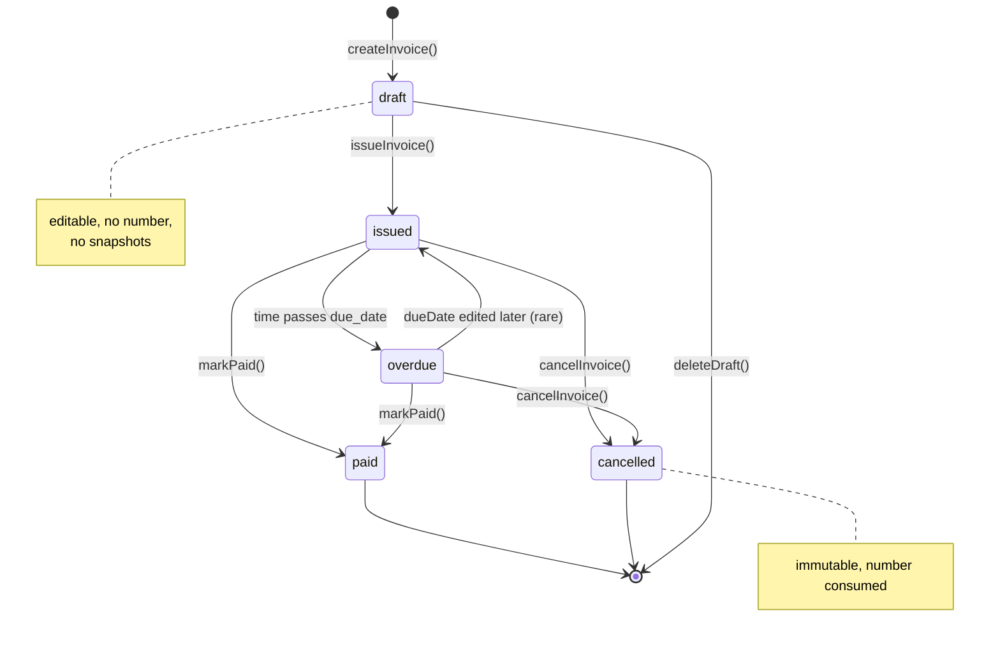

# Status engine

How Invoicey decides whether an invoice is `draft`, `issued`, `paid`, `overdue`, or `cancelled`.

The core principle: **status is derived, not stored** (per [ADR 0014](../decisions/0014-status-derived-not-stored.md)). Only the *facts* (issuance, payment, cancellation) are persisted. The state name is computed from those facts at read time.

## States

| State | Czech | Description |
| --- | --- | --- |
| `draft` | rozpracováno | The invoice has been saved but not finalized. No number assigned. Editable. |
| `issued` | vystaveno | Finalized — number assigned, snapshots frozen, due in the future, not yet paid. Read-only. |
| `overdue` | po splatnosti | Issued, due date has passed, still unpaid. |
| `paid` | uhrazeno | Payment received and recorded. |
| `cancelled` | stornováno | Issued and then explicitly cancelled by the issuer. Number stays consumed. |

## Persisted facts

Only these fields drive status. They live on the `invoices` row:

```ts
interface InvoiceFacts {
	issuedAt: Date | null;       // null = draft
	dueDate: Date;               // always present (default = issuedAt + payment terms)
	paidAt: Date | null;         // null = unpaid
	cancelledAt: Date | null;    // null = not cancelled
}
```

The number (`meta.number`) is also assigned at issue time — but the status logic only needs `issuedAt`. They're updated together in the same transaction (see [`numbering.md`](./numbering.md)).

## Derivation function (`deriveStatus`)

Implemented in `packages/invoice-core/src/status.ts` (Plan 2). Pure, takes facts + a "now" timestamp:

```ts
type InvoiceStatus = 'draft' | 'issued' | 'overdue' | 'paid' | 'cancelled';

function deriveStatus(facts: InvoiceFacts, now: Date): InvoiceStatus {
	if (facts.cancelledAt !== null) return 'cancelled';
	if (facts.issuedAt === null) return 'draft';
	if (facts.paidAt !== null) return 'paid';

	// issued, not paid, not cancelled → check due date
	const dueEndOfDay = endOfDayUTC(facts.dueDate);
	if (now > dueEndOfDay) return 'overdue';
	return 'issued';
}
```

`now` is injected so tests are deterministic and so the same invoice can render with consistent status across an entire request (we pass `request_started_at`).

## State diagram



Note: `paid → issued` transitions are not allowed. Marking an already-paid invoice as unpaid would be an unmark-paid action, modeled as a separate "Unmark paid" verb available only inside a small grace window (TBD).

## Allowed transitions per UI action

| Action | Pre-state(s) | Post-state | What changes |
| --- | --- | --- | --- |
| `saveDraft` | (none, new) / `draft` | `draft` | persists payload |
| `issueInvoice` | `draft` | `issued` | sets `issuedAt`, allocates number, freezes snapshots |
| `markPaid(date?)` | `issued`, `overdue` | `paid` | sets `paidAt` |
| `unmarkPaid` | `paid` | `issued` or `overdue` (re-derived) | clears `paidAt` |
| `cancelInvoice` | `issued`, `overdue` | `cancelled` | sets `cancelledAt` |
| `deleteDraft` | `draft` | (deleted) | removes row entirely |
| `editInvoice` | `draft` only | `draft` | updates payload, does not touch facts |
| `duplicateInvoice` | any | new `draft` | copies payload, drops snapshots/facts |

`issued` and `overdue` are not separate persisted states; they're derivations of the same persisted fact set. So "Mark paid" works identically against `issued` and `overdue`.

## What "issuing" actually does

`issueInvoice` is the only multi-step transition. It runs in one DB transaction (see [`numbering.md`](./numbering.md) for the full SQL):

1. Validate the draft payload via `InvoiceSchema.parse`
2. Lock the issuer's numbering scheme row (`SELECT … FOR UPDATE`)
3. Compute the next number via `nextInvoiceNumber(scheme, issueDate)`
4. Update the scheme counter (and possibly `counterYear` on a yearly reset)
5. Snapshot the issuer + client into JSON columns (see [`snapshots.md`](./snapshots.md))
6. Compute totals via `calcTotals(items, vat)`; verify they match the input
7. Insert (or update) the invoice row with `issuedAt = now`, `number = $resolved`, `payload_json = $validated`
8. Commit

If any step fails, the transaction rolls back. The counter does not advance. Snapshots are not partially written. The user sees an error.

## Immutability after issue

Once `issuedAt` is set, the invoice payload is **frozen**. UI does not present an "Edit" affordance for non-draft invoices.

Edge cases that require change after issue:

- **Wrong amount / wrong client**: cancel and re-issue (cancellation is the legitimate path)
- **Date typo**: same — cancel and re-issue
- **Forgot to add a line**: cancel and re-issue, OR issue a credit note + a new invoice (Czech accounting practice)

We do **not** support an "edit issued invoice" affordance. It would silently desync from PDFs already sent to clients, ISDOCs already imported into accounting tools, payments already in flight. Cancel-and-reissue is the only honest path.

### TODO(plan-9): cancellation UX

When you cancel, do we automatically open a fresh `duplicateInvoice` so the user can correct the mistake? Or just leave them on the canceled invoice with a "create corrected version" CTA? Default plan: explicit CTA, not automatic.

## Overdue: timezone & "due date" semantics

The due date is stored as a calendar date (not a timestamp). An invoice with `dueDate = 2026-05-17` becomes overdue at the *end* of that day in **Europe/Prague** time:

```ts
function endOfDayUTC(d: Date): Date {
	// Treat d as a Europe/Prague calendar date; return its UTC end (next-day 00:00 Prague - 1ms)
	// (uses date-fns-tz or equivalent — final lib pick during Plan 2)
}
```

This avoids "your invoice became overdue at 2:00 a.m. while you slept" on shaky timezone handling.

## Upcoming-due (UI-only state)

For the dashboard, we further classify `issued` invoices that are due within the next 14 days as "upcoming". This is purely a *display* state — `deriveStatus` still returns `issued`. The dashboard adds:

```ts
function isUpcoming(facts: InvoiceFacts, now: Date): boolean {
	if (deriveStatus(facts, now) !== 'issued') return false;
	const days = (facts.dueDate.getTime() - now.getTime()) / 86_400_000;
	return days >= 0 && days <= 14;
}
```

The threshold is a constant in `invoice-core` and may become configurable per workspace (post-MVP).

## Why derive instead of store

If status were a stored column:

- Every dawn, *every* invoice would need a job to check "did this become overdue overnight?"
- A clock-skew bug between the cron and the request handler would create inconsistencies users could see
- Queries that filter by status would still need to recompute it for correctness

Instead, status is computed:

- At read time in RSC pages (server-side, with `now = request_started_at`)
- Inside SQL for filterable queries — see below

We never need a cron just to "tick" status forward.

## Filtering by status in SQL

Pure derivation in TypeScript is great for individual rows, but the invoice list (Plan 7) needs to filter by status across thousands of rows efficiently. We map the derivation into SQL:

```sql
-- "WHERE status = 'overdue'" becomes:
WHERE cancelled_at IS NULL
  AND issued_at IS NOT NULL
  AND paid_at IS NULL
  AND due_date < (now() AT TIME ZONE 'Europe/Prague')::date

-- "WHERE status = 'issued'" becomes:
WHERE cancelled_at IS NULL
  AND issued_at IS NOT NULL
  AND paid_at IS NULL
  AND due_date >= (now() AT TIME ZONE 'Europe/Prague')::date

-- etc.
```

Centralized in a query helper `whereStatusIs(status)` so filters stay consistent.

### Index strategy (Plan 7)

The query above uses `cancelled_at`, `issued_at`, `paid_at`, `due_date`. A partial index for the "live" set helps:

```sql
CREATE INDEX idx_invoices_active
  ON invoices (workspace_id, due_date, paid_at, issued_at)
  WHERE cancelled_at IS NULL;
```

Tuned during Plan 7 if real query plans demand more.

## Open status questions

### TODO(plan-7): partial payments

Czech practice allows partial payment (the client pays half, you mark the partial amount, the rest stays outstanding). Not modeled in MVP — `paidAt` is binary. Plan 7 reconsiders if the dashboard "outstanding" total feels misleading without it.

### TODO(plan-9): grace period for "due"

Some businesses give a grace period (e.g. 3 days after `dueDate`) before something is considered "overdue" in the dashboard. Not in MVP — `dueDate` is the cutoff.

### TODO(plan-2): unmark-paid window

`unmarkPaid` is allowed at the schema level. The UI may restrict it to recent payments (e.g. ≤ 7 days since `paidAt`) to discourage book-cooking. Decision lands when Plan 2 ships.
