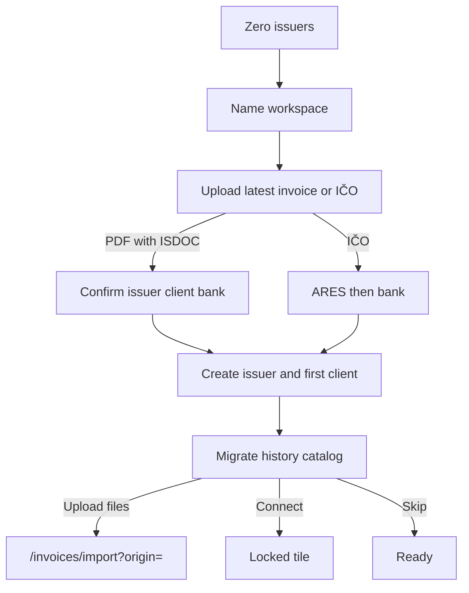

# Research: Migrate from a Czech invoicing platform

**Status:** File dump selected as the live path; hosted Connect locked

**Researched:** 2026-09-11

**Selected:** 2026-09-11 (onboarding + `/invoices/import` catalog)

## Outcome

Switching to Invoicey mid-year should not mean retyping history. Two user
intents:

1. **Bootstrap** — upload one recent issued PDF during first-run onboarding.
   Embedded ISDOC fills the issuer, bank (account / IBAN / BIC; Czech IBAN
   derived from the account number when missing), and first client.
2. **Migrate history** — same historic import already live at
   `/invoices/import`, plus a provider catalog so people see _their_ tool even
   when Connect is not built yet.

**Invoicey 2026 direction:** keep import **web-only** (ADR 0021, no MCP/Eve
tools). File dump of PDFs with embedded ISDOC is the live path for every
listed SaaS. Hosted “Connect” (OAuth or paste-API-key pull) stays **locked**
until a later plan. Desktop/on-prem accounting (Pohoda mServer, Money S3,
MRP, ABRA) is listed so the catalog is honest, then locked.

Promote into [`ui/onboarding.md`](../ui/onboarding.md) and
[`specs/invoice-import.md`](../specs/invoice-import.md). This note is not a
roadmap commitment to build Fakturoid OAuth.

## Two jobs, two surfaces

| Intent    | When                                                               | What we take from the file                                                   |
| --------- | ------------------------------------------------------------------ | ---------------------------------------------------------------------------- |
| Bootstrap | `/welcome`, optional                                               | One recent **issued** PDF → issuer + bank + first client. Not a bulk import. |
| History   | `/welcome` migrate step (skippable) or later **Invoices → Import** | Bulk PDFs, existing classify/commit wizard, provenance `origin_provider`     |

OCR is out of scope. Files without ISDOC stay on the existing **archive**
path (header fields by hand, original PDF stored).

## File dump (live)

Invoicey’s importer already runs `extractIsdocFromPdf` → `parseIsdoc` /
`parseIssuerFromIsdoc`. Any vendor whose issued PDF is ISDOC.PDF (PDF/A-3
with `invoice.isdoc`) lands as a **full** import. The rest is **archive**.

| Provider                                                                                                                                    | User export                                                                        | Fits today’s importer                                             | Notes                                                                                           |
| ------------------------------------------------------------------------------------------------------------------------------------------- | ---------------------------------------------------------------------------------- | ----------------------------------------------------------------- | ----------------------------------------------------------------------------------------------- |
| [FakturaOnline.cz](https://www.fakturaonline.cz/navody/faktury/pokrocila-nastaveni/jak-na-exporty-faktur-z-faktura-online-cz-do-ucetnictvi) | Issued PDF; each PDF embeds ISDOC. Also ZIP of ISDOC / Pohoda / Money S3 XML.      | **Yes** (PDF). ZIP of bare `.isdoc` is not accepted yet.          | Strongest file-dump fit.                                                                        |
| [Fakturoid](https://www.fakturoid.cz/api/v3/invoices)                                                                                       | UI PDF download; API `GET …/download.pdf` (`application/pdf`).                     | **Yes** if the PDF embeds ISDOC (same extractor).                 | Best later Connect candidate (OAuth).                                                           |
| [iDoklad](https://www.idoklad.cz/blog/novinky-cerven-2022)                                                                                  | Issued PDFs have been ISDOC.PDF since 2022; also XML / ISDOC / Excel / CSV export. | **Yes** (PDF).                                                    | API v2 shut 2026-09-08; any later Connect must be [API v3](https://api.idoklad.cz/Help/v3/cs/). |
| SuperFaktura                                                                                                                                | Issued PDF / ISDOC export in product.                                              | **Yes** when ISDOC is embedded or the user uploads those PDFs.    | API is API-key, not OAuth.                                                                      |
| iÚčto                                                                                                                                       | Issued PDF with ISDOC in product.                                                  | **Yes** when ISDOC is embedded.                                   | Added as origin `iucto`.                                                                        |
| VyFakturuj / SimpleShop                                                                                                                     | UI PDF; API does not advertise ISDOC.                                              | **Partial** — PDF without embed → archive row.                    | Prefer a later ISDOC ZIP ingest.                                                                |
| Pohoda, Money S3, MRP, Flexi                                                                                                                | Desktop ISDOC / ISDOC.PDF export, often ZIP.                                       | **Partial** — PDF with embed works; bare `.isdoc` / ZIP does not. | Do not promise “full” until ZIP/XML ingest exists.                                              |

**Product copy:** “Upload the PDFs you already have.” Do not tell Pohoda users
that a native `.isdoc` dump will import until that path is built.

## Connect (locked)

A hosted Connect tile means Invoicey pulls invoices **for** the user after
they authorize. That is a different security and product shape than “upload
files.”

| Provider                                                 | Auth model                                                                                                                                                     | Why locked in 2026                                                                                                                              |
| -------------------------------------------------------- | -------------------------------------------------------------------------------------------------------------------------------------------------------------- | ----------------------------------------------------------------------------------------------------------------------------------------------- |
| **Fakturoid**                                            | OAuth 2.0 Authorization Code ([docs](https://www.fakturoid.cz/api/v3/authorization)). Invoicey would register an integration (client id/secret, redirect URI). | Only real “Sign in with …” candidate. Still a new OAuth app, token store, pagination, and PDF poll (`204` then `200`). File dump already works. |
| FakturaOnline                                            | User pastes `X-Api-Key` (`fo_live_…`) from Settings → API keys. Batch `download_pdf` / `download_isdoc` ([API](https://api.fakturaonline.cz/)).                | Not OAuth. Storing a user’s API key is a secrets-product, not a Connect button. File ZIP from their UI is faster.                               |
| SuperFaktura                                             | API key in user settings.                                                                                                                                      | Same as FakturaOnline.                                                                                                                          |
| iDoklad                                                  | App Client ID + Secret (client credentials), not a TPP-style user consent. API v3.                                                                             | User would paste app credentials. PDF files already work.                                                                                       |
| Pohoda mServer, Money S3, MRP, ABRA Gen / Flexi, PREMIER | On-prem / LAN HTTP.                                                                                                                                            | Invoicey is a hosted SaaS. We will not ask users to expose mServer to the internet.                                                             |

**Do not** present “Connect” as live for any of these until an ADR names the
first provider (almost certainly Fakturoid) and a token-encryption path
mirrors bank connections.

## Catalog UX

Same pattern as bank connections: live tiles in colour, unimplemented Connect
in grayscale with a short “Soon” reason.

- **Upload invoices** → `/invoices/import?origin={provider}` (live).
- **Connect** → disabled; tooltip from the note enum (`oauthLater`,
  `apiKeyLater`, `clientCredentialsLater`, `onPrem`).

Show the catalog:

- on `/welcome` after the first issuer exists (skippable);
- on `/invoices/import` so skip-for-later is the same UI, not a dead end.

## Bootstrap vs bulk

Uploading **one** latest invoice on `/welcome` is not the historic importer.
It must not set `artifacts_immutable` or create an invoice row. It only
prefills:

- issuer identity + VAT flag + contact email;
- bank account, IBAN (mod-97 / `czechAccountToIban` when only the Czech
  account number is present), optional BIC;
- first client (name, IČO, DIČ, address, email when present).

Missing issuer contact email stays a required field — do not invent it.

## Non-goals

- OCR / vision extraction of scan-only PDFs.
- Dual-write sync back to the old tool.
- MCP/Eve bulk import.
- Hosting a TPP or becoming an accounting-system plugin.
- Accepting Pohoda/Money XML as a second document model (ISDOC or archive
  PDF only).

## Open follow-ups (not this change)

1. Accept `.isdoc` / `.isdocx` / ZIP so Pohoda and VyFakturuj dumps are
   first-class **full** imports.
2. Optional Fakturoid OAuth Connect (new ADR + encrypted tokens).
3. Per-provider in-app how-to (where to click Export in each UI).
