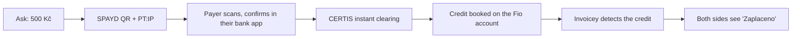
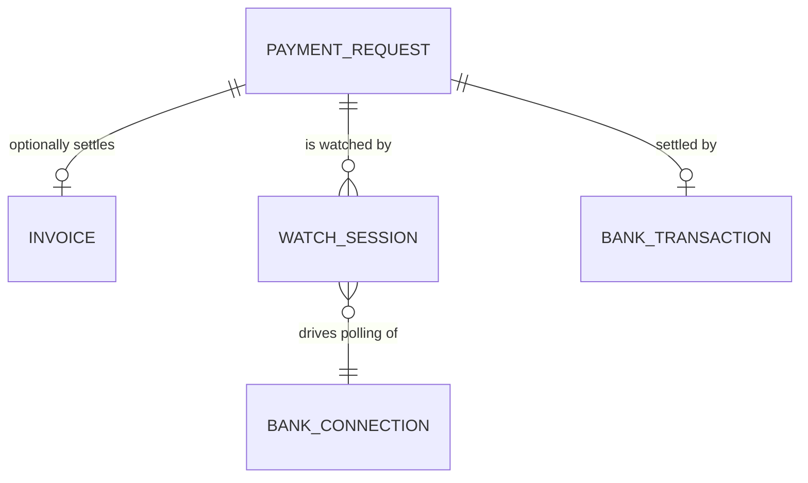

# Research: Instant QR payment acceptance ("Zaplať mi")

**Status:** Direction settled; not yet scheduled
**Researched:** 2026-09-08 · **Decided:** 2026-09-08

Design decisions from this research are recorded in
[ADR 0050](../decisions/0050-polymorphic-payment-allocations.md) and
[ADR 0051](../decisions/0051-payment-requests-self-settle.md). Vocabulary
(**payment request**, **watch session**) is in [`CONTEXT.md`](../../CONTEXT.md)
and [`glossary.md`](../glossary.md).

## Product thesis

Invoicey already turns an invoice into a SPAYD QR code and already reconciles
Fio/MONETA credits against that invoice. The unbuilt part is the **live loop**:
the payee names an amount, shows a QR, and both sides watch the same screen
until the money is confirmed present — seconds, not "check your bank later".

That loop is a different product surface from invoicing, but it is almost
entirely made of parts Invoicey has shipped:

The interesting question is not the QR (solved) and not the matching (solved).
It is **detection latency**, because that alone decides whether this feels like
a payment terminal or like a slow refresh button. Everything below is organized
around that budget.

## What already exists (reuse map)

| Need                     | Existing part                                                            | Gap for this feature                                                 |
| ------------------------ | ------------------------------------------------------------------------ | -------------------------------------------------------------------- |
| QR payload               | `buildSpaydPayload` in `packages/invoice-core/src/spayd/`                | Takes an `Invoice`; needs an invoice-free input                      |
| QR image                 | `renderSpaydQr` (PNG for `@react-pdf/renderer`)                          | Needs an on-screen (SVG/large) variant, not a 164px PDF asset        |
| Bank read                | `fetchFioTransactions`, `parseFioResponse` (`packages/payment-core`)     | None — already returns VS, amount, counterparty, movement id         |
| Rate-limit / concurrency | `bankConnections.lastRequestAt`, `leaseUntil`, `MIN_REQUEST_INTERVAL_MS` | Already exactly the primitives a fast poller needs                   |
| Matching                 | `proposeInvoiceMatches`, `isExactAutoMatchProposal`                      | Invoice-keyed; a payment request is not an invoice                   |
| Ledger                   | `invoice_payment_allocations`, `payment_match_proposals`                 | Both have a `NOT NULL` `invoice_id` — cannot hold invoice-free money |
| Cadence                  | `/api/cron/bank-sync`                                                    | **Runs once a day** (`0 5 * * *`) — see below                        |

Note the cadence line. `markBankSyncSucceeded` sets `nextSyncAt` to `now + 15min`,
but the only thing that reads `nextSyncAt` is a **daily** Vercel cron. Today the
worst-case detection latency for any Fio credit is ~24 hours, and the 15-minute
value is aspirational. Any version of this feature forces that to be fixed.

## The latency budget

### Leg 1 — payer's bank to Fio (not ours to optimise)

| Fact                                | Value                                                                    |
| ----------------------------------- | ------------------------------------------------------------------------ |
| Instant payment delivery (standard) | ≤ 10 s from payer confirmation                                           |
| Instant payment delivery (practice) | most under 3 s                                                           |
| Per-payment ceiling                 | 2 500 000 Kč (receiving bank must accept up to the ceiling)              |
| Availability                        | 24/7/365, no clearing windows                                            |
| Adoption                            | ~45 % of all interbank transfers (CERTIS, April 2026)                    |
| Scheme participation                | voluntary — Fio participates; a payer at a non-participating bank cannot |

So leg 1 is effectively free **if** the payer's transfer is actually sent as
instant. That "if" is the main product risk, not a technical one (see
[Instant is not guaranteed](#instant-is-not-guaranteed)).

### Leg 2 — Fio to Invoicey (the whole design problem)

Fio's API Bankovnictví is **pull-only**. There is no webhook, no callback URL,
no push, no streaming endpoint, and no sandbox. The hard constraints:

- **one request per token per 30 s**; violating it returns `409 Conflict`
  (`fio.ts` already maps this to `fio_throttled`, and `fio-service.ts` enforces
  31 s locally). **MONETA is not subject to this**: `moneta-service.ts:29` sets
  a 5 s floor, so a MONETA watch session detects payment roughly six times
  faster. The polling interval is a per-provider fact, never a constant;
- the limit is **per token**, i.e. per connection — so parallel watchers on one
  account must share a single poller, not each poll;
- `/last` advances a bank-side marker; Invoicey deliberately polls explicit
  overlapping date ranges instead, which is the right call and stays right here;
- movement id is the idempotency key, already enforced by
  `bank_transactions_account_provider_id_uidx`.

**30 s is therefore the floor for pure polling.** Independent Czech products land
where you would expect: iÚčto describes Fio movements reaching accounting
"within several tens of seconds", and Fakturoid runs the same API-polling model.

### Detection paths, ranked

| Path                                         | Typical latency  | Cost to build                         | Verdict                     |
| -------------------------------------------- | ---------------- | ------------------------------------- | --------------------------- |
| **A. Watch-window polling at 31 s**          | 0–31 s (avg ~15) | Low — reuses lease + `lastRequestAt`  | **Ship this first**         |
| **B. Fio notification e-mail as a doorbell** | ~3–15 s          | Medium — inbound route + verification | Strong second step          |
| C. Minute-granularity cron only              | 0–60 s + drift   | Lowest                                | Fine as the always-on floor |
| D. PSD2/AISP or an aggregator                | near-real-time   | High — licence or per-account fees    | Already deferred (ADR 0029) |

#### A. Watch-window polling

While a "waiting for payment" screen is open, the client drives the server; the
server polls Fio as fast as the token allows and answers from the DB in between.
This piggybacks on machinery that already exists — `leaseUntil` makes
overlapping runs harmless and `lastRequestAt` already gates the 31 s interval.
It costs nothing when nobody is waiting, and it degrades to path C on its own.

The client asking every ~2–3 s and the server hitting Fio at most every 31 s
also means N people watching the same account cost exactly one Fio request per
31 s, which is the property that makes this safe.

#### B. The e-mail doorbell

Fio's `Nastavení → SMS a e-mailová upozornění → Pohyby` sends a free e-mail per
movement, filterable to incoming only, above a threshold, or by variable symbol,
and it now runs 24/7. FAPI ships exactly this as a supported Fio integration
path, so the pattern is proven in the Czech market.

Invoicey already has Resend Inbound wired (`RESEND_INBOUND_DOMAIN`, Plan 24b,
`/api/webhooks/resend`), so the marginal work is a per-connection inbound
address the user pastes into Fio, plus:

- **treat the e-mail strictly as a doorbell, never as evidence.** It is
  spoofable; the only correct reaction is "poll Fio now (if the 31 s window
  allows)". The authoritative fact stays the API movement. The existing research
  doc already reaches this conclusion for e-mail generally, and it holds here.
- verify DKIM/SPF for the Fio sending domain and drop everything else;
- FAPI documents that Fio's notification e-mails assume CZK — irrelevant here,
  since SPAYD and the Fio connection are already CZK-only, but it confirms the
  channel is lossy and must not be parsed as truth.

This is what buys the difference between "about half a minute" and "about five
seconds", and it is the only realistic way to reach the latter without a licence.

## Domain model

The natural decomposition is two concepts, not one:

**Payment request** — the receivable. Amount, currency, receiving bank account,
generated variable symbol, message, optional `invoice_id`, status, expiry.

**Watch session** — a bounded window (say 10–20 min) during which the connection
is polled hard and the result is streamed back. A watch session should be
attachable to an **existing invoice** too, which turns "collect this invoice
now" into the same live experience for free.

That split matters: it keeps "money someone owes me" separate from "I am
standing here waiting", and it means the fast-polling machinery is not welded to
the invoice-free case.

### Variable symbol allocation

The VS is the whole matching key here, since amount alone is ambiguous.

- 10 digits max, numeric only;
- must not collide with any invoice VS on the same bank account, nor with any
  other open payment request — uniqueness scope is the **bank account**;
- reserve a namespace (e.g. a leading digit invoice numbering never emits) plus
  randomness, so a mistyped VS lands on nothing rather than on someone else's
  request;
- `invoicePaymentIdentifiers` already strips non-digits, so the payment-request
  path should reuse the same normalization rather than invent a second one.

### Settlement policy

Auto-confirming an exact invoice match is currently opt-in
(`autoConfirmExactMatches`, default off) and `isExactAutoMatchProposal` is
deliberately narrow. A payment request deserves a **different, and defensibly
looser, rule**: Invoicey generated the VS, generated the amount, and the user is
watching the screen when it lands. Exact VS + exact amount + expected receiving
account inside an open watch window is about as strong as bank evidence gets.

Everything else must stay conservative:

| Situation                             | Correct behaviour                                                     |
| ------------------------------------- | --------------------------------------------------------------------- |
| Exact VS + exact amount, request open | Settle, show it live                                                  |
| Exact VS, amount short                | Show "received X of Y", leave open — never round up to paid           |
| Exact VS, amount over                 | Settle, flag the overpayment; do not silently keep the difference     |
| Exact VS, request already settled     | Do **not** settle twice — surface as a duplicate needing review       |
| Right amount, no VS, one open request | Propose with one-tap confirm; never auto-settle                       |
| Right amount, no VS, several open     | Ambiguous — propose against all, force a human choice                 |
| Reversal / returned transfer          | Reverse explicitly, same as the invoice path                          |
| Request expired, money arrives later  | Still match it; expiry must close the _watch_, never disown the money |

### The ledger gap

`invoice_payment_allocations.invoice_id` and
`payment_match_proposals.invoice_id` are both `NOT NULL`, so invoice-free money
has nowhere to live today. **Resolved by [ADR 0050](../decisions/0050-polymorphic-payment-allocations.md):**
allocations become polymorphic over invoice _or_ payment request, the table is
renamed `payment_allocations`, and settlement never materializes a document or
consumes an invoice number. EET is abolished, so no receipt obligation forces
the document; the constraint was Invoicey's own income reporting, not the law.

The dangerous failure mode is not hypothetical. `apps/web/lib/dashboard-metrics.ts:221`
already sums allocations by month for the "paid" series, but line 224
inner-joins `invoices` — so a null `invoice_id` is **silently dropped** from
revenue. The join also powers the issuer filter, so a `LEFT JOIN` alone does not
fix it; the payment request must carry its own issuer (derivable through
`bank_account_issuers`). Settled requests then land in the same "paid" series as
invoice payments, because for cash-basis income received money is received money.

## Instant is not guaranteed

The QR builder already sets `PT:IP` and deliberately omits `DT`, which is
correct. But `PT` is a _hint_: Czech banking apps generally expose instant
payment as a checkbox the payer ticks, and support for pre-selecting it from the
QR varies by app. So a payment can perfectly well arrive as an ordinary transfer
hours later.

The UX consequence is firm: the waiting screen must be **hopeful but not
blocking**. Never imply the payer failed, always leave the request open, and
fall back to notifying the payee when it lands later. A screen that says
"payment failed" because 30 seconds elapsed would be actively wrong.

Other honest limits:

- SPAYD builder and the Fio connection are **CZK-only** — v1 is CZK-only;
- only the payee's own bank matters for reading, but the payer's bank must
  participate in the instant scheme for the fast path to exist at all;
- MONETA's adapter caps history at 90 days and its token at 90 days; neither
  matters for a live window, but the shared poller must respect its own limits;
- this cannot cover cash or card, and should not pretend to.

## Mobile

The user-facing appeal ("hold up a phone, take 500 Kč") is real, but a native
app is not the first step. `app/manifest.ts` already declares
`display: "standalone"` with icons, and `AGENTS.md` records substantial mobile
tuning already done. There is **no service worker**, so today the manifest gives
an install prompt and nothing else.

The cheap path is: installable PWA + Web Push for "money arrived" (works on iOS
for home-screen-installed PWAs). That covers the case that actually needs a
native affordance — being told about a payment when the screen is closed —
without a second codebase, and it also serves the existing app. A native app
becomes justified only if camera/NFC/offline turn out to matter, which for
"display a QR and wait" they do not.

**Not in scope for this feature.** Late settlements notify through the existing
e-mail and Slack DM paths (`send-auto-match-email.ts`, `slack-payment-dm.ts`).
While a watch session is open the confirmation is already on screen, so
notification only matters for the late case — which, by definition, is not
second-sensitive. Web Push is a whole-app capability and deserves its own
decision rather than riding in on this one.

## Where this sits competitively

Fakturoid and iÚčto both do Fio API polling for invoice matching. Neither, as
far as this research found, sells the live "ask for money and watch it land"
loop as a product surface. Invoicey has the unusual position of already owning
both ends — the SPAYD generator and the bank reader — so the feature is mostly
composition rather than new integration risk. That is the argument for it being
worth prototyping.

## Delivery order

1. **Fix the cron cadence first, as its own change.** Daily bank sync makes every
   latency claim here fictional, and it is a latent bug in shipped invoice
   matching independent of this feature. Minute-granularity cron is the
   always-on floor the watch window sits above.
2. **Fix the throttle-is-a-failure bug.** `fio_throttled_locally` currently
   lands in the `catch` in `fio-service.ts` and calls `markBankSyncFailed`,
   incrementing `consecutiveFailureCount` and risking a "bank sync failed"
   e-mail. Under watch sessions that would fire constantly. A throttle must
   become a distinct non-failure outcome carrying the wait time.
3. **Measure leg 2 on a real account.** Send a small instant payment and record
   wall-clock time until it appears in `periods/.../transactions.json`. Every
   number above assumes it appears promptly once booked; that is inferred from
   third-party reports, not verified here, and Fio has no sandbox.
4. **Ship the invoice-linked payment request** ("collect this invoice now").
   This proves the whole live loop with **zero** ledger change, because the
   invoice settlement path already exists end to end.
5. **Then** the standalone payment request, which is where ADR 0050's migration
   and issuer-carrying come due.
6. **Then** measure whether the e-mail doorbell (path B) is worth its spoofing
   surface. Fio at 31 s and MONETA at 5 s give two data points on whether pure
   polling already feels instant enough.

## Sources

- [ČNB — Okamžité platby](https://www.cnb.cz/cs/platebni-styk/certis/okamzite-platby/),
  [popis okamžitých plateb](https://www.cnb.cz/cs/platebni-styk/certis/popis-okamzitych-plateb/),
  [zvýšení limitu](https://www.cnb.cz/cs/cnb-news/aktuality/Zvyseni-limitu-pro-okamzitou-platbu/),
  [seznam účastníků](https://www.cnb.cz/export/sites/cnb/cs/platebni-styk/.galleries/certis/download/seznam_okamzite_platby.pdf)
- [Fio — API Bankovnictví](https://www.fio.cz/bankovni-sluzby/api-bankovnictvi) and
  [dokumentace (PDF)](https://www.fio.cz/docs/cz/API_Bankovnictvi.pdf)
- [Fio — Hlásiče / oznámení k účtu](https://www.fio.cz/bankovni-sluzby/internetbanking/hlasice)
- [FAPI — nastavení zasílání e-mailů o příchozích platbách z Fio banky](https://napoveda.fapi.cz/article/32-nastaveni-zasilani-e-mailu-o-prichozich-platbach-z-fio-banky)
- [iÚčto — okamžité platby z Fio banky](https://www.iucto.cz/okamzite-platby-fio-banka-iucto/)
- [Fakturoid — párování plateb z Fio banky (API)](https://www.fakturoid.cz/podpora/parovani/fio-api)
- [qr-platba.cz — SPAYD standard](https://qr-platba.cz/) and
  [KB klientský formát pro QR platbu](https://www.kb.cz/getmedia/35265715-fe8e-4df9-9212-beaf625ba417/Klientsky-format-pro-QR-platbu-pdf.pdf)
- In-repo: [`payment-ledger-bank-integration.md`](./payment-ledger-bank-integration.md),
  [`specs/payment-ledger-fio.md`](../specs/payment-ledger-fio.md),
  [ADR 0029](../decisions/0029-payment-ledger-fio-first.md)
