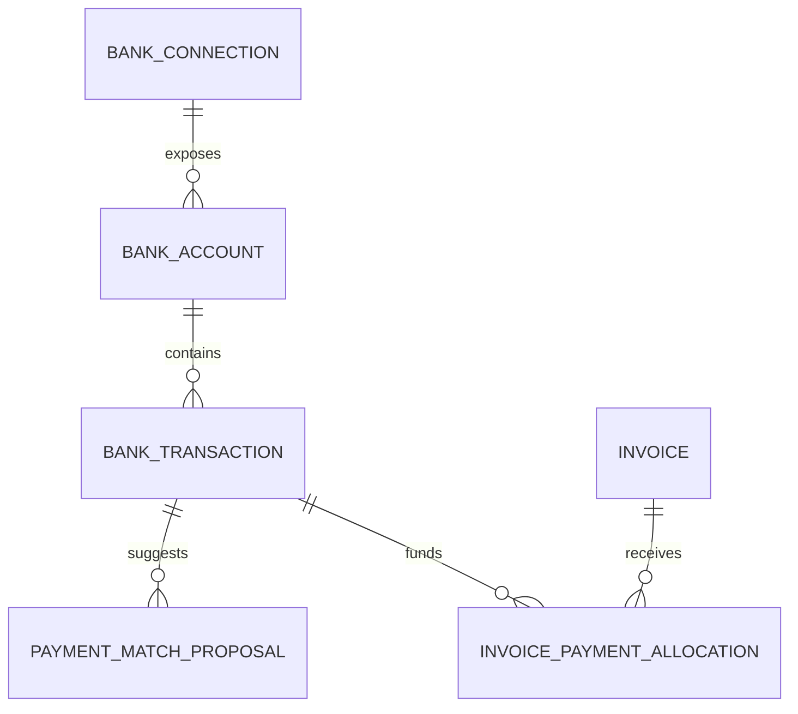

# Research: Payment ledger and bank integration

**Status:** Direction selected for Plan 22; preserved as option research

**Researched:** 2026-08-13

**Selected:** 2026-08-15

## Outcome

The first pilot user will move future invoice settlement from Komerční banka to
an existing Fio account. Invoicey will therefore build the provider-neutral
payment ledger first and use Fio as the first live read-only adapter.

The selected implementation is specified in
[`specs/payment-ledger-fio.md`](../specs/payment-ledger-fio.md), decided in
[ADR 0029](../decisions/0029-payment-ledger-fio-first.md), and sequenced in
[Plan 22](../../.cursor/plans/plan-22-payment-ledger-fio.md). Other integration
options below remain useful future diligence; they are not part of Plan 22.

## Why this is foundational

Invoicey currently persists a binary `invoices.paid_at` fact. That is enough for
manual whole-invoice marking, but it cannot faithfully represent:

- partial or installment payments;
- one transfer settling several invoices;
- overpayments and credits;
- fees, rounding, and foreign-currency differences;
- reversals and returned transfers;
- the bank evidence behind a paid state;
- cash-basis income used by insights and OSVČ year-end preparation.

A payment ledger is therefore a prerequisite for reliable bank matching,
collected-revenue insights, and tax-oriented cashflow. It should complement the
immutable issued invoice, not mutate its document totals.

## Candidate domain model

### `bank_connections`

Provider, workspace, consent/token metadata, status, scopes, last successful
sync, next consent renewal, encrypted secret reference, and failure reason.
Never store online-banking usernames or passwords.

### `bank_accounts`

Canonical account identity, currency, issuer ownership, provider account ID,
display name, and sync cursor. An issuer may own multiple accounts.

### `bank_transactions`

Immutable normalized transaction facts plus encrypted/raw provider provenance:
external ID, booking/value dates, amount, currency, direction, counterparty,
counterparty account, VS/KS/SS, message, status, reversal link, and observed-at
timestamps. Enforce provider-specific idempotency.

### `payment_match_proposals`

Candidate invoice allocations with score, deterministic reasons, blocking
ambiguities, status, and reviewer. Proposals are not accounting facts.

### `invoice_payment_allocations`

Confirmed allocation amount and currency between a transaction and an invoice,
with confirmation source (`user`, `rule`, `provider`), actor, timestamp, and
reversal history. Derive invoice paid/partial/outstanding state from allocations.

Authority obligations and their payments should use a parallel allocation
model. An outgoing bank transfer proves a transfer occurred but not necessarily
that an authority allocated it to the intended period or debt; portal evidence
may still be required to close the obligation.

## Matching policy

The first matcher should be deterministic and explainable.

| Evidence                                             | Suggested behavior                                  |
| ---------------------------------------------------- | --------------------------------------------------- |
| Issuer account + currency + exact amount + exact VS  | High-confidence proposal; optional auto-confirm     |
| Exact VS with partial amount                         | Propose partial allocation; user confirms initially |
| Exact amount + known client account + plausible date | Medium-confidence suggestion                        |
| Exact amount only                                    | Low-confidence suggestion, never auto-confirm       |
| One transfer plausibly covers multiple invoices      | Show allocation editor                              |
| Reversal, chargeback, or returned transfer           | Require review; reverse prior allocation explicitly |

Automatic confirmation should be workspace opt-in, narrowly scoped, audited,
and reversible. AI may help explain ambiguous text but should not override
deterministic financial constraints.

## Integration options

### 1. Direct proprietary bank APIs

Best data quality and sometimes real-time notifications, but each bank needs a
separate commercial, security, and technical adapter.

#### Fio API Bankovnictví

- Self-service read token created by the account owner or authorized person.
- Free according to Fio.
- Transactions/statements in XML, MT940, OFX, GPC, CSV, JSON, HTML, and PDF.
- A token belongs to one account, begins working about five minutes after
  authorization, and has a maximum configured lifetime of 180 days. Fio can
  extend it to 180 days after an Internetbanking/Smartbanking login when the
  user enables automatic extension.
- Requests for one token must be at least 30 seconds apart; a response is capped
  at 50,000 movements.
- Data older than 90 days requires the user to temporarily authorize complete
  history; Fio documents a ten-minute access window.
- The `/last` endpoint advances a bank-side marker when it returns movements.
  Invoicey should instead poll explicit overlapping date ranges and own local
  idempotency so a failed database commit cannot create a gap.
- Movement ID is the idempotency key. Instruction ID can be shared by a
  transfer and its fee, or by a movement and its opposite-sign reversal.
- Fio does not provide a sandbox for this proprietary API; its documentation
  says real testing requires a real account.
- Strong first direct adapter for Fio users; not a multi-bank solution.

#### Komerční banka Business API

- Account Direct Access exposes accounts, balances, transactions, statements,
  and asynchronous transaction subscriptions.
- Intended for entrepreneurs and legal entities.
- Charged under KB's price list and requires customer onboarding/contracts.
- Attractive for near-real-time matching if commercial terms fit Invoicey's
  small-OSVČ audience.

#### Česká spořitelna Premium API / Final API Consumer

- Premium API advertises statements, transaction history, payments, and
  immediate notifications for connected business accounts.
- Česká spořitelna also documents a Final API Consumer route for access to one's
  own accounts, subject to registration and bank approval.
- Requires commercial and onboarding validation before treating it as a
  scalable end-user integration.

#### ČSOB Business Connector / CEB

- Supports automated statements and intraday advices for business customers.
- Data formats include MT940, CAMT.053, CAMT.052, GPC, and bank-specific XML.
- More enterprise/file-channel shaped than a simple OAuth-style SaaS connect.

### 2. Licensed multibank/open-banking intermediary

This is the cleanest user experience for broad Czech coverage: select bank,
authenticate at the bank, consent to read accounts, and let one normalized API
serve Invoicey. The provider carries the regulated account-information-service
boundary, subject to contract and exact service structure.

#### Finbricks MULTIBANK

- Czech/CEE-focused account information and payment initiation through one API.
- States that services are available to partners without their own PSD2
  licence.
- Markets transaction history and matching to accounting/ERP products.
- Requires a bespoke offer and contract; public pricing is not sufficient for
  a go/no-go decision.
- Existing ABRA documentation shows practical coverage across major Czech banks,
  but Invoicey must validate the current bank list, history depth, consent
  renewal, availability, data fields, and small-customer economics directly.

Other European aggregators should be treated as diligence candidates, not
assumed substitutes. For example, Enable Banking's current Czech-market page
says it does not provide services directly to payment-service users residing in
the Czech Republic, and availability of new GoCardless Bank Account Data
accounts is unclear enough that it should not be selected without written
commercial confirmation.

### 3. Bank notification email ingestion

Give each workspace/account a unique receiving address. The user configures
their bank to forward credit notifications; Invoicey verifies the inbound
webhook, parses the notification, and proposes an invoice match.

Advantages:

- potentially broad bank reach without full account consent;
- near-real-time and relatively understandable setup;
- similar patterns are already used by Czech invoicing competitors.

Limitations:

- formats and sender behavior vary by bank and can change;
- forwarded messages are spoofable unless carefully validated;
- notifications may omit fields, arrive late, duplicate, or be disabled;
- not a complete ledger or reliable year-end statement source.

Treat email as a transaction signal that creates a proposal. Reconcile it later
against an authoritative API transaction or statement.

### 4. Payment initiation or payment-provider webhook

Give the invoice recipient a pay-by-bank/payment link. A licensed provider
initiates the transfer and reports its state through a webhook. This can mark
payments made through that link without reading the issuer's whole bank account.

Advantages:

- precise invoice correlation;
- less bank-data exposure;
- a good mobile payment experience;
- potentially immediate status.

Limitations:

- only covers customers who use the link;
- provider fees and commercial onboarding;
- initiated/authorized is not always the same as irrevocably settled;
- ordinary QR/manual transfers still need another matching path.

Finbricks/Whitebricks and Czech payment gateways are candidates for later
diligence. Invoicey's existing SPAYD QR remains a low-friction payment method but
does not itself report settlement.

### 5. Statement upload as fallback

Although not the desired end state, normalized CAMT.053, MT940, OFX, GPC, and
bank CSV import remains important for historical backfill, unsupported banks,
consent outages, and audit/recovery. It should feed the same ledger and
idempotency rules as online connectors, not a separate feature path.

## Security and operational requirements

- Read-only access by default; payment initiation is a separate future scope.
- Encrypt tokens/keys with rotation and provider-specific revocation.
- Never log secrets or full unredacted transaction payloads.
- Strict workspace and issuer isolation.
- Idempotent ingestion and replay-safe webhooks.
- Raw-source retention policy and a normalized immutable transaction record.
- Consent expiry/renewal UX and visible last-successful-sync state.
- Backpressure, provider rate limits, and degraded-mode behavior.
- Audit every auto-match, manual allocation, unmatch, and reversal.
- Data-processing, subprocessor, PSD2/AISP, and legal review before production.

## Selected validation order

1. Run a read-only Fio contract probe with the pilot user's real monitoring
   token and save only redacted field coverage and fixtures.
2. Implement the provider-neutral ledger, allocation service, deterministic
   matcher, and migration of existing manual `paid_at` facts.
3. Ship encrypted Fio connection and explicit-range synchronization.
4. Pilot human-confirmed matching on a real future invoice paid to Fio.
5. Add statement import as the next adapter/fallback after the live pilot.
6. Request commercial/technical proposals from Finbricks and direct-bank APIs
   when user bank distribution justifies broader coverage.
7. Consider bank-notification signals and pay-by-bank links only as later
   complementary inputs.

## Open diligence questions

- Which banks do target Invoicey users actually use?
- Does the account belong to the OSVČ as a consumer or business customer, and
  which APIs permit that account type?
- Transaction-history depth and pagination per bank/provider?
- Availability and quality of VS/KS/SS and counterparty account fields?
- Pending versus booked transactions and reversal semantics?
- Consent lifetime and renewal UX?
- Per-connection, per-account, and per-call pricing?
- Does the provider contractually cover Invoicey without Invoicey holding an
  AISP/PISP licence?
- Webhook availability, SLA, incident reporting, and data residency?
- Can account connections be moved safely between workspaces/issuers?

## Sources consulted

- [Fio API Bankovnictví](https://www.fio.cz/bankovni-sluzby/api-bankovnictvi)
- [Fio API technical documentation](https://www2.fio.cz/docs/cz/API_Bankovnictvi.pdf)
- [KB Business API](https://www.kb.cz/en/kbapi/kb-api-services/kb-business-api)
- [KB Account Direct Access API](https://developers.kb.cz/service/AccountDirectAccessAPI-v2/swagger)
- [Česká spořitelna Premium API](https://www.csas.cz/cs/otevrene-bankovnictvi/premium-api)
- [Česká spořitelna API connection/FAC documentation](https://www.csas.cz/content/dam/cz/csas/www_csas_cz/dokumenty/obecne/jak-se-pripojit-do-api-cs.pdf)
- [ČSOB CEB guide](https://www.csob.cz/portal/documents/10710/36574/ceb-uzivatelska-prirucka-cz.pdf)
- [Finbricks MULTIBANK](https://www.finbricks.com/)
- [ABRA/Finbricks supported-bank example](https://abra.finbricks.com/)
- [Enable Banking Czech-market specifics](https://enablebanking.com/docs/markets/cz)
- [Fakturoid bank matching](https://www.fakturoid.cz/podpora/automatizace/parovani-plateb-s-bankou)
- [iDoklad bank-notification matching](https://www.idoklad.cz/podpora/nastaveni-banka)
