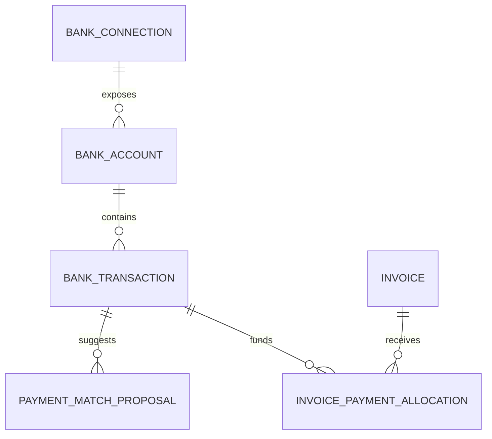

# Research: Payment ledger and bank integration

**Status:** Fio selected and shipping; further direct bank adapters deferred

**Researched:** 2026-08-13 (initial) · **Refreshed:** 2026-08-15 (Czech bank API matrix)

**Selected:** 2026-08-15

## Outcome

The first pilot user will move future invoice settlement from Komerční banka to
an existing Fio account. Invoicey therefore builds a provider-neutral payment
ledger and uses **Fio as the only live read-only adapter**.

**2026-08-15 diligence:** other common Czech banks (and Revolut) were reviewed
for workspace-configurable statement/history APIs comparable to Fio. Except for
Fio, every option is either paid, certificate/OAuth-heavy, PSD2-TPP-only, or
CSV/email-only. **No additional bank adapters will be built for now.** Keep the
provider-neutral ledger so a later adapter (or Finbricks-class aggregator) can
plug in without rewriting matching.

The selected implementation is specified in
[`specs/payment-ledger-fio.md`](../specs/payment-ledger-fio.md), decided in
[ADR 0029](../decisions/0029-payment-ledger-fio-first.md), and sequenced in
[Plan 22](../../.cursor/plans/plan-22-payment-ledger-fio.md).

## Why this is foundational

Invoicey currently persists a binary `invoices.paid_at` fact. That is enough for
manual whole-invoice marking, but it cannot faithfully represent:

- partial or installment payments;
- one transfer settling several invoices;
- overpayments and credits;
- fees, rounding, and foreign-currency differences;
- reversals and returned transfers;
- the bank evidence behind a paid state;
- cash-basis income used by insights and OSVČ year-end preparation.

A payment ledger is therefore a prerequisite for reliable bank matching,
collected-revenue insights, and tax-oriented cashflow. It should complement the
immutable issued invoice, not mutate its document totals.

## Candidate domain model

### `bank_connections`

Provider, workspace, consent/token metadata, status, scopes, last successful
sync, next consent renewal, encrypted secret reference, and failure reason.
Never store online-banking usernames or passwords.

### `bank_accounts`

Canonical account identity, currency, issuer ownership, provider account ID,
display name, and sync cursor. An issuer may own multiple accounts.

### `bank_transactions`

Immutable normalized transaction facts plus encrypted/raw provider provenance:
external ID, booking/value dates, amount, currency, direction, counterparty,
counterparty account, VS/KS/SS, message, status, reversal link, and observed-at
timestamps. Enforce provider-specific idempotency.

### `payment_match_proposals`

Candidate invoice allocations with score, deterministic reasons, blocking
ambiguities, status, and reviewer. Proposals are not accounting facts.

### `invoice_payment_allocations`

Confirmed allocation amount and currency between a transaction and an invoice,
with confirmation source (`user`, `rule`, `provider`), actor, timestamp, and
reversal history. Derive invoice paid/partial/outstanding state from allocations.

Authority obligations and their payments should use a parallel allocation
model. An outgoing bank transfer proves a transfer occurred but not necessarily
that an authority allocated it to the intended period or debt; portal evidence
may still be required to close the obligation.

## Matching policy

The first matcher should be deterministic and explainable.

| Evidence                                             | Suggested behavior                                  |
| ---------------------------------------------------- | --------------------------------------------------- |
| Issuer account + currency + exact amount + exact VS  | High-confidence proposal; optional auto-confirm     |
| Exact VS with partial amount                         | Propose partial allocation; user confirms initially |
| Exact amount + known client account + plausible date | Medium-confidence suggestion                        |
| Exact amount only                                    | Low-confidence suggestion, never auto-confirm       |
| One transfer plausibly covers multiple invoices      | Show allocation editor                              |
| Reversal, chargeback, or returned transfer           | Require review; reverse prior allocation explicitly |

Automatic confirmation should be workspace opt-in, narrowly scoped, audited,
and reversible. AI may help explain ambiguous text but should not override
deterministic financial constraints.

---

## Czech bank / fintech API matrix (2026-08-15)

Criteria for Invoicey: **read payment/statement history**, **per-workspace
credentials**, preferably **free for the account holder** like Fio, without
Invoicey holding a ČNB AISP licence.

Two access models matter:

| Model                          | Who issues credentials                     | Invoicey needs AISP? | Workspace config                   |
| ------------------------------ | ------------------------------------------ | -------------------- | ---------------------------------- |
| Account-holder / “Premium” API | Client creates token or cert in their IB   | No                   | Good if token/simple secret        |
| PSD2 AISP                      | Invoicey is TPP; client consents via OAuth | Yes                  | Poor unless licensed or aggregator |

### Summary matrix

| Provider                       | Account-holder API?                     | History / statements                    | Cost (typical, account holder)                                        | Auth / setup                                 | Workspace-pasteable? | Priority for Invoicey                              |
| ------------------------------ | --------------------------------------- | --------------------------------------- | --------------------------------------------------------------------- | -------------------------------------------- | -------------------- | -------------------------------------------------- |
| **Fio**                        | Yes                                     | Transactions + statements, many formats | **Free**                                                              | Monitoring token in IB                       | **Yes**              | **Supported**                                      |
| **MONETA**                     | Yes                                     | Balances, tx history, statements        | **Free**                                                              | API token + service contract in IB           | **Yes**              | **Supported** (VIP AISP; token ≤90d; history ≤90d) |
| ČSOB Business Connector        | Yes                                     | Statements / avíza (file API)           | **Free** (business CEB)                                               | mTLS cert via CEB                            | Cert + passphrase    | Deferred — free but cert-heavy                     |
| CREDITAS                       | Historically token; moving to ČOBS PSD2 | Tx / export                             | Historically free                                                     | Token or PSD2 depending on era               | Unclear post-2025    | Deferred — re-check before any build               |
| Komerční banka (ADAA / STATDA) | Yes (Business API)                      | Live tx (ADAA) + statements (STATDA)    | **0 / 100 / 500 Kč/mo** by frequency (from 2025-11); ≤50 uses/mo free | App registration + OAuth2                    | No (OAuth refresh)   | Deferred — freemium + heavy setup                  |
| Raiffeisenbank Premium API     | Yes                                     | Tx (often ≤90 days) + statements        | **~500 Kč/mo** + possible annual rights fee                           | ClientID + mTLS PKCS#12; yearly cert unblock | Cert-heavy           | Deferred — paid + ops pain                         |
| Česká spořitelna Premium API   | Yes                                     | Statements / history                    | **300 Kč / account / mo**                                             | Developer portal + bank onboarding           | Medium               | Deferred — paid                                    |
| Revolut Business               | Yes (Grow+)                             | Accounts, tx, webhooks                  | Grow plan **~850–1 000 Kč/mo** (no API on Basic)                      | X.509 + JWT OAuth                            | Medium–heavy         | Deferred — good API, not free                      |
| Partners Banka                 | No (PSD2 only)                          | AIS after TPP consent                   | Free for licensed TPP                                                 | QSeal + OAuth                                | No                   | Skip                                               |
| mBank CZ                       | No (PSD2 only)                          | AIS after TPP consent                   | Free for licensed TPP                                                 | QSealC + mTLS                                | No                   | Skip                                               |
| Air Bank                       | No (PSD2 only)                          | AIS after TPP consent                   | Free for licensed TPP                                                 | eIDAS + OAuth (refresh ~180d)                | No                   | Skip — CSV/email workaround only                   |
| UniCredit / Trinity            | PSD2 / weak                             | Limited                                 | TPP path                                                              | TPP                                          | No                   | Skip                                               |

**Product stance:** keep Fio and MONETA as the pasteable-token adapters. Revisit
this matrix when (a) user bank mix shows clear demand for another bank, or (b) a
licensed multibank intermediary (e.g. Finbricks) has acceptable small-OSVČ
economics.

### What “shitty setup” means in practice

| Pain                                     | Banks                                                     |
| ---------------------------------------- | --------------------------------------------------------- |
| Paid API or paid plan required           | KB (above free tier), RB, ČS, Revolut Grow+               |
| Cert / mTLS / yearly unblock UX          | RB, ČSOB, Revolut                                         |
| OAuth app registration + consent renewal | KB, Revolut, all PSD2                                     |
| Needs Invoicey AISP licence              | Partners, mBank, Air Bank, UniCredit, Trinity, plain PSD2 |
| No live API — CSV / email only           | Air Bank / mBank / Partners in accounting practice        |

Fio and MONETA remain the widely used Czech options that are **free + single
pasteable token + no TPP licence + good enough fields for VS matching**. MONETA
adds token renewal and a 90-day history cap as explicit product constraints.

---

## Integration options (detail)

### 1. Direct proprietary bank APIs

Best data quality and sometimes real-time notifications, but each bank needs a
separate commercial, security, and technical adapter.

#### Fio API Bankovnictví — selected

- Self-service read token created by the account owner or authorized person.
- Free according to Fio.
- Transactions/statements in XML, MT940, OFX, GPC, CSV, JSON, HTML, and PDF.
- A token belongs to one account, begins working about five minutes after
  authorization, and has a maximum configured lifetime of 180 days. Fio can
  extend it to 180 days after an Internetbanking/Smartbanking login when the
  user enables automatic extension.
- Requests for one token must be at least 30 seconds apart; a response is capped
  at 50,000 movements.
- Data older than 90 days requires the user to temporarily authorize complete
  history; Fio documents a ten-minute access window.
- The `/last` endpoint advances a bank-side marker when it returns movements.
  Invoicey should instead poll explicit overlapping date ranges and own local
  idempotency so a failed database commit cannot create a gap.
- Movement ID is the idempotency key. Instruction ID can be shared by a
  transfer and its fee, or by a movement and its opposite-sign reversal.
- Fio does not provide a sandbox for this proprietary API; its documentation
  says real testing requires a real account.

#### MONETA — supported (second adapter)

- Free account-holder API; token from Internet Banka after activating
  “Přístup na platební účet prostřednictvím aplikačního rozhraní”.
- Balances, transaction history (incl. cards), statements; developer sandbox.
- Implemented as VIP AISP read-only adapter ([ADR 0030](../decisions/0030-moneta-second-adapter.md),
  [spec](../specs/payment-ledger-moneta.md)). Token ≤90 days; history ≤90 days.
- Confirm token lifetime / IB-login refresh behaviour before committing.

#### Komerční banka Business API (deferred)

- **ADAA:** accounts, balances, transaction history, optional movement
  notifications.
- **STATDA:** statement download (KM/BEST; XML planned 2026).
- From 2025-11: freemium by frequency (≤50 uses/mo free; then 100 or 500 Kč/mo).
- OAuth2 + registered third-party app — not a pasteable monitoring token.
- Attractive only if many users stay on KB and accept fees/setup.

#### Raiffeisenbank Premium API (deferred)

- Transactions, statements, batch payments; developer portal ClientID + mTLS.
- Typical ~500 Kč/mo connection fee; certs need yearly client unblock.
- Transaction list docs often limit history (e.g. 90 days) — verify if revisited.

#### Česká spořitelna Premium API (deferred)

- Statements / history for connected business accounts.
- ~300 Kč per connected account per month.
- Requires commercial and onboarding validation.

#### ČSOB Business Connector (deferred)

- Free for business CEB clients; automated statements and advices.
- Certificate-based file/API channel — more enterprise-shaped than Fio.

#### CREDITAS (deferred)

- Accounting tools historically used AccountId + security key from IB.
- Late 2025 movement toward ČOBS PSD2 — re-validate auth model before any work.

#### Revolut Business (deferred)

- Solid Business API (accounts, transactions, webhooks) for Grow+ plans.
- No personal API; CZ Grow roughly 850–1 000 Kč/mo.
- Cert + JWT OAuth setup; good product quality, wrong price for “free like Fio”.

#### Partners Banka / mBank CZ / Air Bank (skip for direct adapters)

- PSD2 AIS/PIS only for live data; TPP licence + eIDAS required.
- Market workarounds: manual CSV (Partners, mBank) or email CSV (Air Bank).
- Do not schedule direct adapters; statement-import or email signal could cover
  edge users later without pretending they have a Fio-class API.

### 2. Licensed multibank/open-banking intermediary

This is the cleanest user experience for broad Czech coverage: select bank,
authenticate at the bank, consent to read accounts, and let one normalized API
serve Invoicey. The provider carries the regulated account-information-service
boundary, subject to contract and exact service structure.

#### Finbricks MULTIBANK

- Czech/CEE-focused account information and payment initiation through one API.
- States that services are available to partners without their own PSD2
  licence.
- Markets transaction history and matching to accounting/ERP products.
- Requires a bespoke offer and contract; public pricing is not sufficient for
  a go/no-go decision.
- Existing ABRA documentation shows practical coverage across major Czech banks,
  but Invoicey must validate the current bank list, history depth, consent
  renewal, availability, data fields, and small-customer economics directly.

Other European aggregators should be treated as diligence candidates, not
assumed substitutes. For example, Enable Banking's current Czech-market page
says it does not provide services directly to payment-service users residing in
the Czech Republic, and availability of new GoCardless Bank Account Data
accounts is unclear enough that it should not be selected without written
commercial confirmation.

### 3. Bank notification email ingestion

Give each workspace/account a unique receiving address. The user configures
their bank to forward credit notifications; Invoicey verifies the inbound
webhook, parses the notification, and proposes an invoice match.

Advantages:

- potentially broad bank reach without full account consent;
- near-real-time and relatively understandable setup;
- similar patterns are already used by Czech invoicing competitors.

Limitations:

- formats and sender behavior vary by bank and can change;
- forwarded messages are spoofable unless carefully validated;
- notifications may omit fields, arrive late, duplicate, or be disabled;
- not a complete ledger or reliable year-end statement source.

Treat email as a transaction signal that creates a proposal. Reconcile it later
against an authoritative API transaction or statement.

### 4. Payment initiation or payment-provider webhook

Give the invoice recipient a pay-by-bank/payment link. A licensed provider
initiates the transfer and reports its state through a webhook. This can mark
payments made through that link without reading the issuer's whole bank account.

Advantages:

- precise invoice correlation;
- less bank-data exposure;
- a good mobile payment experience;
- potentially immediate status.

Limitations:

- only covers customers who use the link;
- provider fees and commercial onboarding;
- initiated/authorized is not always the same as irrevocably settled;
- ordinary QR/manual transfers still need another matching path.

Finbricks/Whitebricks and Czech payment gateways are candidates for later
diligence. Invoicey's existing SPAYD QR remains a low-friction payment method but
does not itself report settlement.

### 5. Statement upload as fallback

Although not the desired end state, normalized CAMT.053, MT940, OFX, GPC, and
bank CSV import remains important for historical backfill, unsupported banks,
consent outages, and audit/recovery. It should feed the same ledger and
idempotency rules as online connectors, not a separate feature path.

## Security and operational requirements

- Read-only access by default; payment initiation is a separate future scope.
- Encrypt tokens/keys with rotation and provider-specific revocation.
- Never log secrets or full unredacted transaction payloads.
- Strict workspace and issuer isolation.
- Idempotent ingestion and replay-safe webhooks.
- Raw-source retention policy and a normalized immutable transaction record.
- Consent expiry/renewal UX and visible last-successful-sync state.
- Backpressure, provider rate limits, and degraded-mode behavior.
- Audit every auto-match, manual allocation, unmatch, and reversal.
- Data-processing, subprocessor, PSD2/AISP, and legal review before production.

## Selected validation order

1. ~~Run a read-only Fio contract probe~~ / ship Fio connector (Plan 22).
2. Pilot human-confirmed matching on real Fio payments.
3. Add statement import as the next adapter/fallback after the live pilot
   (covers non-Fio users without pretending other banks have clean APIs).
4. Do **not** schedule KB / RB / Revolut / PSD2 adapters until user bank
   distribution or commercial intermediary pricing justifies it.
5. Optionally request Finbricks (or similar) commercial terms when multibank
   coverage becomes a product priority.
6. Consider bank-notification signals and pay-by-bank links only as later
   complementary inputs.

## Open diligence questions

- Which banks do target Invoicey users actually use? (blocks revisit of matrix)
- Does the account belong to the OSVČ as a consumer or business customer, and
  which APIs permit that account type?
- Transaction-history depth and pagination per bank/provider?
- Availability and quality of VS/KS/SS and counterparty account fields?
- Pending versus booked transactions and reversal semantics?
- Consent lifetime and renewal UX?
- Per-connection, per-account, and per-call pricing?
- Does a multibank provider contractually cover Invoicey without Invoicey
  holding an AISP/PISP licence?
- Webhook availability, SLA, incident reporting, and data residency?
- Can account connections be moved safely between workspaces/issuers?
- CREDITAS: confirm whether the IB token model still works after 2025 ČOBS move.

## Sources consulted

### Fio and ledger

- [Fio API Bankovnictví](https://www.fio.cz/bankovni-sluzby/api-bankovnictvi)
- [Fio API technical documentation](https://www2.fio.cz/docs/cz/API_Bankovnictvi.pdf)

### Direct bank / fintech APIs (2026-08-15 refresh)

- [MONETA API](https://www.moneta.cz/zivnostnici-a-firmy/api) · [MONETA developers](https://www.moneta.cz/zivnostnici-a-firmy/api-pro-vyvojare)
- [KB STATDA](https://www.kb.cz/cs/kbapi/sluzby-kb-api/vypisy-z-uctu-pres-api-statda) · [KB ADAA](https://www.kb.cz/en/kbapi/kb-api-services/account-direct-access)
- [RB Premium API](https://www.rb.cz/firmy/transakcni-bankovnictvi/elektronicke-bankovnictvi/premium-api) · [developers.rb.cz](https://developers.rb.cz/)
- [ČSOB Business Connector](https://www.csob.cz/firmy/prehled-on-line-kanalu-a-aplikaci/business-connector)
- [Česká spořitelna Premium API](https://www.csas.cz/cs/otevrene-bankovnictvi/premium-api)
- [Revolut Business API (CZ)](https://www.revolut.com/en-CZ/business/business-api/) · [developer.revolut.com](https://developer.revolut.com/docs/api/business)
- [Partners Banka PSD2](https://psd2.partnersbanka.cz/)
- [mBank CZ developer portal](https://developer.api.mbank.cz/)
- [Air Bank API](https://www.airbank.cz/api/)

### Aggregators and competitors

- [Finbricks MULTIBANK](https://www.finbricks.com/)
- [ABRA/Finbricks supported-bank example](https://abra.finbricks.com/)
- [Enable Banking Czech-market specifics](https://enablebanking.com/docs/markets/cz)
- [Fakturoid bank matching](https://www.fakturoid.cz/podpora/automatizace/parovani-plateb-s-bankou)
- [iDoklad bank-notification matching](https://www.idoklad.cz/podpora/nastaveni-banka)
