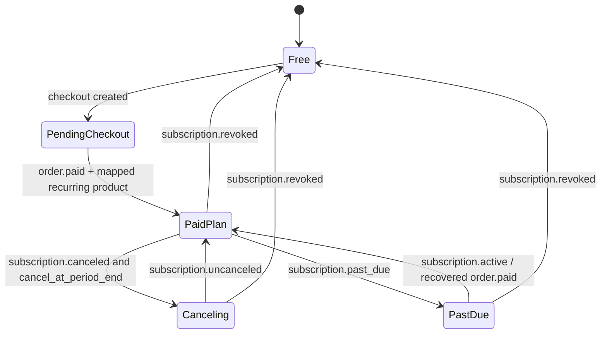

# Polar billing for plans and AI credit top-ups

**Researched:** 2026-09-03  
**Scope:** Current Polar product, Checkout, customer, webhook, portal, tax, and invoice behavior needed to add paid Invoicey plans and one-time AI token packs.  
**Source policy:** Polar documentation and official Polar repositories only.

## Recommendation

Use Polar as the **commercial billing and payment event source**, while Invoicey
remains the **product-entitlement and token-balance source**.

- Create authenticated checkout sessions server-side with the Polar TypeScript
  SDK. Resolve `workspaceId` through Invoicey's existing `requireWorkspace()` /
  route gate and send it as Polar's `external_customer_id`.
- Do not use the Polar Better Auth adapter's default identity mapping. It creates
  customers with the Better Auth **user ID** as `externalId`, whereas Invoicey's
  tenant, plan, and AI balance are all owned by a **workspace**. The adapter's
  `referenceId` support only puts an organization ID in metadata; it does not
  change the customer identity. The official adapter behavior is documented in
  [Polar's Better Auth guide](https://polar.sh/docs/integrate/sdk/adapters/better-auth).
- Model every sellable plan cadence as a Polar recurring product and every token
  pack as a Polar one-time fixed-price product. Keep an explicit, environment-
  specific allowlist that maps Polar product IDs to Invoicey plan IDs or an exact
  token quantity. Never grant from a token quantity supplied by the browser or
  from unchecked metadata.
- Fulfill only from verified, idempotently processed webhooks. The success page
  may show status, but must not activate a plan or credit tokens.
- Add an authenticated "Manage billing" action that generates a fresh Polar
  Customer Portal session. Do not store a portal session URL.

This preserves the existing ADR 0035 boundary: a `plans` row remains the shared
source of entitlements, while Polar answers whether the commercial relationship
is paid, pending, past due, canceled, or revoked.

## Relevant Invoicey state

The repository already has most of the product-side model:

- `workspaces.plan_id` points to shared `plans` rows; application behavior reads
  resolved entitlements, not a plan-key branch.
- `ai_token_balances` separates monthly, gifted, and purchased balances.
- `workspace_token_grants` provides an append-only award ledger whose unique
  `(workspace_id, rule_key)` constraint makes a credit and its balance increment
  atomic and idempotent.
- `assignWorkspacePlan()` changes the plan and monthly limit but deliberately
  does not refill the current monthly balance.
- The paid top-up UI is currently a stub, and the local renewal cron uses a
  rolling 30-day period rather than a provider billing period.

The billing implementation therefore needs a provider-event inbox and provider
subscription/order records, not a replacement entitlement system.

## Polar's current product and price model

Polar uses one `Product` model for subscriptions and one-time purchases. The
product itself has either no recurring interval (one-time) or a recurring
interval and count (daily, weekly, monthly, or yearly). Billing cycle and price
type are locked after product creation; changing either means creating a new
product. Fixed prices can change, but existing subscribers retain their old
price. Polar also archives rather than deletes products, and existing active
subscriptions continue to renew after archival. See
[Products](https://polar.sh/docs/features/products) and
[Subscriptions](https://polar.sh/docs/features/subscriptions/introduction).

Polar explicitly models monthly and yearly versions as **separate products**, not
prices/variants on one product. It supports fixed, pay-what-you-want, free,
seat-based, and metered pricing. A product can have at most one static price plus
metered prices; metered prices cannot be attached to a one-time product. See the
[Create Product API](https://polar.sh/docs/api-reference/products/create).

Recommended launch catalog:

| Invoicey offer    | Polar shape                                             | Invoicey fulfillment                                                |
| ----------------- | ------------------------------------------------------- | ------------------------------------------------------------------- |
| Pro monthly       | recurring fixed-price product, monthly interval         | assign the existing Pro plan; set billing state and provider period |
| Pro yearly        | separate recurring fixed-price product, yearly interval | same Pro plan, different provider cadence/product mapping           |
| Enterprise        | do not self-serve unless pricing is standardized        | keep custom/manual sales and plan assignment                        |
| NFCtron sponsored | no public Polar product                                 | retain internal custom-plan assignment                              |
| Token pack S/M/L  | one-time fixed-price product per pack                   | append a purchased-bucket grant for the exact server-mapped amount  |

Separate catalog products are preferable to ad-hoc checkout prices for token
packs: they make the webhook `product_id` an auditable fulfillment key. Polar
does support temporary `prices` on a checkout session, but those are intended for
dynamic pricing and are marked `source: "ad_hoc"`; see
[Checkout API](https://polar.sh/docs/features/checkout/session).

## Checkout and Next.js integration

Polar provides both `@polar-sh/sdk` and `@polar-sh/nextjs`. The Next.js adapter
offers ready-made `Checkout`, `CustomerPortal`, and `Webhooks` route handlers;
its Checkout handler reads product, customer, and metadata values from query
parameters. See the [Next.js adapter](https://polar.sh/docs/integrate/sdk/adapters/nextjs).

For Invoicey, prefer a small authenticated POST route or server action around the
TypeScript SDK's checkout-session API:

1. Authenticate and resolve the active workspace server-side.
2. Check the caller can manage billing for that workspace.
3. Resolve a stable Invoicey offer key (`pro_monthly`, `tokens_5m`) through a
   server-side, environment-specific product allowlist.
4. Create the checkout with exactly one allowed product, an absolute success URL,
   an Invoicey return URL, `external_customer_id = workspaceId`, customer name /
   email when appropriate, `is_business_customer = true`, and the real client IP
   if available.
5. Redirect to the returned hosted checkout URL.

Do not expose a generic route that trusts `products`, `customerExternalId`, or
metadata from its query string. The adapter supports those inputs, but in a
multi-tenant app a caller could otherwise attach a purchase to another workspace
or request an unintended product.

Polar's current versioned API docs show `@polar-sh/sdk@next` with
`createPolar()` from `@polar-sh/sdk/2026-04`, while the framework-adapter docs
still show the stable `new Polar({ server: "sandbox" })` surface. The new SDK is
explicitly described as public preview in the
[API overview](https://polar.sh/docs/api-reference/2026-04/introduction). At
implementation time, choose one compatible SDK/adapter line, pin exact versions,
and compile the installed types instead of mixing examples from both generations.

### Customer IP and checkout locale

When an application creates checkout sessions from a backend, Polar sees the
server's IP, not the buyer's. That can select the wrong country, currency, and
tax defaults. Pass a trusted proxy-derived `customer_ip_address`; do not accept
it from request JSON. Polar documents this in
[Checkout API: Customer IP address](https://polar.sh/docs/features/checkout/session).

The Checkout API accepts an IETF BCP 47 locale. Use Invoicey's current UI locale
(`cs` or `en`) if Polar supports it and otherwise allow Polar's documented
English fallback. Checkout localization is documented in
[Checkout Links](https://polar.sh/docs/features/checkout/links).

## Workspace-to-customer mapping

Use the Invoicey workspace ID as Polar's immutable external customer ID:

```text
Polar Customer.external_id = Invoicey workspaces.id
```

`external_customer_id` on checkout reuses a matching Polar customer or creates
one and is returned as `customer.external_id` in webhooks. If either
`customer_id` or `external_customer_id` is supplied, Polar pre-fills and locks
the checkout email, preventing a signed-in buyer from changing the commercial
record to a different email. See
[Checkout API: External Customer ID](https://polar.sh/docs/features/checkout/session).

Polar requires customer `external_id` to be unique within the Polar organization
and immutable once set. Customer email is also unique within the organization.
See the [Create Customer API](https://polar.sh/docs/api-reference/customers/create).

Store the Polar customer ID locally after the first signed webhook or API
reconciliation even though the external ID supports lookup. A local mapping
makes portal-session creation and support inspection cheap and provides a second
consistency check:

```text
billing_customers
  workspace_id primary key
  provider = 'polar'
  environment
  provider_customer_id unique
  provider_external_id unique  // must equal workspace_id
  created_at, updated_at
```

Do not delete or anonymize the Polar customer automatically when one Better Auth
user leaves or deletes their account: the billed customer is the organization /
workspace, potentially with other members and retained financial records.

## Metadata and custom fields

Checkout `metadata` is copied to the resulting order and/or subscription. Product
metadata travels on related orders, subscriptions, and webhooks. Use it for
diagnostics (`invoicey_offer_key`, `schema_version`) but do not treat mutable or
unvalidated metadata as the source of token quantities or plan entitlements.
Polar documents product metadata in
[Products](https://polar.sh/docs/features/products) and checkout propagation in
the [Create Checkout Session API](https://polar.sh/docs/api-reference/checkouts/create-session).

Polar metadata permits up to 50 key/value pairs. Keys are at most 40 characters;
values are strings up to 500 characters, numbers, or booleans. Do not put secrets,
personal invoice contents, or large JSON in metadata.

Custom fields are organization-level definitions attached per product. Supported
types are text, integer, date, checkbox, and select. They can be required and
pre-filled through `custom_field_data`; values are copied to the resulting order
or subscription. See [Custom Fields](https://polar.sh/docs/features/custom-fields).

Use the built-in business-customer, billing address, billing name, and tax-ID
fields for invoice identity. Reserve a required checkbox custom field for any
explicit Invoicey terms acknowledgement only if legal review requires a second
acceptance at checkout.

## Checkout success handling

The success URL can contain `checkout_id={CHECKOUT_ID}`, which Polar replaces at
redirect time. The checkout object distinguishes `confirmed` (the buyer clicked
Pay, not proof of payment) from `succeeded` (payment succeeded). See the
[Create Checkout Session API](https://polar.sh/docs/api-reference/checkouts/create-session)
and [Checkout Links](https://polar.sh/docs/features/checkout/links).

Invoicey's success page should:

- authenticate the current member and confirm the checkout belongs to the active
  workspace before displaying details;
- retrieve status server-side using the OAT, never expose the OAT or trust URL
  parameters beyond using the checkout ID as a lookup key;
- show a pending state until local webhook fulfillment is visible;
- offer a retry/refresh path and a link back to Usage or Billing;
- never assign a plan or increment tokens itself.

The redirect is user-controlled navigation and can be skipped, repeated, or
opened after a webhook. The webhook/inbox transaction is the fulfillment path.

## Webhook verification and delivery behavior

Use a dedicated raw JSON endpoint such as `POST /api/webhooks/polar`. Configure
the exact canonical `https://invoicey.app/...` URL: Polar treats 3xx redirects as
delivery failures and does not follow them. Keep the route outside normal session
middleware, but require a valid webhook signature.

Polar follows Standard Webhooks headers and its SDKs provide typed validation.
For Next.js, `@polar-sh/nextjs` exposes `Webhooks`; the lower-level SDK exposes
`validateEvent` from `@polar-sh/sdk/webhooks`. Use Polar's helper against the raw
body and `POLAR_WEBHOOK_SECRET`. Polar currently documents a key-encoding
compatibility detail: it signs HMAC-SHA256 with the UTF-8 bytes of the full
`whsec_...` secret; current Polar SDKs try both that and Standard Webhooks key
derivation. This is a strong reason not to reuse Invoicey's existing `svix`
dependency directly or write a verifier. See
[Handle and monitor webhook deliveries](https://polar.sh/docs/integrate/webhooks/delivery)
and the official [Polar adapter verifier implementation](https://github.com/polarsource/polar-adapters/blob/main/packages/polar-betterauth/src/plugins/webhooks.ts).

Polar retries delivery up to 10 times with exponential backoff, times requests
out after 10 seconds, recommends responding within 2 seconds, and automatically
disables an endpoint after 10 consecutive non-2xx failures. The dashboard retains
delivery payloads and supports manual redelivery. Queueing is recommended by
Polar, but on Vercel a short database transaction that persists an inbox event
before 2xx is sufficient for launch if processing remains fast. See
[webhook failure handling](https://polar.sh/docs/integrate/webhooks/delivery).

### Idempotency and ordering

Polar documents retries and lifecycle-specific event sequences, but does not
promise global exactly-once delivery or ordering across events. Therefore treat
delivery as at-least-once and potentially out of order:

1. Persist the Standard Webhooks `webhook-id` in a `billing_webhook_events` table
   with a unique constraint before applying effects.
2. Also make each business effect idempotent on the provider resource: one token
   purchase grant per Polar `order.id`; one cumulative refund adjustment per
   order/refund; one subscription snapshot upsert per `subscription.id`.
3. Compare provider `modified_at` / lifecycle fields before replacing a newer
   local snapshot with an older event.
4. Acknowledge only after durable persistence. Processing failures should return
   non-2xx so Polar retries; unknown but valid event types can be recorded and
   acknowledged for forward compatibility.
5. Add an admin reconciliation command/job that reads current Customer State by
   external ID and repairs projection drift. Customer State returns active
   subscriptions, granted benefits, and meters in one call; see
   [Customer State](https://polar.sh/docs/integrate/customer-state).

This is an Invoicey reliability design inferred from Polar's documented retry
behavior and absence of an exactly-once contract, not a Polar-stated ordering
guarantee.

## Events and required fields

Subscribe only to events the projection handles, plus `customer.state_changed`
as a recovery/snapshot signal:

| Event                     | Use in Invoicey                                                                                       | Required payload fields                                                                                                                        |
| ------------------------- | ----------------------------------------------------------------------------------------------------- | ---------------------------------------------------------------------------------------------------------------------------------------------- |
| `order.paid`              | authoritative money-collected event; activate/renew a paid plan or credit a one-time token pack       | `id`, `status`, `billing_reason`, `product_id`, `subscription_id`, `customer.external_id`, amounts/currency, `metadata`, `custom_field_data`   |
| `subscription.created`    | create/upsert provider subscription snapshot; do not grant paid access by itself                      | `id`, `product_id`, `customer.external_id`, `status`, period/trial dates, metadata                                                             |
| `subscription.updated`    | catch-all snapshot for plan change, cancel-at-period-end, pause/resume, and period dates              | `id`, `modified_at`, `status`, `product_id`, `current_period_start/end`, `cancel_at_period_end`, `ends_at`, `ended_at`, `customer.external_id` |
| `subscription.active`     | clear past-due/revoked UI state after recovery; reconcile mapped plan                                 | same subscription identity/status fields                                                                                                       |
| `subscription.canceled`   | mark cancellation scheduled/requested; retain entitlements while status remains active                | `id`, `status`, `cancel_at_period_end`, `ends_at`                                                                                              |
| `subscription.uncanceled` | clear scheduled cancellation                                                                          | `id`, status/cancellation fields                                                                                                               |
| `subscription.past_due`   | show dunning banner and billing-portal CTA; do not assume final revocation                            | `id`, `status`, `customer.external_id`, period/payment recovery fields available in snapshot                                                   |
| `subscription.revoked`    | terminate provider-backed access and downgrade to the internal fallback plan                          | `id`, `status`, `ended_at`, `product_id`, `customer.external_id`                                                                               |
| `order.refunded`          | update cumulative refunded amount for both full and partial refunds                                   | `id`, `status`, `product_id`, `customer.external_id`, `refunded_amount`, `refunded_tax_amount`, total/net amounts                              |
| `refund.updated`          | record final refund resource outcome; act only on `status === "succeeded"`                            | `id`, `status`, `order_id`, `subscription_id`, `customer_id`, amount/tax/currency, `revoke_benefits`                                           |
| `customer.state_changed`  | reconcile customer, active subscriptions, benefits, and meters; not a financial-payment signal        | `id`, `external_id`, `active_subscriptions`, `granted_benefits`, `active_meters`                                                               |
| `customer.updated`        | keep provider billing-contact snapshot current if desired; never rewrite OAuth identity automatically | `id`, `external_id`, email/name/billing/tax fields                                                                                             |

`order.created` is not fulfillment: renewal orders begin as `pending`. On renewal,
Polar emits `subscription.cycled`, `subscription.updated`, and `order.created`
before payment, followed later by `order.updated` and `order.paid` if collection
succeeds. `order.billing_reason` distinguishes `purchase`,
`subscription_create`, `subscription_cycle`, and `subscription_update`. See
[Webhook Events](https://polar.sh/docs/integrate/webhooks/events),
[Orders](https://polar.sh/docs/features/orders), and the
[`order.paid` payload](https://polar.sh/docs/api-reference/webhooks/order.paid).

For current access, scheduled cancellation is not revocation. Polar documents
that an end-of-period cancellation first emits `subscription.updated` and
`subscription.canceled` while the subscription remains active with
`cancel_at_period_end = true`; only at period end does it emit
`subscription.revoked`. Immediate cancellation emits all three immediately. See
[Cancellation Sequences](https://polar.sh/docs/integrate/webhooks/events).

## Plan lifecycle projection

Recommended state rules:



- Map provider products to internal plan IDs in data/config; never branch product
  behavior on a Polar product name.
- Keep the current plan active through a scheduled cancellation until
  `subscription.revoked`.
- Decide explicitly whether Invoicey's product access follows Polar's benefit
  grace period or the subscription `status`. Polar's default revokes benefits as
  soon as a subscription becomes `past_due`; configurable grace periods are 2,
  7, 14, or 21 days. Payment retries occur after 2, 5, 7, and 7 more days (21 days
  total), after which the subscription is revoked if still unpaid. See
  [Recovering failed payments](https://polar.sh/docs/features/subscriptions/failed-payments).
- Avoid free trials in the first implementation. Trials make `active` access and
  paid order timing different, while Invoicey's plan assignment currently has no
  trial state. Add them only with a written entitlement policy.
- The existing 30-day AI renewal should not independently replenish a paid plan.
  Paid monthly allowances need one policy tied to Polar periods: usually reset on
  successfully paid `subscription_create` / `subscription_cycle` orders, with the
  provider `current_period_start/end` stored locally. Keep the local cron for Free
  and non-billed custom plans, or turn it into a reconciliation safety net.

Polar allows only one active subscription per customer per organization by
default, which matches one billed plan per Invoicey workspace. Multiple active
subscriptions can be enabled in Polar settings; leave that disabled unless a
future requirement establishes conflict resolution. See
[Subscriptions FAQ](https://polar.sh/docs/features/subscriptions/introduction).

## One-time credit fulfillment and refunds

On `order.paid` with a mapped one-time token product:

1. Resolve `workspaceId` from `customer.external_id` and verify any checkout
   metadata agrees.
2. Resolve token quantity from the local provider-product mapping.
3. In one database transaction, insert the provider order/inbox effect and a
   `workspace_token_grants` row using `rule_key = polar:order:<order-id>`, a new
   purchase-specific trigger, and `bucket = purchased`; increment
   `purchased_remaining` only if the ledger insert wins.
4. Record paid amount, currency, product ID, order ID, checkout ID, and invoice
   availability for support/reconciliation.

Polar permits full and partial refunds and may proactively refund within 60 days
to prevent chargebacks, including despite a merchant's stated no-refund policy.
For one-time purchases, benefit revocation is selectable; for subscription order
refunds, refunding does not cancel the subscription. See
[Manage Refunds](https://polar.sh/docs/features/refunds).

Invoicey therefore cannot assume token-pack refunds never happen. Before launch,
define and test a deterministic policy for full **and partial** refunds:

- store cumulative provider refund amounts per order;
- convert only the newly refunded delta to a token reversal, using the original
  pack quantity and net order amount with an explicit rounding rule;
- append reversal rows rather than deleting the original grant;
- never let duplicate `order.refunded` and `refund.updated` events double-revoke;
- decide how to represent credits already consumed (purchased-bucket debt,
  unrecovered amount, or account hold). Silently clamping to zero loses the audit
  trail and allows spend-then-refund abuse.

`refund.created` can still be pending. The refund resource statuses are
`pending`, `succeeded`, `failed`, and `canceled`; perform the local financial
effect only when succeeded. See the
[`refund.updated` payload](https://polar.sh/docs/api-reference/webhooks/refund.updated),
[`order.refunded` payload](https://polar.sh/docs/api-reference/webhooks/order.refunded),
and [Create Refund API](https://polar.sh/docs/api-reference/refunds/create).

## Customer Portal

The hosted portal lets customers view subscriptions and purchases, download and
edit invoices, download receipts, cancel subscriptions, and update payment
methods. Optional settings add plan switching, pausing/resuming, seat management,
email changes, and usage views. See
[Customer Portal](https://polar.sh/docs/features/customer-portal/introduction)
and [Customer Portal settings](https://polar.sh/docs/features/customer-portal/settings).

For a signed-in Invoicey user, create a pre-authenticated portal link using a
server-side Customer Session and redirect to its `customerPortalUrl`.
`@polar-sh/nextjs` also exposes `CustomerPortal`. Customer Session URLs are
short-lived and must be generated on click, not persisted. See
[Navigate Customers to the Portal](https://polar.sh/docs/features/customer-portal/navigate-customers).

The portal may allow the buyer to change billing email and invoice details. Those
are provider billing-contact changes, not authority to mutate Invoicey's
OAuth-locked user identity, workspace membership, issuer, or client records.

## Sandbox and production

Polar Sandbox is a separate server with isolated users, organizations, products,
customers, data, access tokens, and webhook secrets. Production tokens do not
work in Sandbox. The API bases are:

```text
production  https://api.polar.sh/v1
sandbox     https://sandbox-api.polar.sh/v1
```

The SDK selects Sandbox through its environment/server option. Sandbox accepts
Stripe test cards such as `4242 4242 4242 4242`; customer emails are only sent to
members of the sandbox Polar organization (sub-address aliases are supported).
See [Sandbox Environment](https://polar.sh/docs/integrate/sandbox).

Product IDs are environment-specific. Keep separate environment variables or
mapping rows for every recurring offer and token pack, and fail startup/build
validation if the active environment lacks a complete mapping. Never let a
production deployment fall back to Sandbox or vice versa.

Required secret/config families:

```text
POLAR_ENVIRONMENT=sandbox|production
POLAR_ACCESS_TOKEN=...
POLAR_WEBHOOK_SECRET=...
POLAR_PRODUCT_PRO_MONTHLY=...
POLAR_PRODUCT_PRO_YEARLY=...
POLAR_PRODUCT_TOKENS_SMALL=...
POLAR_PRODUCT_TOKENS_MEDIUM=...
POLAR_PRODUCT_TOKENS_LARGE=...
```

Use an organization access token only on the server. Polar explicitly warns not
to expose it in browser code or logs; see
[API Authentication](https://polar.sh/docs/api-reference/2026-04/introduction).

## Currency, Czech/EU VAT, and billing invoices

Polar supports 130+ product currencies including **CZK** and **EUR**. A product
requires a price in the organization's default currency and may add matching
prices in other currencies. Polar chooses among enabled currencies using buyer
geolocation and falls back to the organization default. See
[Products: Multiple payment currencies](https://polar.sh/docs/features/products).

For Czech-first launch, use CZK as the default and optionally EUR as an explicit
second price. Forward the buyer's actual IP when creating checkout sessions, or
server-side checkout creation can geolocate the Vercel server and select the
wrong currency/country.

Polar is the Merchant of Record and reseller for sales through its checkout. It
calculates, collects, and remits international sales taxes, supports EU B2B
reverse-charge treatment for VAT-registered businesses, and remains responsible
for the indirect-tax liability. Polar says its EU OSS VAT number is
`EU372061545`. Invoicey remains responsible for its own Czech income/revenue tax.
See [Merchant of Record](https://polar.sh/docs/merchant-of-record/introduction)
and Polar's [MoR feature summary](https://polar.sh/features/merchant-of-record).

Polar's tax-behavior setting controls **presentation**, not tax liability or tax
rate. `location` is the default/recommended behavior: EU and most of the world
see tax-inclusive prices, while the US, Canada, and India see tax-exclusive
prices. Inclusive/exclusive may also be selected explicitly. Tax is itemized at
checkout and on receipts. See
[Tax Inclusive Pricing](https://polar.sh/docs/features/tax-inclusive-pricing).

Set `is_business_customer = true` for Invoicey's B2B checkout so full billing
name/address is required, and allow/prefill `customer_tax_id` only from a trusted
workspace billing profile. Do not assume the workspace's invoice issuer is always
the Polar buyer; Invoicey supports multiple issuers and sponsored workspaces, so
make billing identity explicit.

Polar creates a PDF invoice for every paid order. Customers can download and
correct company name, VAT number, or billing address in the Customer Portal. Once
generated, an invoice's billing details are frozen unless the customer uses the
portal regeneration flow. See [Orders](https://polar.sh/docs/features/orders).

Because Polar invoices Invoicey's customers directly as MoR, Invoicey's own
accounting relationship is the payout from Polar. Polar documents that the seller
must invoice Polar for each payout and provides a downloadable reverse invoice
from its Payouts page. This operational accounting step belongs in launch runbooks
and should be confirmed with a Czech accountant; see
[Payouts: Reverse invoices](https://polar.sh/docs/features/finance/payouts).

## Constraints and gotchas checklist

- Workspace, not user, is the Polar customer boundary.
- Derive workspace and allowed product server-side; never trust checkout query
  parameters for tenant or fulfillment identity.
- Paid subscriptions must go through Checkout; the Subscriptions API can create
  only free subscriptions directly.
- Polar products are not Stripe-style plan variants: monthly/yearly are separate
  products, and billing cycle/price type cannot be edited later.
- Archiving a product does not stop existing subscription renewals.
- A changed fixed price applies only to new subscribers unless individual
  subscriptions are migrated.
- Hosted checkout created from the backend needs a forwarded client IP for
  correct geolocation, currency, and tax defaults.
- `confirmed` checkout is not payment success. Success redirects are not
  fulfillment.
- `order.created` is not paid. Use `order.paid`.
- Scheduled cancellation is not revocation. Keep access until
  `subscription.revoked` (subject to the chosen past-due policy).
- Refunds of subscription orders do not cancel the subscription.
- Token pack refunds can be partial or Polar-initiated; implement reversible,
  auditable credit accounting before enabling purchases.
- Verify raw webhook bodies with Polar's SDK helper; its documented secret
  encoding currently differs from a naive Standard Webhooks implementation.
- Webhooks retry and can be redelivered. Persist `webhook-id`, make domain effects
  independently idempotent, and reconcile from Customer State.
- Webhook URLs must be canonical and return 2xx without a redirect.
- Portal links are short-lived; generate them per click.
- Billing-contact changes in Polar must not overwrite Invoicey auth identity.
- Sandbox and production require separate accounts/orgs, tokens, webhook secrets,
  and product IDs.
- Pin SDK/adapter versions: Polar's versioned SDK is currently public preview and
  official docs contain both versioned and stable API styles.
- Polar-generated billing invoices are separate from invoices users issue through
  Invoicey and should not enter Invoicey's issued-invoice lifecycle.

## Minimum implementation acceptance evidence

The implementation handoff should require sandbox evidence for:

1. A new workspace buys Pro; a verified `order.paid` maps the provider product to
   the internal plan exactly once.
2. Replaying the same delivery and delivering the same order under a different
   webhook ID do not duplicate plan activation or tokens.
3. A token pack credits only `purchased_remaining`, exactly once.
4. Full and partial refund events produce the documented reversible adjustment
   without double-revocation or lost debt.
5. Scheduled cancellation retains access; uncancel restores normal state;
   revocation downgrades without deleting workspace data.
6. Past-due and recovered-payment flows match the chosen grace policy.
7. A renewal does not double-reset the monthly allowance and uses the Polar
   billing period rather than racing the current 30-day cron.
8. An unauthorized member cannot start checkout or open the portal for another
   workspace; arbitrary product/customer IDs are rejected.
9. The success page remains correct when the webhook arrives before it, after it,
   twice, or not until refresh/reconciliation.
10. Customer Portal opens from Invoicey and exposes payment-method recovery,
    subscription cancellation, and billing invoices.
11. CZK and EUR checkout show expected B2B address/tax-ID handling in Sandbox.
12. Production configuration cannot resolve Sandbox product IDs or secrets.
