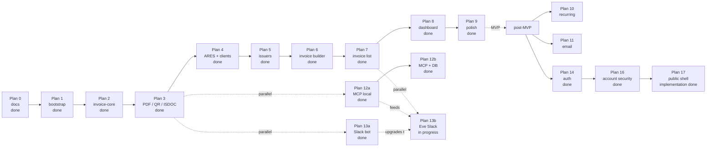

# Roadmap

Phased delivery plan. Each phase corresponds to one entry in `.cursor/plans/`. Phases are sequenced — later phases assume earlier ones are complete and tested.

## Visual timeline

## MVP plans

### Plan 0 — Docs scaffolding

**Status:** Done  
**Completed:** 2026-05-03

**Goal:** Land the in-repo docs that lock product scope, architecture, domain model, and decisions captured in the originating chat session.

**Exit criteria:**

- [x] Every file in `docs/` tree (per [`README.md`](./README.md)) exists and is non-empty
- [x] All session-level ADRs (0001..0016) are written in Michael Nygard format
- [x] Domain docs each contain at least one worked example
- [x] Open product questions are either resolved in the relevant doc or carry a `TODO(plan-N):` marker

### Plan 1 — Repo bootstrap

**Status:** Done  
**Completed:** 2026-05-03

**Goal:** Get a working monorepo: Turborepo + bun workspaces + Next.js 16 web app + Drizzle + Neon + lint/format/commitlint, with `bun dev` serving an empty layout.

**Exit criteria:**

- [x] `apps/web` Next.js 16 (App Router, RSC) starts and renders a sidebar layout
- [x] `packages/{invoice-core,db,ares,config-eslint,config-ts}` exist with `package.json` and a placeholder `index.ts`
- [x] Drizzle is wired to a Neon database, an empty migrations folder is committed, `bun db:push` works
- [x] Tailwind v4 + shadcn/ui base + ReUI registry (`@reui` namespace, `base-nova` style) is configured per [reui.io/docs/get-started](https://reui.io/docs/get-started)
- [x] `commitlint` enforces conventional commits with the project's scope enum
- [x] One placeholder ADR per technology choice that wasn't pre-decided (e.g. Tailwind v4) — see [0017](./decisions/0017-tailwind-v4-tooling-baseline.md)

**Doc inputs:** [`architecture.md`](./architecture.md), [`decisions/0001-monorepo-turborepo-bun.md`](./decisions/0001-monorepo-turborepo-bun.md), [`decisions/0002-nextjs15-app-router.md`](./decisions/0002-nextjs15-app-router.md), [`decisions/0003-shadcn-plus-reui-registry.md`](./decisions/0003-shadcn-plus-reui-registry.md), [`decisions/0009-drizzle-neon-postgres.md`](./decisions/0009-drizzle-neon-postgres.md)

### Plan 2 — `invoice-core` domain package

**Status:** Done  
**Completed:** 2026-05-03

**Goal:** Land the contract — Zod schema, totals calculation, numbering, status engine — fully unit-tested. No UI, no PDF, no DB. Pure domain.

**Exit criteria:**

- [x] `packages/invoice-core/src/schema.ts` exports `InvoiceSchema`, `IssuerSnapshotSchema`, `ClientSnapshotSchema`, `InvoiceItemSchema`, `TotalsSchema`
- [x] `calcTotals(items, vat, issuerVatPayer)` is implemented with line-level + per-rate + grand totals (third argument required for neplátce / effective rate rules)
- [x] `nextInvoiceNumber(scheme, issueDate)` is implemented as a pure function with template tokens
- [x] `deriveStatus(facts, now)` is implemented as a pure function over persisted invoice facts (`issuedAt`, `dueDate`, `paidAt`, `cancelledAt`); alias `deriveStatusFromInvoiceRow`
- [x] Unit tests cover: every VAT mode, both supplies-abroad cases, status branches, numbering tokens + yearly reset, edge cases (zero-amount lines, mixed VAT rates, credit notes)
- [x] Vitest runs via `bun run test` (Turbo `test` task); no GitHub Actions required for solo workflow

**Doc inputs:** [`domain/invoice-schema.md`](./domain/invoice-schema.md), [`domain/vat-czech.md`](./domain/vat-czech.md), [`domain/numbering.md`](./domain/numbering.md), [`domain/status-engine.md`](./domain/status-engine.md)

### Plan 3 — PDF + QR + ISDOC rendering

**Status:** Done  
**Completed:** 2026-05-03

**Goal:** `renderInvoicePdf`, `renderSpaydQr`, `renderIsdoc` with golden-file tests. PDF readable by humans; QR readable by every Czech bank app; ISDOC validates against the public XSD.

**Exit criteria:**

- [x] `renderInvoicePdf(invoice): Promise<Uint8Array>` produces a PDF with logo / stamp / signature slots, line items, totals, payment block, embedded QR
- [x] Czech-diacritic font picked, version-pinned, registered with `@react-pdf/renderer` `Font.register` (DejaVu Sans via `dejavu-fonts-ttf`; see [`specs/pdf-rendering.md`](./specs/pdf-rendering.md))
- [x] `buildSpaydPayload(invoice)` produces a SPAYD 1.0 string
- [x] `renderSpaydQr(invoice)` returns a PNG data URL via `qrcode`
- [x] `renderIsdoc(invoice)` produces ISDOC 6.0.2 XML with root `Invoice` `version="6.0.2"`; validated against the vendored XSD in tests (`xmllint-wasm`)
- [x] Golden / stable tests on canonical fixtures: ISDOC string snapshots + XSD; PDF smoke (`%PDF` header); SPAYD string + deterministic QR PNG hash
- [x] Spec doc `specs/pdf-rendering.md`, `specs/spayd-qr.md`, `specs/isdoc.md` written before implementation

**Doc inputs:** the three specs above + [`domain/invoice-schema.md`](./domain/invoice-schema.md)

**Artifacts:** `@invoicey/invoice-core` exports `pdf/`, `spayd/`, `isdoc/`; XSD [`packages/invoice-core/assets/schemas/isdoc-invoice-6.0.2.xsd`](../packages/invoice-core/assets/schemas/isdoc-invoice-6.0.2.xsd); tests [`packages/invoice-core/src/plan03-render.test.ts`](../packages/invoice-core/src/plan03-render.test.ts).

### Plan 4 — ARES client + client (customer) management

**Status:** Done  
**Completed:** 2026-05-03

**Goal:** Lookup any Czech business by IČO, save it as a client, list/edit/delete clients.

**Exit criteria:**

- [x] `packages/ares/src/client.ts` calls `https://ares.gov.cz/ekonomicke-subjekty-v-be/rest/ekonomicke-subjekty/{ico}` and parses the response with a Zod schema
- [x] 24h `unstable_cache` per-IČO
- [x] `apps/web/app/(app)/clients/page.tsx` lists clients in a table
- [x] `clients/new` has an IČO-first form: type IČO → click Lookup → form prefills from ARES → save
- [x] Manual entry fallback works when ARES returns 404
- [x] Spec doc `specs/ares.md` is written before implementation

**Doc inputs:** [`specs/ares.md`](./specs/ares.md), [`domain/invoice-schema.md`](./domain/invoice-schema.md) (snapshot shape)

### Plan 5 — Issuer (my-businesses) management

**Status:** Done  
**Completed:** 2026-08-10

**Goal:** Manage the businesses I invoice _from_ — VAT settings, banking, numbering schemes, optional logo/stamp/signature uploads.

**Exit criteria:**

- [x] `apps/web/app/(app)/issuers/page.tsx` lists issuers
- [x] `issuers/[id]/edit/page.tsx` edits all issuer fields including a numbering-scheme editor (per docType)
- [x] UploadThing wired for logo/stamp/signature with size + MIME validation (manual URL fallback without token)
- [x] ARES lookup also works on issuer creation
- [x] Spec doc `specs/uploads.md` is written before implementation

**Doc inputs:** [`specs/uploads.md`](./specs/uploads.md), [`domain/numbering.md`](./domain/numbering.md), [`decisions/0010-uploadthing-for-files.md`](./decisions/0010-uploadthing-for-files.md)

### Plan 6 — Invoice builder

**Status:** Done  
**Completed:** 2026-08-10

**Goal:** `/invoices/new` — a React-Hook-Form + Zod form that produces an `InvoiceSchema`-valid payload, with live preview and ARES lookup.

**Exit criteria:**

- [x] Pick issuer → defaults populate (bank, VAT mode, language, numbering preview)
- [x] Pick client from DB (create client via Clients CRUD + ARES)
- [x] Line items via `useFieldArray` with VAT rate per line
- [x] VAT mode + supplies-abroad selectors at invoice level
- [x] Live preview: debounced PDF iframe via `/api/demo/invoice-pdf` + computed totals
- [x] "Save draft" persists with `issuedAt = null`; "Issue" assigns a number via `nextInvoiceNumber`, freezes snapshots, and persists
- [x] Builder UI flow doc `ui/invoice-builder-flow.md` is written before implementation

**Doc inputs:** [`ui/invoice-builder-flow.md`](./ui/invoice-builder-flow.md), [`domain/snapshots.md`](./domain/snapshots.md)

### Plan 7 — Invoice list + actions

**Status:** Done  
**Completed:** 2026-08-10

**Goal:** ReUI Data Grid showing all invoices with filters, sort, search, and row actions.

**Exit criteria:**

- [x] Columns: number, issue date, due date, client, total, status (badge), actions
- [x] Filters: status, issuer, client, date range
- [x] Search: number, client name, notes
- [x] Sort, paginate (50/page default)
- [x] Actions per row: view, edit (drafts only), download PDF, download ISDOC, duplicate (creates new draft), mark paid, delete (drafts only)
- [x] Spec doc `specs/data-grid.md` is written before implementation
- [x] Presentation upgraded to ReUI Data Grid + Filters + nuqs (server SQL retained; clients/issuers share the grid shell)

**Doc inputs:** [`specs/data-grid.md`](./specs/data-grid.md), [`domain/status-engine.md`](./domain/status-engine.md)

### Plan 8 — Dashboard

**Status:** Done  
**Completed:** 2026-08-10

**Goal:** Single page showing the invoicing pulse at a glance.

**Exit criteria:**

- [x] Cards: count + total amount per status (draft, issued, paid, overdue, upcoming due ≤ 14 days)
- [x] Chart: monthly issued vs. paid for the last 12 months (basic, ReUI/shadcn chart)
- [x] Recent invoices table (last 10)
- [x] Issuer filter that re-scopes everything on the page

### Plan 9 — Polish

**Status:** Done  
**Completed:** 2026-08-10

**Goal:** Make it feel finished.

**Exit criteria:**

- [x] Empty states everywhere (no invoices, no clients, no issuers — each with a CTA)
- [x] Loading skeletons via React Suspense
- [x] Error boundaries with actionable messages
- [x] Onboarding seed: when there are zero issuers, dashboard shows a "Create your first issuer" guided flow
- [x] Toasts for every mutation (success + error)
- [x] Mobile-acceptable layout (it's a desktop tool, but doesn't break on phone)

## MVP boundary

End of Plan 9 = MVP. Anything past this is post-MVP and lives below.

## MVP-parallel plans

Plans listed here do not block the MVP and can be picked up in parallel with Plans 5–9. They depend only on Plan 3 (PDF / QR / ISDOC) being done.

### Plan 13a — Slack bot, stateless demo (in `apps/web`)

**Status:** Done  
**Completed:** 2026-05-03 (implementation; tools later shared via `@invoicey/invoice-tools`)

**Goal:** Let a user post `/invoice <free-text>` (or `@bot …`) in Slack and receive a rendered Czech invoice PDF + ISDOC XML in-thread, with no DB writes. Vercel AI SDK aggregates the message into an `InvoiceSchema`-valid payload via tool calls; the deterministic core renders.

**Exit criteria:**

- [x] Slack route handler at `apps/web/app/api/slack/commands/route.ts` verifies signatures and acks within Slack's 3s window
- [x] Events API `app_mention` at `apps/web/app/api/slack/events/route.ts`
- [x] AI tool surface wraps `@invoicey/invoice-core` + `@invoicey/ares` (now via `@invoicey/invoice-tools`)
- [x] Worker uses `generateText({ tools, maxSteps })` against Vercel AI Gateway
- [x] Successful runs reply with PDF + ISDOC via `files.uploadV2`
- [x] Single demo issuer from `INVOICEY_DEMO_ISSUER_JSON` or hard-coded sample — no DB
- [x] Spec doc [`specs/slack-bot.md`](./specs/slack-bot.md)

**Doc inputs:** [`specs/slack-bot.md`](./specs/slack-bot.md), [`specs/ares.md`](./specs/ares.md), [`specs/isdoc.md`](./specs/isdoc.md), [`specs/pdf-rendering.md`](./specs/pdf-rendering.md)

## Post-MVP plans

### Plan 10 — Recurring invoices

**Status:** Post-MVP backlog

- New tables: `invoice_templates` (saved invoice payloads), `recurring_schedules` (cadence + next-run + linkage)
- Vercel Cron Job that runs daily and issues due recurrences
- UI to create a template from an existing invoice and to manage recurrences

### Plan 11 — Email delivery

**Status:** Done (implementation; operator smoke pending)  
**Completed:** 2026-08-11  
**Spec:** [`specs/email.md`](./specs/email.md) · [ADR 0022](./decisions/0022-resend-and-react-email.md)

Resend + `@invoicey/emails` (react-email). Sub-phases below. **Operator still needed:** verify `mail.invoicey.ditrich.me`, set Resend/webhook/`CRON_SECRET` on Vercel, run one real send + webhook check.

#### Plan 11a — Email engine

**Status:** Done (implementation)  
**Completed:** 2026-08-11  
**Plan file:** [`.cursor/plans/plan-11a-email-engine.md`](../.cursor/plans/plan-11a-email-engine.md)

**Goal:** Templates package, Resend client, `email_messages` / `email_events`, webhook tracking, Better Auth invite send.

**Exit criteria:**

- [x] Spec + ADR + this roadmap section
- [x] `@invoicey/emails` with invoice-sent + workspace-invite (+ stub templates)
- [x] Drizzle tables + schema applied
- [x] Resend client + webhook route + env schema
- [x] Auth invite sends via Resend when key set
- [x] Vitest for render + from-display + webhook status mapping

#### Plan 11b — Invoice send UI

**Status:** Done (implementation)  
**Completed:** 2026-08-11  
**Plan file:** [`.cursor/plans/plan-11b-invoice-send.md`](../.cursor/plans/plan-11b-invoice-send.md)

**Goal:** Send issued invoices from the web app with customizable cover, PDF (+ ISDOC), issuer defaults, delivery timeline.

**Exit criteria:**

- [x] Send action + dialog + issuer `email_settings`
- [x] PDF (+ ISDOC) attached correctly
- [x] Timeline on invoice detail
- [x] Tests for ops defaults / missing email / cancelled guard

#### Plan 11c — Agent surfaces

**Status:** Done (implementation)  
**Completed:** 2026-08-11  
**Plan file:** [`.cursor/plans/plan-11c-email-agents.md`](../.cursor/plans/plan-11c-email-agents.md)

**Goal:** MCP + Eve `send_invoice_email` (HITL) on the same ops path.

**Exit criteria:**

- [x] MCP + Eve tools registered and tested
- [x] Specs (`mcp.md`, `slack-eve.md`) updated

#### Plan 11d — Lifecycle emails

**Status:** Done (implementation)  
**Completed:** 2026-08-11  
**Plan file:** [`.cursor/plans/plan-11d-email-lifecycle.md`](../.cursor/plans/plan-11d-email-lifecycle.md)

**Goal:** Overdue reminders (cron), optional payment-received mail, bounce/complaint suppression.

**Exit criteria:**

- [x] Cron reminder job + payment-received hook
- [x] Suppression list honored
- [x] Eligibility + suppression tests

### Plan 12a — MCP server, local + Vercel HTTP prep (`apps/mcp`)

**Status:** Done (implementation)  
**Completed:** 2026-08-10  
**Plan file:** [`.cursor/plans/plan-12-mcp-local.md`](../.cursor/plans/plan-12-mcp-local.md)  
**Spec:** [`specs/mcp.md`](./specs/mcp.md)

**Goal:** Cursor-ready stdio MCP with create/render + ARES + local presets; prepare Streamable HTTP on `apps/web` `/api/mcp` (API-key gated) for later go-live. No DB.

**Exit criteria:**

- [x] `@invoicey/invoice-tools` shared handlers (normalize, presets, create/render, ARES)
- [x] `apps/mcp` stdio MCP exposes `create_invoice`, `lookup_business`, preset CRUD
- [x] Slack tools import `@invoicey/invoice-tools`
- [x] `mcp-handler` route at `/api/mcp` with required `MCP_API_KEY`
- [x] Spec + Cursor/`mcp.json` + Vercel go-live checklist documented

### DB foundation — durable schema (feeds Plan 5 / 6 / 12b)

**Status:** Done  
**Completed:** 2026-08-10  
**Spec:** [`specs/db-schema.md`](./specs/db-schema.md)

- Tables: `workspaces`, `issuer_businesses`, `issuer_numbering_schemes`, `clients`, `invoices`, `invoice_items`, `presets`
- MCP presets + draft invoice persist when `DATABASE_URL` is set; file fallback otherwise
- Still single-tenant via `INVOICEY_DEFAULT_WORKSPACE_ID` (seeded UUID; no Clerk)

### Plan 12b — MCP server, DB-backed tools

**Status:** Done  
**Completed:** 2026-08-11

- [x] Tools: `list_invoices`, `get_invoice`, `mark_invoice_paid` (Neon via `@invoicey/invoice-tools/ops`)
- [x] Summaries include domain `status` + FO `displayStatus`
- [x] Spec updated in [`specs/mcp.md`](./specs/mcp.md)

### Lifecycle visibility polish (Plans 7/8 follow-up)

**Status:** Done  
**Completed:** 2026-08-11

- FO-style display statuses (Unpaid / Future / …), list summary cards, color pills, bulk + unmark paid, dashboard Přehled balance row

### Plan 13b — Eve Slack agent (DB-backed, in `apps/web`)

**Status:** In progress  
**Spec:** [`specs/slack-eve.md`](./specs/slack-eve.md)

**Goal:** Replace Plan 13a’s hand-rolled Slack AI loop with a durable [Eve](https://eve.dev/docs) agent under `apps/web/agent/`, wired to Neon via `@invoicey/invoice-tools` (+ `/ops`). Single-tenant (no Clerk); Slack auth via Vercel Connect → `/eve/v1/slack`.

**Exit criteria:**

- [x] Domain APIs: `issueInvoiceById` / `markInvoicePaidById` / list/get; draft persist writes `invoice_items`
- [x] `withEve` + `apps/web/agent` (Slack Connect + Bearer HTTP channel)
- [x] Tools: create/upload/list/get/presets + HITL `issue_invoice` / `mark_invoice_paid`
- [x] Spec + human Connect checklist in [`specs/slack-eve.md`](./specs/slack-eve.md)
- [x] Retire Plan 13a `/api/slack/*` routes and `lib/slack` AI loop
- [x] Prod deploy with `withEve` (`GET https://invoicey.ditrich.me/eve/v1/health` → ready)
- [ ] Human: Connect create/attach `--trigger-path /eve/v1/slack`, invite bot, run E2E checklist in the spec

**Out of v1:** slash `/invoice`, Clerk / per-user scoping, Eve calling remote `/api/mcp`.

### Plan 14 — Authentication + multi-user

**Status:** Done  
**Completed:** 2026-08-11  
**Supersedes:** Clerk path in [`decisions/0006-no-auth-mvp-multi-tenant-ready.md`](./decisions/0006-no-auth-mvp-multi-tenant-ready.md) — shipped **Better Auth** (OAuth Google/GitHub, DB sessions, workspaces = organizations per [ADR 0019](./decisions/0019-workspaces-are-better-auth-organizations.md) / [ADR 0018](./decisions/0018-better-auth-oauth-only.md)).

**Exit criteria:**

- [x] Better Auth OAuth-only sign-in + session cookie gate
- [x] `users` / `sessions` / `accounts` / `members` / `invitations` (+ MCP OIDC + `api_keys` tables)
- [x] Personal workspace bootstrap on user create; `session.activeOrganizationId`
- [x] ADR 0018 written ([`decisions/0018-better-auth-oauth-only.md`](./decisions/0018-better-auth-oauth-only.md))
- [x] Members / invite accept UI (Plan 16)

### Plan 15 — Historical issued-invoice import

**Status:** In progress  
**Spec:** [`specs/invoice-import.md`](./specs/invoice-import.md) · [ADR 0021](./decisions/0021-immutable-imported-invoice-artifacts.md)

**Goal:** Bulk-import historical PDFs (ISDOC → full; no ISDOC → archive + original PDF) with provenance and immutable artifacts.

**Exit criteria:**

- [x] Provenance columns + `insertIssuedImport` + `artifacts_immutable` guard
- [x] `extractIsdocFromPdf` + `parseIsdoc` + round-trip tests
- [x] UploadThing import endpoints + `/invoices/import` review UI
- [x] Archive mode + paid-at-import + origin badges
- [x] Numbering counter sync after import
- [ ] `bun db:push` applied on target Neon
- [ ] Manual smoke: import FO PDF with ISDOC + one without

### Plan 16 — Account security & settings

**Status:** Done  
**Completed:** 2026-08-11  
**Spec:** [`specs/account-security.md`](./specs/account-security.md) · [ADR 0023](./decisions/0023-account-security-soft-devices.md) · [plan](../.cursor/plans/plan-16-account-security.md)

**Goal:** Settings security (linked OAuth, sessions, soft trusted devices + new-sign-in email), members/invites UI, API keys UI with MCP/Eve PAT cutover, audit log, auth rate limits.

**Exit criteria:**

- [x] Settings subnav + nav entry (Appearance / Security / Members / API keys)
- [x] Link/unlink providers with last-provider guard
- [x] List/revoke sessions + revoke others; IP headers configured
- [x] Soft trusted devices + `new_sign_in` email + trust link
- [x] Security audit feed
- [x] Members invite/list/role/remove + `/invite/[id]`
- [x] API keys UI; MCP + Eve accept user PAT or env ops key; workspace threading
- [x] BA DB rate limit + BotID on auth surfaces
- [x] Spec + ADR 0023 + this roadmap section
- [x] Plan 16 SQL applied on Neon (`rate_limits`, `trusted_devices`, `security_audit_events`)

### Plan 17 — Public website and entry shell

**Status:** In progress  
**Completed:** —  
**Spec:** [`specs/public-shell.md`](./specs/public-shell.md) · [plan](../.cursor/plans/plan-17-public-shell.md)

**Goal:** Wrap the authenticated product in a compact public website: one substantial Czech homepage, polished OAuth/onboarding entry, essential legal routes, launch metadata, and an Invoicey-native consent experience.

**Exit criteria:**

- [x] Public `/` with shared header/footer and anchored product sections
- [x] Cohesive `/sign-in` and `/onboarding` entry screens
- [x] `/privacy`, `/terms`, and `/cookies`
- [x] First-party consent bar/preferences sheet; analytics gated by measurement consent
- [x] Metadata, sitemap, robots, social preview, responsive and accessibility QA
- [ ] Merged to `main` + production smoke

**Out of scope:** separate product/feature/AI/pricing pages, blog/CMS, billing, or new marketing trackers.

## Plans not yet promised

These are tracked here for traceability but not currently slotted:

- Multi-currency (EUR / USD) + bilingual invoices (CZ / EN)
- Custom PDF templates / template editor
- Bank-statement reconciliation
- Tax-period reporting (kontrolní hlášení / DPH přiznání) — adjacent product
