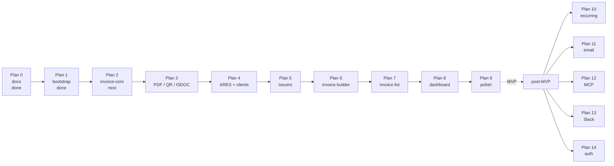

# Roadmap

Phased delivery plan. Each phase corresponds to one entry in `.cursor/plans/`. Phases are sequenced — later phases assume earlier ones are complete and tested.

## Visual timeline

## MVP plans

### Plan 0 — Docs scaffolding

**Status:** Done  
**Completed:** 2026-05-03  

**Goal:** Land the in-repo docs that lock product scope, architecture, domain model, and decisions captured in the originating chat session.

**Exit criteria:**
- [x] Every file in `docs/` tree (per [`README.md`](./README.md)) exists and is non-empty
- [x] All session-level ADRs (0001..0016) are written in Michael Nygard format
- [x] Domain docs each contain at least one worked example
- [x] Open product questions are either resolved in the relevant doc or carry a `TODO(plan-N):` marker

### Plan 1 — Repo bootstrap

**Status:** Done  
**Completed:** 2026-05-03  

**Goal:** Get a working monorepo: Turborepo + bun workspaces + Next.js 16 web app + Drizzle + Neon + lint/format/commitlint, with `bun dev` serving an empty layout.

**Exit criteria:**
- [x] `apps/web` Next.js 16 (App Router, RSC) starts and renders a sidebar layout
- [x] `packages/{invoice-core,db,ares,config-eslint,config-ts}` exist with `package.json` and a placeholder `index.ts`
- [x] Drizzle is wired to a Neon database, an empty migrations folder is committed, `bun db:push` works
- [x] Tailwind v4 + shadcn/ui base + ReUI registry (`@reui` namespace, `base-nova` style) is configured per [reui.io/docs/get-started](https://reui.io/docs/get-started)
- [x] `commitlint` enforces conventional commits with the project's scope enum
- [x] One placeholder ADR per technology choice that wasn't pre-decided (e.g. Tailwind v4) — see [0017](./decisions/0017-tailwind-v4-tooling-baseline.md)

**Doc inputs:** [`architecture.md`](./architecture.md), [`decisions/0001-monorepo-turborepo-bun.md`](./decisions/0001-monorepo-turborepo-bun.md), [`decisions/0002-nextjs15-app-router.md`](./decisions/0002-nextjs15-app-router.md), [`decisions/0003-shadcn-plus-reui-registry.md`](./decisions/0003-shadcn-plus-reui-registry.md), [`decisions/0009-drizzle-neon-postgres.md`](./decisions/0009-drizzle-neon-postgres.md)

### Plan 2 — `invoice-core` domain package

**Status:** Next  

**Goal:** Land the contract — Zod schema, totals calculation, numbering, status engine — fully unit-tested. No UI, no PDF, no DB. Pure domain.

**Exit criteria:**
- `packages/invoice-core/src/schema.ts` exports `InvoiceSchema`, `IssuerSnapshotSchema`, `ClientSnapshotSchema`, `InvoiceItemSchema`, `TotalsSchema`
- `calcTotals(items, vat)` is implemented with line-level + per-rate + grand totals
- `nextInvoiceNumber(scheme, now)` is implemented as a pure function with template tokens
- `deriveStatus(invoice, now)` is implemented as a pure function
- Unit tests cover: every VAT mode, both supplies-abroad cases, every status transition, every numbering token, edge cases (zero-amount lines, mixed VAT rates)
- Vitest runs in CI

**Doc inputs:** [`domain/invoice-schema.md`](./domain/invoice-schema.md), [`domain/vat-czech.md`](./domain/vat-czech.md), [`domain/numbering.md`](./domain/numbering.md), [`domain/status-engine.md`](./domain/status-engine.md)

### Plan 3 — PDF + QR + ISDOC rendering

**Status:** Planned  

**Goal:** `renderInvoicePdf`, `renderSpaydQr`, `renderIsdoc` with golden-file tests. PDF readable by humans; QR readable by every Czech bank app; ISDOC validates against the public XSD.

**Exit criteria:**
- `renderInvoicePdf(invoice): Promise<Uint8Array>` produces a PDF with logo / stamp / signature slots, line items, totals, payment block, embedded QR
- Czech-diacritic font picked, version-pinned, registered with `@react-pdf/renderer` `Font.register`
- `buildSpaydPayload(invoice)` produces a SPAYD 1.0 string
- `renderSpaydQr(invoice)` returns a PNG data URL via `qrcode`
- `renderIsdoc(invoice)` produces ISDOC 6.0.2 XML; validated against the official XSD in tests
- Golden-file tests check stable byte output for canonical fixtures
- Spec doc `specs/pdf-rendering.md`, `specs/spayd-qr.md`, `specs/isdoc.md` are written before implementation

**Doc inputs:** the three specs above + [`domain/invoice-schema.md`](./domain/invoice-schema.md)

### Plan 4 — ARES client + client (customer) management

**Status:** Planned  

**Goal:** Lookup any Czech business by IČO, save it as a client, list/edit/delete clients.

**Exit criteria:**
- `packages/ares/src/client.ts` calls `https://ares.gov.cz/ekonomicke-subjekty-v-be/rest/ekonomicke-subjekty/{ico}` and parses the response with a Zod schema
- 24h `unstable_cache` per-IČO
- `apps/web/app/(app)/clients/page.tsx` lists clients in a table
- `clients/new` has an IČO-first form: type IČO → click Lookup → form prefills from ARES → save
- Manual entry fallback works when ARES returns 404
- Spec doc `specs/ares.md` is written before implementation

**Doc inputs:** [`specs/ares.md`](./specs/ares.md), [`domain/invoice-schema.md`](./domain/invoice-schema.md) (snapshot shape)

### Plan 5 — Issuer (my-businesses) management

**Status:** Planned  

**Goal:** Manage the businesses I invoice *from* — VAT settings, banking, numbering schemes, optional logo/stamp/signature uploads.

**Exit criteria:**
- `apps/web/app/(app)/issuers/page.tsx` lists issuers
- `issuers/[id]/page.tsx` edits all issuer fields including a numbering-scheme editor (per docType)
- UploadThing wired for logo/stamp/signature with size + MIME validation
- ARES lookup also works on issuer creation
- Spec doc `specs/uploads.md` is written before implementation

**Doc inputs:** [`specs/uploads.md`](./specs/uploads.md), [`domain/numbering.md`](./domain/numbering.md), [`decisions/0010-uploadthing-for-files.md`](./decisions/0010-uploadthing-for-files.md)

### Plan 6 — Invoice builder

**Status:** Planned  

**Goal:** `/invoices/new` — a React-Hook-Form + Zod form that produces an `InvoiceSchema`-valid payload, with live preview and ARES lookup.

**Exit criteria:**
- Pick issuer → defaults populate (bank, VAT mode, language, numbering preview)
- Pick or create client (with ARES lookup)
- Line items via `useFieldArray` with VAT rate per line
- VAT mode + supplies-abroad selectors at invoice level
- Live preview: a rasterized or `<PDFViewer>` rendering of the PDF + computed totals + SPAYD QR
- "Save draft" persists with `status = draft`; "Issue" assigns a number via `nextInvoiceNumber`, freezes snapshots, and persists
- Builder UI flow doc `ui/invoice-builder-flow.md` is written before implementation

**Doc inputs:** [`ui/invoice-builder-flow.md`](./ui/invoice-builder-flow.md), [`domain/snapshots.md`](./domain/snapshots.md)

### Plan 7 — Invoice list + actions

**Status:** Planned  

**Goal:** ReUI Data Grid showing all invoices with filters, sort, search, and row actions.

**Exit criteria:**
- Columns: number, issue date, due date, client (with logo if set), total, status (badge), actions menu
- Filters: status, issuer, client, date range
- Search: number, client name, notes
- Sort, paginate (50/page default)
- Actions per row: view, edit (drafts only), download PDF, download ISDOC, duplicate (creates new draft), mark paid, delete (drafts only)
- Spec doc `specs/data-grid.md` is written before implementation

**Doc inputs:** [`specs/data-grid.md`](./specs/data-grid.md), [`domain/status-engine.md`](./domain/status-engine.md)

### Plan 8 — Dashboard

**Status:** Planned  

**Goal:** Single page showing the invoicing pulse at a glance.

**Exit criteria:**
- Cards: count + total amount per status (draft, issued, paid, overdue, upcoming due ≤ 14 days)
- Chart: monthly issued vs. paid for the last 12 months (basic, ReUI/shadcn chart)
- Recent invoices table (last 10)
- Issuer filter that re-scopes everything on the page

### Plan 9 — Polish

**Status:** Planned  

**Goal:** Make it feel finished.

**Exit criteria:**
- Empty states everywhere (no invoices, no clients, no issuers — each with a CTA)
- Loading skeletons via React Suspense
- Error boundaries with actionable messages
- Onboarding seed: when there are zero issuers, dashboard shows a "Create your first issuer" guided flow
- Toasts for every mutation (success + error)
- Mobile-acceptable layout (it's a desktop tool, but doesn't break on phone)

## MVP boundary

End of Plan 9 = MVP. Anything past this is post-MVP and lives below.

## Post-MVP plans

### Plan 10 — Recurring invoices

**Status:** Post-MVP backlog  

- New tables: `invoice_templates` (saved invoice payloads), `recurring_schedules` (cadence + next-run + linkage)
- Vercel Cron Job that runs daily and issues due recurrences
- UI to create a template from an existing invoice and to manage recurrences

### Plan 11 — Email delivery

**Status:** Post-MVP backlog  

- Resend wiring with verified sending domain
- "Send" action on issued invoices: PDF + ISDOC attached, customizable cover text
- Email log per invoice (sent, delivered, bounced)

### Plan 12 — MCP server (`apps/mcp`)

**Status:** Post-MVP backlog  

- Tools: `create_invoice`, `list_invoices`, `lookup_business`, `get_invoice`, `mark_paid`
- Imports `@invoicey/invoice-core` + `@invoicey/db` directly — no HTTP shim
- Schema parity with the UI is automatic because both consume `InvoiceSchema`

### Plan 13 — Slack bot (`apps/slack`)

**Status:** Post-MVP backlog  

- Slack app with slash command + `@Invoicey` mention parsing
- Backed by the same domain layer; Slack identity becomes a workspace member when auth lands
- Until auth, Slack maps to the single default workspace

### Plan 14 — Authentication + multi-user

**Status:** Post-MVP backlog  

- Clerk integration (Vercel Marketplace) — see [`decisions/0006-no-auth-mvp-multi-tenant-ready.md`](./decisions/0006-no-auth-mvp-multi-tenant-ready.md)
- New tables: `users`, `workspace_memberships`
- All existing data already has `workspace_id` so this is additive, not migration-heavy
- Slack/MCP gain proper user attribution

## Plans not yet promised

These are tracked here for traceability but not currently slotted:

- Multi-currency (EUR / USD) + bilingual invoices (CZ / EN)
- Custom PDF templates / template editor
- Bank-statement reconciliation
- Tax-period reporting (kontrolní hlášení / DPH přiznání) — adjacent product
