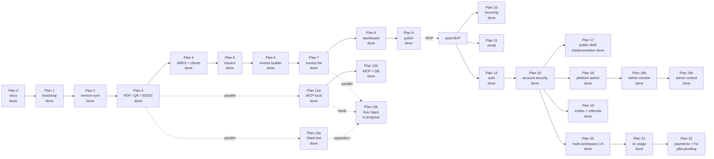

# Roadmap

Phased delivery plan. Each phase corresponds to one entry in `.cursor/plans/`. Phases are sequenced — later phases assume earlier ones are complete and tested.

## Visual timeline

## MVP plans

### Plan 0 — Docs scaffolding

**Status:** Done  
**Completed:** 2026-05-03

**Goal:** Land the in-repo docs that lock product scope, architecture, domain model, and decisions captured in the originating chat session.

**Exit criteria:**

- [x] Every file in `docs/` tree (per [`README.md`](./README.md)) exists and is non-empty
- [x] All session-level ADRs (0001..0016) are written in Michael Nygard format
- [x] Domain docs each contain at least one worked example
- [x] Open product questions are either resolved in the relevant doc or carry a `TODO(plan-N):` marker

### Plan 1 — Repo bootstrap

**Status:** Done  
**Completed:** 2026-05-03

**Goal:** Get a working monorepo: Turborepo + bun workspaces + Next.js 16 web app + Drizzle + Neon + lint/format/commitlint, with `bun dev` serving an empty layout.

**Exit criteria:**

- [x] `apps/web` Next.js 16 (App Router, RSC) starts and renders a sidebar layout
- [x] `packages/{invoice-core,db,ares,config-eslint,config-ts}` exist with `package.json` and a placeholder `index.ts`
- [x] Drizzle is wired to a Neon database, an empty migrations folder is committed, `bun db:push` works
- [x] Tailwind v4 + shadcn/ui base + ReUI registry (`@reui` namespace, `base-nova` style) is configured per [reui.io/docs/get-started](https://reui.io/docs/get-started)
- [x] `commitlint` enforces conventional commits with the project's scope enum
- [x] One placeholder ADR per technology choice that wasn't pre-decided (e.g. Tailwind v4) — see [0017](./decisions/0017-tailwind-v4-tooling-baseline.md)

**Doc inputs:** [`architecture.md`](./architecture.md), [`decisions/0001-monorepo-turborepo-bun.md`](./decisions/0001-monorepo-turborepo-bun.md), [`decisions/0002-nextjs15-app-router.md`](./decisions/0002-nextjs15-app-router.md), [`decisions/0003-shadcn-plus-reui-registry.md`](./decisions/0003-shadcn-plus-reui-registry.md), [`decisions/0009-drizzle-neon-postgres.md`](./decisions/0009-drizzle-neon-postgres.md)

### Plan 2 — `invoice-core` domain package

**Status:** Done  
**Completed:** 2026-05-03

**Goal:** Land the contract — Zod schema, totals calculation, numbering, status engine — fully unit-tested. No UI, no PDF, no DB. Pure domain.

**Exit criteria:**

- [x] `packages/invoice-core/src/schema.ts` exports `InvoiceSchema`, `IssuerSnapshotSchema`, `ClientSnapshotSchema`, `InvoiceItemSchema`, `TotalsSchema`
- [x] `calcTotals(items, vat, issuerVatPayer)` is implemented with line-level + per-rate + grand totals (third argument required for neplátce / effective rate rules)
- [x] `nextInvoiceNumber(scheme, issueDate)` is implemented as a pure function with template tokens
- [x] `deriveStatus(facts, now)` is implemented as a pure function over persisted invoice facts (`issuedAt`, `dueDate`, `paidAt`, `cancelledAt`); alias `deriveStatusFromInvoiceRow`
- [x] Unit tests cover: every VAT mode, both supplies-abroad cases, status branches, numbering tokens + yearly reset, edge cases (zero-amount lines, mixed VAT rates, credit notes)
- [x] Vitest runs via `bun run test` (Turbo `test` task); no GitHub Actions required for solo workflow

**Doc inputs:** [`domain/invoice-schema.md`](./domain/invoice-schema.md), [`domain/vat-czech.md`](./domain/vat-czech.md), [`domain/numbering.md`](./domain/numbering.md), [`domain/status-engine.md`](./domain/status-engine.md)

### Plan 3 — PDF + QR + ISDOC rendering

**Status:** Done  
**Completed:** 2026-05-03

**Goal:** `renderInvoicePdf`, `renderSpaydQr`, `renderIsdoc` with golden-file tests. PDF readable by humans; QR readable by every Czech bank app; ISDOC validates against the public XSD.

**Exit criteria:**

- [x] `renderInvoicePdf(invoice): Promise<Uint8Array>` produces a PDF with logo / stamp / signature slots, line items, totals, payment block, embedded QR
- [x] Czech-diacritic font picked, version-pinned, registered with `@react-pdf/renderer` `Font.register` (DejaVu Sans via `dejavu-fonts-ttf`; see [`specs/pdf-rendering.md`](./specs/pdf-rendering.md))
- [x] `buildSpaydPayload(invoice)` produces a SPAYD 1.0 string
- [x] `renderSpaydQr(invoice)` returns a PNG data URL via `qrcode`
- [x] `renderIsdoc(invoice)` produces ISDOC 6.0.2 XML with root `Invoice` `version="6.0.2"`; validated against the vendored XSD in tests (`xmllint-wasm`)
- [x] Golden / stable tests on canonical fixtures: ISDOC string snapshots + XSD; PDF smoke (`%PDF` header); SPAYD string + deterministic QR PNG hash
- [x] Spec doc `specs/pdf-rendering.md`, `specs/spayd-qr.md`, `specs/isdoc.md` written before implementation

**Doc inputs:** the three specs above + [`domain/invoice-schema.md`](./domain/invoice-schema.md)

**Artifacts:** `@invoicey/invoice-core` exports `pdf/`, `spayd/`, `isdoc/`; XSD [`packages/invoice-core/assets/schemas/isdoc-invoice-6.0.2.xsd`](../packages/invoice-core/assets/schemas/isdoc-invoice-6.0.2.xsd); tests [`packages/invoice-core/src/plan03-render.test.ts`](../packages/invoice-core/src/plan03-render.test.ts).

### Plan 4 — ARES client + client (customer) management

**Status:** Done  
**Completed:** 2026-05-03

**Goal:** Lookup any Czech business by IČO, save it as a client, list/edit/delete clients.

**Exit criteria:**

- [x] `packages/ares/src/client.ts` calls `https://ares.gov.cz/ekonomicke-subjekty-v-be/rest/ekonomicke-subjekty/{ico}` and parses the response with a Zod schema
- [x] 24h `unstable_cache` per-IČO
- [x] `apps/web/app/(app)/clients/page.tsx` lists clients in a table
- [x] `clients/new` has an IČO-first form: type IČO → click Lookup → form prefills from ARES → save
- [x] Manual entry fallback works when ARES returns 404
- [x] Spec doc `specs/ares.md` is written before implementation

**Doc inputs:** [`specs/ares.md`](./specs/ares.md), [`domain/invoice-schema.md`](./domain/invoice-schema.md) (snapshot shape)

### Plan 5 — Issuer (my-businesses) management

**Status:** Done  
**Completed:** 2026-08-10

**Goal:** Manage the businesses I invoice _from_ — VAT settings, banking, numbering schemes, optional logo/stamp/signature uploads.

**Exit criteria:**

- [x] `apps/web/app/(app)/issuers/page.tsx` lists issuers
- [x] `issuers/[id]/edit/page.tsx` edits all issuer fields including a numbering-scheme editor (per docType)
- [x] UploadThing wired for logo/stamp/signature with size + MIME validation (manual URL fallback without token)
- [x] ARES lookup also works on issuer creation
- [x] Spec doc `specs/uploads.md` is written before implementation

**Doc inputs:** [`specs/uploads.md`](./specs/uploads.md), [`domain/numbering.md`](./domain/numbering.md), [`decisions/0010-uploadthing-for-files.md`](./decisions/0010-uploadthing-for-files.md)

### Plan 6 — Invoice builder

**Status:** Done  
**Completed:** 2026-08-10

**Goal:** `/invoices/new` — a React-Hook-Form + Zod form that produces an `InvoiceSchema`-valid payload, with live preview and ARES lookup.

**Exit criteria:**

- [x] Pick issuer → defaults populate (bank, VAT mode, language, numbering preview)
- [x] Pick client from DB (create client via Clients CRUD + ARES)
- [x] Line items via `useFieldArray` with VAT rate per line
- [x] VAT mode + supplies-abroad selectors at invoice level
- [x] Live preview: debounced PDF iframe via `/api/demo/invoice-pdf` + computed totals
- [x] "Save draft" persists with `issuedAt = null`; "Issue" assigns a number via `nextInvoiceNumber`, freezes snapshots, and persists
- [x] Builder UI flow doc `ui/invoice-builder-flow.md` is written before implementation

**Doc inputs:** [`ui/invoice-builder-flow.md`](./ui/invoice-builder-flow.md), [`domain/snapshots.md`](./domain/snapshots.md)

### Plan 7 — Invoice list + actions

**Status:** Done  
**Completed:** 2026-08-10

**Goal:** ReUI Data Grid showing all invoices with filters, sort, search, and row actions.

**Exit criteria:**

- [x] Columns: number, issue date, due date, client, total, status (badge), actions
- [x] Filters: status, issuer, client, date range
- [x] Search: number, client name, notes
- [x] Sort, paginate (50/page default)
- [x] Actions per row: view, edit (drafts only), download PDF, download ISDOC, duplicate (creates new draft), mark paid, delete (drafts only)
- [x] Spec doc `specs/data-grid.md` is written before implementation
- [x] Presentation upgraded to ReUI Data Grid + Filters + nuqs (server SQL retained; clients/issuers share the grid shell)

**Doc inputs:** [`specs/data-grid.md`](./specs/data-grid.md), [`domain/status-engine.md`](./domain/status-engine.md)

### Plan 8 — Dashboard

**Status:** Done  
**Completed:** 2026-08-10

**Goal:** Single page showing the invoicing pulse at a glance.

**Exit criteria:**

- [x] Cards: count + total amount per status (draft, issued, paid, overdue, upcoming due ≤ 14 days)
- [x] Chart: monthly issued vs. paid for the last 12 months (basic, ReUI/shadcn chart)
- [x] Recent invoices table (last 10)
- [x] Issuer filter that re-scopes everything on the page

### Plan 9 — Polish

**Status:** Done  
**Completed:** 2026-08-10

**Goal:** Make it feel finished.

**Exit criteria:**

- [x] Empty states everywhere (no invoices, no clients, no issuers — each with a CTA)
- [x] Loading skeletons via React Suspense
- [x] Error boundaries with actionable messages
- [x] Onboarding seed: when there are zero issuers, dashboard shows a "Create your first issuer" guided flow
- [x] Toasts for every mutation (success + error)
- [x] Mobile-acceptable layout (it's a desktop tool, but doesn't break on phone)

**Follow-up (post Plan 9):** `/welcome` first-issuer wizard (ARES → bank, skippable) + sectioned issuer edit routes — see [`ui/onboarding.md`](./ui/onboarding.md).

## MVP boundary

End of Plan 9 = MVP. Anything past this is post-MVP and lives below.

## MVP-parallel plans

Plans listed here do not block the MVP and can be picked up in parallel with Plans 5–9. They depend only on Plan 3 (PDF / QR / ISDOC) being done.

### Plan 13a — Slack bot, stateless demo (in `apps/web`)

**Status:** Done  
**Completed:** 2026-05-03 (implementation; tools later shared via `@invoicey/invoice-tools`)

**Goal:** Let a user post `/invoice <free-text>` (or `@bot …`) in Slack and receive a rendered Czech invoice PDF + ISDOC XML in-thread, with no DB writes. Vercel AI SDK aggregates the message into an `InvoiceSchema`-valid payload via tool calls; the deterministic core renders.

**Exit criteria:**

- [x] Slack route handler at `apps/web/app/api/slack/commands/route.ts` verifies signatures and acks within Slack's 3s window
- [x] Events API `app_mention` at `apps/web/app/api/slack/events/route.ts`
- [x] AI tool surface wraps `@invoicey/invoice-core` + `@invoicey/ares` (now via `@invoicey/invoice-tools`)
- [x] Worker uses `generateText({ tools, maxSteps })` against Vercel AI Gateway
- [x] Successful runs reply with PDF + ISDOC via `files.uploadV2`
- [x] Single demo issuer from `INVOICEY_DEMO_ISSUER_JSON` or hard-coded sample — no DB
- [x] Spec doc [`specs/slack-bot.md`](./specs/slack-bot.md)

**Doc inputs:** [`specs/slack-bot.md`](./specs/slack-bot.md), [`specs/ares.md`](./specs/ares.md), [`specs/isdoc.md`](./specs/isdoc.md), [`specs/pdf-rendering.md`](./specs/pdf-rendering.md)

## Post-MVP plans

### Plan 10 — Recurring invoice drafts

**Status:** Done  
**Completed:** 2026-08-12  
**Spec:** [`specs/recurring.md`](./specs/recurring.md) · [ADR 0027](./decisions/0027-recurring-drafts-only.md) · [plan](../.cursor/plans/plan-10-recurring.md)

**Goal:** Save an invoice as a template, attach a monthly/quarterly schedule, and have a daily cron create a **draft** (HITL). The original “cron issues invoices” wording is superseded by ADR 0027.

**Exit criteria:**

- [x] Spec + ADR 0027 + this roadmap section
- [x] `invoice_templates` + `recurring_schedules` + `invoices.recurring_schedule_id`
- [x] Ops: create from invoice, pause/resume/skip/delete, run now, `runDueRecurringForWorkspace`
- [x] Cron `/api/cron/recurring-drafts` (`CRON_SECRET`) + `0 6 * * *`
- [x] `/invoices/recurring` + save-from-invoice; cs/en
- [x] Vitest for next-run / materialize / skip; typecheck / lint / test
- [x] Apply `packages/db/sql/2026-08-12-plan10-recurring.sql` on Neon

**Out of v1:** auto-issue, auto-email, MCP/Eve tools, template line editor.

### Plan 11 — Email delivery

**Status:** Done (implementation; operator smoke pending)  
**Completed:** 2026-08-11  
**Spec:** [`specs/email.md`](./specs/email.md) · [ADR 0022](./decisions/0022-resend-and-react-email.md)

Resend + `@invoicey/emails` (react-email). Sub-phases below. **Operator still needed:** verify `invoicey.ditrich.me`, set Resend/webhook/`CRON_SECRET` on Vercel, run one real send + webhook check.

#### Plan 11a — Email engine

**Status:** Done (implementation)  
**Completed:** 2026-08-11  
**Plan file:** [`.cursor/plans/plan-11a-email-engine.md`](../.cursor/plans/plan-11a-email-engine.md)

**Goal:** Templates package, Resend client, `email_messages` / `email_events`, webhook tracking, Better Auth invite send.

**Exit criteria:**

- [x] Spec + ADR + this roadmap section
- [x] `@invoicey/emails` with invoice-sent + workspace-invite (+ stub templates)
- [x] Drizzle tables + schema applied
- [x] Resend client + webhook route + env schema
- [x] Auth invite sends via Resend when key set
- [x] Vitest for render + from-display + webhook status mapping

#### Plan 11b — Invoice send UI

**Status:** Done (implementation)  
**Completed:** 2026-08-11  
**Plan file:** [`.cursor/plans/plan-11b-invoice-send.md`](../.cursor/plans/plan-11b-invoice-send.md)

**Goal:** Send issued invoices from the web app with customizable cover, PDF (+ ISDOC), issuer defaults, delivery timeline.

**Exit criteria:**

- [x] Send action + dialog + issuer `email_settings`
- [x] PDF (+ ISDOC) attached correctly
- [x] Timeline on invoice detail
- [x] Tests for ops defaults / missing email / cancelled guard

#### Plan 11c — Agent surfaces

**Status:** Done (implementation)  
**Completed:** 2026-08-11  
**Plan file:** [`.cursor/plans/plan-11c-email-agents.md`](../.cursor/plans/plan-11c-email-agents.md)

**Goal:** MCP + Eve `send_invoice_email` (HITL) on the same ops path.

**Exit criteria:**

- [x] MCP + Eve tools registered and tested
- [x] Specs (`mcp.md`, `slack-eve.md`) updated

#### Plan 11d — Lifecycle emails

**Status:** Done (implementation)  
**Completed:** 2026-08-11  
**Plan file:** [`.cursor/plans/plan-11d-email-lifecycle.md`](../.cursor/plans/plan-11d-email-lifecycle.md)

**Goal:** Overdue reminders (cron), optional payment-received mail, bounce/complaint suppression.

**Exit criteria:**

- [x] Cron reminder job + payment-received hook
- [x] Suppression list honored
- [x] Eligibility + suppression tests

### Plan 12a — MCP server, local + Vercel HTTP prep (`apps/mcp`)

**Status:** Done (implementation)  
**Completed:** 2026-08-10  
**Plan file:** [`.cursor/plans/plan-12-mcp-local.md`](../.cursor/plans/plan-12-mcp-local.md)  
**Spec:** [`specs/mcp.md`](./specs/mcp.md)

**Goal:** Cursor-ready stdio MCP with create/render + ARES + local presets; prepare Streamable HTTP on `apps/web` `/api/mcp` (API-key gated) for later go-live. No DB.

**Exit criteria:**

- [x] `@invoicey/invoice-tools` shared handlers (normalize, presets, create/render, ARES)
- [x] `apps/mcp` stdio MCP exposes `create_invoice`, `lookup_business`, preset CRUD
- [x] Slack tools import `@invoicey/invoice-tools`
- [x] `mcp-handler` route at `/api/mcp` with required `MCP_API_KEY`
- [x] Spec + Cursor/`mcp.json` + Vercel go-live checklist documented

### DB foundation — durable schema (feeds Plan 5 / 6 / 12b)

**Status:** Done  
**Completed:** 2026-08-10  
**Spec:** [`specs/db-schema.md`](./specs/db-schema.md)

- Tables: `workspaces`, `issuer_businesses`, `issuer_numbering_schemes`, `clients`, `invoices`, `invoice_items`, `presets`
- MCP presets + draft invoice persist when `DATABASE_URL` is set; file fallback otherwise
- Still single-tenant via `INVOICEY_DEFAULT_WORKSPACE_ID` (seeded UUID; no Clerk)

### Plan 12b — MCP server, DB-backed tools

**Status:** Done  
**Completed:** 2026-08-11

- [x] Tools: `list_invoices`, `get_invoice`, `mark_invoice_paid` (Neon via `@invoicey/invoice-tools/ops`)
- [x] Summaries include domain `status` + FO `displayStatus`
- [x] Spec updated in [`specs/mcp.md`](./specs/mcp.md)

### Lifecycle visibility polish (Plans 7/8 follow-up)

**Status:** Done  
**Completed:** 2026-08-11

- FO-style display statuses (Unpaid / Future / …), list summary cards, color pills, bulk + unmark paid, dashboard Přehled balance row

### Plan 13b — Eve Slack agent (DB-backed, in `apps/web`)

**Status:** In progress  
**Spec:** [`specs/slack-eve.md`](./specs/slack-eve.md)

**Goal:** Replace Plan 13a’s hand-rolled Slack AI loop with a durable [Eve](https://eve.dev/docs) agent under `apps/web/agent/`, wired to Neon via `@invoicey/invoice-tools` (+ `/ops`). Single-tenant (no Clerk); Slack auth via Vercel Connect → `/eve/v1/slack`.

**Exit criteria:**

- [x] Domain APIs: `issueInvoiceById` / `markInvoicePaidById` / list/get; draft persist writes `invoice_items`
- [x] `withEve` + `apps/web/agent` (Slack Connect + Bearer HTTP channel)
- [x] Tools: create/upload/list/get/presets + HITL `issue_invoice` / `mark_invoice_paid`
- [x] Spec + human Connect checklist in [`specs/slack-eve.md`](./specs/slack-eve.md)
- [x] Retire Plan 13a `/api/slack/*` routes and `lib/slack` AI loop
- [x] Prod deploy with `withEve` (`GET https://invoicey.ditrich.me/eve/v1/health` → ready)
- [ ] Human: Connect create/attach `--trigger-path /eve/v1/slack`, invite bot, run E2E checklist in the spec

**Out of v1:** slash `/invoice`, Clerk / per-user scoping, Eve calling remote `/api/mcp`.

### Plan 14 — Authentication + multi-user

**Status:** Done  
**Completed:** 2026-08-11  
**Supersedes:** Clerk path in [`decisions/0006-no-auth-mvp-multi-tenant-ready.md`](./decisions/0006-no-auth-mvp-multi-tenant-ready.md) — shipped **Better Auth** (OAuth Google/GitHub, DB sessions, workspaces = organizations per [ADR 0019](./decisions/0019-workspaces-are-better-auth-organizations.md) / [ADR 0018](./decisions/0018-better-auth-oauth-only.md)).

**Exit criteria:**

- [x] Better Auth OAuth-only sign-in + session cookie gate
- [x] `users` / `sessions` / `accounts` / `members` / `invitations` (+ MCP OIDC + `api_keys` tables)
- [x] Personal workspace bootstrap on user create; `session.activeOrganizationId`
- [x] ADR 0018 written ([`decisions/0018-better-auth-oauth-only.md`](./decisions/0018-better-auth-oauth-only.md))
- [x] Members / invite accept UI (Plan 16)

### Plan 15 — Historical issued-invoice import

**Status:** In progress  
**Spec:** [`specs/invoice-import.md`](./specs/invoice-import.md) · [ADR 0021](./decisions/0021-immutable-imported-invoice-artifacts.md)

**Goal:** Bulk-import historical PDFs (ISDOC → full; no ISDOC → archive + original PDF) with provenance and immutable artifacts.

**Exit criteria:**

- [x] Provenance columns + `insertIssuedImport` + `artifacts_immutable` guard
- [x] `extractIsdocFromPdf` + `parseIsdoc` + round-trip tests
- [x] UploadThing import endpoints + `/invoices/import` review UI
- [x] Archive mode + paid-at-import + origin badges
- [x] Numbering counter sync after import
- [ ] `bun db:push` applied on target Neon
- [ ] Manual smoke: import FO PDF with ISDOC + one without

### Plan 16 — Account security & settings

**Status:** Done  
**Completed:** 2026-08-11  
**Spec:** [`specs/account-security.md`](./specs/account-security.md) · [ADR 0023](./decisions/0023-account-security-soft-devices.md) · [plan](../.cursor/plans/plan-16-account-security.md)

**Goal:** Settings security (linked OAuth, sessions, soft trusted devices + new-sign-in email), members/invites UI, API keys UI with MCP/Eve PAT cutover, audit log, auth rate limits.

**Exit criteria:**

- [x] Settings subnav + nav entry (Appearance / Security / Members / API keys)
- [x] Link/unlink providers with last-provider guard
- [x] List/revoke sessions + revoke others; IP headers configured
- [x] Soft trusted devices + `new_sign_in` email + trust link
- [x] Security audit feed
- [x] Members invite/list/role/remove + `/invite/[id]`
- [x] API keys UI; MCP accepts user PAT or env ops key; Eve HTTP ops-key only (channel client boundary); workspace threading
- [x] BA DB rate limit + BotID on auth surfaces
- [x] Spec + ADR 0023 + this roadmap section
- [x] Plan 16 SQL applied on Neon (`rate_limits`, `trusted_devices`, `security_audit_events`)

### Plan 17 — Public website and entry shell

**Status:** Done (implementation; merge and production smoke pending)

**Completed:** 2026-08-11

**Spec:** [`specs/public-shell.md`](./specs/public-shell.md) · [plan](../.cursor/plans/plan-17-public-shell.md)

**Goal:** Wrap the authenticated product in a compact public website: one substantial Czech homepage, polished OAuth/onboarding entry, essential legal routes, launch metadata, and an Invoicey-native consent experience.

**Exit criteria:**

- [x] Public `/` with shared header/footer and anchored product sections
- [x] Cohesive `/sign-in` and `/onboarding` entry screens
- [x] `/privacy`, `/terms`, and `/cookies`
- [x] First-party consent bar/preferences sheet; analytics gated by measurement consent
- [x] Metadata, sitemap, robots, social preview, responsive and accessibility QA
- [ ] Merged to `main` + production smoke

**Out of scope:** separate product/feature/AI/pricing pages, blog/CMS, billing, or new marketing trackers.

### Plan 18 — Global platform admin

**Status:** Done  
**Completed:** 2026-08-11  
**ADR:** [0024](./decisions/0024-platform-admin-user-flag.md) · [plan](../.cursor/plans/plan-18-platform-admin.md)

**Goal:** User-level platform admin (orthogonal to workspace roles) plus an isolated `/admin` console for cross-tenant metrics and lists (users, workspaces, invoices, issuers).

**Exit criteria:**

- [x] `users.platform_role` + Better Auth field + `requirePlatformAdmin()`
- [x] Env allowlist promote + grant script; runtime gate reads DB flag
- [x] `/admin` dashboard + list pages; grant/revoke platform role with audit
- [x] Nav entry for admins only; proxy matcher; cs/en i18n
- [x] Typecheck / focused tests; `platform_role` column applied on Neon
- [ ] Set `INVOICEY_PLATFORM_ADMIN_EMAILS` on Vercel prod/preview

**Out of v1:** Better Auth admin plugin, MCP/Eve platform role, cross-tenant business mutations, RLS.

### Plan 18b — Platform admin monitor

**Status:** Done  
**Completed:** 2026-09-03  
**ADR:** [0024](./decisions/0024-platform-admin-user-flag.md) · [plan](../.cursor/plans/plan-18b-platform-admin-monitor.md) · Spec: [`specs/platform-admin.md`](./specs/platform-admin.md)

**Goal:** Make `/admin` the morning ops console — truthful aggregates, global AI usage, invoice/issuer drill-down, richer lists. No new tenant mutations.

**Exit criteria:**

- [x] Spec + this roadmap section
- [x] Dashboard uses SQL aggregates; monthly issued/paid chart; volume by currency
- [x] `/admin/ai` + workspace grant/usage history
- [x] Read-only invoice and issuer detail; list rows link through
- [x] Workspace/user lists show plan, tokens, last session
- [x] Platform audit includes `platform_plan_assign` / `platform_plan_update`
- [x] List cap is visible; i18n cs/en; typecheck / focused tests

**Out of 18b:** Impersonation, freeze/ban, session/key revoke, email suppression lift, invoice mutations, in-app log tail.

### Plan 18c — Platform admin support control

**Status:** Done  
**Completed:** 2026-09-03  
**ADR:** [0046](./decisions/0046-workspace-freeze.md) · [plan](../.cursor/plans/plan-18c-platform-admin-control.md) · Spec: [`specs/platform-admin.md`](./specs/platform-admin.md)

**Goal:** Give the operator control that matches the 18b monitor — cut access, lift accidental blocks, tailor one workspace — without impersonating or editing a tenant’s books.

**Exit criteria:**

- [x] ADR 0046 + spec Approach (control) + this roadmap section
- [x] User detail: sessions + trusted devices + API key prefixes; revoke each (never secrets)
- [x] Workspace entitlement-override editor (sectioned form) + clear overrides
- [x] Freeze / unfreeze; `assertWorkspaceWritable` on web, MCP/Eve, companion, Drive writes, crons
- [x] Email suppression list + lift
- [x] Community-look unpublish from `/admin`
- [x] Bank connections listed without secrets; disconnect via existing helpers
- [x] New `platform_*` audit types; i18n cs/en; typecheck / focused tests; freeze SQL on Neon

**Out of 18c:** Impersonation, user ban (18d), invoice/client/issuer/look edits, secret display, in-app log tail, billing admin, Slack unlink, cron last-run.

### Plan 19 — Workspace invites + referral attribution

**Status:** Done  
**Completed:** 2026-08-11  
**ADR:** [0025](./decisions/0025-referral-attribution.md) · [plan](../.cursor/plans/plan-19-invites-referrals.md) · Spec: [`specs/account-security.md`](./specs/account-security.md)

**Goal:** Polish Better Auth workspace member invites (email, accept page, i18n, resend/cancel/expiry, audit) and ship personal referral links that only attribute new signups (own workspace; record referrer + events).

**Exit criteria:**

- [x] Invite email polish + expiry copy; explicit `invitationExpiresIn` (48h)
- [x] Members UI: i18n, expiry display, resend/cancel + audit events
- [x] Rich `/invite/[id]` (workspace/inviter/role/expiry, mismatch/expired/reject)
- [x] Schema: `users.referral_code`, `users.referred_by_user_id`, `referral_events`
- [x] `/r/[code]` landing + `invoicey_ref` cookie; signup attribution once
- [x] `/settings/account/referrals` (link + stats); admin users show code / referred-by
- [x] ADR 0025 + specs + this roadmap section
- [x] Typecheck / focused tests
- [x] Plan 19 SQL applied on Neon (`packages/db/sql/2026-08-11-plan19-invites-referrals.sql`)

**Out of v1:** Referral rewards, auto-join workspace, bilingual invite emails, MCP referral tools.

### Plan 20 — Multi-workspace product UX

**Status:** Done  
**Completed:** 2026-08-12  
**Plan:** [plan-20-multi-workspace.md](../.cursor/plans/plan-20-multi-workspace.md) · ADR [0019](./decisions/0019-workspaces-are-better-auth-organizations.md)

**Goal:** Product UX for multiple workspaces per user — switcher, create, rename, invite landing, and PAT default alignment — on top of existing Better Auth organization tenancy.

**Exit criteria:**

- [x] Sidebar workspace switcher (list + switch active + update `defaultWorkspaceId`)
- [x] Create additional workspace → active + default → dashboard
- [x] Settings → Workspace rename (owner/admin); slug read-only
- [x] Settings → API keys shows/sets default workspace for PAT/MCP
- [x] Invite accept sets active (BA) + default workspace
- [x] Docs updated (`workspaces.mdx`); typecheck / lint / test green

**Out of scope:** workspace delete/leave/transfer, slug edit, ops-key multi-tenant picker, Slack multi-workspace remap, Postgres RLS.

### Plan 21 — In-app AI draft + workspace token usage

**Status:** Implemented  
**Completed:** 2026-08-12  
**ADR:** [0026](./decisions/0026-workspace-ai-tokens.md) · [spec](./specs/ai-usage.md) · [plan](../.cursor/plans/plan-21-ai-usage.md)

**Goal:** Prompt → InvoiceSchema in the web app; workspace-scoped AI token balances with per-product usage (web / slack / mcp activity) and Usage settings UI.

**Exit criteria:**

- [x] Schema + grant on workspace create; gifted / monthly / purchased buckets
- [x] Meter Web + Eve LLM tokens; log MCP tool calls without debit
- [x] Cron renewal (no monthly rollover) + ops script
- [x] `/invoices/ai`, Settings → Usage, sidebar balance chip
- [x] Spec + ADR

**Out of v1:** Payments / top-up, billing MCP client LLM tokens.

### Plan 22 — Payment ledger and Fio bank integration

**Status:** Implemented; real Fio pilot pending

**Selected:** 2026-08-15

**ADR:** [0029](./decisions/0029-payment-ledger-fio-first.md) · [spec](./specs/payment-ledger-fio.md) · [plan](../.cursor/plans/plan-22-payment-ledger-fio.md)

**Goal:** Reconcile future invoice payments received into a Fio account through
a provider-neutral, auditable ledger with deterministic suggestions and human
confirmation.

**22a — live contract probe:**

- [x] Confirm pilot account scope/currency, linked issuer, and history start
- [x] Resolve Filip Ditrich / IČO 09870113 in the workspace for
      `filip.ditrich@gmx.us`; create only if absent
- [x] Add minimal encrypted workspace connection and in-app token form
- [ ] Validate the current Fio JSON contract with a real monitoring-only token
- [ ] Capture only redacted field coverage and test fixtures

**22b — ledger and matcher:**

- [x] Provider-neutral transaction, proposal, allocation, and audit schema
- [x] Existing `paid_at` migration and allocation-derived payment state
- [x] Manual payments use the same allocation service
- [x] Versioned deterministic matcher with partial, split, overpayment, and
      reversal coverage

**22c — Fio connection and sync:**

- [x] Encrypted, rotatable, read-only token storage and account verification
- [x] Explicit overlapping date-range sync with leases and idempotency
- [x] Connection-date start, scheduled/manual sync, backoff, and degraded UX

**22d — reconciliation and pilot:**

- [x] Bank connection settings and payments review queue
- [x] Confirm/reject/reverse workflows; rematch/split UI remains
- [ ] Rematch and split-allocation UI
- [x] Invoice timeline plus allocation-derived outstanding dashboard values
- [ ] One controlled real-invoice pilot and repeated-sync idempotency validation

**Out of Plan 22:** payment initiation, FX allocation, auto-confirmation,
multibank provider, notification-email ingestion, and general expense
categorization.

### Plan 24 — Incoming invoices (přijaté faktury)

**Status:** Removed from the product — 2026-08-26

Incoming invoices shipped, then came off again. The feature needed a shape the
rest of Invoicey does not have: a five-gate lifecycle, three orthogonal state
projections, multi-actor approval with teams as a permission primitive, and an
accounting-system integration with its own network topology. Carrying that
alongside a product about issuing documents cost more than it returned, and the
same capability is a better fit inside the NFCtron ecosystem, which already has
the Pohoda mServer client, the static egress it needs, and the org structure.

Everything is preserved on the **`feat/payables-lifecycle`** branch, tagged
**`archive/payables-lifecycle`** — Plan 24, the Plan 25 design work that
followed it, and the four ADRs. The most reusable output is the mPohoda API
analysis: the REST API cannot set předkontace or členění DPH and has no
liquidation endpoint for received invoices, so Pohoda XML is the only rail that
can express the process. That finding transfers unchanged.

Removed here: routes, suppliers, inbound email capture and its webhook and cron,
payment runs and Fio submission, the payables half of bank import, all nineteen
database tables, and the related environment variables. The payment **ledger**
(Plan 22/23, issued-side reconciliation) is untouched.

### Plan 26 — Plans, entitlements, and workspace permissions

**Status:** Implemented — 2026-08-30  
**ADR:** [0035](./decisions/0035-plans-are-shared-entitlement-rows.md) ·
[0036](./decisions/0036-managed-client-catalogs.md) ·
[0037](./decisions/0037-declarative-token-grants.md) ·
[0038](./decisions/0038-permission-catalog-with-role-presets.md) ·
[spec](./specs/plans-entitlements.md) ·
[plan](../.cursor/plans/plan-26-plans-entitlements.md)

**Goal:** One `plans` table (Free / Pro / Enterprise / custom) driving every
workspace limit and feature flag through resolved entitlements, activated
manually by platform admin. Enables the sponsored-plan use case — NFCtron
contractors each in their own isolated workspace, restricted to a managed client
catalog — and lands the permission chokepoint that Pro teams need.

**26a — plans and entitlement resolution:**

- [x] `plans` table, `workspaces.plan_id` + `entitlement_overrides`, seeded
      Free / Pro / Enterprise rows and the NFCtron custom row
- [x] `EntitlementsSchema` + `resolveEntitlements()` + `requireEntitlement()`,
      memoized alongside `requireWorkspace()`
- [x] Domain-based assignment at workspace bootstrap; manual assignment wins
- [x] `/admin/plans` CRUD and per-workspace assignment + overrides
- [x] Workspace settings plan card showing resolved entitlements

**26b — token grants:**

- [x] `workspace_token_grants` ledger; signup + `first_invoice_issued` rules
- [x] Existing `adminGrantTokens` moved onto the ledger, attribution kept
- [x] `monthly_limit` seeded from the plan on assignment and renewal
- [x] First-invoice reward notification (in-app + email), once per workspace
- [x] Top-up UI stub (no payment path)

**26c — managed clients:**

- [x] `plan_clients` catalog seeded from ARES by IČO; `clients.plan_client_id`
- [x] Sync on catalog write and on plan assignment; non-destructive revocation
- [x] `createMode: "managed"` enforced in web, import, MCP, and Eve/Slack

**26d — permissions:**

- [x] Permission catalog + `assertCan()` wired into every mutation surface
- [x] Role presets; `requireRole()` removed from call sites
- [x] Per-member overrides UI, gated on `permissions.mode === "advanced"` — first pass; needs grouping, plan-availability hints, and bulk edit

**26e — quotas and Enterprise policy:**

- [x] Seat and issuer quotas on the write path only
- [x] `allowedEmailDomains` enforced at invite _and_ at accept
- [x] Audit retention honoured per plan (daily cron)

**Out of Plan 26:** payment-driven activation and billing, pooled cross-workspace
token budgets, workspace-authored custom roles, per-member client/issuer
scoping.

**Follow-ups:** the per-member permission editor is a first pass — no grouping
by area, no marking of permissions the plan does not include, no bulk edit.

## Plan 27 — PDF looks S0

**Status:** Done
**Completed:** 2026-08-31

**Goal:** Invoice PDFs are **looks** (ADR 0039): Classic `1.0.0` as data, Minimal `1.0.0` as a second layout, full look snapshot at issue, picker, Free applies Classic only.

**Spec:** [`specs/pdf-looks.md`](./specs/pdf-looks.md)

- [x] Look document schema, structural + invoice validators, first-party catalog
- [x] `@react-pdf/renderer` interprets bands; `renderInvoicePdf` unchanged at the API
- [x] `look` / `appearance` / `lookSnapshot` on `InvoiceSchema`; `customization` compat
- [x] `looks.apply` entitlement; workspace default look; issue snapshot; duplicate/entitlement gates
- [x] Builder + workspace look picker (Minimal locked on Free)

**Out of 27:** builder JSON editor, workspace/community origins, publish (S1/S2).

## Plan 28 — PDF looks S1 (workspace builder)

**Status:** Done
**Completed:** 2026-08-31

**Goal:** Workspace-origin looks in the database; Pro builder (structured + JSON + preview) edits the same look document.

**Spec:** [`specs/pdf-looks-builder.md`](./specs/pdf-looks-builder.md)

- [x] `origin: workspace`, catalog lookup, versioned save (patch/minor)
- [x] `workspace_looks` table; issue/draft/default resolve from workspace catalog
- [x] Settings list + editor; picker lists latest workspace looks

**Out of 28:** community publish (S2).

## Plan 29 — PDF looks S2 (community publish)

**Status:** Done
**Completed:** 2026-08-31

**Goal:** Publish a workspace look to a global community catalog. Any Pro workspace may apply a published community look. No review queue.

**Spec:** [`specs/pdf-looks-community.md`](./specs/pdf-looks-community.md)

- [x] `origin: community`, publish helpers, picker listing
- [x] `community_looks` table; catalog resolve includes published rows
- [x] Publish / unpublish from the builder; picker origin badge

**Out of 29:** moderation queue, takedown console, licensing copy.

## Plan 30 — Invoicey Drive (macOS companion)

**Status:** Done (web + Mac mirror; Finder Locations and notarized `.dmg` parked on Apple Developer team)

**ADR:** [0041](./decisions/0041-invoicey-drive-companion.md) ·
[0042](./decisions/0042-drive-device-pairing.md) ·
[0043](./decisions/0043-drive-layout-workspace-issuer-template.md) ·
[spec](./specs/invoicey-drive.md) ·
[UI](./ui/invoicey-drive.md) ·
[plan](../.cursor/plans/plan-30-invoicey-drive.md)

**Goal:** Pair a Mac companion so issued invoices appear in Finder as Invoicey
Drive (`/{workspace}/{issuer}/{layout}`), with an optional mirror folder into
iCloud / Proton / `_faktury`. The website stays the product. The Mac app is a
librarian, not a second Invoicey.

**30a — Drive API + pairing (this repo):**

- [x] Layout template parser + preview
- [x] `drive_devices` / `drive_pair_grants` SQL
- [x] `/drive/connect` + `POST /api/drive/token`
- [x] `GET /api/drive/index` and artifact byte routes
- [x] Settings → Invoicey Drive
- [x] Audit events

**30b — Web promo + docs (this repo):**

- [x] Fumadocs `integrations/invoicey-drive`
- [x] Marketing companion mention
- [x] Post-issue banner when the user has zero devices
- [x] Download placeholder (notarized `.dmg`)

**30c — Mac app (sibling `invoicey-mac`):**

- [x] Menu bar + Keychain + connect session
- [ ] File Provider domain from the index (enumerator compiles; Finder Locations needs a paid-team `.appex`)
- [x] On-demand PDF fetch (mirror sync)
- [x] Optional mirror folder
- [ ] Notarized build

**Out of 30:** Windows, iOS Files, invoice create/issue, server iCloud/Proton
APIs, two-way Finder edits that mutate Invoicey, APNs, Mac App Store.

## Plan 31 — Invoicey CLI (operator companion)

**Status:** Completed
**Completed:** 2026-09-02

**ADR:** [0044](./decisions/0044-invoicey-cli-companion.md) ·
[spec](./specs/invoicey-cli.md) ·
[research](./research/invoicey-cli.md) ·
[plan](../.cursor/plans/plan-31-invoicey-cli.md)

**Goal:** Interactive terminal CLI for invoice, client, issuer, payment, and
ARES management against the live workspace. Same PAT as remote MCP. The website
stays the system of record for looks, members, bank connect, and import.

- [x] Companion ops + `POST /api/companion` + PDF/ISDOC GET
- [x] `apps/cli` (`invoicey`) — login, status, invoices, clients, issuers,
      payments, ARES, interactive home
- [x] Public docs `/docs/integrations/cli`
- [x] Bun-compiled binary + `bun run invoicey:install` → `~/.invoicey/bin`
- [x] Public checksum-verified `curl | bash` installer + release binaries

**Out of 31:** look builder, bulk import, members, bank connect, recurring
editor, Drive device tokens, local Neon mode.

## Plan 32 — Standalone domain (`invoicey.app`)

**Goal:** Canonical public origin `https://invoicey.app` (apex), email From on
`@invoicey.app`, old host kept as a dual-serve / 308 for a deprecation window.

**Spec:** [`specs/standalone-domain.md`](./specs/standalone-domain.md)

**Why it is a plan:** the host is hardcoded in CLI defaults, PDF footer, email
From, Drive allowlist, OAuth consoles, and Resend DNS — not just
`NEXT_PUBLIC_APP_URL`. The CLI refuses redirects ([ADR 0044](./decisions/0044-invoicey-cli-companion.md)),
so a naive 308 of the old hostname would break MCP and `invoicey` until
clients update.

### Exit criteria

- [x] ADR 0045 accepted with apex-canonical, dual-serve machine routes, and
      From-domain decisions
- [x] `invoicey.app` + `www` attached on Vercel `inveoiceyai-web` with valid
      certs (`.app` is HSTS-preloaded)
- [x] Google + GitHub OAuth callbacks exist on the new origin **before**
      `BETTER_AUTH_URL` flips
- [x] Resend domain `invoicey.app` verified (SPF/DKIM/DMARC); webhook observed
      on a real send
- [x] Runtime defaults + public docs no longer advertise `invoicey.ditrich.me`
- [x] Smoke table in the spec is green (OAuth, invite, send, Eve health, MCP
      on **both** hosts, CLI old `apiUrl` still works)
- [ ] CLI release with `DEFAULT_API_URL=https://invoicey.app` published
- [x] Old-host HTML 308s to apex; `/api/mcp`, `/api/companion`, `/eve/v1/*`,
      `/install` still serve on the old host until the deprecation window ends

**Out of 32:** repo/Vercel rename, Neon/Resend account move, Drive bundle-id
change, inbound `inbox.` revival, legal-entity copy.

## Plan 33 — Polar billing for plans and AI-token top-ups

**Status:** In progress  
**Started:** 2026-09-03

**Goal:** Self-serve Pro (monthly/yearly) and one-time AI token packs through
Polar Checkout, with Invoicey remaining the entitlement and token-ledger
authority.

**Spec:** [`specs/polar-billing.md`](./specs/polar-billing.md)  
**ADR:** [0047](./decisions/0047-polar-billing-projects-into-invoicey.md)  
**Research:** [`research/polar-billing.md`](./research/polar-billing.md)

### Exit criteria

- [ ] Polar-managed workspace buys Pro; verified `order.paid` assigns the
      internal Pro row exactly once
- [ ] Token packs credit `purchased_remaining` exactly once; replayed webhooks
      do not double-grant
- [ ] Full and partial refunds apply the documented reversal and purchased-token
      debt without double-revocation
- [ ] Scheduled cancellation keeps access; revocation downgrades to Free without
      deleting data
- [ ] Past-due keeps the plan and shows a billing banner until `revoked`
- [ ] Polar period resets monthly tokens; the 30-day cron skips live Polar
      subscriptions
- [ ] Only `billing:manage` can start checkout or open the Customer Portal
- [ ] Checkout return page never assigns a plan or credits tokens
- [ ] Grandfathered Pro and custom/sponsored plans are not charged or exposed
      as Polar checkout
- [ ] Incomplete Polar env fails closed (no sandbox fallback in production)

**Out of 33:** Enterprise self-serve, portal plan-switching, MCP/Eve/CLI
billing, Invoicey-hosted billing-profile table, Polar Better Auth adapter.

## Plan 34 — Free invoice generator (guest issuance)

**Status:** Done (implementation)

**Completed:** 2026-09-04

**Goal:** A public, sign-in-free surface that issues one real invoice, collects
an email address at the download gate, keeps the invoice in an unclaimed guest
workspace, and hands it over when the visitor signs up.

**Spec:** [`specs/free-invoice-generator.md`](./specs/free-invoice-generator.md)
**ADR:** [0048](./decisions/0048-guest-issuance-into-unclaimed-workspaces.md)

### Exit criteria

- [ ] A visitor with no account issues an invoice and downloads a clean PDF
- [ ] The same PDF and a signed claim link arrive by mail
- [ ] The invoice is a numbered, snapshotted, issued invoice in an unclaimed
      guest workspace — no parallel guest table, no claim-time migration
- [ ] Second attempt from the same address in the same month is refused; another
      address behind the same IP is not
- [ ] Disposable addresses are refused before any render
- [ ] Auto-claim on matching OAuth address; token claim on a mismatched one
- [ ] Claiming lifts every guest limit and offers the guest issuer to onboarding
- [ ] Unclaimed workspaces are excluded from admin metrics and plan counts
- [ ] Unclaimed guest data older than 12 months is hard-deleted
- [ ] Marketing opt-in is unticked by default and recorded per address

**Out of 34:** The editable page (Plan 35), guest logo upload, guest access to
anything but the invoice just issued, merging a claimed workspace into an
existing one, sending the invoice onward to the guest's own client.

## Plan 35 — Editable invoice page (DOM look interpreter)

**Status:** In progress
**Started:** 2026-09-04

**Goal:** Replace the generator's form with an editable page that renders the
same Classic look document in DOM, so a visitor types on the invoice rather than
beside it.

**Spec:** [`specs/free-invoice-generator.md`](./specs/free-invoice-generator.md)
**ADR:** [0049](./decisions/0049-dom-look-interpreter-for-editing.md)

### Exit criteria

- [ ] One style IR derived from the theme feeds both interpreters
- [ ] Classic renders with identical structure through both
- [ ] A block missing from either interpreter fails to compile
- [ ] Inline edits to parties, dates, notes, and line items round-trip through
      `InvoiceSchema` and appear in the downloaded PDF
- [ ] `totals` and `tax` cannot be edited on the page

**Out of 35:** Pixel parity between browser and embedded font metrics, Minimal
and workspace looks, the in-app builder adopting the interpreter.

## Plans not yet promised

These are tracked here for traceability but not currently slotted:

- Dual-label bilingual invoices (CS + EN on one PDF)
- Czech OSVČ lifecycle companion (start, obligations, insights, year-end close,
  and guided portal filings) — see
  [`research/osvc-companion.md`](./research/osvc-companion.md)
- Tax-period reporting (kontrolní hlášení / DPH přiznání) — adjacent product
