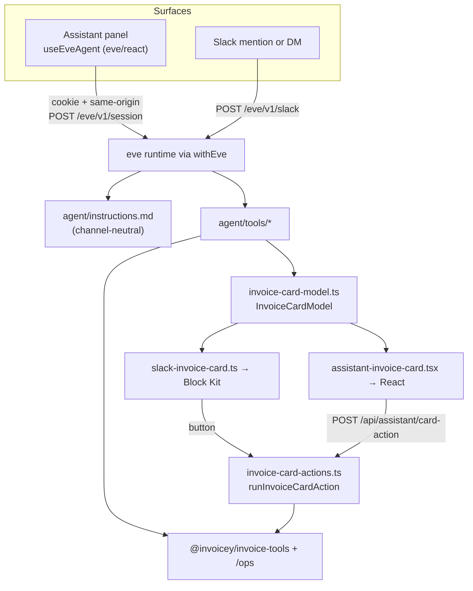

# In-app assistant panel

The Invoicey web app talks to the **same Eve agent as Slack**, over the same
`/eve/v1/*` routes, rendered as a chat panel instead of a Slack thread. There is
one agent, one instruction set, one tool set and one HITL protocol; only the
rendering differs.

This replaces the one-shot "AI draft" page (`/invoices/ai` → `POST /api/ai/invoice`),
which ran its own short system prompt and three inlined tools, could not ask a
follow-up question, and had no approvals.

## Architecture

| Piece             | Location                                                                       |
| ----------------- | ------------------------------------------------------------------------------ |
| Panel + session   | `apps/web/components/assistant/` (`assistant-provider.tsx` owns `useEveAgent`) |
| Browser auth      | `agent/lib/web-identity.ts` → `browserSession()` in `agent/channels/eve.ts`    |
| Session lookup    | `packages/db/src/web-sessions.ts` — `resolveWebSessionPrincipal`               |
| Shared card model | `agent/lib/invoice-card-model.ts`                                              |
| Shared actions    | `agent/lib/invoice-card-actions.ts` — `runInvoiceCardAction`                   |
| Web card route    | `app/api/assistant/card-action/route.ts`                                       |
| Balance refresh   | `app/api/assistant/balance/route.ts`                                           |

## What is shared, and why

Three things had to be shared or the two surfaces would drift apart:

1. **Instructions.** `agent/instructions.md` no longer says "Slack". The
   ask-don't-guess table, the draft → review → issue loop and the issuer policy
   are stated once and hold everywhere.
2. **The card.** `buildInvoiceCardModel` returns a serializable
   `InvoiceCardModel` — fields, `assumed` tags, assumptions, lifecycle state.
   Slack renders it as Block Kit, the panel as React. Neither re-derives it.
3. **The card's controls.** `runInvoiceCardAction` is what a click _does_:
   issue, mark paid, send, discard, and the due/currency/VAT/language patches.
   Slack's `onInteraction` handler and the web route are both thin adapters over
   it. The model is in neither loop — a click on a card that already shows
   number, client and total is more specific consent than a sentence the model
   would have to re-interpret, and it costs no tokens and no turn.

## Browser authentication

The Eve runtime is its own service: it has no `next/headers` and cannot use
`lib/auth/session.ts` (which is `server-only`). `browserSession()` therefore
resolves the Better Auth cookie itself:

1. Require a same-origin browser. Cookie auth is ambient, so this is what
   stops a cross-site request from driving the agent as a signed-in user.
   Accept `Sec-Fetch-Site: same-origin` (Eve's GET stream often has no
   `Origin`) or a matching `Origin`. Requests with neither fall through to
   the bearer strategies.
2. Verify the cookie's HMAC (standard base64 of
   `HMAC-SHA256(BETTER_AUTH_SECRET, token)`, matching Better Auth
   `makeSignature` on `session_token` — not the base64url-nopad used on the
   session-data cache cookie), then look the token up with
   `resolveWebSessionPrincipal` — unexpired session, then a re-checked
   membership in `session.activeOrganizationId`. The signature check is defence
   in depth: the token _is_ the credential, so a forged signature cannot conjure
   a session, but a tampered cookie is rejected before it reaches the database.
   A runtime with no `BETTER_AUTH_SECRET` skips the check (warning once) rather
   than locking every browser session out over a missing env var.
3. Return a principal carrying `{ workspaceId, userId, surface: "web" }`.
   `tool-workspace.ts` already reads those attributes for non-Slack sessions, so
   every tool binds to the right workspace with no further wiring.

A signed-in user whose session has no workspace gets an explicit
`no_workspace` 401 rather than falling through to a bare "unauthorized".

Eve session and stream fetches send a BotID token (`instrumentation-client.ts`).
Without it, Vercel Security Checkpoint can return an HTML interstitial as the
POST body; the panel maps that to a short "blocked" message instead of dumping
the page source.

## Metering

`hooks/ai-token-usage.ts` reads the product off the session principal:
`isWebSession()` → `product: "web"`, everything else → `"slack"`. Settings →
Usage keeps its per-product split, and the panel re-reads the balance from
`/api/assistant/balance` when a turn settles (the Eve stream carries no token
accounting).

## Surface differences

These are the only intentional ones:

| Behavior     | Slack                                  | Panel                                                     |
| ------------ | -------------------------------------- | --------------------------------------------------------- |
| Progress     | Thinking Steps block (label + snippet) | Quiet past-tense step rows; failures still show a snippet |
| PDF / ISDOC  | `upload_invoice_files` into thread     | Card links to `/api/invoices/[id]/pdf`                    |
| Page context | —                                      | Route + invoice id sent as `clientContext`                |

The card's own strings (field labels, `Regular · domestic`, `in 30 days`) come
from the shared model and are English on both surfaces. Localizing them for the
Czech web UI means localizing the model, which changes Slack too — deliberately
left alone for now.

### Layering

The panel sits at `z-50`. It renders after the shell, so at equal z-index it
covers the sticky app header, while portalled popups (selects, tooltips) mount
at the end of `body` and still open above the panel. Raising the panel higher
buries its own dropdowns.

`upload_invoice_files` is resolved with `defineDynamic` and is only exposed to
Slack sessions, so the panel's model never sees a tool it cannot use.

## Session persistence

Eve stores the conversation durably (session cursor + event stream, 30 days by
default). The panel keeps a **local index** of those threads so the user can
reopen them:

- `localStorage` key `invoicey.assistant.threads.v2.<workspaceId>` — list of
  `{ id, title, updatedAt, events, session }` plus `activeId`.
- The v1 single-thread key (`invoicey.assistant.<workspaceId>`) is migrated on
  first read and then removed.
- History is per device. Eve has no list-sessions HTTP API, so a new browser
  cannot see older threads even though the server still holds them.

"New conversation" remounts `useEveAgent` without a cursor. The draft is not
written until the first turn finishes.

## Context budget

`agent/agent.ts` sets `limits.maxInputTokensPerSession` to 256_000 (keep in
lockstep with `ASSISTANT_CONTEXT_LIMIT_TOKENS`). Eve's cap is a **running sum
of every model call's input**, not the latest window fill — the panel sums
every `step.completed` usage the same way. Showing only the last step made the
bar sit at ~14k while Eve parked the turn. Once the sum is full the composer
is replaced with a "start a new conversation" note. Eve also parks a HITL
turn at the cap; the panel replaces Eve's "defective session" copy with
Continue / New conversation. Compaction still runs at 75% of the model window.

### Restored cards can lag the database

A card rendered from a restored event log replays the tool output as it was when
the turn ran, so an invoice changed afterwards (by a card control before the
reload, by the Slack card, or in the app) shows its older values until the agent
touches it again. The card's `Otevřít fakturu` link is the authoritative view.
Slack does not have this: it edits the one card message in place, so the thread
only ever holds current state. Fixing it here would mean re-fetching every
visible card's model on mount.

## MCP

MCP is not a conversational surface, so there is no chat loop to mirror. It
already shares the tool layer through `@invoicey/invoice-tools`, and its host
(Cursor, Claude) supplies the approval prompt natively, so the irreversible
tools are gated there. `create_invoice` already returns `assumptions`.

What it does not have is the card: the result is the raw handler payload rather
than `InvoiceCardModel`. Closing that means hoisting `invoice-card-model.ts` out
of `apps/web/agent/lib/` into `@invoicey/invoice-tools` so all three surfaces
build the same summary. Worth doing, but it is a refactor of the shared package,
not an addition.
