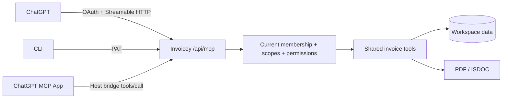

# Invoicey MCP and ChatGPT integration

## Delivery contract

Invoicey's existing Vercel app serves authenticated Streamable HTTP MCP at `/api/mcp`. Existing PAT and operations-key clients remain supported. ChatGPT uses OAuth authorization code with S256 PKCE, workspace consent, expiring tokens and revocation. Access follows current membership, permissions, entitlements and workspace freeze rules.

The integration supports invoice discovery, invoice detail and artifacts, ARES lookup, draft creation and review, explicit issuing, explicit email sending and payment recording. Historical import and recurring automation remain web-only. Issuers are resolved server-side; tools never accept a caller-selected tenant or fabricated issuer.

ChatGPT gets a native-styled invoice workspace, inline invoice review, navigation entrypoint, invoice mentions and model context. All tools remain useful without UI. Controls call the same authorized tools. Destructive and external effects require an explicit user action and appropriate tool annotations.

## Phases and acceptance

- [ ] MCP: typed inputs, structured outputs, annotations, permissions, paging, resources, prompts and protocol tests.
- [ ] Authorization: OAuth discovery, consent, workspace binding, renewal, revocation and cross-tenant denial tests.
- [ ] ChatGPT: extension registration, bundled native UI, loading/error/empty states, invoice actions, accessibility and responsive browser checks.
- [ ] Distribution: validated portable plugin package, private connection, host rendering and real tool verification.
- [ ] Web: Czech/English feature presentation and accurate setup/revocation guide after integration validation.
- [ ] Release: typecheck, lint, tests, build, diff review, deployment readiness and production smoke checks.

## Boundaries

Public directory approval is an external review, distinct from deployment and private installation. Report actual host verification separately from a simulated MCP host. Never claim listing availability or successful email delivery without evidence. Testing uses isolated fixtures; no customer invoices are issued or emailed as smoke tests.

## Architecture

## Private plugin

Private package: `plugins/invoicey`. Created plugin ID: `plugins_6abe92279bfc8191aaff5cd11904f96e`.
Release: `pluginrel_6abe9228d1b081919714e73ab0c6bd75`.
[Open Invoicey plugin](https://chatgpt.com/plugins/plugins_6abe92279bfc8191aaff5cd11904f96e).
Saving the package is verified; connecting it and rendering inside the actual host remains a separate acceptance step.

## Deployment

The reviewed additive SQL is `packages/db/sql/2026-10-01-mcp-oauth.sql`. It preserves legacy OAuth and PAT tables.
The deployment build runs the migration only when `INVOICEY_APPLY_MCP_OAUTH=1` is supplied for that deployment.
It uses the database connection already stored in Vercel, without exporting credentials locally, and applies DDL in a transaction.
A partial existing schema aborts; an already applied schema is skipped. Regular builds do not migrate.

After a READY deployment, check discovery and 401 challenges, connect the private plugin through the user's OAuth consent,
then verify read-only invoice discovery and native rendering. Exercise mutating workflows only with explicitly disposable test invoices.

The homepage feature card is enabled only by `INVOICEY_CHATGPT_LAUNCH=1` after actual-host acceptance. The setup guide and connection management ship with the backend.
