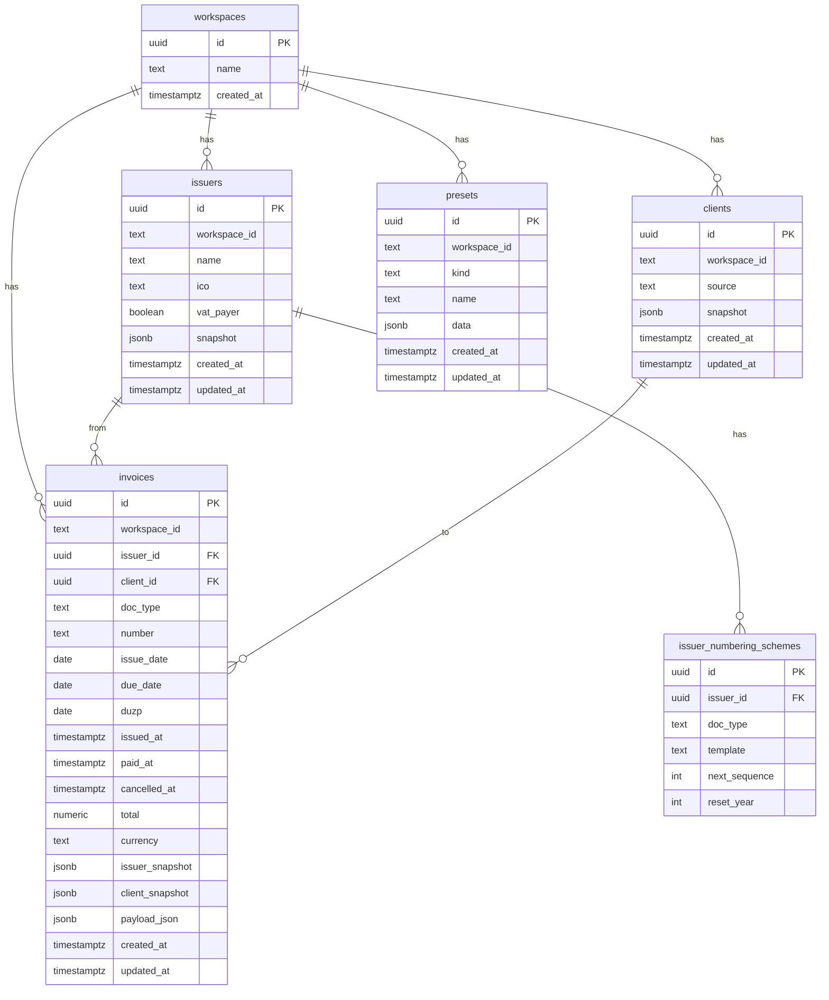

# Database schema — durable foundation

## Goal

Neon Postgres tables for workspaces, issuers, clients, invoices, and MCP/Slack presets. Single-tenant via `INVOICEY_DEFAULT_WORKSPACE_ID` (default `00000000-0000-4000-8000-000000000001`) until Plan 14 (Clerk).

Package entry points: `@invoicey/db` (schema + repos + `tryCreateDbFromEnv`), `@invoicey/db/client` (eager `db` with `@invoicey/env` validation for Next.js).

## ERD

## Tables

| Table | Package | Notes |
| --- | --- | --- |
| `workspaces` | `@invoicey/db` | Seeded when workspace id is a UUID |
| `issuers` | `@invoicey/db` | Live issuer; unique `(workspace_id, ico)` |
| `issuer_numbering_schemes` | `@invoicey/db` | Plan 5 numbering; unique `(issuer_id, doc_type)` |
| `clients` | `@invoicey/db` | Plan 4 (unchanged shape) |
| `invoices` | `@invoicey/db` | Drafts have `issued_at` null; status derived (ADR 0014); unique `(workspace_id, number)` |
| `presets` | `@invoicey/db` | `kind` = `issuer` \| `invoice_template`; unique `(workspace_id, kind, name)` |

## Backend selection (presets)

| Condition | Store |
| --- | --- |
| `DATABASE_URL` set and no `path` override | Neon `presets` |
| `INVOICEY_PRESETS_BACKEND=file` or explicit `path` | JSON file (`INVOICEY_PRESETS_PATH` / `~/.invoicey/presets.json`) |

`create_invoice` persists a draft invoice row when `DATABASE_URL` is set.

## References

- ADR 0007 workspace-scoped data, 0008 snapshots, 0009 Neon+Drizzle, 0014 derived status
- Schema: [`packages/db/src/schema.ts`](../../packages/db/src/schema.ts)
