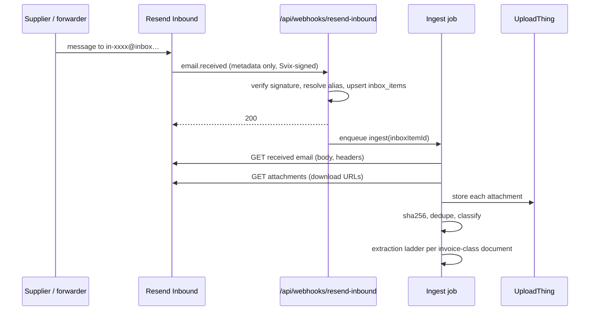

# Inbound email capture

**Plan:** [24b](../../.cursor/plans/plan-24-incoming-invoices.md) ·
**ADR:** [0032](../decisions/0032-inbound-email-capture-resend.md) ·
**Parent spec:** [incoming invoices](./incoming-invoices.md)

How a supplier's email becomes an `inbox_items` row with stored, hashed
documents. Everything downstream of `inbox_items` is capture-agnostic by
construction. Resend Inbound is the first `InboundCaptureAdapter` (ADR 0032,
ADR 0034); ingest fetches body and attachments through that adapter, not the
Resend API directly.

## Address model

```text
in-<22 chars base32>@inbox.invoicey.ditrich.me
```

- One primary alias per workspace, created on first visit to the settings page.
- Optional additional aliases pin an `issuer_id`, which resolves the receiving
  entity before anything is parsed — the cheapest possible multi-entity routing.
- The local part is random and unguessable; it is a bearer capability and is
  presented as such: copy button, warning, and a **rotate** action that
  immediately deactivates the previous address (kept as a row for audit).
- Mail to an unknown or deactivated alias is accepted by Resend and dropped by
  us with a counter; no bounce is generated, and nothing is stored.

## DNS and provider setup

Operator steps, required before the feature can be enabled in an environment:

1. Add the receiving domain `inbox.invoicey.ditrich.me` in Resend.
2. Add the MX record on that **subdomain** with priority `10`. It must be the
   lowest priority value on that name. The apex domain keeps its existing mail
   configuration untouched.
3. Create a webhook subscribed to `email.received` pointing at
   `/api/webhooks/resend-inbound`, and put its signing secret in
   `RESEND_INBOUND_WEBHOOK_SECRET` (distinct from `RESEND_WEBHOOK_SECRET`, which
   stays on the delivery-events webhook).
4. Set `INVOICEY_INBOUND_EMAIL_DOMAIN`.

## Ingestion flow



### Webhook route

`apps/web/app/api/webhooks/resend-inbound/route.ts`, Node runtime, mirroring the
existing Resend webhook route:

1. Read the raw body; verify `svix-id` / `svix-timestamp` / `svix-signature`
   with `RESEND_INBOUND_WEBHOOK_SECRET`. Invalid signature → `400`, nothing
   stored.
2. Resolve `received_for` (or the first recipient) to an active `inbox_aliases`
   row. Unknown alias → `200` with `{ ignored: "unknown_alias" }` so Resend does
   not retry.
3. Enforce the per-workspace daily message cap. Over limit → an `inbox_items`
   row with `status = 'rejected'`, `error_code = 'rate_limited'`, and `200`.
4. Insert `inbox_items` with `on conflict (workspace_id, provider_message_id) do
nothing`, status `received`.
5. Enqueue the ingest job and return `200`. The handler does no network I/O to
   Resend and no file work — webhook timeouts must never depend on attachment
   size.

The webhook is the only place the signature is checked, and it never trusts
anything in the payload beyond routing.

### Ingest job

Runs as a Vercel function invoked by the webhook (fire-and-forget with an
idempotent body) and, as a safety net, by a cron sweep that picks up
`inbox_items` stuck in `received` or `processing` past a timeout.

Per item:

1. `GET` the received email for body text and headers; store a truncated
   `body_text` and the SPF/DKIM/DMARC verdicts in `auth_results`.
2. If the message looks forwarded, parse a `From:` line out of the body into
   `parsed_original_from`. Display and classification hint only.
3. For each attachment: fetch via its download URL, enforce the per-attachment
   byte cap and an allow-list of MIME types (`application/pdf`,
   `application/xml`, `text/xml`, `application/zip` for `.isdocx`, common image
   types), compute `sha256`.
4. Skip inline images below a small threshold and anything matching known
   signature-logo patterns.
5. Deduplicate on `(workspace_id, sha256)`. An existing document is re-linked to
   this inbox item rather than stored twice, and if it already belongs to an
   incoming invoice, the item is marked as a duplicate delivery of that invoice.
6. Upload to UploadThing server-side and insert `incoming_documents`.
7. Classify, then run the extraction ladder for invoice-class documents.
8. Set the item to `processed`, or `no_invoice` when nothing classified as an
   invoice, or `failed` with an `error_code`.

Every step is idempotent. Re-running the job for an item must converge, never
duplicate.

## Classification

Deterministic first, model only for the remainder.

| Signal                                                          | Class                                                                                  |
| --------------------------------------------------------------- | -------------------------------------------------------------------------------------- |
| `.isdoc` / `.isdocx`, or a PDF with an embedded `invoice.isdoc` | `invoice` (or `credit_note` from the ISDOC document type)                              |
| Filename or subject matching proforma / zálohová patterns       | `proforma`                                                                             |
| Matching upomínka / reminder / penalty patterns                 | `reminder`                                                                             |
| Matching výpis / statement patterns                             | `statement`                                                                            |
| Zero attachments                                                | item is `no_invoice`; body kept                                                        |
| Everything else                                                 | AI classifier over the first page plus subject, returning one class from the fixed set |

The AI classifier is a small, cheap call metered like extraction. It returns one
of the enumerated classes and never invents a new one. Anything it is unsure
about becomes `unknown`, which appears in the inbox for a human to classify — an
`unknown` never silently becomes an invoice.

A user can reclassify any document from the inbox; a document reclassified to
`invoice` enters the extraction ladder immediately.

## Manual upload

`/incoming-invoices/upload` produces exactly the same records: one
`inbox_items` row with `source = 'upload'`, one `incoming_documents` row per
file, then the identical classify-and-extract path. There is no second code
path for uploads, and no capability that exists for one source only.

Upload goes through a new UploadThing route (`incomingInvoiceDocument`) with the
same MIME allow-list, a per-file cap, and the standard authed middleware.

## Limits and abuse

| Limit                            | Default        | Enforced                                |
| -------------------------------- | -------------- | --------------------------------------- |
| Messages per workspace per day   | 200            | Webhook, before insert                  |
| Attachments per message          | 20             | Ingest job                              |
| Bytes per attachment             | 20 MB          | Ingest job, before upload               |
| Total stored bytes per workspace | plan-dependent | Ingest job, soft warning then hard stop |

Over-limit events are recorded as visible inbox items with an error code. Losing
an invoice silently is worse than showing a rejection.

## Failure modes

| Failure                              | Behaviour                                                                                                               |
| ------------------------------------ | ----------------------------------------------------------------------------------------------------------------------- |
| Signature invalid                    | `400`, nothing stored, counted                                                                                          |
| Unknown or rotated alias             | `200` ignored, counter incremented                                                                                      |
| Resend API unavailable during ingest | Item stays `processing`; the cron sweep retries with backoff; after N attempts → `failed` with a retry action in the UI |
| Attachment download URL expired      | Re-fetch the attachment list, then retry once; then `failed`                                                            |
| Attachment over cap                  | Item processed, document recorded as rejected with its name and size so the user knows what to upload manually          |
| Duplicate delivery                   | Idempotent no-op; the UI shows "already received" against the existing invoice                                          |
| Workspace out of AI tokens           | Documents stored and classified deterministically; extraction `skipped` with a prompt                                   |

## Testing

- Signature verification: valid, tampered, missing headers, replayed id.
- Alias resolution: active, rotated, unknown, issuer-pinned.
- Idempotency: the same `email_id` twice; the same `sha256` from two messages.
- Attachment handling: over-cap, disallowed MIME, zero attachments,
  `.isdocx` zip, a PDF with an embedded ISDOC.
- Forward parsing: a Gmail-style forward, an Outlook-style forward, and a direct
  send that must not be mis-parsed.
- Limits: daily cap boundary; per-message attachment cap.
- The Resend API is faked at the HTTP boundary; no test performs a live call.

Fixtures are synthetic. No real supplier message, address, or account number
enters the repository.

## References

- [Resend — receiving emails](https://resend.com/docs/dashboard/receiving/introduction)
- [Email spec](./email.md) — outbound side and the existing webhook route
- [ADR 0034](../decisions/0034-email-transport-adapters.md) — `InboundCaptureAdapter` seam
- [Uploads spec](./uploads.md)
