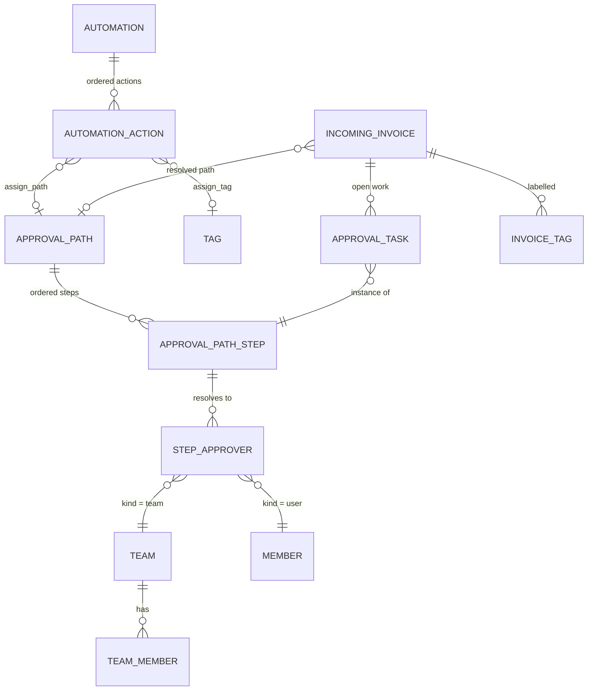
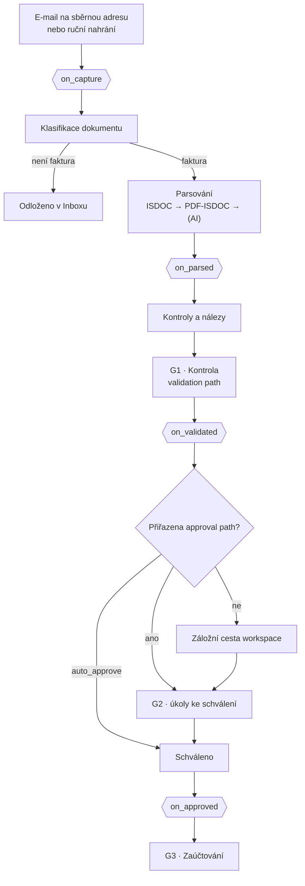
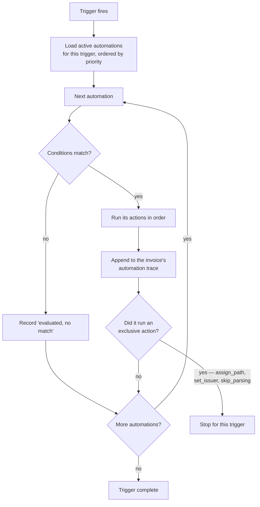
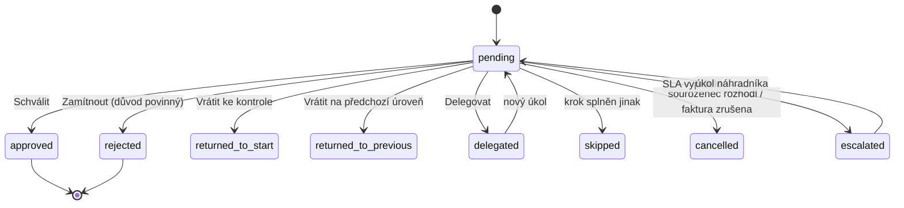

# Workflow paths and automations

**Plan:** [25](../../.cursor/plans/plan-25-payables-lifecycle.md) ·
**Parent:** [payables lifecycle](./payables-lifecycle.md) ·
**Supersedes:** the `approval_rules` section of
[incoming invoices](./incoming-invoices.md) ·
**Companions:** [invoice checks](./invoice-checks.md),
[accounting layer](./accounting-layer.md)

This spec redesigns the routing layer shared by **G1 (kontrola)** and
**G2 (schválení)**: how work is assigned, who acts on it, how the customer
configures that routing, and how the product explains itself while doing so.

The two gates use one mechanism. A **path** carries a `stage` — `validation` or
`approval` — and everything below applies to both. A workspace with one
accountant and no validation path gets a single-action G1; a workspace with a
junior and a chief accountant configures a two-step validation path. Nothing in
the model changes between those cases.

Segment: **mid-market**. Departments, several issuers, multi-level paths, teams
as the unit of substitution. Cost centres appear as a tagging dimension; budgets
are out of scope.

---

## 1. Why this exists

The engine shipped in plan 24 evaluates conditions and produces paths. The
product around it does not let anyone use that.

| What the engine can do                         | What the UI exposes               |
| ---------------------------------------------- | --------------------------------- |
| 13 facts × 10 operators                        | one fact: `currency`              |
| `auto_approve`, `one_of`, `all_of`, `sequence` | `auto_approve` or "require admin" |
| Named users and roles as approvers             | no approver picker at all         |
| Multi-step sequences                           | none                              |
| Rule editing (the action supports `id`)        | no edit UI — create only          |

Three structural problems sit underneath that, and no amount of form-building
fixes them:

1. **Paths are not objects.** A path exists only as JSON inlined in the rule
   that produced it. It cannot be named, reused across rules, or assigned to a
   single invoice by hand. "Send this one to Jana as well" is unrepresentable.
2. **Routing is the only outcome.** A rule can decide who approves, and nothing
   else. It cannot tag, cannot pre-fill, cannot grant access, cannot skip AI
   extraction on a document that is obviously not an invoice.
3. **Rules fire once.** Evaluation happens at accept. Anything that should
   happen at capture — pin the issuer, tag by sender, refuse to spend tokens on
   a newsletter — has nowhere to live.

Two defects to fix in passing:

- `approval_rules` carries `UNIQUE (workspace_id, priority)` while the form
  hardcodes `defaultValue={100}`; the second rule a workspace creates throws an
  unhandled database error.
- `decideIncomingApprovalAction` fabricates an `assigneeRole: "admin"` task when
  it finds none pending, which routes around whatever path the rule produced.

---

## 2. Concept model

Four nouns replace one.

| Noun                                    | Definition                                                                                    | Owned by |
| --------------------------------------- | --------------------------------------------------------------------------------------------- | -------- |
| **Workflow path** (_schvalovací cesta_) | A named, ordered list of steps with a `stage`. Reusable. Assignable by automation or by hand. | admin    |
| **Automation** (_automatizace_)         | `when <conditions> then <actions>`, bound to a trigger point.                                 | admin    |
| **Team** (_tým_)                        | A named set of members, usable anywhere an approver is named.                                 | admin    |
| **Tag** (_štítek_)                      | A free-form label on an invoice. Set by hand or by automation. Filterable.                    | member   |



The separation is what makes the product legible: an automation answers _which
path_, a path answers _who and in what order_. Users think in those two
questions separately, and today we force them into one form.

---

## 3. Pipeline and trigger points

Automations fire at four moments, not one. Three of them are new.



What each trigger is for:

| Trigger        | Facts available                                                           | Typical use                                                                                                   |
| -------------- | ------------------------------------------------------------------------- | ------------------------------------------------------------------------------------------------------------- |
| `on_capture`   | sender, sender domain, alias, subject, filename, auth results             | Pin the issuer. Tag by sender. Skip parsing for a known newsletter sender. Assign a **validation** path.      |
| `on_parsed`    | + all invoice fields, supplier, findings, confidence                      | Prefill the accounting layer. Change doc type. Tag by amount band or line text. Assign a **validation** path. |
| `on_validated` | + validated-by, resolved supplier, confirmed account, resolved dimensions | Assign the **approval** path. Grant access. Escalate on findings.                                             |
| `on_approved`  | + approver decisions                                                      | Tag. Notify. (Accounting export is not an automation — it is gate G3.)                                        |

`assign_path` targeting a **validation** path is valid on `on_capture` and
`on_parsed`; targeting an **approval** path it is valid only on `on_validated`.
`skip_parsing` is valid only on `on_capture`. The builder filters the action list
by trigger rather than validating after the fact.

---

## 4. Automations

### 4.1 Conditions — v2, OR of ANDs

```jsonc
{
  "version": 2,
  "any": [
    {
      "all": [
        {
          "fact": "supplier_ico",
          "op": "in",
          "value": ["12345678", "87654321"],
        },
        { "fact": "currency", "op": "eq", "value": "CZK" },
        { "fact": "total", "op": "gt", "value": "50000" },
      ],
    },
    { "all": [{ "fact": "tag", "op": "contains", "value": "marketing" }] },
  ],
}
```

An empty `any` matches everything (an unconditional automation is legitimate —
"tag everything from this alias"). v1 `{ version: 1, all: [...] }` reads as
`{ version: 2, any: [{ all: [...] }] }`; the migration rewrites rows in place
and the parser keeps accepting v1 for one release.

**Facts.** The plan-24 set, plus: `tag`, `sender_address`, `alias_id`,
`subject`, `file_name`, `issuer_id`, `payment_method`, `due_in_days`,
`line_count`, `supplier_country`, `is_vat_reliable`, `exception_code`.

**Operators.** Unchanged: `eq`, `ne`, `gt`, `gte`, `lt`, `lte`, `in`, `not_in`,
`contains`, `is`. The currency guard stays — comparing `total` without pinning
`currency` is refused at save time, in the same AND block.

### 4.2 Actions

Ordered; all actions of the winning automation run. Two automations may both
match — see 4.3.

| Action                  | Config                              | Triggers                    |
| ----------------------- | ----------------------------------- | --------------------------- |
| `assign_path`           | `path_id`                           | by path stage, see above    |
| `assign_tag`            | `tag_id[]`                          | all                         |
| `remove_tag`            | `tag_id[]`                          | all                         |
| `set_document_type`     | `doc_type`                          | `on_capture`, `on_parsed`   |
| `set_issuer`            | `issuer_id`                         | `on_capture`                |
| `grant_access`          | `user_id[]`, `team_id[]`            | all                         |
| `set_description`       | template string with `{field}` refs | `on_parsed`, `on_validated` |
| `prefill_fields`        | `{ field: value }`                  | `on_parsed`                 |
| `prefill_accounting`    | `{ dimension: item_id }`            | `on_parsed`                 |
| `skip_parsing`          | —                                   | `on_capture`                |
| `require_manual_review` | `reason`                            | `on_parsed`                 |
| `notify`                | `user_id[]`, `team_id[]`, `message` | all                         |

### 4.3 Evaluation



The rule is: **additive actions accumulate across all matching automations;
exclusive actions stop evaluation.** Three automations can each add a tag; only
the first to assign a path assigns it. This is the behaviour customers expect
from "štítkuj podle dodavatele" and "velké nákupy schvaluje CFO" coexisting, and
it is why plain first-match-wins is the wrong default.

**Priority is a list position, not a number the user types.** Automations are
reordered by drag-and-drop; the server rewrites contiguous positions in one
transaction. This also disposes of the `UNIQUE (workspace_id, priority)`
collision.

---

## 5. Workflow paths

### 5.1 Structure

A path is an ordered list of steps with a `stage` (`validation` | `approval`).
Each step has a mode and a set of assignees. "Approver" below means the person a
step is assigned to, at either stage — at G1 they are checking data, at G2 they
are authorising spend, and the machinery is identical.

| Step mode | CZ            | Completes when             |
| --------- | ------------- | -------------------------- |
| `any_one` | kdokoliv z    | the first approver decides |
| `all_of`  | všichni z     | every approver has decided |
| `quorum`  | alespoň _n_ z | _n_ approvals collected    |

An approver reference is one of:

| Kind      | Resolves to                                     | Notes                                        |
| --------- | ----------------------------------------------- | -------------------------------------------- |
| `user`    | one member                                      | brittle — the UI nudges toward `team`        |
| `team`    | every current member of the team                | substitution = edit the team, never the path |
| `role`    | every member at or above `owner`/`admin`        | coarse; kept for the fallback path           |
| `dynamic` | `supplier_owner`, `issuer_owner`, `uploaded_by` | resolved per invoice at task-creation time   |

Teams are the point. wflow's own guidance is to route to _Finance_, not to Jana,
so that a holiday is a membership edit rather than a workflow edit. Our current
model has no unit between "one named user" and "everyone with the admin role",
and that gap is why paths feel unusable at any real headcount.

### 5.2 Path-level settings

- **Reminder after _n_ days** on a pending step.
- **Escalation after _n_ days** → named approver or the fallback path.
- **Four-eyes**: the accepting user is stripped from every step. On by default,
  overridable per path with a written justification stored on the path.
- **Skip if already approved by** a user who decided at an earlier step.

### 5.3 Guardrails

Enforced at evaluation, never as advice the user must remember to write:

| Guardrail                                 | Effect                                                                      |
| ----------------------------------------- | --------------------------------------------------------------------------- |
| New beneficiary account                   | `auto_approve` is refused; the path runs                                    |
| Any open exception                        | `auto_approve` is refused                                                   |
| `extraction_source = ai` + low confidence | `auto_approve` is refused                                                   |
| Step resolves to zero approvers           | Step escalates to the fallback path; `approval.step_unreachable` logged     |
| Validator is the only approver            | Step escalates; four-eyes is never satisfiable by the validating accountant |
| `auto_approve` without a cap              | Refused at save                                                             |

Every refusal is surfaced on the invoice, not just logged — see §8.

---

## 6. Tasks and approver actions



Actions available to an approver, and what each does:

| Action                         | Effect                                                                                                                                                                                                                              |
| ------------------------------ | ----------------------------------------------------------------------------------------------------------------------------------------------------------------------------------------------------------------------------------- |
| **Schválit**                   | Step advances. Optional comment.                                                                                                                                                                                                    |
| **Zamítnout**                  | Invoice → `rejected`. Comment mandatory. All open tasks cancelled. Offers **Odpovědět dodavateli**; a corrected invoice arriving later links back through `supersedes_id` — see [payables lifecycle](./payables-lifecycle.md) §5.3. |
| **Vrátit ke kontrole**         | Invoice → `needs_validation`. Tasks cancelled. On the next validation, `on_validated` re-evaluates.                                                                                                                                 |
| **Vrátit na předchozí úroveň** | Re-opens step _n−1_. The returner must approve again afterwards — the path does not skip them.                                                                                                                                      |
| **Delegovat**                  | Creates a task for another member; the original is `delegated`, and the trail names both.                                                                                                                                           |
| **Komentář s @zmínkou**        | No state change. Notifies the mentioned member.                                                                                                                                                                                     |

Bulk approve from any list view, over the selection, with a confirmation
summarising totals per supplier.

**Line-item approval** is out of scope for v1, but `approval_tasks` gains a
nullable `line_id` now so that adding it later is not a migration of live
approval data. Note that line-level _accounting_ — předkontace and středisko per
line — ships in this epic regardless; it is an
[accounting layer](./accounting-layer.md) concern, not an approval one.

---

## 7. Tags, views, and the list surface

### 7.1 Tags

Free-form, workspace-scoped, shared across incoming and issued invoices. Created
inline by typing. Deleted automatically when the last usage goes. Colour is
optional and assigned from a fixed palette — not free hex, so lists stay
readable. Bulk **add tags** / **remove tags** from any selection.

### 7.2 Views

The four hardcoded tabs become **system views**, and users add their own on top
of the same filter model.

| System view   | CZ                | Definition                                      |
| ------------- | ----------------- | ----------------------------------------------- |
| Needs review  | Ke zpracování     | `status in (needs_review, extract_failed)`      |
| My approvals  | Moje schválení    | open task assigned to me                        |
| All approvals | Všechna schválení | `status = pending_approval` — visibility-scoped |
| To pay        | K zaplacení       | `approved` and outstanding                      |
| Everything    | Vše               | no filter                                       |

A custom view is a name, an icon, a filter expression, and a
**show count badge** toggle. Views with the badge on appear in the sidebar with
a live count; one view can be set as the workspace or personal landing screen.

### 7.3 The list itself

Replace the hand-rolled table in `incoming-invoice-queue.tsx` with the ReUI Data
Grid already used by invoices and clients, as plan 24 specified: column
selection, sort, sticky selection bar, saved column layouts, tags column,
validation column showing error/warning counts.

---

## 8. Making it legible

This is the part that decides whether the feature feels like a product. Three
surfaces, each answering a question a user actually asks.

### "Which rule caught this?" — the automation trace

On the invoice detail, a panel listing every automation evaluated at every
trigger: matched or not, which condition failed first, which actions ran, and
which guardrail overrode the result. Not a log dump — a readable sentence per
entry, with the rule name linking to its editor.

### "Where is it now?" — the approval timeline

A stepper: completed steps with who and when, the current step with its pending
approvers and elapsed time, future steps greyed. Comments inline at the step
they were made. Reminder and escalation timers shown as what they are — "escalates
to Owner in 2 days".

### "What's wrong with it?" — validation cards

The 13 exception codes gain a **severity**: `warning` (yellow, passable) or
`error` (red, blocks accept), configurable per workspace for the codes where
that's a policy question rather than a fact. Each renders as a card naming the
problem in plain Czech with a **Vyřešit** button that scrolls to and focuses the
offending field. Today these are inert badges, which tells a user something is
wrong and nothing about what to do.

### And in the builder itself

- **Live match preview**: as conditions are edited, "matches 14 of your last 100
  invoices", with the list one click away.
- **Test against an invoice**: pick a real invoice, see the full evaluation —
  every fact's actual value, every condition's verdict, the resulting path.
- **Path preview**: the resolved step list with real names, and a warning when a
  step would currently resolve to zero people.
- **Conflict warning**: when a new automation would be shadowed by an earlier
  one, say so at save time.

---

## 9. Screens

| Route                            | Purpose                                                           |
| -------------------------------- | ----------------------------------------------------------------- |
| `/incoming-invoices`             | Data grid + system and custom views + tag filters + bulk actions  |
| `/incoming-invoices/[id]`        | Two-pane review; timeline, trace, validation cards, tags          |
| `/incoming-invoices/[id]/review` | Focused gate-1 mode: document left, fields right, keyboard-driven |
| `/incoming-invoices/approvals`   | All approvals — org-wide status board                             |
| `/settings/workflow-paths`       | Path list, grouped by stage (kontrola / schválení)                |
| `/settings/workflow-paths/[id]`  | Step builder with drag-and-drop, SLA, escalation                  |
| `/settings/automations`          | Automation list grouped by trigger, drag-to-reorder               |
| `/settings/automations/[id]`     | Condition builder + action list + live preview                    |
| `/settings/teams`                | Teams and membership                                              |
| `/settings/tags`                 | Tag management, merge, colour                                     |
| `/settings/incoming-invoices`    | Aliases, fallback paths, notification defaults                    |
| `/settings/checks`               | Check catalogue — see [invoice checks](./invoice-checks.md)       |
| `/settings/accounting`           | Connection, codelists, required dimensions                        |
| `/settings/payments`             | Payment policy, pay days, bank connections                        |

The gate-1 review screen is worth calling out separately: document on the left
at readable size, fields on the right with confidence styling, `Tab` walking
only the fields that need attention, and `⌘↵` accepting. Extraction quality is
judged entirely through this screen.

---

## 10. Permissions

| Capability                                | Minimum              |
| ----------------------------------------- | -------------------- |
| View, upload, edit fields, accept, tag    | `member`             |
| Approve                                   | as named by the path |
| Create and edit personal views            | `member`             |
| Create and edit shared views              | `admin`              |
| Create and edit paths, automations, teams | `admin`              |
| Change validation severities              | `admin`              |
| Confirm a new supplier bank account       | `admin`              |
| Submit a payment run                      | `owner`              |

Automations run with system authority, not the acting user's — an automation may
grant access a member could not grant by hand. Every automation-driven mutation
records `actor = automation:<id>` in the audit trail.

---

## 11. Migration

Live data is pre-pilot, so this is cheap now and expensive after the first
customer.

1. `approval_paths` + `approval_path_steps` + `approval_path_step_approvers`.
   Every existing `approval_rules.path` becomes a generated path named after its
   rule.
2. `automations` + `automation_actions`. Every existing rule becomes an
   `on_accepted` automation with one `assign_path` action.
3. Conditions rewritten v1 → v2 in the same transaction.
4. `teams` + `team_members`, seeded empty.
5. `tags` + `invoice_tags`, seeded empty.
6. `approval_rules` dropped once `evaluateApprovalRules` no longer reads it.
7. `approval_tasks` gains `path_step_id`, `line_id` (nullable), `escalated_at`,
   `delegated_from_task_id`.

---

## 12. Sequencing

Sequencing for this spec lives in the epic plan, where it interleaves with the
accounting layer, the checks, and the Pohoda integration:
[plan 25](../../.cursor/plans/plan-25-payables-lifecycle.md). Slices **25c**
(paths and teams) and **25d** (automations, tags, views) carry this document.

## 13. Open questions

1. **Fallback path.** Today it is implicit ("admin"). Should it become a real
   path object the workspace picks in settings? _Proposed: yes, seeded at
   workspace creation as "Výchozí schválení"._
2. **Amount-banded steps inside one path** ("level 2 only if over 100k") versus
   separate paths chosen by separate automations. _Proposed: separate paths —
   conditions belong in automations, keeping paths purely structural._
3. **Cost centres.** A tag dimension, or a typed field with its own owner used by
   the `dynamic` approver kind? _Proposed: typed field in a later plan; tags now._
4. **Notification channel.** Immediate email per event, nightly digest, or both?
   wflow ships digest-only, which pilots complain about. _Proposed: per-event
   choice, defaulting to immediate for approval tasks._
5. **Where the "all approvals" board lives** — a view under incoming invoices, or
   its own top-level entry beside them.

---

## References

- [Incoming invoices](./incoming-invoices.md) — records, statuses, extraction
- [Inbound email capture](./inbound-email-capture.md)
- [Payables, payment runs, and Fio submission](./payables-payment-runs-fio.md)
- Competitive reading: wflow help centre —
  [schvalovací cesty](https://support.wflow.com/cs/articles/5960407-vytvoreni-a-prirazeni-schvalovaci-cesty),
  [automatizace schvalování](https://support.wflow.com/cs/articles/9748612-nastaveni-automatizace-schvalovani),
  [další automatizované akce](https://support.wflow.com/cs/articles/9743778-dalsi-automatizovane-akce),
  [štítkování](https://support.wflow.com/cs/articles/3563208-stitkovani-dokumentu-tagovani),
  [vlastní pohledy](https://support.wflow.com/cs/articles/9902192-nastaveni-vlastniho-prehledu-dokladu),
  [validace](https://support.wflow.com/cs/articles/5326840-validace)
