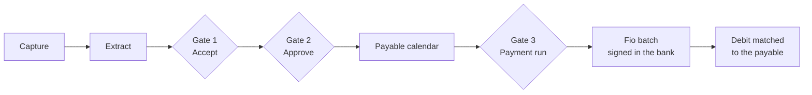
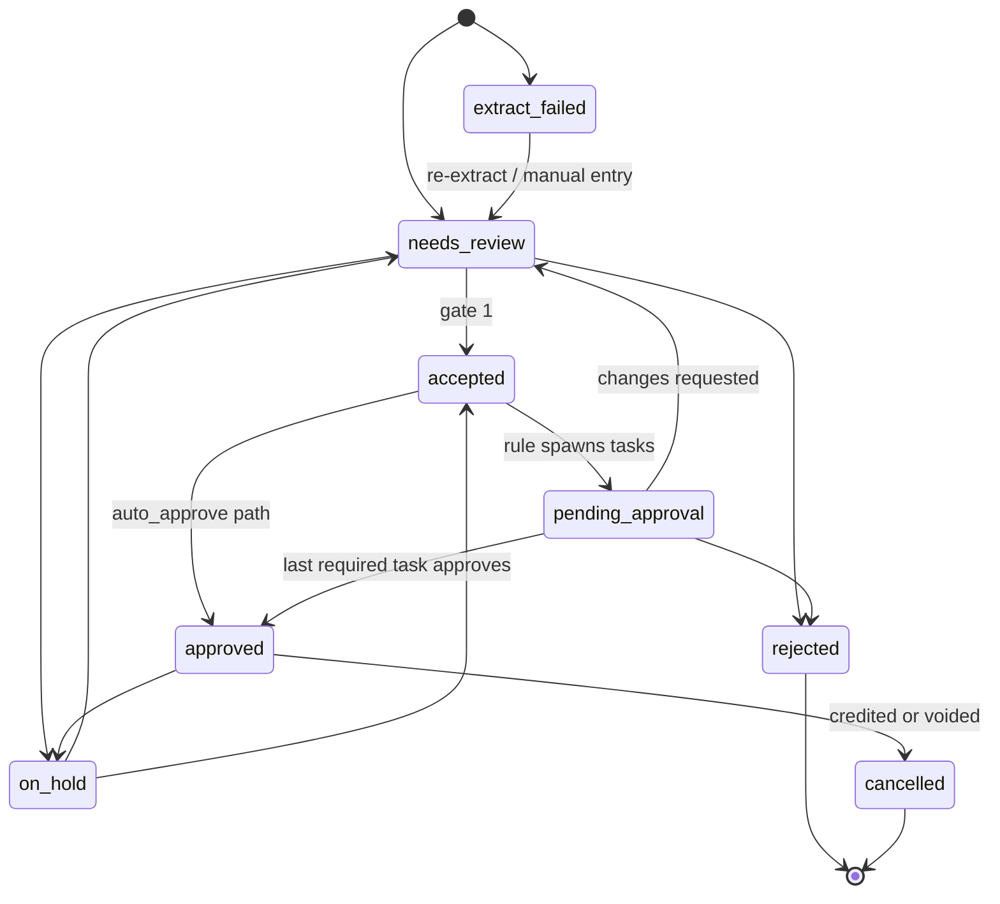
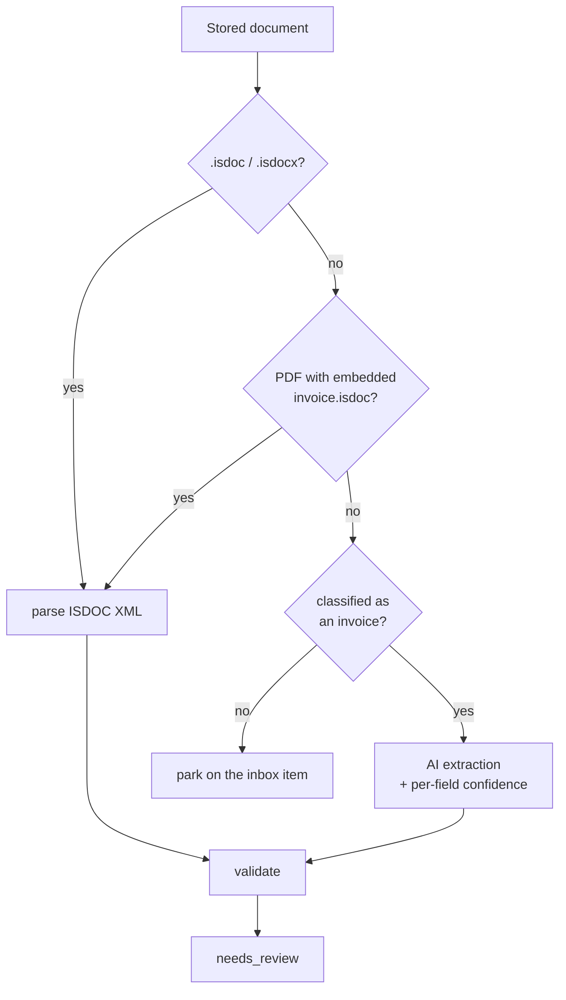

# Incoming invoices (přijaté faktury)

**Plan:** [24](../../.cursor/plans/plan-24-incoming-invoices.md) ·
**ADRs:** [0031](../decisions/0031-incoming-invoice-payable-ledger.md),
[0032](../decisions/0032-inbound-email-capture-resend.md),
[0033](../decisions/0033-fio-payment-initiation-bank-signed.md) ·
**Companions:** [inbound email capture](./inbound-email-capture.md),
[payables, payment runs, and Fio submission](./payables-payment-runs-fio.md)

This is the domain specification: records, statuses, invariants, extraction,
approval rules, and web surfaces. The two companion specs carry the capture
mechanics and the payment mechanics.

## Goal

Own the process of a supplier invoice from the moment it arrives to the moment
its payment is reconciled: collect it, read it, confirm it, authorize it, plan
its payment, submit the batch to the bank, and match the debit back.

Invoicey is the **process and evidence** of record for payables. It is not a
general ledger and does not file tax returns.

## Vocabulary

| Term                 | Meaning                                                                                      |
| -------------------- | -------------------------------------------------------------------------------------------- |
| **Incoming invoice** | A supplier tax document addressed to one of this workspace's issuers. CZ: _přijatá faktura_. |
| **Inbox item**       | One inbound email or one manual upload action. Carries 0..n documents.                       |
| **Document**         | One stored file — attachment or upload — identified by `sha256`.                             |
| **Supplier**         | A counterparty we receive invoices from, keyed by IČO where one exists. CZ: _dodavatel_.     |
| **Receiving issuer** | The `issuer_businesses` row whose IČO the invoice is addressed to.                           |
| **Accept**           | Gate 1. "The data is right."                                                                 |
| **Approve**          | Gate 2. "This cost is legitimate and may be paid."                                           |
| **Payable**          | An approved incoming invoice with an outstanding amount.                                     |
| **Payment run**      | A named batch of payables selected for submission to the bank. Gate 3.                       |

## Three gates, never collapsed



| Gate            | Question                                           | Who                                             | Effect                                                         |
| --------------- | -------------------------------------------------- | ----------------------------------------------- | -------------------------------------------------------------- |
| 1 — Accept      | Is this a real invoice and are the fields correct? | Any member                                      | Trusted record; supplier upserted; approval tasks spawned      |
| 2 — Approve     | May we owe this?                                   | Rule-selected members, or automatic under a cap | Status `approved`; enters the payable calendar                 |
| 3 — Payment run | Do we pay it in _this_ batch?                      | Admin or owner                                  | Frozen run lines; Fio batch submitted for the customer to sign |

Rules decide **who passes gate 2** and when it may pass automatically. They never
skip gate 1 on a non-ISDOC document, and they never skip gate 3.

## Records

All tables are workspace-scoped (ADR 0007). Money is `numeric(_, 2)` handled as
decimal strings, with minor-unit arithmetic in `@invoicey/payment-core`.

### `inbox_items`

One inbound message or one upload action.

| Column                      | Type                                 | Notes                                                                               |
| --------------------------- | ------------------------------------ | ----------------------------------------------------------------------------------- |
| `id`                        | `uuid` pk                            |                                                                                     |
| `workspace_id`              | `text` → `workspaces.id`             |                                                                                     |
| `source`                    | `text`                               | `email` \| `upload`                                                                 |
| `alias_id`                  | `uuid` null → `inbox_aliases.id`     | which address received it                                                           |
| `issuer_id`                 | `uuid` null → `issuer_businesses.id` | pinned by a per-issuer alias                                                        |
| `provider_message_id`       | `text` null                          | Resend `email_id`; idempotency key                                                  |
| `rfc_message_id`            | `text` null                          | `Message-ID` header                                                                 |
| `from_address`, `from_name` | `text` null                          | envelope sender                                                                     |
| `parsed_original_from`      | `text` null                          | sender parsed out of a forwarded body — display hint only                           |
| `to_addresses`              | `jsonb`                              | array                                                                               |
| `subject`                   | `text` null                          |                                                                                     |
| `body_text`                 | `text` null                          | truncated for display and classification                                            |
| `auth_results`              | `jsonb`                              | `{ spf, dkim, dmarc }` verdicts                                                     |
| `received_at`               | `timestamptz`                        |                                                                                     |
| `status`                    | `text`                               | `received` \| `processing` \| `processed` \| `no_invoice` \| `rejected` \| `failed` |
| `error_code`                | `text` null                          |                                                                                     |
| `document_count`            | `integer`                            |                                                                                     |
| `created_by_user_id`        | `text` null                          | set for uploads                                                                     |
| `created_at`                | `timestamptz`                        |                                                                                     |

Unique: `(workspace_id, provider_message_id)` where not null.
Index: `(workspace_id, received_at desc)`, `(workspace_id, status)`.

### `inbox_aliases`

| Column                         | Type                   | Notes                                                              |
| ------------------------------ | ---------------------- | ------------------------------------------------------------------ |
| `id`                           | `uuid` pk              |                                                                    |
| `workspace_id`                 | `text`                 |                                                                    |
| `issuer_id`                    | `uuid` null            | pins the receiving entity when set                                 |
| `local_part`                   | `text`                 | `in-<random>`; the full address is `<local_part>@<inbound domain>` |
| `label`                        | `text` null            | user-facing name                                                   |
| `is_active`                    | `boolean` default true |                                                                    |
| `rotated_from_id`              | `uuid` null            | audit chain across rotations                                       |
| `created_at`, `deactivated_at` | `timestamptz`          |                                                                    |

Unique: `local_part` globally (the address space is global, not per workspace).

### `incoming_documents`

| Column                  | Type          | Notes                                                                                                                              |
| ----------------------- | ------------- | ---------------------------------------------------------------------------------------------------------------------------------- |
| `id`                    | `uuid` pk     |                                                                                                                                    |
| `workspace_id`          | `text`        |                                                                                                                                    |
| `inbox_item_id`         | `uuid` null   |                                                                                                                                    |
| `file_url`              | `text`        | UploadThing                                                                                                                        |
| `file_name`             | `text`        |                                                                                                                                    |
| `mime_type`             | `text`        |                                                                                                                                    |
| `byte_size`             | `integer`     |                                                                                                                                    |
| `sha256`                | `text`        | hex                                                                                                                                |
| `kind`                  | `text`        | `pdf` \| `isdoc` \| `isdocx` \| `image` \| `other`                                                                                 |
| `classification`        | `text` null   | `invoice` \| `credit_note` \| `proforma` \| `reminder` \| `statement` \| `contract` \| `receipt` \| `other` \| `spam` \| `unknown` |
| `classification_source` | `text` null   | `deterministic` \| `ai` \| `manual`                                                                                                |
| `extraction_status`     | `text`        | `pending` \| `succeeded` \| `failed` \| `skipped`                                                                                  |
| `extraction_error`      | `text` null   |                                                                                                                                    |
| `retain_until`          | `date` null   | copied from the invoice when linked                                                                                                |
| `created_at`            | `timestamptz` |                                                                                                                                    |

Unique: `(workspace_id, sha256)` — the same bytes are stored once and re-linked.

### `suppliers`

| Column                     | Type                       | Notes                                      |
| -------------------------- | -------------------------- | ------------------------------------------ |
| `id`                       | `uuid` pk                  |                                            |
| `workspace_id`             | `text`                     |                                            |
| `ico`                      | `text` null                | stored normalized (digits only)            |
| `dic`                      | `text` null                |                                            |
| `vat_id`                   | `text` null                | foreign VAT identifier                     |
| `name`                     | `text`                     |                                            |
| `address`                  | `jsonb`                    | `{ street, city, zip, country }`           |
| `country`                  | `text` default `CZ`        |                                            |
| `source`                   | `text`                     | `ares` \| `isdoc` \| `extract` \| `manual` |
| `client_id`                | `uuid` null → `clients.id` | same legal person on the sales side        |
| `default_currency`         | `text` null                |                                            |
| `payment_terms_days`       | `integer` null             |                                            |
| `is_trusted`               | `boolean` default false    | eligible for `auto_approve` paths          |
| `is_archived`              | `boolean` default false    |                                            |
| `notes`                    | `text` null                |                                            |
| `created_at`, `updated_at` | `timestamptz`              |                                            |

Unique (partial, mirroring `clients`):

- `(workspace_id, digits(ico))` where the normalized IČO is non-empty;
- `(workspace_id, lower(trimmed name), country)` where IČO is empty.

### `supplier_bank_accounts`

| Column                        | Type                                      | Notes                            |
| ----------------------------- | ----------------------------------------- | -------------------------------- |
| `id`                          | `uuid` pk                                 |                                  |
| `workspace_id`                | `text`                                    |                                  |
| `supplier_id`                 | `uuid` → `suppliers.id` on delete cascade |                                  |
| `iban`                        | `text` null                               | normalized, uppercase, no spaces |
| `account_number`, `bank_code` | `text` null                               | Czech domestic form              |
| `bic`                         | `text` null                               |                                  |
| `currency`                    | `text` null                               |                                  |
| `first_seen_at`               | `timestamptz`                             |                                  |
| `first_seen_document_id`      | `uuid` null                               | evidence for the first sighting  |
| `confirmed_at`                | `timestamptz` null                        | explicit human confirmation      |
| `confirmed_by_user_id`        | `text` null                               |                                  |
| `is_blocked`                  | `boolean` default false                   |                                  |
| `created_at`                  | `timestamptz`                             |                                  |

Unique: `(supplier_id, coalesce(iban, account_number || '/' || bank_code))`.

An account with `confirmed_at IS NULL` is **new** — a gate-2 rule fact and a
gate-3 blocker (ADR 0033).

### `incoming_invoices`

| Column                                                                                       | Type                                  | Notes                                                                     |
| -------------------------------------------------------------------------------------------- | ------------------------------------- | ------------------------------------------------------------------------- |
| `id`                                                                                         | `uuid` pk                             |                                                                           |
| `workspace_id`                                                                               | `text`                                |                                                                           |
| `issuer_id`                                                                                  | `uuid` → `issuer_businesses.id`       | receiving legal entity                                                    |
| `supplier_id`                                                                                | `uuid` null → `suppliers.id`          | required before accept                                                    |
| `inbox_item_id`                                                                              | `uuid` null                           |                                                                           |
| `primary_document_id`                                                                        | `uuid` null → `incoming_documents.id` | the original shown in the viewer                                          |
| `status`                                                                                     | `text`                                | lifecycle, see below                                                      |
| `doc_type`                                                                                   | `text`                                | `invoice` \| `credit_note` \| `proforma` \| `advance`                     |
| `number`                                                                                     | `text` null                           | the supplier's number                                                     |
| `number_normalized`                                                                          | `text` null                           | Postgres generated column: uppercase, non-alphanumerics stripped          |
| `supplier_name_raw`, `supplier_ico_raw`                                                      | `text` null                           | as extracted, before resolution                                           |
| `variable_symbol`, `constant_symbol`, `specific_symbol`                                      | `text` null                           |                                                                           |
| `issue_date`, `tax_date`, `due_date`                                                         | `text` (ISO date)                     | `tax_date` = DUZP                                                         |
| `received_date`                                                                              | `text`                                |                                                                           |
| `currency`                                                                                   | `text`                                |                                                                           |
| `subtotal`, `vat_total`, `total`                                                             | `numeric(14,2)`                       | `total` is negative for a credit note                                     |
| `vat_breakdown`                                                                              | `jsonb`                               | `[{ rate, base, vat }]`                                                   |
| `payment_method`                                                                             | `text`                                | `transfer` \| `card` \| `cash` \| `direct_debit` \| `other`               |
| `beneficiary_iban`, `beneficiary_account_number`, `beneficiary_bank_code`, `beneficiary_bic` | `text` null                           | as printed on the invoice                                                 |
| `supplier_bank_account_id`                                                                   | `uuid` null                           | resolved master row                                                       |
| `message_for_recipient`                                                                      | `text` null                           |                                                                           |
| `paid_amount`                                                                                | `numeric(14,2)` default `0`           | projection from allocations                                               |
| `payment_state`                                                                              | `text` default `unpaid`               | `unpaid` \| `partial` \| `paid` \| `overpaid`                             |
| `extraction_source`                                                                          | `text`                                | `isdoc` \| `isdoc_pdf` \| `ai` \| `manual`                                |
| `extraction_confidence`                                                                      | `jsonb`                               | `{ field: "high" \| "medium" \| "low" }`                                  |
| `extraction_model`                                                                           | `text` null                           | model id when `ai`                                                        |
| `extracted_at`                                                                               | `timestamptz` null                    |                                                                           |
| `accepted_at`, `accepted_by_user_id`                                                         |                                       | gate 1                                                                    |
| `approved_at`                                                                                | `timestamptz` null                    | gate 2 completion                                                         |
| `rejected_at`, `rejected_by_user_id`, `rejection_reason`                                     |                                       |                                                                           |
| `hold_until`                                                                                 | `date` null                           |                                                                           |
| `hold_reason`                                                                                | `text` null                           |                                                                           |
| `cancelled_at`                                                                               | `timestamptz` null                    |                                                                           |
| `duplicate_of_id`                                                                            | `uuid` null                           | set when blocked as a duplicate                                           |
| `credit_note_of_id`                                                                          | `uuid` null                           | credit note against an invoice; set by hand in v1                         |
| `active_payment_run_id`                                                                      | `uuid` null → `payment_runs.id`       | at most one live run per invoice                                          |
| `external_key`                                                                               | `text` null                           | ISDOC UUID when present                                                   |
| `retain_until`                                                                               | `date`                                | `31 December of the year of coalesce(tax_date, issue_date)` plus 10 years |
| `notes`                                                                                      | `text` null                           |                                                                           |
| `created_at`, `updated_at`                                                                   | `timestamptz`                         |                                                                           |

Indexes: `(workspace_id, status)`, `(workspace_id, due_date)`,
`(workspace_id, supplier_id)`, `(workspace_id, issuer_id)`,
`(workspace_id, external_key)`.

Hard duplicate (partial unique index):

```sql
CREATE UNIQUE INDEX incoming_invoices_identity_uidx
  ON incoming_invoices (workspace_id, issuer_id, supplier_id, number_normalized)
  WHERE supplier_id IS NOT NULL
    AND number_normalized IS NOT NULL
    AND cancelled_at IS NULL
    AND status <> 'rejected';
```

### `incoming_invoice_lines`

`id`, `incoming_invoice_id` (cascade), `position`, `description`, `quantity`
`numeric(14,4)`, `unit`, `unit_price_without_vat` `numeric(14,4)`, `vat_rate`,
`line_subtotal`, `line_vat`, `line_total`.

Lines are optional for a header-only accept but required to be internally
consistent when present.

### `incoming_invoice_documents`

Join table: `incoming_invoice_id`, `document_id`, `role`
(`original` \| `isdoc` \| `attachment`), unique on the pair. One document may
belong to several invoices only through explicit re-linking.

### `approval_rules`

| Column                                           | Type                  | Notes                                   |
| ------------------------------------------------ | --------------------- | --------------------------------------- |
| `id`                                             | `uuid` pk             |                                         |
| `workspace_id`                                   | `text`                |                                         |
| `name`                                           | `text`                |                                         |
| `priority`                                       | `integer`             | lower evaluates first; first match wins |
| `is_active`                                      | `boolean`             |                                         |
| `conditions_version`                             | `integer` default `1` |                                         |
| `conditions`                                     | `jsonb`               | see below                               |
| `path`                                           | `jsonb`               | see below                               |
| `created_by_user_id`, `created_at`, `updated_at` |                       |                                         |

Unique: `(workspace_id, priority)`.

### `approval_tasks`

| Column                                        | Type           | Notes                                                             |
| --------------------------------------------- | -------------- | ----------------------------------------------------------------- |
| `id`                                          | `uuid` pk      |                                                                   |
| `workspace_id`                                | `text`         |                                                                   |
| `incoming_invoice_id`                         | `uuid` cascade |                                                                   |
| `rule_id`                                     | `uuid` null    | null for the workspace fallback path                              |
| `step`                                        | `integer`      | 1-based position in a `sequence`                                  |
| `assignee_user_id`                            | `text` null    |                                                                   |
| `assignee_role`                               | `text` null    | `owner` \| `admin` \| `member` — any member at or above           |
| `status`                                      | `text`         | `pending` \| `approved` \| `rejected` \| `skipped` \| `cancelled` |
| `decided_by_user_id`, `decided_at`, `comment` |                |                                                                   |
| `created_at`                                  | `timestamptz`  |                                                                   |

Exactly one of `assignee_user_id` / `assignee_role` is set.
Index: `(workspace_id, status)`, `(assignee_user_id, status)`.

### `payable_payment_allocations`

Field-for-field mirror of `invoice_payment_allocations` with
`incoming_invoice_id` in place of `invoice_id`: `bank_transaction_id`,
`proposal_id`, `source` (`bank_match` \| `manual` \| `payment_run`), `amount`,
`currency`, `effective_date`, `confirmed_by_user_id`, `reversed_at`,
`reversed_by_user_id`, `reversal_reason`.

Same constraints: unique active `(bank_transaction_id, incoming_invoice_id)`
where `reversed_at IS NULL`.

### `payable_match_proposals`

Mirror of `payment_match_proposals` against `incoming_invoices`, with the
payables reason/blocker vocabulary. Unique on
`(bank_transaction_id, incoming_invoice_id, matcher_version)`.

### Audit

No new table. `payment_audit_events` carries every sensitive action, with
`entity_type` extended to `incoming_invoice`, `supplier`,
`supplier_bank_account`, `approval_rule`, `inbox_alias`, `payment_run`. Actions
use the existing dotted convention: `incoming_invoice.accepted`,
`incoming_invoice.approved`, `supplier_bank_account.confirmed`,
`payment_run.submitted`, and so on.

## Lifecycle

`status` describes review and authorization only. Payment is
`payment_state`, derived from active allocations exactly as on the issued side.



Invariants, all enforced server-side:

1. `accepted` requires `supplier_id`, `number`, `issue_date`, `due_date`,
   `currency`, `total`, and — unless `payment_method <> 'transfer'` — a
   beneficiary account.
2. A duplicate identity cannot reach `accepted`. The attempt sets
   `duplicate_of_id` and surfaces the existing record.
3. The user who accepted cannot be the only user who approves, unless the path
   is `auto_approve`. Enforced when tasks are created and again when decided.
4. Only `approved` invoices with `payment_state <> 'paid'` and no active
   `on_hold` may enter a payment run.
5. `payment_state` and `paid_amount` are written only by the allocation service.
6. `retain_until` is set at accept and never shortened.
7. A `credit_note` has a negative `total` and is never submitted for payment.
   In v1 the link to the invoice it corrects is set by hand on the detail page;
   once set, the payable calendar shows the supplier's net position and the
   linked invoice's outstanding amount is reduced by the credit. Automatic
   credit-note matching is out of scope.
8. Supported currencies for the payment path are `CZK` and `EUR`. Anything else
   is captured, extracted, and archived normally but raises
   `currency_unsupported` and stays out of payment runs.

## Extraction

### Ladder



`extraction_source` records which rung produced the row, and the accept screen
renders differently for each: ISDOC fields are shown as authoritative, AI fields
are shown with confidence styling and every low-confidence field is focused
first.

### ISDOC mapping, inverted

`@invoicey/invoice-core/isdoc` already has `parseIsdoc` (ISDOC → an invoice _we
issued_, requiring an `IssuerSnapshot`), `parseIssuerFromIsdoc`, and
`extractIsdocFromPdf`. Incoming invoices need a new mapper in the same module:

```ts
parseIsdocAsIncoming(xml: string): {
  supplier: { ico?: string; dic?: string; name: string; address: {...} };
  customer: { ico?: string; dic?: string; name: string };
  header: {
    number: string; docType: IncomingDocType;
    issueDate: string; taxDate?: string; dueDate: string;
    currency: string; subtotal: string; vatTotal: string; total: string;
    variableSymbol?: string; constantSymbol?: string; specificSymbol?: string;
  };
  payment: { iban?: string; accountNumber?: string; bankCode?: string; bic?: string };
  vatBreakdown: Array<{ rate: string; base: string; vat: string }>;
  lines: Array<IncomingInvoiceLine>;
  isdocUuid?: string;
}
```

Entity routing: the customer IČO must resolve to exactly one
`issuer_businesses` row in the workspace. Zero matches or several matches raise
the `entity_unresolved` exception rather than picking one — unless the alias the
mail arrived at already pinned an issuer, which wins.

### AI extraction

- Runs only on documents classified as `invoice` or `credit_note` that produced
  no ISDOC.
- Uses AI Gateway through the same path as the in-app draft
  (`apps/web/app/api/ai/invoice/route.ts` is the reference), with
  `generateObject` and a strict Zod schema, the PDF passed as a file part.
- Model id from `INVOICEY_AI_EXTRACT_MODEL`, defaulting to a document-capable
  gateway model; the existing `INVOICEY_AI_MODEL` stays as the drafting model.
- Metered on workspace AI tokens: `assertHasTokens` before, `recordLlmUsage`
  after, product tag `incoming_invoice_extract`. A workspace out of tokens gets
  a queued document with `extraction_status = 'skipped'` and a clear prompt, not
  a hard failure.
- The model returns a value **and** a confidence for each field. Nothing it
  returns is trusted: the invoice is created in `needs_review` and cannot leave
  it without a human action.
- The prompt forbids inventing IČO, account numbers, and dates. A field it
  cannot read is null, not guessed.

### Validation and the exception queue

Every extraction result runs the same checks. A failure is an entry in the
exception bucket on the queue, never a silent skip.

| Code                      | Trigger                                                                                                        |
| ------------------------- | -------------------------------------------------------------------------------------------------------------- |
| `duplicate_invoice`       | Identity already exists                                                                                        |
| `entity_unresolved`       | Customer IČO matches zero or several issuers                                                                   |
| `supplier_unknown`        | No IČO and no name match; needs manual resolution                                                              |
| `new_beneficiary_account` | Account not previously confirmed for this supplier                                                             |
| `vat_mismatch`            | `subtotal + vat_total ≠ total`, or a rate's base × rate ≠ its vat, outside a 1-minor-unit tolerance            |
| `line_total_mismatch`     | Sum of lines disagrees with the header                                                                         |
| `missing_required_field`  | An accept-blocking field is empty                                                                              |
| `due_before_issue`        | `due_date < issue_date`                                                                                        |
| `invalid_iban`            | IBAN checksum fails                                                                                            |
| `invalid_ico`             | IČO fails the mod-11 check                                                                                     |
| `low_confidence`          | Any accept-blocking field extracted at `low`                                                                   |
| `currency_unsupported`    | Currency other than `CZK` or `EUR`; the invoice is still captured and archived, but cannot enter a payment run |
| `unverified_sender`       | SPF/DKIM/DMARC failed on the carrying message                                                                  |

## Approval rules

Rules are data, evaluated server-side when an invoice becomes `accepted`. First
active rule by ascending `priority` whose conditions all hold wins; if none
match, the workspace fallback path applies.

### Conditions

```json
{
  "version": 1,
  "all": [
    { "fact": "total", "op": "gt", "value": "50000" },
    { "fact": "currency", "op": "eq", "value": "CZK" },
    { "fact": "supplier_ico", "op": "in", "value": ["12345678", "87654321"] },
    { "fact": "new_beneficiary_account", "op": "is", "value": true }
  ]
}
```

Facts: `issuer_id`, `supplier_id`, `supplier_ico`, `supplier_is_trusted`,
`supplier_is_new`, `sender_domain`, `doc_type`, `currency`, `total`,
`line_text`, `new_beneficiary_account`, `extraction_source`, `has_exceptions`.

Operators: `eq`, `ne`, `gt`, `gte`, `lt`, `lte`, `in`, `not_in`, `contains`,
`is`. Amounts compare in minor units after currency equality; a rule that
compares `total` without pinning `currency` is rejected at save time.

### Paths

```json
{ "type": "auto_approve", "maxTotal": "5000", "currency": "CZK" }
{ "type": "one_of",   "approvers": [{ "kind": "user", "id": "..." }, { "kind": "role", "role": "admin" }] }
{ "type": "all_of",   "approvers": [ ... ] }
{ "type": "sequence", "steps": [ { "type": "one_of", "approvers": [...] }, { "type": "one_of", "approvers": [...] } ] }
```

Guardrails, enforced when a rule is saved and again when it is evaluated:

- `auto_approve` requires a `maxTotal` with a currency, requires
  `supplier_is_trusted`, and is refused outright when the invoice carries any
  exception or when `extraction_source = 'ai'` with a low-confidence field.
- `new_beneficiary_account` never auto-approves, whatever the matched rule says.
  The evaluator applies this as an override, not as a rule the user must
  remember to write.
- A path resolving to zero reachable approvers falls back to the workspace
  fallback path and records `approval.path_unreachable` in the audit trail.
- The accepting user is removed from the eligible set for their own invoice; if
  that empties a step, the step escalates to the fallback path.

### Task lifecycle

`sequence` creates the step-1 tasks only; the next step is created when the
previous one completes. `all_of` creates every task at once and needs all of
them. `one_of` creates one task per named approver or one role task, and the
first approval completes the step, cancelling the siblings.

A rejection at any step rejects the invoice, cancels outstanding tasks, and
requires a reason. "Request changes" returns the invoice to `needs_review` with
the comment attached, cancels the tasks, and re-runs rule evaluation after the
next accept.

Notifications go out on task creation and on a run being ready, over email
(`@invoicey/emails`) with in-app badges; Slack is out of v1 scope.

## Payables and reconciliation

Full detail in [payables, payment runs, and Fio submission](./payables-payment-runs-fio.md).
The domain-level contract:

- The payable calendar reads `approved` invoices with outstanding amounts,
  bucketed `overdue` / `this week` / `next week` / `later`, filtered by issuer,
  currency, and supplier, shown against the connected account balances.
- A payment run freezes beneficiary details onto its lines at confirmation.
- Debits ingested from a bank connection are matched by the payables matcher.
  Only a confirmed allocation moves `payment_state`.

## Web surfaces

| Route                                   | Purpose                                                                                                                                                |
| --------------------------------------- | ------------------------------------------------------------------------------------------------------------------------------------------------------ |
| `/incoming-invoices`                    | Queue with tabs: **Ke zpracování** (needs review + failures), **Ke schválení** (my open tasks / all open), **K zaplacení** (payable calendar), **Vše** |
| `/incoming-invoices/[id]`               | Detail: document viewer beside fields, exceptions, approval trail, allocations, audit                                                                  |
| `/incoming-invoices/inbox`              | Raw inbox items including parked non-invoices, with reclassify                                                                                         |
| `/incoming-invoices/upload`             | Manual multi-file upload                                                                                                                               |
| `/incoming-invoices/runs`, `/runs/[id]` | Payment runs                                                                                                                                           |
| `/suppliers`, `/suppliers/[id]`         | Supplier master, known accounts, invoice history                                                                                                       |
| `/settings/incoming-invoices`           | Alias management, approval rules, fallback path, currency and limit settings                                                                           |
| `/settings/bank-connections`            | Extended with the optional Fio submit token                                                                                                            |

Lists use the ReUI Data Grid + Filters shell already used by invoices and
clients. The detail page is a two-pane layout: original document on the left
(inline PDF, never regenerated), fields on the right.

Sidebar: a top-level **Přijaté faktury / Incoming invoices** entry beside
Invoices, with a pending-count badge, plus **Dodavatelé / Suppliers** under it.

Copy is Czech-first with an English catalogue, per the existing `next-intl`
setup.

## Permissions

Workspace roles are `member` < `admin` < `owner` (Better Auth organizations).

| Capability                              | Minimum                                     |
| --------------------------------------- | ------------------------------------------- |
| View incoming invoices and suppliers    | `member`                                    |
| Upload, edit fields, accept, reclassify | `member`                                    |
| Approve                                 | the specific user or role named by the path |
| Confirm a new supplier bank account     | `admin`                                     |
| Create and edit approval rules          | `admin`                                     |
| Rotate the inbox alias                  | `admin`                                     |
| Create a payment run                    | `admin`                                     |
| Submit a run to the bank                | `owner`                                     |
| Reverse an allocation                   | `admin`                                     |

Every mutation goes through a Server Action (ADR 0016) that re-derives the
workspace from the session; no route trusts a client-supplied workspace id.

## Privacy and retention

- Documents are private by default. Access is via short-lived, server-issued
  URLs, never a public UploadThing link in a list payload.
- Originals are immutable: no regeneration, no overwrite, `sha256` recorded.
- `retain_until` blocks hard deletion inside the retention window; a "delete"
  during that period soft-deletes the record and keeps the bytes, with the
  reason shown to the user.
- Inbound message bodies are stored truncated; raw MIME is not retained.
- Bank account numbers are masked in notification emails and in audit payloads.

## Environment

| Variable                                | Purpose                             |
| --------------------------------------- | ----------------------------------- |
| `INVOICEY_INBOUND_EMAIL_DOMAIN`         | e.g. `inbox.invoicey.ditrich.me`    |
| `RESEND_INBOUND_WEBHOOK_SECRET`         | Svix secret for the inbound webhook |
| `INVOICEY_AI_EXTRACT_MODEL`             | Document-capable gateway model id   |
| `INVOICEY_INBOUND_MAX_ATTACHMENT_BYTES` | Per-attachment cap                  |
| `INVOICEY_INBOUND_MAX_MESSAGES_PER_DAY` | Per-workspace cap                   |

Reused unchanged: `RESEND_API_KEY`, `UPLOADTHING_TOKEN`, `AI_GATEWAY_API_KEY`,
`BANK_TOKEN_ENCRYPTION_KEY_V1`, `CRON_SECRET`.

## Testing

| Area                   | Coverage                                                                                                                       |
| ---------------------- | ------------------------------------------------------------------------------------------------------------------------------ |
| ISDOC inverted mapping | Official 6.0.2 examples plus at least one real supplier file; round-trip of parties, VAT breakdown, payment means              |
| Duplicate identity     | Same number in different case/spacing; different issuer; cancelled predecessor                                                 |
| Validation             | Each exception code has a fixture that raises it and one that does not                                                         |
| Rule evaluator         | First-match ordering, currency guard, `auto_approve` cap, new-account override, four-eyes exclusion, unreachable path fallback |
| Task lifecycle         | `sequence` progression, `all_of` completion, `one_of` sibling cancellation, rejection cascade                                  |
| Payables matcher       | Exact VS, partial, overpayment, ambiguity blocker, run-line link, currency mismatch rejection                                  |
| Allocation ledger      | Projection, reversal, concurrency, workspace isolation                                                                         |
| Fio XML builder        | Golden files for domestic and T2, element ordering, 2 MB split, field truncation                                               |
| Fio response parser    | Each `errorCode`, `warning` vs `error` vs `fatal`                                                                              |
| Inbound webhook        | Signature rejection, replay idempotency, unknown alias, over-limit                                                             |
| Extraction AI          | Schema conformance and refusal-to-guess on a deliberately illegible fixture (mocked model)                                     |

No test may contain a live token, a real IBAN, or an unredacted supplier
document.

## Out of scope

MCP and Eve tooling for payables; cost centres and budgets; DPH return or
kontrolní hlášení generation; purchase orders and three-way match; datová
schránka, Peppol, and EDI intake; mobile receipt capture; supplier portal;
foreign (non-SEPA) payment rails; FX allocation.

## References

- [Incoming invoices research](../research/incoming-invoices.md)
- [Inbound email capture](./inbound-email-capture.md)
- [Payables, payment runs, and Fio submission](./payables-payment-runs-fio.md)
- [Payment ledger and Fio](./payment-ledger-fio.md)
- [ISDOC spec](./isdoc.md) · [invoice import](./invoice-import.md)
- [Status engine](../domain/status-engine.md) · [Czech VAT](../domain/vat-czech.md)
