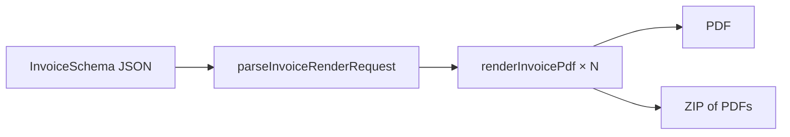

# Stateless invoice render (bulk PDF)

## Goal

Expose Invoicey's **rendering engine** as a bulk, persist-nothing API and a
paste-JSON page. A consumer sends `InvoiceSchema` documents; Invoicey returns
ISDOC.PDF files (visual page + embedded `invoice.isdoc`). No issuer, client,
or invoice rows. No numbering, no payment matching, no email.

First consumer: NFCtron maps a deals table to `InvoiceSchema[]` and attaches
the PDFs to existing payout mail.

## Inputs / outputs

| Surface                     | Input                                                       | Output                                                                                    |
| --------------------------- | ----------------------------------------------------------- | ----------------------------------------------------------------------------------------- |
| `POST /api/render/invoices` | JSON body (below)                                           | 1 invoice → `application/pdf`; 2+ → `application/zip`                                     |
| `/invoices/render`          | Same JSON in the editor                                     | Download the same bytes                                                                   |
| Auth                        | Session cookie or user PAT **and** `features.invoiceRender` | 401 without auth; 403 `{ error: "forbidden", feature: "invoiceRender" }` without the flag |
| Ops                         | `Authorization: Bearer` `MCP_API_KEY`                       | Allowed without the entitlement (NFCtron machine path)                                    |

Accepted bodies:

```json
{
  "invoices": [
    ,/* InvoiceSchema */
    /* InvoiceSchema */
  ]
}
```

Also accepted: a bare array, or a single `InvoiceSchema` object.

Limits: 25 invoices, 2 MB JSON. Validation is all-or-nothing.

Vendor-fee invoices (Dakaben / Magmafest and similar) use `payment.method: "offset"`
(zápočet, no bank account) and may mix a positive fee line with a negative
záloha deduction on a normal `invoice`. Totals stay nonnegative.

Two payment stories:

1. **Already settled (Magmafest / Dakaben).** Booth fee plus matching záloha
   deduction, `total: 0`, `payability: "do_not_pay"`, custom
   `methodLabel: "Úhrada zálohou"`. No QR. See
   [`examples/magmafest-dakaben-mrfly.json`](./examples/magmafest-dakaben-mrfly.json).
2. **Remainder due (Ivan / Fakturoid).** Commission + fee + `Uhrazená záloha` at
   0% VAT. Payable total `81 058.55`. `payability: "due"`. See
   [`examples/paid-deposit-remainder.json`](./examples/paid-deposit-remainder.json).

`meta.issuedBy` customizes **Vystavil** (`name` / `gender` / `label`, or a full
`line`). `meta.footer` customizes or hides the Invoicey footer.

Seeds turn `features.invoiceRender` on for **enterprise** and **nfctron** only.
Seeds insert missing plan rows; existing enterprise / NFCtron rows stay off
until an admin ticks the box (or `--force-entitlements`).

## Approach



- Parse/validate lives in `@invoicey/invoice-core` (`render-batch.ts`).
- Each PDF is `renderInvoicePdf` (ISDOC already embedded).
- ZIP is store-only (`apps/web/lib/zip-store.ts`) — PDFs are already compressed.
- Auth is a **gate only**. The handler does not read the workspace ledger.

The existing `/invoices/from-json` preview stays: one invoice, preview pane,
demo rate limits. This surface is download-first and machine-callable.

## Open questions / TODOs

- TODO(plan-37): Raise the 25-invoice cap once we know NFCtron batch size
  (async job only if we regularly exceed Vercel 120s).
- TODO(plan-37): Whether UploadThing URLs are wanted later. v1 is bytes in
  the HTTP response.

## Out of v1

- Persist issuer / client / invoice
- Payment matching or mark-paid
- Invoicey sending the payout email
- Pohoda / accounting export beyond the ISDOC already inside the PDF
- MCP as the primary contract

## References

- Schema: `@invoicey/invoice-core/schema`
- Render: `packages/invoice-core/src/pdf/render-invoice-pdf.tsx`
- Route: `apps/web/app/api/render/invoices/route.ts`
- UI: `apps/web/app/(app)/(gated)/invoices/render/`
- Entitlement: `features.invoiceRender` (`packages/db/src/entitlements.ts`)
- Plan: [`.cursor/plans/plan-37-invoice-issue-as-service.md`](../../.cursor/plans/plan-37-invoice-issue-as-service.md)
