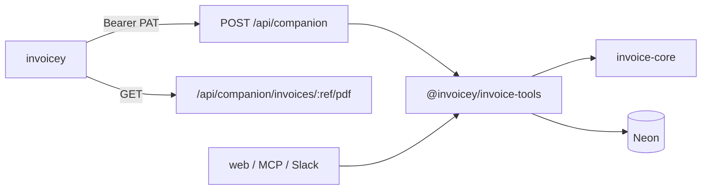

# Invoicey CLI (operator companion)

## Goal

A first-party terminal CLI for the daily management loop: see what is unpaid,
draft and issue, send, confirm payment matches, add a client from ARES. Same
`InvoiceSchema`, same workspace, same PAT as remote MCP.

## Inputs / outputs

| Name                                     | Type   | Notes                                                             |
| ---------------------------------------- | ------ | ----------------------------------------------------------------- |
| PAT / ops key                            | secret | Same as `/api/mcp`. `~/.invoicey/cli.json` or `INVOICEY_API_KEY`  |
| `POST /api/companion`                    | JSON   | Discriminated `op`; `{ ok: true, ... }` or `{ ok: false, error }` |
| `GET /api/companion/invoices/:ref/pdf`   | bytes  | PAT; `ref` is invoice id or issued number                         |
| `GET /api/companion/invoices/:ref/isdoc` | bytes  | Same                                                              |
| `invoicey`                               | TTY    | Interactive home when no subcommand and stdin is a TTY            |

## Approach



### Auth

`resolveMachineBearer`: env ops `MCP_API_KEY` → default workspace; else Better
Auth PAT → `users.defaultWorkspaceId`. Bind ALS. Fail closed. No cookie
session. No Drive device token.

### Operations

| `op`                 | Purpose                                           |
| -------------------- | ------------------------------------------------- |
| `me`                 | Workspace id + name, auth kind                    |
| `status`             | Display-status counts and outstanding by currency |
| `invoices.list`      | Summaries (`limit`, `unpaidOnly`, `q`)            |
| `invoices.get`       | Summary + payload by id or number                 |
| `invoices.create`    | Normalize + persist draft (default issuer)        |
| `invoices.issue`     | Issue a draft                                     |
| `invoices.send`      | Email PDF (+ ISDOC)                               |
| `invoices.paid`      | Manual allocation for outstanding                 |
| `invoices.unpaid`    | Reverse paid state                                |
| `invoices.cancel`    | Cancel                                            |
| `clients.list`       | Saved clients                                     |
| `clients.add`        | ARES by IČO → `ensureClient`                      |
| `issuers.list`       | Issuers (default flagged)                         |
| `payments.proposals` | Pending match proposals                           |
| `payments.confirm`   | Confirm a proposal                                |
| `payments.reject`    | Reject (user PAT; ops key refused)                |
| `ares.lookup`        | ARES by IČO                                       |
| `ares.search`        | ARES by name                                      |

Create hydrates `client` from `clientId` or `ico`, injects `payment.method:
transfer` (issuer bank), and never returns PDF base64. Download bytes from the
GET routes.

Managed-client workspaces (`clients.createMode: "managed"`) refuse `clients.add`.

### CLI commands

```text
invoicey                 interactive home (TTY)
invoicey login           save PAT
invoicey logout
invoicey whoami
invoicey status
invoicey invoices [ls]
invoicey invoices show <ref>
invoicey invoices new
invoicey invoices issue <ref>
invoicey invoices send <ref>
invoicey invoices paid <ref>
invoicey invoices unpaid <ref>
invoicey invoices cancel <ref>
invoicey invoices pdf <ref> [-o]
invoicey invoices isdoc <ref> [-o]
invoicey clients [ls]
invoicey clients add <ico>
invoicey issuers [ls]
invoicey payments [ls]
invoicey payments confirm <id>
invoicey payments reject <id>
invoicey ares <ico-or-query>
```

Global flags: `--api`, `--token`, `--json`, `--yes`. Config:
`~/.invoicey/cli.json` `{ "apiUrl", "token" }`. Env: `INVOICEY_API_URL`,
`INVOICEY_API_KEY`.

### Out of v1

Look builder, bulk import, members, bank-token connect, recurring schedule
editor, platform admin, Drive pairing, local Neon.

## Package map

| Piece                                                      | Role                 |
| ---------------------------------------------------------- | -------------------- |
| `packages/invoice-tools/src/companion-ops.ts`              | Ops + request schema |
| `apps/web/app/api/companion/route.ts`                      | POST JSON            |
| `apps/web/app/api/companion/invoices/[ref]/pdf/route.ts`   | PDF bytes            |
| `apps/web/app/api/companion/invoices/[ref]/isdoc/route.ts` | ISDOC bytes          |
| `apps/cli`                                                 | `invoicey` binary    |
