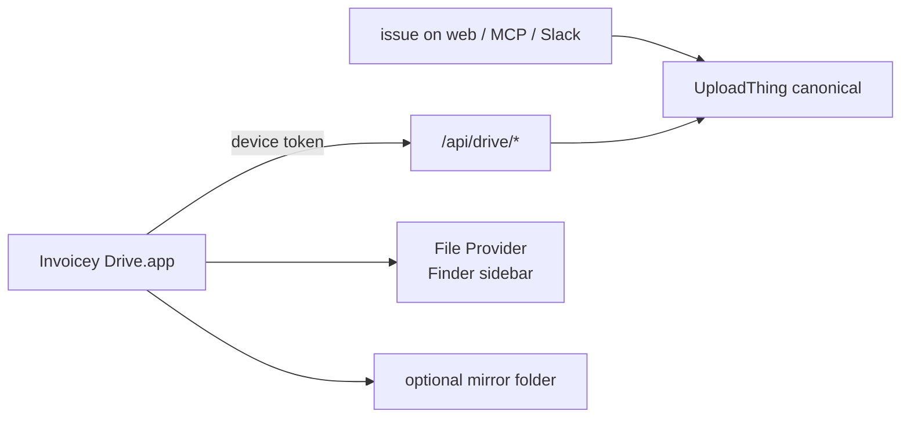

# Invoicey Drive (macOS companion)

## Goal

A macOS companion that shows issued invoices as files in Finder (Invoicey Drive) and keeps an optional local/iCloud/Proton **mirror folder** in sync. The website remains the product. The Mac app is a librarian.

## Inputs / outputs

| Name                                | Type   | Notes                                                                                                            |
| ----------------------------------- | ------ | ---------------------------------------------------------------------------------------------------------------- |
| `DriveLayoutTemplate`               | string | Path under issuer. Tokens + `/`. Default `{year}/{kind}_{number}`                                                |
| `DriveDevice`                       | row    | User-owned Mac install: name, public id, token hash, last seen, revoked                                          |
| `DriveIndexItem`                    | JSON   | `invoiceId`, `workspaceId`, `issuerId`, display names, `layoutRelPath`, `pdfSha256`, `issuedAt`, `displayStatus` |
| `GET /api/drive/index`              | list   | Issued, non-cancelled invoices the device may see                                                                |
| `GET /api/drive/invoices/:id/pdf`   | bytes  | Canonical PDF; device token                                                                                      |
| `GET /api/drive/invoices/:id/isdoc` | bytes  | Optional sibling                                                                                                 |
| File Provider domain                | Finder | Root = Invoicey Drive                                                                                            |

Drafts never appear. Cancelled invoices leave the tree. Every issued `docType` (invoice, credit note, proforma, advance) appears, including historical imports that have a canonical PDF. Rows without `pdf_url` are omitted (replica of stored artifacts, not a live renderer). Lose workspace membership → those invoices leave the index.

## Approach



### Surfaces

| Surface                                         | Role                                                                     |
| ----------------------------------------------- | ------------------------------------------------------------------------ |
| File Provider                                   | Invoicey Drive in Finder Locations. Dataless until open.                 |
| Menu bar                                        | Connect, sync now, last error, Open Invoicey Drive, optional mirror path |
| Web `/drive/connect`                            | Pairing (Better Auth + confirm)                                          |
| Web `/settings/account/drive`                   | Devices, layout template, hide workspaces, download Mac app              |
| Marketing + `/docs/integrations/invoicey-drive` | What it is, install, first connect                                       |

### Tree

```text
Invoicey Drive/
  {workspaceDisplayName}/
    {issuerDisplayName}/
      {layout template → folders and file stem}.pdf
      {same stem}.isdoc          # if includeIsdoc
```

Layout tokens (v1):

| Token      | Value                                                                             |
| ---------- | --------------------------------------------------------------------------------- |
| `{year}`   | `meta.issueDate` year, Europe/Prague                                              |
| `{month}`  | `01`–`12` from issue date                                                         |
| `{kind}`   | Localized stem (`faktura` / `invoice` / …) same map as `invoiceArtifactFileNames` |
| `{number}` | `meta.number`                                                                     |
| `{client}` | Client snapshot name                                                              |
| `{name}`   | Alias of `{kind}_{number}` (same stem as issuer filename default)                 |

`/` in the template is a folder. `{year}_{name}` is one file, no year folder.

Default: `{year}/{kind}_{number}` → `2026/faktura_2026001.pdf`.

The template must contain `{number}` or `{name}`. Two live titles at the same parent get a numeric suffix. Identity is ids, not paths. Template or rename **moves** the item.

### Pairing

See [ADR 0042](../decisions/0042-drive-device-pairing.md).

1. Menu bar: Connect Invoicey (Settings never starts PKCE).
2. `ASWebAuthenticationSession` → `/drive/connect?challenge=&redirect=`.
3. Prod callback: Associated Domains on `invoicey.ditrich.me`. Local: `invoicey-drive://oauth`.
4. Sign-in if needed. Confirm Connect this Mac.
5. Callback `code`. `POST /api/drive/token` + PKCE verifier.
6. Keychain stores the device token until revoke. File Provider domain is added. Sign out revokes this device. No cap.

### Sync

1. Mac polls `GET /api/drive/index` every 60s, on wake, and on Sync now. APNs is out of Plan 30.
2. Diff against local enumerator by `invoiceId`.
3. New / hash-changed: mark File Provider item dirty; download on open (dataless until then).
4. Mirror folder (if set): write the same relative path under the bookmark. Skip when SHA-256 matches. After download **and** skip, set the Finder color label from `displayStatus` (paid = green, unpaid/future = orange, overdue = red). Do not put status in the filename. Do not wipe user `tagNames`. Labels are local Finder metadata; they often do not survive Proton/iCloud. Delete-from-mirror restores on next sync, same as Finder.
5. Removed from index: remove from domain and mirror (Trash locally; do not call Invoicey cancel).

Finder delete is local-only. Next sync **restores** the file. A file dropped into the domain is ignored. Invoicey is the source of truth.

### Auth and tenancy

Device token → user id. No plan entitlement. Index = issued invoices with `pdf_url` in workspaces where that user is still a member, minus hidden workspace ids. File Provider extension uses the same Keychain item via App Group.

Settings live under **account** (`/settings/account/drive`), not workspace. Account vs workspace settings are already two doors; Drive is user-owned like sessions.

### Data model (web)

`drive_user_settings` (1:1 `user_id`)

- `layout_template` (default `{year}/{kind}_{number}`)
- `include_isdoc` (default false)
- `hidden_workspace_ids` jsonb

`drive_devices`

- `id`, `user_id`, `name`, `token_hash`, `token_fingerprint`
- `last_seen_at`, `revoked_at`
- `created_at`

`drive_pair_grants`

- one-time `code_hash`, PKCE challenge, `user_id`, `expires_at`, `used_at`

No invoice bytes in Neon. Mirror folder bookmarks stay on the Mac.

### Web product

- Account Settings → Invoicey Drive: download `.dmg`, layout preview, hide workspaces, device list + revoke. Pairing starts in the app.
- Invoice detail banner when the user has zero Drive devices (v1, dismissible).
- Marketing: companion tile, not a second hero product.
- Fumadocs: `apps/web/content/docs/integrations/invoicey-drive.mdx` (macOS 14+, install, tokens, iCloud vs Invoicey Drive).

### Mac product (sibling `invoicey-mac`)

Bundle id `me.ditrich.invoicey.drive` (same `me.ditrich.*` house style as Caliper). Targets: app + File Provider extension + App Group. Login item default on. Notarized `.dmg`. macOS 14+.

Out of v1: Windows, iOS Files, create/issue/pay, two-way PDF edit, Proton/iCloud APIs, APNs, Mac App Store.

## Open questions / TODOs

- `TODO(plan-30):` Czech + English catalog copy (implementation)
- `TODO(plan-30):` Associated Domains apple-app-site-association path once the team id exists
- `TODO(plan-30):` `.dmg` hosting URL (Settings download placeholder until the first notarized build)

## References

- [ADR 0041](../decisions/0041-invoicey-drive-companion.md), [0042](../decisions/0042-drive-device-pairing.md), [0043](../decisions/0043-drive-layout-workspace-issuer-template.md)
- [`research/personal-invoice-archive.md`](../research/personal-invoice-archive.md)
- [`ui/invoicey-drive.md`](../ui/invoicey-drive.md)
- [`uploads.md`](./uploads.md), [`mcp.md`](./mcp.md), [`account-security.md`](./account-security.md)
- [File Provider](https://developer.apple.com/documentation/fileprovider/synchronizing-files-using-file-provider-extensions)
