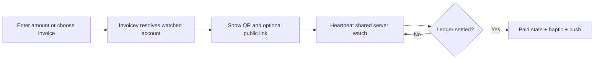

# Invoicey Pocket — receive money

## Goal

A focused native iPhone companion for creating an ad-hoc CZK payment request or
choosing an unpaid invoice, showing a full-screen SPAYD QR, and celebrating only
when Invoicey's server-side bank reconciliation confirms the money.

## User loop

The receive tab prioritizes amount entry, with eligible unpaid invoices below.
The collection sheet shows amount, QR and variable symbol; standalone requests
also expose the existing public payment link. Recent requests and the durable
notification inbox are separate tabs.

## Companion API

`POST /api/pocket` accepts a bearer token from Pocket pairing and one typed
operation: `me`; `payment_requests.create | list | get | watch`;
`invoices.list_unpaid | collect | watch`; `device.register_push`; or
`notifications.list | read`.

Responses are JSON with `Cache-Control: no-store`. Create/watch operations need
`payments:manage`; read lists need `payments:read`. The server resolves device,
user, workspace membership, plan entitlement, role and overrides on each call.

Pairing begins at `/pocket/connect` with an RFC 7636 S256 challenge and fixed
`invoicey-pocket://oauth` callback. Approval creates a one-use five-minute
grant; `/api/pocket/token` exchanges it for a random device token. Only its HMAC
and short fingerprint are stored server-side; the raw token stays in iOS
Keychain.

## Settlement and notifications

The app polls the Invoicey watch endpoint every three seconds, while the server
honors each bank's shared provider floor. It never polls a bank directly. APNs
is supplementary: foreground polling gives the live paid transition; the
durable event engine provides background notification and inbox history.

## Phase-one boundaries

CZK, SPAYD, Fio/MONETA-connected receiving accounts, and one paired workspace.
No payment initiation, payer identity claim, Bluetooth/NFC discovery, direct
bank credentials, or offline settlement assertion.

## Open work

- `TODO(plan-38):` Add App Store assets, privacy strings, APNs production key,
  signing profiles, and TestFlight distribution.
- `TODO(plan-39):` Evaluate workspace switching and nearby discovery only after
  observing phase-one collection usage.

## References

- [Payment requests](./payment-requests.md)
- [Notification engine](./notifications.md)
- [ADR 0053](../decisions/0053-invoicey-pocket-native-receive-companion.md)
