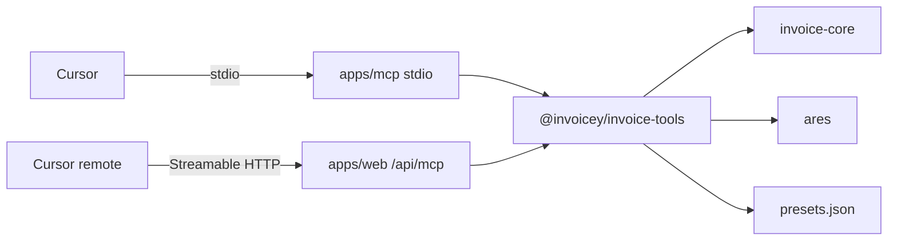

# MCP server — local stdio + Vercel HTTP (Plan 12a)

## Goal

Expose invoice create/render, ARES lookup, and local presets as MCP tools so Cursor (and later remote clients) can drive `InvoiceSchema` → PDF/ISDOC without a heavy builder UI.

## Package map

| Piece | Role |
| --- | --- |
| [`packages/invoice-tools`](../../packages/invoice-tools/) | Handlers: `lookupBusiness`, `createAndRenderInvoice`, preset CRUD, `normalizeDraftToInvoice` |
| [`packages/invoice-tools/src/register-mcp-tools.ts`](../../packages/invoice-tools/src/register-mcp-tools.ts) | Registers tools on an MCP `McpServer` (`@invoicey/invoice-tools/mcp`) |
| [`apps/mcp`](../../apps/mcp/) | Local **stdio** entry (`bun run --cwd apps/mcp src/stdio.ts`) |
| [`apps/web/app/api/[transport]/route.ts`](../../apps/web/app/api/[transport]/route.ts) | Remote **Streamable HTTP** via `mcp-handler` → `/api/mcp` |

Slack reuses the same handlers through AI SDK wrappers in `apps/web/lib/slack/` — see [`slack-bot.md`](./slack-bot.md).

## Tools

| Tool | Input | Output |
| --- | --- | --- |
| `lookup_business` | `{ ico }` | ARES draft client fields or error |
| `create_invoice` | `{ draft?, issuerPresetId?, templatePresetId? }` | Validated invoice + PDF base64 + ISDOC XML, or issues |
| `list_presets` / `get_preset` / `save_preset` / `delete_preset` | preset ids / kind / data | Preset records on disk |

### Preset kinds

- **`issuer`** — full `IssuerSnapshot` (locked “from” party; model cannot invent bank/IČO).
- **`invoice_template`** — partial draft (`meta` / `vat` / `payment` / `items`); merged under `create_invoice` draft overlay.

## Approach



- **Local:** `@modelcontextprotocol/sdk` stdio.
- **Remote:** `mcp-handler`, Node runtime, `maxDuration` 120. `MCP_API_KEY` is required (validated via `@invoicey/env`); `/api/mcp` always expects `Authorization: Bearer <key>`.
- **Issuer lock:** `create_invoice` injects issuer from preset or `getDemoIssuer()` / `INVOICEY_DEMO_ISSUER_JSON`.
- **Presets file:** `INVOICEY_PRESETS_PATH` or `~/.invoicey/presets.json` (on Vercel: `/tmp/…` — ephemeral until Plan 12b).

## Cursor local setup

1. Copy [`.cursor/mcp.json.example`](../../.cursor/mcp.json.example) → `.cursor/mcp.json` and replace `/ABS/PATH/…`.
2. Optional seed: `cp apps/mcp/presets.example.json` to your presets path.
3. Reload MCP in Cursor; confirm tools list.
4. Prompt with issuer preset + client IČO + line items (see root README).

```json
{
  "mcpServers": {
    "invoicey-local": {
      "command": "bun",
      "args": [
        "run",
        "--cwd",
        "/ABS/PATH/inveoiceyai/apps/mcp",
        "src/stdio.ts"
      ],
      "env": {
        "INVOICEY_PRESETS_PATH": "/ABS/PATH/inveoiceyai/.invoicey/presets.json"
      }
    },
    "invoicey-server": {
      "url": "https://<your-web>.vercel.app/api/mcp",
      "headers": {
        "Authorization": "Bearer <MCP_API_KEY>"
      }
    }
  }
}
```

## Vercel go-live checklist (wait for explicit go)

1. Deploy `apps/web` (includes `/api/mcp`).
2. Set `MCP_API_KEY` (required — build fails without it), optional `INVOICEY_DEMO_ISSUER_JSON`.
3. Confirm Node runtime + font tracing (`outputFileTracingIncludes` in `next.config.ts`).
4. Cursor remote:

```json
{
  "mcpServers": {
    "invoicey-server": {
      "url": "https://<your-web>.vercel.app/api/mcp",
      "headers": {
        "Authorization": "Bearer <MCP_API_KEY>"
      }
    }
  }
}
```

5. Smoke: `lookup_business` + `create_invoice`.

## Env

| Var | Required | Notes |
| --- | --- | --- |
| `INVOICEY_DEMO_ISSUER_JSON` | no | Full `IssuerSnapshot` JSON override |
| `INVOICEY_PRESETS_PATH` | no | Absolute path to presets JSON |
| `MCP_API_KEY` | yes | Bearer gate for `/api/mcp`; build/runtime fail if missing |

## Out of scope (Plan 12b)

- DB-backed `list_invoices` / `get_invoice` / `mark_paid`
- Durable remote presets (Blob/DB)
- OAuth / Clerk (Plan 14)

## References

- [`docs/roadmap.md`](../roadmap.md) Plan 12a
- [`.cursor/plans/plan-12-mcp-local.md`](../../.cursor/plans/plan-12-mcp-local.md)
- [`slack-bot.md`](./slack-bot.md)
- [Vercel MCP docs](https://vercel.com/docs/mcp/deploy-mcp-servers-to-vercel)
- [`mcp-handler`](https://github.com/vercel/mcp-handler)
