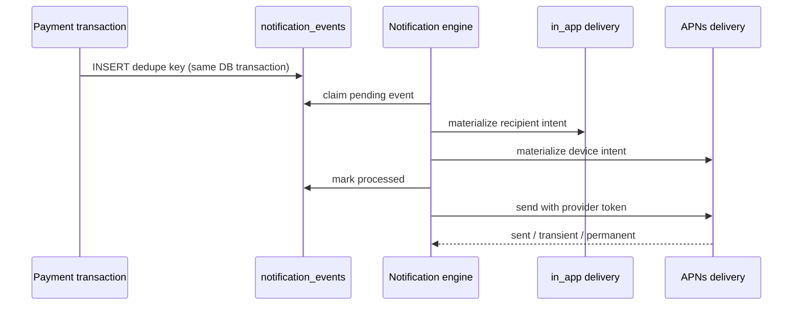

# Notification engine

## Goal

Reliably turn Invoicey business events into an in-app inbox and external
delivery channels without allowing a provider failure to lose an event or
affect financial state. Phase one delivers `payment_request.settled` through
the Pocket inbox and APNs.

## Contract

An event contains `workspaceId`, stable `type`, subject identity, dedupe key,
factual JSON payload, and occurrence time. A delivery contains recipient,
optional device, channel, reviewed title/body/action, state, retry metadata,
and read time. Unique `(event, user, channel, destination)` prevents duplicate
fan-out.

## Processing rules

- Settlement uses `payment_request.settled:<allocation-id>` so replay of one
  allocation is deduped while a reversed request settled by a later allocation
  can notify again.
- Recipients must currently have `payments:read` in the event workspace.
- APNs token-auth uses key id, team id, `.p8` private key, topic, and each
  device's sandbox/production registration environment.
- Permanent token failures disable the device token. Other failures retry.
- Push workers claim rows with `FOR UPDATE SKIP LOCKED` and a 60-second lease;
  an overlapping cron cannot double-send them and a crashed worker is reclaimed.
- Unconfigured APNs leaves delivery rows pending. The bank import invokes the
  engine opportunistically; `/api/cron/notifications` retries each minute.
- Copy is rendered by event-specific presentation code. Unsupported types fail
  visibly on the event rather than being discarded.

## Extension seam

New events add a stable payload contract and presentation policy. New channels
add a delivery adapter; event producers do not change. Candidate next events
are invoice payment matched, payment review required, invoice overdue, and
invoice sent.

## Open work

- `TODO(plan-38):` Provision the APNs key and production entitlement/topic.
- `TODO(plan-39):` Move existing email notification policies behind channel
  delivery only after preferences and Resend suppression rules are preserved.

## References

- [ADR 0052](../decisions/0052-durable-notification-outbox.md)
- [Invoicey Pocket](./invoicey-pocket.md)
