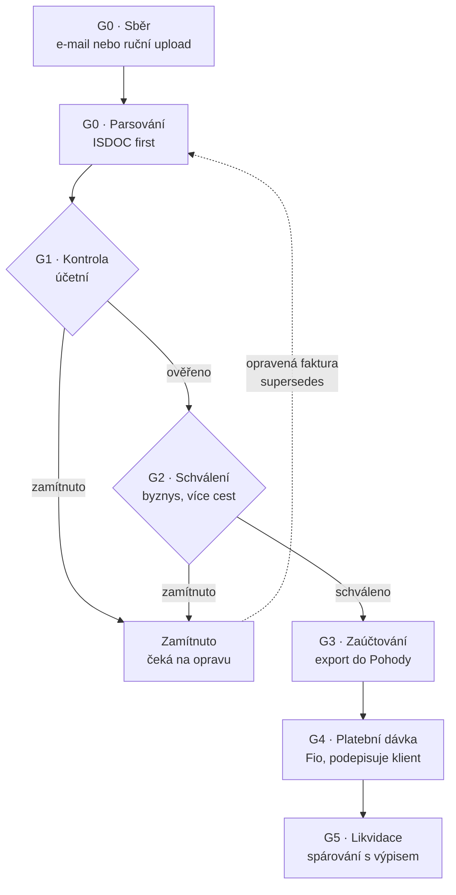
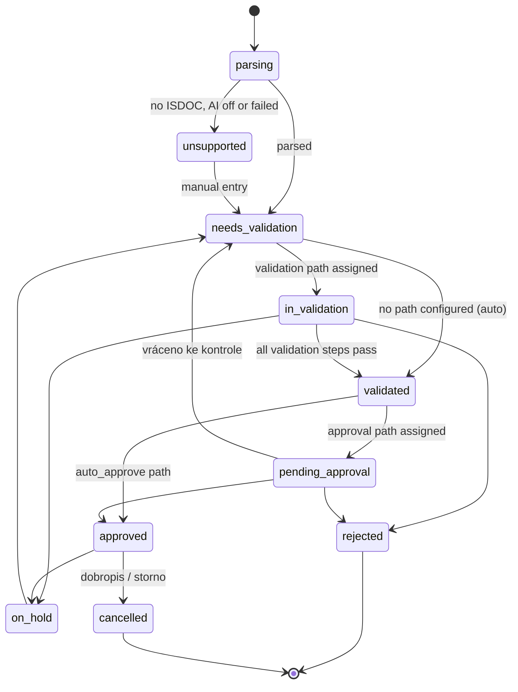
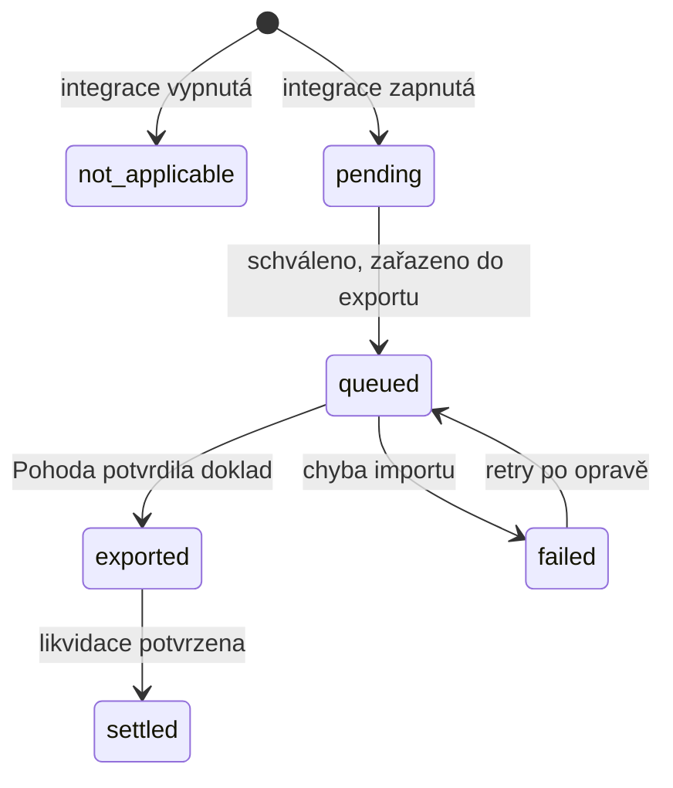
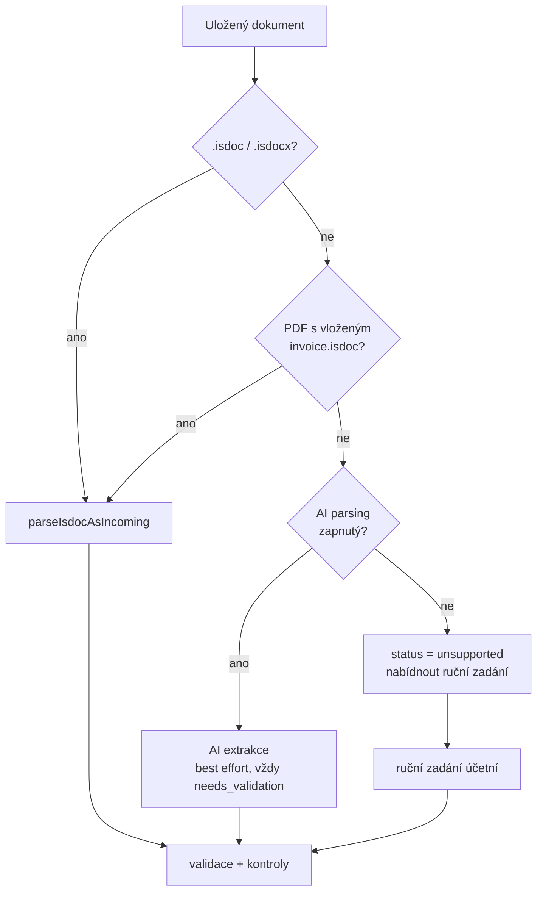

# Payables lifecycle

**Plan:** [25](../../.cursor/plans/plan-25-payables-lifecycle.md) ·
**ADRs:** [0035](../decisions/0035-isdoc-first-parsing.md),
[0036](../decisions/0036-accounting-dimension-layer.md),
[0037](../decisions/0037-pohoda-xml-as-the-reference-rail.md),
[0038](../decisions/0038-three-orthogonal-projections.md)

**Child specs:** [accounting layer](./accounting-layer.md) ·
[invoice checks](./invoice-checks.md) ·
[workflow paths and automations](./incoming-approval-workflows.md) ·
[Pohoda integration](./pohoda-integration.md) ·
[cash-out planning](./cashout-planning.md)

**Supersedes:** the three-gate model in [incoming invoices](./incoming-invoices.md)

This is the master spec for the whole payables epic: the path a supplier invoice
takes from the mailbox to a settled entry in the accounting system, every gate it
passes, and every knob a workspace can turn along the way.

---

## 1. The reference scenario

The epic is specified against a real process, not a hypothetical one. NFCtron
today:

1. Suppliers send invoices to `invoices@nfctron.com`.
2. **Ivan** (accountant) opens each one, checks it is correct and legitimate,
   and retypes it into POHODA with předkontace, středisko and DUZP.
3. Ivan emails **Filip** and **Václav** for business approval, and waits.
4. If Ivan rejects an invoice, he replies to the supplier asking for a
   correction. The corrected invoice arrives later, usually under the same
   number.
5. Approved invoices are paid **on Monday**, in one batch, covering everything
   due that week. Payment is on the due date — not before unless there is a
   reason, sometimes after.
6. The bank debit is matched back and the invoice is marked settled in POHODA.

Every capability in this epic exists to remove a manual step from that list
without removing a decision from it. When a design question is ambiguous, the
tie-breaker is: **does this let Ivan stop retyping, without letting anything
reach the bank that Filip and Václav did not approve?**

Later the same workspace adds Libor as a third approver for invoices above a
threshold and for specific suppliers. The configuration model must absorb that
without a schema change.

---

## 2. The five gates

The three-gate model in [incoming invoices](./incoming-invoices.md) collapses
accounting work into "accept" and has no place for the accounting system. It is
replaced by five.

| Gate   | CZ               | Question                                    | Actor                          | New?                                    |
| ------ | ---------------- | ------------------------------------------- | ------------------------------ | --------------------------------------- |
| **G0** | Sběr a parsování | Do we have a readable invoice?              | system                         | reshaped (ISDOC-first)                  |
| **G1** | Kontrola         | Is the data right, and how is it booked?    | accountant, optionally a path  | **new** — accounting layer              |
| **G2** | Schválení        | May we owe this?                            | business approvers, multi-path | reshaped (paths, multi-actor)           |
| **G3** | Zaúčtování       | Is it in the accounting system?             | system, if enabled             | **new**                                 |
| **G4** | Platba           | Do we pay it in this batch?                 | admin / owner                  | exists (plan 24e)                       |
| **G5** | Likvidace        | Is it settled against a real bank movement? | system                         | partly exists; accounting half deferred |

**G1 and G2 are never collapsed**, even in a one-person workspace. If nobody is
configured for a gate, the gate auto-passes and says so in the trail — it does
not disappear. This keeps the audit story identical across workspace sizes.

**G3 is optional per workspace.** A workspace with no accounting integration
enabled treats G3 as a no-op and the invoice moves from `approved` straight to
the payment calendar.

---

## 3. Three orthogonal projections

One status column cannot carry review, money, and accounting at once. The record
carries three, and each is written by exactly one service.

| Projection         | Values                                                                                                                                                  | Written by              |
| ------------------ | ------------------------------------------------------------------------------------------------------------------------------------------------------- | ----------------------- |
| `status`           | `parsing` · `unsupported` · `needs_validation` · `in_validation` · `validated` · `pending_approval` · `approved` · `rejected` · `on_hold` · `cancelled` | workflow service        |
| `payment_state`    | `unpaid` · `partial` · `paid` · `overpaid`                                                                                                              | allocation service      |
| `accounting_state` | `not_applicable` · `pending` · `queued` · `exported` · `failed` · `settled`\*                                                                           | accounting sync service |

\* `settled` is modelled but unreachable in plan 25 — nothing writes settlement
into the accounting system yet. See §9.

Reading a row means reading all three. "Approved, unpaid, exported" and
"approved, paid, failed" are both real, common, and must render distinctly in
every list. No list may show a single conflated badge.

`accounting_state` advances independently once `status = approved`:

---

## 4. G0 — capture and parsing

Capture is unchanged: [inbound email capture](./inbound-email-capture.md) and
manual upload, both producing `inbox_items` and `incoming_documents`.

**Parsing is deliberately narrowed.** ISDOC is the supported path; PDF parsing is
not where this epic spends engineering (ADR 0035).

`unsupported` is a first-class, non-embarrassing state. Its detail page opens
the manual entry form beside the PDF with a single line of copy: _"Tato faktura
není v ISDOC. Vyplňte údaje ručně, nebo požádejte dodavatele o ISDOC."_ — and a
one-click **Požádat dodavatele o ISDOC** action that sends a prepared reply.

Nudging suppliers toward ISDOC is a product strategy, not a workaround. Every
supplier converted removes a manual entry forever, and the supplier profile
tracks the ratio so the workspace can see progress.

AI extraction stays in the codebase, behind a workspace switch, default **off**,
and never produces anything better than `needs_validation`.

---

## 5. G1 — validation (kontrola)

The gate Ivan operates. Two things happen here, and they are separable in the UI
but joined in the gate: **confirming the invoice data** and **supplying the
accounting layer**.

### 5.1 What the accountant sees

A two-pane screen: original document left, work right. The right pane has three
stacked sections, in this order:

1. **Nálezy** — the checks that fired, as cards with a **Vyřešit** action.
   Blocking findings are red and prevent the gate from passing; warnings are
   yellow and require an acknowledgement with one click.
2. **Fakturační údaje** — the parsed core fields, ISDOC-authoritative fields
   shown as read-only with a small "z ISDOC" marker, everything else editable.
3. **Zaúčtování** — the accounting layer: předkontace, středisko, činnost,
   zakázka, členění DPH, DUZP, and the per-line override table.

The gate passes with **Ověřit a předat ke schválení** (`⌘↵`). It is disabled,
with the reason named, while any blocking finding is open or any required
accounting dimension is empty.

### 5.2 Checks

Configurable, per workspace, each with a severity and an optional condition for
when it applies. Full catalogue in [invoice checks](./invoice-checks.md). The
ones that answer the brief directly:

| Check                     | Fires when                                                                       |
| ------------------------- | -------------------------------------------------------------------------------- |
| `new_supplier`            | No prior validated invoice from this supplier                                    |
| `amount_deviation`        | Total is outside the supplier's trailing band by more than the configured margin |
| `bank_account_changed`    | Beneficiary differs from the supplier's confirmed account                        |
| `currency_changed`        | Currency differs from the supplier's usual                                       |
| `payment_terms_deviation` | Due-date distance differs from the supplier's usual terms                        |
| `unreliable_vat_payer`    | Supplier is listed as nespolehlivý plátce                                        |
| `account_not_published`   | Beneficiary account is not published in the VAT register (§109 ZDPH)             |
| `missing_accounting`      | A required accounting dimension is empty                                         |

Each check carries `applies_when` conditions, so "warn me about amount deviation
only above 50 000 Kč" is configuration, not code.

### 5.3 Rejection and correction

Rejecting at G1 sets `status = rejected` with a mandatory reason, and offers
**Odpovědět dodavateli** — a prefilled reply to the original sender quoting the
reason. The invoice is not processed further and never reaches the payment
calendar.

When the corrected invoice arrives, usually under the same number, the existing
hard-duplicate index does not block it: it already excludes rows with
`status = 'rejected'`. Instead, ingestion detects the identity collision against
a rejected predecessor and links them.

| Column             | Meaning                                  |
| ------------------ | ---------------------------------------- |
| `supersedes_id`    | The rejected invoice this one replaces   |
| `superseded_by_id` | Set on the predecessor, back-reference   |
| `correction_round` | 1 for the first correction, incrementing |

The successor's detail page opens on a **diff** — only the fields that changed
against the predecessor, with old and new side by side — and carries forward the
predecessor's accounting layer as defaults. Ivan re-checks a handful of changed
fields instead of retyping the invoice.

Both records stay in the system; lists show the chain as one group with the
latest round expanded.

### 5.4 The validation path

Validation is itself a configurable multi-actor flow. It uses the same machinery
as approval — see [workflow paths and automations](./incoming-approval-workflows.md)
— with `stage = 'validation'`. A workspace with one accountant configures no path
and the gate is a single action. A workspace with a junior and a chief accountant
configures a two-step path. Nothing in the model changes between those cases.

---

## 6. G2 — approval (schválení)

Business validity, by people who are not the accountant. Fully specified in
[workflow paths and automations](./incoming-approval-workflows.md); the parts
this spec fixes:

- Approval paths are **named, reusable objects** with ordered steps, each step
  `any_one` / `all_of` / `quorum` over users, teams, roles, or dynamic
  resolvers.
- Which path applies is decided by **automations** at the `on_validated`
  trigger: `amount > 100000 → Cesta A`, `amount < 20000 → Cesta B`,
  `supplier = X → Cesta X`. Conditions are OR-of-ANDs.
- A path can also be **assigned by hand** on a single invoice, before or during
  approval, and extra approvers can be added to an already-running path.
- **Rejection at G2 returns the invoice to `rejected`**, on the same footing as a
  G1 rejection, and the same correction-linking applies.
- Four-eyes: the validating accountant cannot be the only approver.

NFCtron's day-one configuration: one path, `all_of[Filip, Václav]`, assigned by a
single unconditional automation. Adding Libor later is one new automation with an
amount condition and one new path.

---

## 7. G3 — accounting export (zaúčtování)

**Only approved invoices are exported.** This ordering is the point: the
accounting system receives documents that are already correct and already
authorized, so nothing has to be corrected or deleted there afterwards.

Optional per workspace. When no integration is configured, `accounting_state`
stays `not_applicable` and the gate is invisible.

Full detail in [Pohoda integration](./pohoda-integration.md). **In plan 25 this
is a file export**: Invoicey generates a Pohoda dataPack, the accountant imports
it and confirms. No live connection to any accounting system. The contract at
this level:

- Export is **queued, not synchronous** — approval never blocks on the export,
  and on the file rail `accounting_state` advances when the accountant confirms
  the import, not when the file is generated.
- Export is **idempotent**, keyed on our invoice UUID carried into Pohoda's
  `extId`.
- A failed export is a visible, actionable state with the provider's own error
  message, a **Zkusit znovu** action, and no effect on the approval record.
- An exported invoice becomes **locked for accounting edits**. Changing a
  dimension after export requires an explicit **Znovu odeslat** which re-exports
  under the same `extId`.
- The export carries the accounting layer **as resolved per line**, so per-line
  overrides survive into Pohoda.

Export is a hard eligibility requirement for the payment run **only if the
workspace turns that on** (`require_export_before_payment`, default on when an
integration is enabled). NFCtron wants it on: nothing gets paid that is not
booked.

---

## 8. G4 — planning and the payment run

Planning is new; the run itself exists (plan 24e).

### 8.1 Planning

Full detail in [cash-out planning](./cashout-planning.md). Every approved
invoice gets a `planned_payment_date`, defaulting from a workspace policy:

| Policy            | Default planned date   |
| ----------------- | ---------------------- |
| `on_due_date`     | `due_date` — NFCtron's |
| `days_before_due` | `due_date - n`         |
| `asap`            | next pay day           |

**Pay days** are workspace configuration — NFCtron: every Monday. The system
proposes a run for the next pay day containing everything planned on or before
the following pay day, which is exactly "Monday, everything due this week".

**Postponement** is a first-class action, not an edit: `Odložit` moves the
planned date, requires a reason, keeps `postponed_from`, and shows a badge with
the original date. Postponing past the due date is allowed and marked
distinctly — it is a real business decision, and the system's job is to make it
visible rather than to prevent it.

### 8.2 The run

Unchanged from [payables, payment runs, and Fio submission](./payables-payment-runs-fio.md),
with one added eligibility blocker:

| Blocker        | Reason                                                             |
| -------------- | ------------------------------------------------------------------ |
| `not_exported` | `require_export_before_payment` is on and export has not succeeded |

The safety property is unchanged and non-negotiable: a batch posted to Fio is
inert until a human signs it in internet banking.

---

## 9. G5 — reconciliation and likvidace

The debit-matching half exists. What is new is closing the loop in the
accounting system.

1. Bank sync ingests the debit.
2. The payables matcher proposes an allocation; confirming it moves
   `payment_state`.
3. Settlement in the accounting system stays the customer's own statement
   import. **Invoicey does not write to POHODA's Bank agenda in plan 25**, so
   `accounting_state` stops at `exported`.

**Likvidace has a serious failure mode, which is the second reason it is
deferred.** If the customer already imports their bank statement into POHODA
themselves — the common case — a second push from us double-books the bank
agenda. When it is picked up, the modes are:

| Mode               | Behaviour                                                                                                                                                                | Default |
| ------------------ | ------------------------------------------------------------------------------------------------------------------------------------------------------------------------ | ------- |
| `off`              | We record settlement in Invoicey only. POHODA is settled by the customer's own statement import.                                                                         | ✅      |
| `statement_import` | We import the bank movements into POHODA's Bank agenda with liquidation items linking each debit to its invoice. The customer must stop importing statements themselves. |         |

Turning `statement_import` on requires an explicit confirmation naming that
consequence. This is spelled out because getting it wrong corrupts a customer's
books, which is not a bug we can fix from our side.

_Both modes are out of plan 25._

---

## 10. The configuration surface

Everything a workspace can turn. This table is the checklist for the settings
information architecture.

| Area          | Setting                                               | Default            |
| ------------- | ----------------------------------------------------- | ------------------ |
| Sběr          | Inbox aliases, per-issuer pinning, sender allowlist   | one alias          |
| Parsování     | AI parsing enabled                                    | off                |
| Parsování     | Ask supplier for ISDOC — reply template               | provided           |
| Kontrola      | Validation path per condition (automations)           | none — auto-pass   |
| Kontrola      | Each check: enabled, severity, `applies_when`, params | see checks spec    |
| Zaúčtování    | Required dimensions per doc type                      | none               |
| Zaúčtování    | Workspace defaults per dimension                      | empty              |
| Zaúčtování    | Supplier defaults, learned or pinned                  | learned            |
| Schválení     | Approval paths                                        | none — auto-pass   |
| Schválení     | Automations mapping conditions → path                 | none               |
| Schválení     | Four-eyes enforcement                                 | on                 |
| Účetní systém | Provider, rail, credentials                           | none               |
| Účetní systém | `require_export_before_payment`                       | on when enabled    |
| Účetní systém | Likvidace mode                                        | `off`              |
| Platby        | Payment policy                                        | `on_due_date`      |
| Platby        | Pay days                                              | none               |
| Platby        | Bank connection, submit token                         | none               |
| Notifikace    | Per event, immediate or digest                        | immediate on tasks |

---

## 11. Data model deltas

Against the plan-24 schema. Full column detail lives in the child specs.

**`incoming_invoices`** gains:

| Column                                                                                      | Purpose                        |
| ------------------------------------------------------------------------------------------- | ------------------------------ |
| `accounting_state`                                                                          | §3                             |
| `validated_at`, `validated_by_user_id`                                                      | G1 completion                  |
| `supersedes_id`, `superseded_by_id`, `correction_round`                                     | §5.3                           |
| `planned_payment_date`, `postponed_from`, `postpone_reason`                                 | §8.1                           |
| `predkontace_id`, `centre_id`, `activity_id`, `contract_id`, `vat_classification_id`        | accounting layer, header level |
| `external_system`, `external_document_id`, `external_number`, `exported_at`, `export_error` | G3                             |

`accepted_at` / `accepted_by_user_id` are renamed to `validated_at` /
`validated_by_user_id` in the same migration; there is no meaningful data to
preserve pre-pilot.

**`incoming_invoice_lines`** gains the same five accounting dimension columns,
all nullable — null means "inherit the header".

**New tables:** `accounting_codelists` and `accounting_codelist_items`,
`supplier_profiles`, `invoice_checks` (configuration), `invoice_findings`
(instances), `accounting_connections`, `accounting_export_jobs`, plus the
workflow tables from [workflow paths and automations](./incoming-approval-workflows.md).

---

## 12. Permissions

| Capability                           | Minimum              |
| ------------------------------------ | -------------------- |
| View invoices and suppliers          | `member`             |
| Upload, edit core fields             | `member`             |
| Edit the accounting layer, pass G1   | `accountant`\*       |
| Approve                              | as named by the path |
| Configure checks, paths, automations | `admin`              |
| Configure the accounting connection  | `admin`              |
| Set payment policy and pay days      | `admin`              |
| Create a payment run                 | `admin`              |
| Submit a run to the bank             | `owner`              |
| Turn on `statement_import` likvidace | `owner`              |

\* `accountant` is a **new capability**, not a new role rank. It is granted per
member alongside the existing `member` / `admin` / `owner` ladder, because the
accountant is frequently an external person who must not gain admin rights.
Modelled as a capability flag on the membership row.

---

## 13. Out of scope

Purchase orders and three-way match · budgets and budget checks · DPH přiznání
and kontrolní hlášení generation · Peppol and datová schránka intake ·
non-Pohoda accounting systems in this epic (the connection model is built to
accept them next) · FX allocation · line-item-level _approval_ (the schema
reserves `line_id` on tasks but no UI ships) · supplier portal.

---

## 14. References

- [Incoming invoices](./incoming-invoices.md) — records, extraction, retention
- [Inbound email capture](./inbound-email-capture.md)
- [Payables, payment runs, and Fio submission](./payables-payment-runs-fio.md)
- [Payment ledger and Fio](./payment-ledger-fio.md)
- [ISDOC](./isdoc.md) · [Czech VAT](../domain/vat-czech.md)
