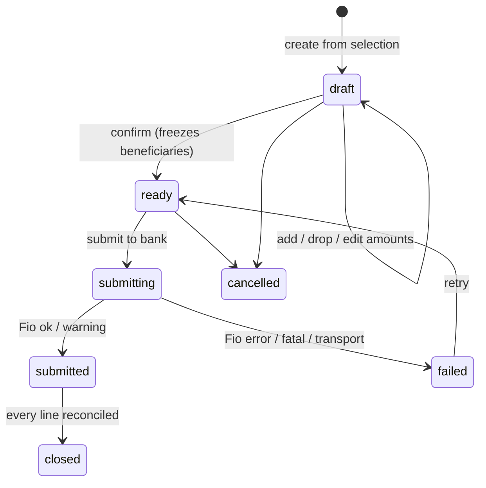

# Payables, payment runs, and Fio submission

**Plan:** [24e](../../.cursor/plans/plan-24-incoming-invoices.md) ·
**ADR:** [0033](../decisions/0033-fio-payment-initiation-bank-signed.md) ·
**Parent spec:** [incoming invoices](./incoming-invoices.md)

The last third of the loop: what is due, which of it we pay now, how the batch
reaches the bank, and how the resulting debit closes the payable.

## The safety property this whole spec rests on

A batch posted to Fio's import endpoint is **inert**. Fio groups it into the
account's _orders to sign_ queue, and it is processed only after an authorized
signatory approves it in internet banking with SMS or Fio podpis. Invoicey holds
a credential that can _propose_ payments and nothing more.

Every piece of language in the UI, in emails, and in status values must respect
that. A submitted run is _"submitted to the bank — awaiting your authorization"_.
It is never _paid_, and it is never _sent_.

## Payable calendar

Source: `incoming_invoices` where `status = 'approved'`, `cancelled_at IS NULL`,
`payment_state <> 'paid'`, and no active hold.

| Bucket        | Definition (`Europe/Prague`)           |
| ------------- | -------------------------------------- |
| Po splatnosti | `due_date < today`                     |
| Tento týden   | `due_date` within the current ISO week |
| Příští týden  | `due_date` within the next ISO week    |
| Později       | everything after                       |

Filters: issuer, supplier, currency, exception state. Each row shows the
outstanding amount (`abs(total) − paid_amount`), the supplier, the beneficiary
account with its confirmation state, and any blockers.

Alongside the buckets, the connected-account panel shows the current balance per
`bank_accounts` row for the selected issuer, the total already committed to open
runs, and the projected balance after the run being assembled. No revenue
forecasting — the question this answers is "does the balance cover this week".

## Payment run

### Records

**`payment_runs`**

| Column                                           | Notes                                                                                    |
| ------------------------------------------------ | ---------------------------------------------------------------------------------------- |
| `id`, `workspace_id`                             |                                                                                          |
| `issuer_id`                                      | receiving entity paying                                                                  |
| `bank_account_id`                                | source account; fixes the currency and the Fio connection                                |
| `name`                                           | defaults to `Platby <ISO week>`                                                          |
| `execution_date`                                 | the `date` field written into every order                                                |
| `currency`                                       | single currency per run                                                                  |
| `status`                                         | `draft` \| `ready` \| `submitting` \| `submitted` \| `failed` \| `cancelled` \| `closed` |
| `total_amount`                                   | sum of included lines                                                                    |
| `line_count`                                     |                                                                                          |
| `provider`                                       | `fio`                                                                                    |
| `provider_batch_id`                              | Fio `idInstruction`                                                                      |
| `provider_status`                                | `ok` \| `warning`                                                                        |
| `provider_message`                               | Fio's own message text                                                                   |
| `submit_attempt_count`                           |                                                                                          |
| `submitted_at`, `submitted_by_user_id`           |                                                                                          |
| `created_by_user_id`, `created_at`, `updated_at` |                                                                                          |

**`payment_run_lines`**

| Column                                                                                       | Notes                                                |
| -------------------------------------------------------------------------------------------- | ---------------------------------------------------- |
| `id`, `workspace_id`, `payment_run_id`                                                       |                                                      |
| `incoming_invoice_id`                                                                        |                                                      |
| `amount`, `currency`                                                                         | amount ≤ outstanding                                 |
| `beneficiary_name`                                                                           | **frozen** at confirmation                           |
| `beneficiary_iban`, `beneficiary_account_number`, `beneficiary_bank_code`, `beneficiary_bic` | **frozen**                                           |
| `variable_symbol`, `constant_symbol`, `specific_symbol`                                      |                                                      |
| `message_for_recipient`                                                                      | ≤ 140 characters                                     |
| `comment`                                                                                    | our own reference, `inv/<incoming_invoice_id short>` |
| `rail`                                                                                       | `domestic` \| `sepa`                                 |
| `status`                                                                                     | `included` \| `dropped` \| `submitted` \| `failed`   |
| `drop_reason`                                                                                |                                                      |
| `sequence`                                                                                   | position within the batch                            |
| `created_at`                                                                                 |                                                      |

Unique: `(payment_run_id, incoming_invoice_id)`.

An invoice may belong to only one live run at a time. A partial unique index
cannot express that, because run status lives on the parent table, so the
constraint is carried by `incoming_invoices.active_payment_run_id` (nullable,
FK to `payment_runs`): set transactionally when a line is added to a `draft`,
cleared when the line is dropped or the run is cancelled, and left in place from
`ready` onward until the run reaches `closed`. Eligibility reads that column,
and the FK plus the transaction make a double-add impossible.

### Lifecycle



**Dropping a line is not rejecting an invoice.** A dropped payable returns to the
calendar for a later run, unchanged.

### Eligibility

A payable may enter a run only if all of these hold. Each failure is shown
against the row with its reason, not hidden by filtering the row away.

| Requirement                                                     | Reason                            |
| --------------------------------------------------------------- | --------------------------------- |
| `status = 'approved'`, no active hold                           | Gate 2 passed                     |
| Outstanding > 0                                                 | Nothing to pay                    |
| Currency equals the run currency                                | No FX (ADR 0029)                  |
| `payment_method = 'transfer'`                                   | Other methods are not bank orders |
| Beneficiary account present and **confirmed** for that supplier | ADR 0033 fraud control            |
| Rail resolves to `domestic` or `sepa`                           | Foreign rail is out of v1         |
| `active_payment_run_id IS NULL`                                 | Not already in another live run   |
| `doc_type <> 'credit_note'`                                     | Credit notes reduce, never pay    |

### Confirmation

Confirming a `draft` freezes every beneficiary field onto the line from the
supplier master and the invoice as they read at that instant, recomputes the
total, assigns `sequence`, and moves the run to `ready`. What a person approved
on screen is byte-for-byte what will be built into the XML.

## Fio submission

### Credential

The submit token lives on `bank_connections` in its own columns, separate from
the read token (ADR 0033):

`payment_secret_ciphertext`, `payment_secret_fingerprint`, `payment_key_version`,
`payment_token_expires_at`, `payment_last_request_at`,
`payment_enabled_at`, `payment_enabled_by_user_id`, and `access_mode` moving from
`read` to `read_write`.

Rules:

- Encrypted with the existing `token-crypto` helpers and key versioning.
- Never returned after submission, never logged, never rendered.
- Validated on entry: 64 characters, no whitespace.
- Used only for `POST /import/`. Statement sync keeps using the read token.
- Its own 30-second throttle clock (`payment_last_request_at`).
- `payment_token_expires_at` is captured from the user at entry, since Fio caps
  a token at 180 days and does not report expiry over the API. The settings page
  warns from 14 days out and the run page blocks submission on an expired token
  with a re-entry prompt.
- Removing payment rights clears only the payment columns and returns
  `access_mode` to `read`; sync is unaffected.

### Building the XML

New module `packages/payment-core/src/fio-import.ts`.

```ts
buildFioImportXml(input: {
  accountFrom: string;      // source account number, no bank code
  currency: string;
  executionDate: string;    // YYYY-MM-DD
  lines: FioOrderLine[];
}): { xml: string; byteLength: number };
```

Hard requirements from the Fio documentation:

- Root `<Import xmlns:xsi="…" xsi:noNamespaceSchemaLocation="http://www.fio.cz/schema/importIB.xsd"><Orders>…`.
- Order elements must appear as **`DomesticTransaction` → `T2Transaction` →
  `ForeignTransaction`**. Any other ordering causes the whole file to be
  rejected. v1 emits only the first two.
- Element order **inside** each transaction is fixed by the schema; the builder
  emits fields in the documented sequence and omits absent optional fields
  rather than emitting empty elements.
- Field constraints: `messageForRecipient` ≤ 140, `comment` ≤ 255, `vs` / `ss`
  ≤ 10 digits, `ks` ≤ 4 digits, amount as `18d` with two decimals,
  `paymentType` `431001` (standard domestic) / `431008` (standard europlatba).
- XML text must be escaped. Supplier names carry `&` and quotes.
- The file must stay **under 2 MB**. The builder reports byte length and the run
  service splits a run into several batches when needed, each submitted and
  authorized separately, each with its own `provider_batch_id`.

Rail classification: a Czech account number with a bank code is `domestic`; a
Fio-internal IBAN (`CZ..2010`, `SK..8330`) is `domestic`; an IBAN inside the SEPA
scheme is `sepa`; anything else is `foreign` and is not eligible in v1.

Golden-file tests cover both rails, escaping, truncation, ordering, and the
2 MB split boundary.

### Transport

```ts
submitFioImport(input: {
  token: string;
  xml: string;
  lang?: "cs" | "en";
  fetchImpl?: typeof fetch;
}): Promise<FioImportResult>;
```

`POST https://fioapi.fio.cz/v1/rest/import/` — the trailing slash is required —
as `multipart/form-data` with `token`, `type=xml`, `lng`, and `file`
(`import.xml`, `application/xml`).

Response parsing (schema: `responseImportIB.xsd`):

| `errorCode` | `status`  | Meaning                                           | Run outcome                               |
| ----------- | --------- | ------------------------------------------------- | ----------------------------------------- |
| `0`         | `ok`      | Batch accepted                                    | `submitted`                               |
| `2`         | `warning` | Accepted with complaints (e.g. currency mismatch) | `submitted`, message surfaced prominently |
| `1`         | `error`   | Validation errors; **nothing accepted**           | `failed`, per-order messages shown        |
| `11`        | `error`   | Syntax error                                      | `failed`, internal bug — log and alert    |
| `12` / `14` | `error`   | Empty import / empty file                         | `failed`, internal bug                    |
| `13`        | `error`   | File over 2 MB                                    | `failed`, split and retry                 |
| —           | `fatal`   | Bank-side failure, all orders refused             | `failed`, retry later                     |

HTTP-level: `409` → throttled, retry after 30 s; `500` → missing or inactive
token, prompt for re-entry; `404` → malformed URL, internal bug.

`idInstruction`, `sumDebet`, and `sumCredit` are stored on the run and shown to
the user, and `sumDebet` is asserted against the run total — a mismatch is an
error even when Fio says `ok`.

### Idempotency

- Submission requires `status = 'ready'`; the service compare-and-swaps to
  `submitting` so two clicks cannot produce two batches.
- A successful submission is terminal: `submitted` never returns to `ready`.
- Only `failed` may retry, incrementing `submit_attempt_count`, each attempt
  audited with its response.
- If the transport fails ambiguously (timeout after the request left), the run
  goes to `failed` with `provider_status = 'unknown'` and the UI tells the user
  to check the orders-to-sign queue in Fio **before** retrying. Never
  auto-retry an ambiguous submission.

### After submission

The run page states plainly, in Czech: the batch is waiting in Fio internet
banking and must be authorized there; nothing has been paid yet. The batch id is
shown for cross-reference. An email goes to the submitting user and the workspace
owner with the batch id, the line count, and the total, with account numbers
masked.

## Reconciliation of the debit

### Enabling debit ingestion

`bank_accounts.import_scope` moves from `incoming` to `all` when a workspace
turns on payables for that account. `importBankTransactionBatch` currently
filters `direction === 'credit'`; it starts persisting debits for accounts whose
scope allows it. Receivables matching is untouched — it already filters on
direction.

### Payables matcher

`proposePayableMatches` in `@invoicey/payment-core`, mirroring
`proposeInvoiceMatches`:

- Only `direction = 'debit'` with a negative-magnitude amount > 0.
- Candidates: approved payables, outstanding > 0, currency equal, issuer linked
  to the paying account.

| Reason                                                                          | Weight             |
| ------------------------------------------------------------------------------- | ------------------ |
| `payment_run_line` — a submitted line with the same amount, VS, and beneficiary | 70                 |
| `exact_variable_symbol`                                                         | 50                 |
| `known_supplier_account` — counterparty is a confirmed account of the supplier  | 30                 |
| `exact_outstanding_amount`                                                      | 25                 |
| `partial_amount`                                                                | 15                 |
| `overpayment`                                                                   | 10                 |
| `paying_account`, `currency`, `plausible_date`                                  | qualifying / small |

Blocker: `ambiguous_variable_symbol` when several payables share the VS.

`isExactAutoMatchPayable` is deliberately narrow, exactly as on the receivables
side: a submitted run line plus exact VS plus exact outstanding amount plus no
blockers. Auto-confirmation stays **off by default** and is a per-connection
opt-in, consistent with Plan 22.

### Allocation

A confirmed proposal writes a `payable_payment_allocations` row and
transactionally refreshes `paid_amount` and `payment_state` on the invoice, using
the same projection logic as `packages/db/src/payments-repo.ts`. Reversal
mirrors `reversePaymentAllocation`. When every line of a submitted run is fully
allocated, the run moves to `closed`.

Manual allocation is available for payments made outside Invoicey, with the same
service and `source = 'manual'`.

## Web surfaces

| Surface                                | Content                                                                                                                                         |
| -------------------------------------- | ----------------------------------------------------------------------------------------------------------------------------------------------- |
| `/incoming-invoices` → **K zaplacení** | Buckets, balances, multi-select, "create run from selection"                                                                                    |
| `/incoming-invoices/runs`              | Runs with status, total, execution date, batch id                                                                                               |
| `/incoming-invoices/runs/[id]`         | Lines with beneficiaries and blockers; drop, edit amount, confirm, submit; after submission, the authorization instruction and the Fio response |
| `/settings/bank-connections`           | Optional submit token: add, rotate, remove, expiry warning, explicit copy that Invoicey cannot authorize payments                               |
| Invoice detail                         | Run membership, allocations, reversal                                                                                                           |

## Testing

- XML golden files: domestic, T2, mixed ordering, escaping, truncation, split.
- Response parser: every `errorCode` and `status` combination.
- Submission service: compare-and-swap under concurrency, retry only from
  `failed`, ambiguous-timeout handling, `sumDebet` assertion.
- Eligibility: each rule has a fixture that blocks and one that passes.
- Freeze semantics: editing a supplier after confirmation does not change a line.
- Matcher: run-line link, exact VS, partial, overpayment, ambiguity, currency
  mismatch, workspace isolation.
- One controlled live pilot with a single small real payment, authorized in Fio
  by the account owner, before the feature is enabled for anyone else.

The Fio HTTP boundary is faked in every automated test. No test carries a real
token or account number.

## References

- [Fio API Bankovnictví (PDF, v. 16. 10. 2025)](https://www.fio.cz/docs/cz/API_Bankovnictvi.pdf) — §6 import
- [Fio import XSD](https://www.fio.cz/schema/importIB.xsd) ·
  [response XSD](https://www.fio.cz/schema/responseImportIB.xsd)
- [Payment ledger and Fio](./payment-ledger-fio.md) — the read side
- [Incoming invoices](./incoming-invoices.md)
