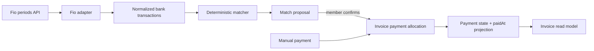

# Payment ledger and Fio bank integration

**Status:** Implemented; monitoring-token contract probe and real invoice pilot pending

**Decision:** [ADR 0029](../decisions/0029-payment-ledger-fio-first.md)

## Goal

Turn incoming Fio account movements into explainable invoice-match proposals,
then let a workspace member confirm allocations that derive unpaid, partial,
paid, and overpaid state. The ledger must remain usable by later bank adapters
and statement importers without changing the invoice document contract.

## Selected scope

The first release includes:

- a provider-neutral normalized bank transaction store;
- auditable invoice payment allocations, including manual payments;
- a deterministic, versioned matcher;
- one Fio account per Fio monitoring token, with multiple connections supported
  by the model;
- read-only Fio synchronization and a manual **Sync now** action;
- confirmation-first reconciliation UI;
- existing manual mark-paid behavior routed through the ledger;
- a 90-day initial backfill by default;
- CZK pilot support, while preserving currency fields in the shared model.

It does not include:

- payment initiation or a token that can submit payment orders;
- automatic confirmation;
- exchange-rate conversion or cross-currency allocation;
- accounting categorization of all expenses;
- authority-payment reconciliation;
- a multibank consent flow;
- email-notification ingestion;
- treating pending or initiated payments as settled.

## Domain boundaries and invariants



The following rules are non-negotiable:

1. A bank transaction is evidence; a proposal is a suggestion; an allocation is
   a confirmed accounting fact.
2. Issued invoice payloads, totals, PDFs, and ISDOC artifacts remain immutable.
3. Active allocation amounts are positive. Settlement target is the absolute
   invoice total. A positive-total receivable requires a credit transaction; a
   negative-total payable/refund requires a debit transaction.
4. An allocation currency must equal its invoice currency. A bank-backed
   allocation must also equal the transaction currency.
5. Active allocations backed by one transaction cannot exceed the absolute
   transaction amount.
6. Reconciliation never crosses workspace boundaries. Account-to-issuer links
   and invoice candidates must belong to the same workspace.
7. Every confirm, manual add, reverse, rematch, connection change, and automatic
   state transition is auditable.
8. Money is parsed from provider decimal strings without binary floating-point
   arithmetic.

## Persistence model

All tables carry `created_at` and `updated_at` where appropriate. Foreign keys
must not rely on an application-supplied workspace alone; services verify that
the referenced rows share the same workspace inside the mutation transaction.

### Workspace scope and ownership

Bank connections are workspace resources, never user-global resources:

- `bank_connections`, `bank_accounts`, transactions, proposals, allocations,
  and audit events all carry `workspace_id`;
- the UI reads and mutates connections only for the session's active workspace;
- `created_by_user_id`, `last_rotated_by_user_id`, and review actor IDs record
  who acted, but do not make that user the owner of the bank data;
- if the authorizing user later leaves, the connection remains with the
  workspace until a workspace owner/admin rotates, pauses, or revokes it;
- a user in several workspaces configures each workspace independently;
- in Plan 22, one provider account/IBAN can have only one active workspace
  connection. Moving it requires an explicit disconnect/reconnect flow, which
  avoids duplicate ingestion and accidental cross-workspace transaction
  exposure;
- one connected account may serve multiple issuers inside the same workspace.
  Matching still requires the issued invoice's payment IBAN and currency.

Connection-secret management is owner/admin-only. Payment review permission may
be broader, but must still be an explicit workspace role check.

### `bank_connections`

| Field                       | Purpose                                                             |
| --------------------------- | ------------------------------------------------------------------- |
| `id`, `workspace_id`        | Tenant identity                                                     |
| `provider`                  | `fio` initially                                                     |
| `status`                    | `pending`, `active`, `needs_reauth`, `paused`, `error`, `revoked`   |
| `access_mode`               | Must be `read` in Plan 22                                           |
| `secret_ciphertext`         | Authenticated ciphertext; never exposed by a read API               |
| `secret_key_version`        | Supports encryption-key rotation                                    |
| `secret_fingerprint`        | Keyed fingerprint for duplicate detection, not the token itself     |
| `token_expires_at`          | User-entered/confirmed expiry; Fio does not return it in statements |
| `sync_coverage_through`     | Last calendar date covered by a committed range sync                |
| `last_sync_started_at`      | Lease/diagnostics                                                   |
| `last_sync_succeeded_at`    | User-visible freshness                                              |
| `last_sync_error_code`      | Redacted operational state                                          |
| `next_sync_at`              | Scheduler eligibility                                               |
| `consecutive_failure_count` | Backoff and alerting                                                |

Each Fio token addresses one account. A connection can expose multiple accounts
in the generic model, but a Fio connection must resolve to exactly one account.

### `bank_accounts`

| Field                                  | Purpose                                                 |
| -------------------------------------- | ------------------------------------------------------- |
| `id`, `workspace_id`, `connection_id`  | Ownership                                               |
| `provider_account_id`                  | Fio `accountId`                                         |
| `account_number`, `bank_code`          | Canonical domestic identity                             |
| `iban`, `bic`, `currency`              | Account header facts                                    |
| `display_name`                         | User-facing label                                       |
| `import_scope`                         | `invoice_matching` initially; `full_ledger` is later    |
| `last_reported_balance` / `balance_at` | Optional operational display, not an accounting balance |

An optional `bank_account_issuers` join records one or more issuer associations
inside the workspace. The connection flow compares the returned IBAN with the
selected issuer's bank snapshot. A mismatch is shown clearly and requires
explicit confirmation; it is not silently linked.

### `bank_transactions`

| Field                                                    | Purpose                                                 |
| -------------------------------------------------------- | ------------------------------------------------------- |
| `id`, `workspace_id`, `bank_account_id`                  | Ownership                                               |
| `provider`, `provider_transaction_id`                    | Fio movement ID and idempotency key                     |
| `provider_instruction_id`                                | Fio instruction ID; useful for fees and reversals       |
| `booking_date`                                           | Fio movement calendar date                              |
| `amount`, `currency`, `direction`                        | Signed source amount plus explicit direction            |
| `counterparty_account`, `counterparty_bank_code`         | Normalized counterparty identity                        |
| `counterparty_name`, `counterparty_bank_name`, `bic`     | Optional display and future learned matching            |
| `variable_symbol`, `constant_symbol`, `specific_symbol`  | Czech payment symbols                                   |
| `message`, `user_identification`, `comment`, `payer_ref` | Provider text fields                                    |
| `provider_type`                                          | Original Fio movement type                              |
| `provider_payload_hash`                                  | Integrity/debugging without duplicating the raw payload |
| `observed_at`                                            | When Invoicey first committed the movement              |
| `possible_reversal_of_id`                                | Nullable reviewed/derived relation                      |

Use a unique constraint on `(bank_account_id, provider,
provider_transaction_id)`. Upsert may fill previously missing optional fields,
but must not rewrite amount, currency, booking date, or account ownership. A
conflicting immutable field is a sync error requiring review.

Plan 22 stores normalized fields, not an unbounded raw response body. Provider
fixtures used in tests are redacted. Raw token-bearing request URLs are never
logged.

### `payment_match_proposals`

| Field                               | Purpose                                      |
| ----------------------------------- | -------------------------------------------- |
| `id`, `workspace_id`                | Ownership                                    |
| `bank_transaction_id`, `invoice_id` | Suggested relation                           |
| `proposed_amount`, `currency`       | Suggested allocation                         |
| `score`, `confidence`               | Sortable outcome                             |
| `reasons_json`, `blockers_json`     | Stable machine codes for an explainable UI   |
| `matcher_version`                   | Reproducibility                              |
| `status`                            | `open`, `accepted`, `rejected`, `superseded` |
| `reviewed_by`, `reviewed_at`        | Human decision                               |

There is at most one open proposal per matcher version, transaction, and
invoice. Rerunning a newer matcher supersedes obsolete open proposals rather
than erasing history.

### `invoice_payment_allocations`

| Field                                       | Purpose                                                    |
| ------------------------------------------- | ---------------------------------------------------------- |
| `id`, `workspace_id`, `invoice_id`          | Ownership and destination                                  |
| `bank_transaction_id`                       | Nullable for manual or migrated legacy payments            |
| `source`                                    | `fio`, `manual`, `legacy_manual`, later `statement_import` |
| `amount`, `currency`                        | Confirmed amount                                           |
| `effective_date`                            | Bank booking date or explicit manual payment date          |
| `confirmed_by`, `confirmed_at`              | Actor and audit time                                       |
| `reversed_at`, `reversed_by`, `reason_code` | Reversible history; allocation rows are not hard-deleted   |

A bank transaction can fund several invoice allocations, and an invoice can
receive several allocations. Reversal locks the invoice and transaction rows,
marks the allocation reversed, and recomputes both sides in one database
transaction.

### Invoice read-model additions

Issued invoice rows gain:

- `payment_account_iban` — normalized, whitespace-free uppercase IBAN;
- `payment_variable_symbol` — the issued payment symbol;
- an indexed payment summary derived from active allocations, either by a
  maintained projection or a query/view selected during implementation.

`paid_at` remains during Plan 22 because status, filters, reminders, MCP, and
email already consume it. It becomes a compatibility projection:

- below the absolute invoice total: `paid_at = null`;
- when cumulative active allocations first reach the settlement target: the
  effective date of the allocation that crosses the threshold, converted to a
  documented stable instant in `Europe/Prague` for the timestamp projection;
- after a reversal drops the total below the invoice total: `paid_at = null`;
- when the total is reached again: recompute from the active allocation order.

Zero-total invoices retain their existing lifecycle behavior and must not gain a
synthetic bank allocation. Plan 22's Fio matcher handles incoming,
positive-total receivables only; manual and migrated allocations preserve
payment handling for negative-total credit notes until outgoing bank matching is
designed.

## Payment state

For an issued, non-cancelled invoice:

```text
target = abs(invoice total)
allocated = sum(active allocation amounts)
outstanding = max(target - allocated, 0)

allocated = 0             -> unpaid
0 < allocated < target    -> partial
allocated = target        -> paid
allocated > target        -> overpaid
```

`partial` and `overpaid` are payment states. The combined list/detail badge may
surface them, but cancellation and future/overdue lifecycle rules still take
precedence where relevant. Dashboard outstanding revenue uses `outstanding`,
not a binary `paid_at` test.

Manual **Mark paid** creates a whole-outstanding manual allocation with a
selected effective date. **Unmark paid** is replaced by payment management: it
may reverse the relevant manual allocation but cannot silently erase a
bank-confirmed allocation.

Existing non-zero rows with `paid_at IS NOT NULL` receive one idempotently
generated `legacy_manual` allocation for the absolute invoice total and the
existing paid date.

## Fio adapter contract

The provider package returns provider-neutral values and has no access to
invoice tables:

```ts
type BankAdapter = {
  validateConnection(secret: string): Promise<DiscoveredBankAccount>;
  listTransactions(input: {
    secret: string;
    from: string;
    to: string;
  }): Promise<NormalizedTransactionBatch>;
};
```

The Fio adapter uses the current base URL:

```text
https://fioapi.fio.cz/v1/rest/periods/{token}/{from}/{to}/transactions.json
```

It does not use the retired `www.fio.cz/ib_api` host.

### Token contract

The setup UI instructs the account owner or authorized person to create:

- token right: **Sledování účtu** (monitoring/export only);
- maximum chosen validity, optionally with Fio's automatic extension;
- one token for the one account being connected.

Fio documents a five-minute delay before a new token works, a maximum token
validity of 180 days, and automatic extension to 180 days after an online/mobile
banking login when enabled. The UI treats an immediate failure after creation as
possibly pending activation and offers retry without storing an unvalidated
secret.

The application never accepts or requests the broader right that can import
payment or collection orders.

### Fio JSON normalization

The parser keys on documented column IDs, not localized `name` strings:

| Fio field  | Normalized field        |
| ---------- | ----------------------- |
| `column22` | `providerTransactionId` |
| `column0`  | `bookingDate`           |
| `column1`  | `amount` / `direction`  |
| `column14` | `currency`              |
| `column2`  | `counterpartyAccount`   |
| `column10` | `counterpartyName`      |
| `column3`  | `counterpartyBankCode`  |
| `column12` | `counterpartyBankName`  |
| `column4`  | `constantSymbol`        |
| `column5`  | `variableSymbol`        |
| `column6`  | `specificSymbol`        |
| `column7`  | `userIdentification`    |
| `column16` | `message`               |
| `column8`  | `providerType`          |
| `column18` | `detail`                |
| `column25` | `comment`               |
| `column26` | `bic`                   |
| `column17` | `providerInstructionId` |
| `column27` | `payerReference`        |

Every optional column can be `null`. A missing `transactionList` or a null/empty
transaction collection is a successful empty batch, not a parser error.

Fio movement ID is the transaction idempotency key. Instruction ID is not
unique: a transfer and its fee can share it, and an original movement and its
storno can share it with opposite signs. Reversal detection therefore creates a
reviewable relation and never merges rows by instruction ID.

## Synchronization

### Why not `/last`

Fio's `/last` endpoint moves a bank-side marker whenever a response contains
movements. If Invoicey receives the response but fails before its database
commit, the next call may skip those movements. The normal synchronizer instead
uses stateless date ranges and local idempotency.

### Range algorithm

1. Acquire a short database lease for the connection; overlapping jobs exit.
2. Choose `from`:
   - initial sync: user-selected start, default `today - 90 days`;
   - subsequent sync: `sync_coverage_through - 3 days`;
   - after a long outage: the stored coverage date still prevents a gap.
3. Choose `to = today` in `Europe/Prague`.
4. Enforce at least 30 seconds between requests made with one Fio token.
5. Fetch and parse the explicit period response.
6. Verify the returned account identity matches the connection.
7. In one database transaction, idempotently insert/update normalized rows,
   advance committed coverage, and enqueue/recompute proposals.
8. Release the lease and update user-visible success/failure state.

The three-day overlap protects against delayed corrections and makes retries
safe. The unique provider movement key is the ultimate duplicate guard.

Fio limits one response to 50,000 movements. Initial history is chunked only if
needed and stays sequential for one token. History older than 90 days requires
the user to temporarily authorize complete-history access in Fio; the current
documentation says that window lasts ten minutes. It is an explicit optional
backfill flow, not part of unattended sync.

### Polling cadence

- scheduled target: every 15 minutes when the deployment scheduler supports it;
- manual **Sync now**: available when the connection is not leased or throttled;
- exponential backoff for provider/network failures;
- `409`: respect Fio's per-token interval and retry later;
- invalid/inactive token response: mark `needs_reauth`, do not delete history;
- parser/schema drift: mark `error`, retain the redacted response hash and stop
  advancing coverage;
- no successful sync for 24 hours: show degraded status prominently.

The scheduling mechanism is replaceable; synchronization correctness must not
depend on Vercel Cron delivering exactly once.

## Deterministic matcher v1

Only positive booked transactions on the connected receiving account are Fio
v1 candidates. Candidate invoices must be positive-total receivables, issued,
not cancelled, have the same payment IBAN and currency, and have positive
outstanding value.

The matcher emits reason and blocker codes rather than an opaque probability.

| Evidence                                                          | Result                                                    |
| ----------------------------------------------------------------- | --------------------------------------------------------- |
| Exact VS, one invoice, amount equals outstanding                  | `high`; propose full allocation                           |
| Exact VS, one invoice, amount below outstanding                   | `high`; propose partial allocation; confirmation required |
| Exact VS, one invoice, amount above outstanding                   | `high`; propose outstanding amount and flag remainder     |
| Exact VS resolves to several invoices                             | blocked ambiguity; show candidates                        |
| No VS, exact outstanding amount, known client account, date valid | `medium`; confirmation required                           |
| Exact amount only                                                 | `low`; display as a possible match, never preselect       |
| Currency or receiving account mismatch                            | no proposal                                               |
| Negative movement / possible reversal                             | review queue; never confirm automatically                 |

The plausible date window is configurable in code and starts as invoice issue
date minus two days through the current date. Due date is supporting context,
not a hard limit: customers can pay late.

"Known client account" is learned only from a previously confirmed allocation
for that client and counterparty account in the same workspace. Client names and
free-text similarity do not become high-confidence evidence.

Plan 22 has no auto-confirm path. Later opt-in automation requires pilot metrics,
a separate decision, narrowly defined rules, audit events, and reversibility.

## Reconciliation mutations

Confirming a proposal runs a database transaction that:

1. locks the bank transaction and affected invoice rows;
2. recomputes currently unallocated and outstanding amounts;
3. rejects stale, cross-workspace, cancelled, negative, or currency-mismatched
   input;
4. inserts the allocation and accepts/supersedes affected proposals;
5. recomputes invoice payment state and `paid_at`;
6. records an audit event;
7. emits a payment-received email only on the transition into fully paid, using
   the existing issuer preference and idempotency controls.

The allocation editor can split one transaction across several invoices. Any
remainder stays visibly unallocated. Overpayment to one invoice is allowed only
after explicit confirmation and is shown as overpaid.

## Web surfaces

### Settings → Bank connections

- explain read-only access before the token field;
- show exact Fio steps and warn not to choose payment-order rights;
- token is write-only and masked after submission;
- validate and encrypt the token in an authenticated server action; never return
  it to the browser after submission;
- select/link an issuer and verify returned account identity;
- choose initial history start (default 90 days) and import scope;
- show token-expiry reminder, last successful sync, next sync, and errors;
- pause, reconnect/rotate token, sync now, and revoke connection.

Only workspace owners/admins manage connection secrets. The existing workspace
role model determines who can review payments; Plan 22 must document and test
the chosen member permission before shipping.

### Payments

- queue of unmatched and proposed incoming movements;
- filters for account, proposal confidence, allocation state, and date;
- transaction detail with provider facts and match explanation;
- confirm, reject, choose another invoice, or split allocation;
- clear unallocated remainder and possible-reversal warnings.

### Invoice detail and list

- received, outstanding, and payment state;
- payment timeline with bank/manual source and effective date;
- add manual payment and reverse an allocation with confirmation;
- list/dashboard totals use allocation-derived outstanding amounts.

## Secret handling and privacy

- Encrypt tokens with AES-256-GCM using a versioned application key supplied via
  server-only environment configuration.
- Store a keyed fingerprint for duplicate detection; never a reversible hint
  derived from too much of the token.
- Decrypt only inside the provider call boundary and discard plaintext promptly.
- Never include the token, token-bearing URL, full provider response, or full
  transaction text in logs, analytics, error reporting, or client payloads.
- Redact account numbers in general operational logs and UI notifications.
- Rotate a token by validating new plaintext first, then atomically replacing
  ciphertext and fingerprint.
- Revoking a connection destroys ciphertext but retains normalized transactions
  and allocations unless the user separately requests data deletion.
- `invoice_matching` scope persists positive incoming movements plus
  correction/reversal movements related to them. Unrelated outgoing movements
  are discarded after parsing without logging or analytics. A mixed
  personal/business account must not silently become a general personal-finance
  ledger.
- Document retention/export/deletion behavior before wider release.

Required server configuration:

```text
BANK_TOKEN_ENCRYPTION_KEY_V1=<32-byte key encoded for server use>
BANK_TOKEN_ACTIVE_KEY_VERSION=1
CRON_SECRET=<existing cron authorization secret>
```

## Validation strategy

### 22a — real-account contract probe

Fio does not provide a sandbox for this API; its documentation says real
testing requires a real account. Plan 22a therefore builds the smallest secure
in-app connection path before the transaction ledger:

1. Add the connection/account schema and versioned token-encryption boundary.
2. Add a write-only Fio token form under the active workspace's Settings → Bank
   connections page.
3. The pilot user creates a monitoring-only token in Fio and pastes it into that
   authenticated form; it is never supplied through chat or committed config.
4. A server action runs a read-only probe against a short explicit date range,
   validates the discovered account, and stores the token only as authenticated
   ciphertext after successful validation.
5. Save only a redacted field-coverage report:
   - account currency and masked identity;
   - transaction count by direction/type;
   - null/non-null coverage for VS, counterparty, message, instruction ID;
   - duplicate movement-ID check;
   - suspected reversal pairs by instruction ID and opposite sign.
6. Convert representative responses into hand-redacted test fixtures.

This validates field types and real Fio behavior without importing movements
into the payment ledger or exposing the plaintext token outside the provider
boundary.

### Automated tests

- Zod parser tests for full, sparse, empty, malformed, and changed Fio payloads;
- decimal parsing and Prague calendar-date tests;
- idempotent overlapping sync and conflict detection;
- matcher table tests for exact, partial, overpayment, ambiguous VS, learned
  account, currency mismatch, split payment, and reversal;
- allocation concurrency tests so two confirmations cannot overspend one
  transaction or over-allocate outstanding value accidentally;
- legacy `paid_at` migration and rollback/idempotency tests;
- workspace-isolation and permission tests;
- token encryption, rotation, redaction, and no-secret-serialization tests;
- email transition idempotency tests;
- end-to-end connect → sync → proposal → confirm → paid invoice flow.

### Pilot acceptance

- issue a real CZK invoice whose payment account is the connected Fio account;
- keep Invoicey's generated numeric variable symbol;
- observe the posted incoming movement on the next sync;
- require one high-confidence proposal with account, currency, amount, and VS
  reasons;
- confirm it and verify the transaction/allocation timeline and `paid_at` date;
- re-run sync and matcher to prove there are no duplicate transactions,
  proposals, allocations, or emails;
- exercise one synthetic partial payment, split, overpayment, and reversal case
  before considering the pilot complete.

## Rollout and metrics

Release behind a workspace feature flag for the first Fio pilot. Track counts,
not sensitive payment contents:

- sync attempts/successes/latency and redacted error code;
- new versus duplicate movement counts;
- proposal confidence distribution;
- accepted/rejected/rematched proposals;
- time from bank booking to proposal and from proposal to confirmation;
- false-positive rate reported by reversals/rematches;
- unallocated incoming amount and stale connections.

Automatic confirmation is not considered until exact-match acceptance is high,
false positives are effectively zero in the pilot sample, and reversal recovery
has been demonstrated.

## First pilot configuration

Confirmed on 2026-08-15:

- the Fio account is currently inactive/empty and will be used primarily for
  business invoice receipts;
- account currency is CZK;
- issuer is **Filip Ditrich**, IČO **09870113**, in the workspace for
  `filip.ditrich@gmx.us`; resolve the existing issuer first and create it only if
  absent;
- initial history starts on the connection date because there is no useful
  history to backfill;
- the monitoring-only token will be entered by the user through Invoicey's
  workspace bank-connection settings form;
- the remaining pilot input is one real future invoice paid to Fio with
  Invoicey's generated VS.

## Open questions

- `TODO(plan-22a):` Record real response nullability, exact error bodies, and
  whether recent same-day movements appear immediately in `/periods`.
- `TODO(plan-22a):` Confirm how token expiry is displayed in current Fio
  Internetbanking so the setup copy can be exact.
- `TODO(plan-22b):` Choose maintained summary table versus query/view after
  measuring the invoice-list query with allocations.
- `TODO(plan-22b):` Define the combined badge precedence for `partial`,
  `overpaid`, `future`, and `overdue` in the status domain doc.
- `TODO(plan-22c):` Confirm production scheduler cadence and maximum runtime for
  the deployed Vercel plan.
- `TODO(plan-22d):` Finalize which non-owner workspace roles can confirm or
  reverse allocations.
- `TODO(plan-22d):` Set normalized transaction retention/deletion rules before
  enabling workspaces beyond the pilot.

## References

- [ADR 0029](../decisions/0029-payment-ledger-fio-first.md)
- [Payment ledger research](../research/payment-ledger-bank-integration.md)
- [Invoice status engine](../domain/status-engine.md)
- [Invoice schema](../domain/invoice-schema.md)
- [Fio API Bankovnictví](https://www.fio.cz/bankovni-sluzby/api-bankovnictvi)
- [Fio API technical documentation, version 1.9](https://www2.fio.cz/docs/cz/API_Bankovnictvi.pdf)
- [Fio API base-URL migration notice](https://www.fio.cz/zpravodajstvi/aktuality/303608-fio-api-pro-prechod-na-novou-url-zbyva-jen-par-dni)
