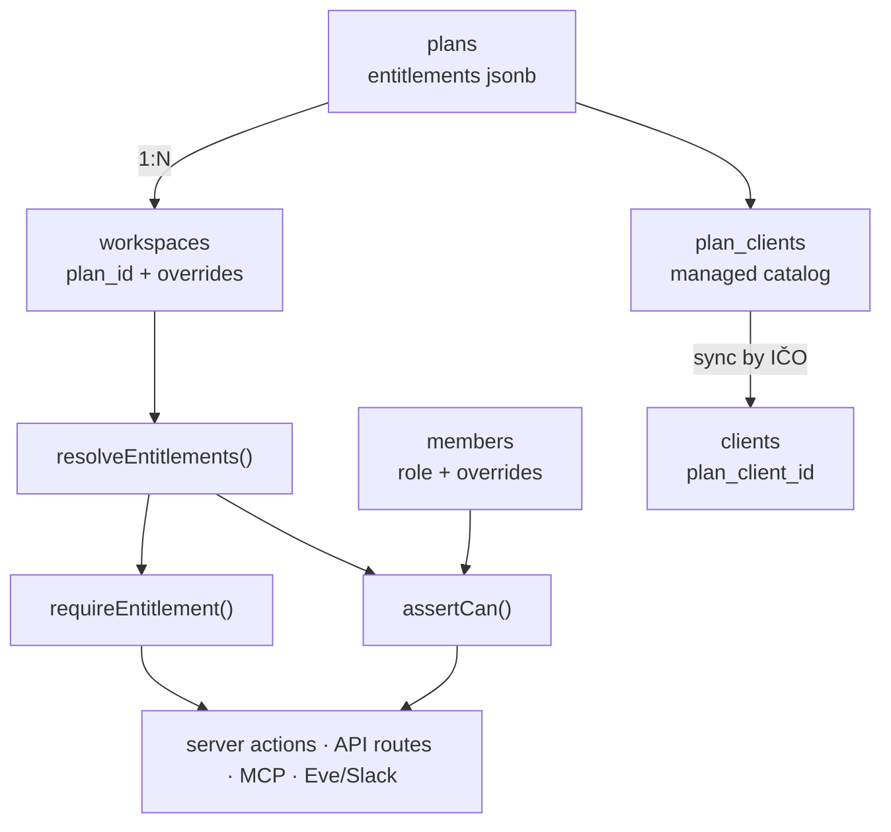

# Plans and entitlements

**Plan:** 26 · **ADRs:** [0035](../decisions/0035-plans-are-shared-entitlement-rows.md),
[0036](../decisions/0036-managed-client-catalogs.md),
[0037](../decisions/0037-declarative-token-grants.md),
[0038](../decisions/0038-permission-catalog-with-role-presets.md)

## Goal

Give every workspace exactly one **plan**, and give one plan many workspaces. A
plan carries **entitlements** — the numbers and flags that decide what a
workspace may do — plus, optionally, a **managed client catalog** and an
**email-domain grant rule**. Platform admin activates plans by hand; there is no
payment path in this plan.

The driving use case is not a team plan. It is a **sponsored plan**: NFCtron
contractors each get their own workspace (their own IČO as issuer, their own
invoice history, no cross-visibility), all pointing at one custom plan row that
restricts who they may invoice and how many AI tokens they burn.

## The three concepts, kept apart

Conflating these is what makes plan work sprawl. They are separate layers and
each one has a single resolver:

| Layer           | Question it answers                      | Where it lives                                   |
| --------------- | ---------------------------------------- | ------------------------------------------------ |
| **Plan**        | Which commercial package is this?        | `plans` row, `workspaces.plan_id`                |
| **Entitlement** | _May this workspace_ do X, and how much? | `resolveEntitlements()` → `requireEntitlement()` |
| **Permission**  | _May this member_ do X inside it?        | permission catalog → `assertCan()`               |

A plan never appears in a code branch. Nothing anywhere reads
`plan.key === "nfctron"`. Behaviour is driven only by resolved entitlements, so
a new custom plan is a database row, not a deploy.



## Plan matrix

Values are seed data for the four launch rows, not constants in code.

|                            | **Free** | **Pro**  | **Enterprise** | **NFCtron** (custom) |
| -------------------------- | -------- | -------- | -------------- | -------------------- |
| Seats                      | 1        | 5        | unlimited      | 3                    |
| Issuers                    | 1        | 5        | unlimited      | 1                    |
| Signup grant               | 250k     | 500k     | 500k           | —                    |
| First-issued-invoice grant | 500k     | 500k     | 500k           | —                    |
| Monthly included tokens    | 100k     | 1.5M     | 5M             | 1M                   |
| Token top-up               | ✓ (stub) | ✓ (stub) | ✓ (stub)       | ✓ (stub)             |
| Clients                    | open     | open     | configurable   | **managed**          |
| Permissions                | off      | advanced | advanced       | roles                |
| Recurring drafts           | ✓        | ✓        | ✓              | ✓                    |
| Historical import          | ✓        | ✓        | ✓              | ✓                    |
| Slack / MCP / Eve          | ✓        | ✓        | ✓              | ✓                    |
| Bank connections           | —        | ✓        | ✓              | ✓                    |
| Allowed email domains      | —        | —        | configurable   | `nfctron.com`        |
| Audit retention            | 30d      | 1y       | unlimited      | 1y                   |

Positioning: **Free is a complete solo Czech invoicing tool** — ARES, VAT,
ISDOC, QR, PDF, email, recurring, import, and the agent surfaces — with AI as a
taste rather than a workhorse, because every agent surface already meters
against the token balance. **Pro adds people and money** — seats, granular
permissions, bank reconciliation, and a real monthly allowance. **Enterprise
adds control** — unlimited scale plus the boundary rules (domains, managed
clients, retention). **NFCtron is Pro-shaped but locked.**

> **Open risk — thin Pro.** With recurring, import, and the agent surfaces on
> Free, Pro's differentiators reduce to seats, permissions, bank connections,
> and the monthly allowance. That is a defensible but narrow wedge, and the
> monthly allowance is doing more work than it looks. Revisit once there is real
> Free-tier usage data; every row above is an `/admin` edit, not a deploy.
> `TODO(plan-26): re-evaluate the Free/Pro line after 30 days of plan telemetry.`

## Data model

```ts
plans                    // one row per commercial package
  id, key (unique), name, kind: "builtin" | "custom"
  entitlements: jsonb    // Entitlements (below)
  autoAssignEmailDomains: text[]
  isDefault: boolean     // exactly one; where new signups land
  archivedAt, createdAt, updatedAt

plan_clients             // managed client catalog, per plan
  id, planId → plans (cascade)
  ico                    // normalized, digits only
  snapshot: jsonb        // same shape as clients.snapshot
  createdAt, updatedAt
  unique (planId, ico)

workspaces               // added columns
  + planId → plans (restrict)
  + entitlementOverrides: jsonb | null
  + planAssignedAt, planAssignedBy → users | null   // null = domain rule

clients                  // added column
  + planClientId → plan_clients (set null)          // non-null = managed

workspace_token_grants   // idempotent grant ledger (ADR 0037)
  id, workspaceId → workspaces (cascade)
  ruleKey                // "signup" | "first_invoice_issued" | "manual:<uuid>"
  trigger, bucket, tokens
  grantedBy → users | null, note
  createdAt
  unique (workspaceId, ruleKey)
```

`workspaces.plan_id` is `RESTRICT`, not `CASCADE` — deleting a plan that still
has workspaces must fail loudly rather than orphan tenants. Archive instead.

### Entitlements

One Zod schema, one merge function, no ad-hoc reads.

```ts
const EntitlementsSchema = z.object({
  seats: z.object({ max: z.number().int().positive().nullable() }), // null = unlimited
  issuers: z.object({ max: z.number().int().positive().nullable() }),
  ai: z.object({
    monthlyIncludedTokens: z.number().int().nonnegative(),
    topUpEnabled: z.boolean(),
    grants: z.array(TokenGrantRuleSchema),
  }),
  clients: z.object({ createMode: z.enum(["open", "managed"]) }),
  permissions: z.object({ mode: z.enum(["off", "roles", "advanced"]) }),
  features: z.object({
    bankConnections: z.boolean(),
    recurring: z.boolean(),
    historicalImport: z.boolean(),
    agents: z.boolean(), // Slack + MCP + Eve as one switch
  }),
  auth: z.object({ allowedEmailDomains: z.array(z.string()) }), // [] = any
  audit: z.object({ retentionDays: z.number().int().positive().nullable() }),
});

resolveEntitlements(plan.entitlements, workspace.entitlementOverrides): Entitlements
```

`resolveEntitlements` is a pure deep merge — plan defaults, then overrides,
scalars replaced and arrays replaced wholesale (never concatenated, so an
override can _shrink_ a domain list). Overrides are the exception for a genuine
one-off; the plan row is the mechanism. Resolution is memoized per request
alongside `requireWorkspace()`.

### Token grant rules

```ts
const TokenGrantRuleSchema = z.object({
  key: z.string(), // stable; the idempotency key
  trigger: z.enum(["signup", "first_invoice_issued"]),
  tokens: z.number().int().positive(),
  bucket: z.literal("gifted"),
  notify: z.boolean().default(true),
});
```

The existing `adminGrantTokens` path rides the same ledger with
`ruleKey = "manual:<uuid>"` and `grantedBy` set — one table, one audit trail,
one code path (ADR 0037). Admin gifting already works today; what it gains is a
row saying which award a balance came from, so support can read one table
instead of inferring.

Workspaces that predate the ledger get a backfilled `signup_v1` row for the old
hardcoded 500k award. It credits nothing — those tokens are already in the
balance — but it claims the key, so enabling the rule cannot hand the same
workspace a second signup award.

`ai_token_balances.monthlyLimit` (`packages/db/src/ai-usage.ts:53`) stops
defaulting to a module constant and is seeded and re-seeded from
`entitlements.ai.monthlyIncludedTokens` on assignment and on renewal.
`SIGNUP_GIFTED_TOKENS` / `MONTHLY_INCLUDED_TOKENS` remain exported only as the
seed values of the `free` row.

## Enforcement

Three rules, and the third is the one that gets skipped:

1. **Entitlements gate capability.**
   `requireEntitlement(ctx, "features.bankConnections")` in the server action /
   route / tool, plus hiding the UI. UI hiding alone is decoration.
2. **Quotas are checked on the write path only.** `assertSeatAvailable()` before
   invite, `assertIssuerQuota()` before issuer create. Never on read. A
   downgrade must leave an over-limit workspace fully readable and never delete
   anything — otherwise every plan change is a data-loss event and nobody will
   dare touch one.
3. **Every surface, not just the web app.** The same gates run in MCP tools,
   Eve/Slack tools, and cron. A workspace-level bypass in the agent path makes
   the entire layer decorative — `create_invoice` over Slack must respect a
   managed client catalog exactly as the web form does.

### Assignment

At workspace bootstrap (`apps/web/lib/auth/workspace-bootstrap.ts`):

1. If the owner's **verified** email domain matches a non-archived plan's
   `autoAssignEmailDomains`, use that plan.
2. Ties break to the most recently updated `custom` plan.
3. Otherwise use `isDefault` (Free).

The rule keys off the **person**, evaluated on **every** workspace they create —
not just their first. Keying off the workspace instead leaves an obvious escape
hatch: create a second workspace, get an unrestricted account.

Platform admin can override the assignment per workspace at any time; a manual
assignment sets `planAssignedBy` and is never overwritten by the domain rule.

**Revocation** (contractor leaves NFCtron): reassign to Free. Invoice history,
issuers, and clients are untouched; the workspace loses the managed-client
constraint and drops to Free's allowance at the next renewal. Managed clients
have `plan_client_id` cleared and become ordinary editable clients.

## Managed clients

Generic entitlement, not an NFCtron special case — Enterprise can be configured
the same way.

- `clients.createMode: "managed"` → no client create/edit/delete anywhere (web
  form, ARES lookup, import, MCP, Eve). The invoice client picker offers only
  rows with a non-null `plan_client_id`.
- The catalog lives on the plan and syncs **into** each workspace rather than
  being read cross-workspace. Invoices already snapshot the client at issue time
  (ADR 0008), so nothing downstream changes and no query gains a join.
- Sync upserts by normalized IČO, reusing the existing
  `clients_workspace_ico_uidx` identity. Adding NFCtron Marketing s.r.o. to the
  plan appears in all granted workspaces; editing a catalog row updates them.
- Catalog rows are seeded from ARES by IČO, so the admin types an IČO and gets a
  full snapshot.
- Removing a row from the catalog clears `plan_client_id` on the synced copies
  and leaves them in place. Deleting historical counterparties would break
  invoice lists; the constraint is on _new_ invoices, not on the past.

**Where the gate lives.** `ensureClient` (`packages/db/src/clients-repo.ts`)
refuses to create or adopt a non-catalog client on a managed workspace. That is
deliberate placement: every write path — web form, importer, MCP, Eve/Slack, the
AI draft — funnels through it, so the rule is structural rather than a list of
call sites to keep in sync. The web actions add their own early guard for a
better message, and `loadClientOptions` filters the picker so the UI never
offers something the server would reject.

Resolved: a managed workspace may **not** bill a non-catalog client that
predates the assignment. The client row survives, but it is not offered and
`ensureClient` rejects it.

## Permissions

Not required for the NFCtron use case (single-member workspaces), but the
chokepoint must exist from day one — retrofitting `assertCan()` into every route
later is the expensive version of this work.

**Catalog** (flat, stable strings):

```
invoices:read  invoices:create  invoices:issue  invoices:send  invoices:delete
clients:read   clients:manage
issuers:read   issuers:manage
payments:read  payments:manage
bank:manage    recurring:manage  import:run     ai:use
members:manage workspace:manage  apikeys:manage
```

**Role presets** expand to permission sets: `owner` (everything), `admin`
(everything except `workspace:manage`), `accountant` (payments + bank + invoice
reads and issue), `issuer` (invoice create/issue/send, `clients:read`), `viewer`
(reads only).

**Per-member overrides** are an explicit grant/deny list layered on the preset,
available only when `permissions.mode === "advanced"`. `mode: "roles"` gives
presets without per-member editing; `mode: "off"` hides the whole surface and
treats every member as their preset.

```ts
assertCan(ctx, "payments:manage");
// 1. entitlement gate for the owning feature (payments → features.bankConnections)
// 2. role preset for ctx.role
// 3. member override (deny wins over grant)
```

The "payments layer" requirement falls out of this with no special case:
`payments:read` off the `issuer` and `viewer` presets.

## Enterprise auth policy

`auth.allowedEmailDomains` does double duty — it is the acquisition rule at
workspace bootstrap _and_ the membership rule on invite and join. When set,
`members:manage` may only invite matching addresses, and accepting an invitation
re-checks the domain at accept time, not just at send time.

## Open questions

- `TODO(plan-26): re-evaluate the Free/Pro line after 30 days of plan telemetry.`
- `TODO(plan-26): decide whether a managed workspace may still bill a non-catalog client that predates the plan assignment.`
- `TODO(plan-26): pooled vs per-workspace token budget for sponsored plans — per-workspace for now; revisit if the NFCtron bill surprises.`
- `TODO(plan-26): top-up is a stub until payments exist; confirm the UI states an unpurchasable price or hides it.`

## References

- [ADR 0026 — Workspace AI tokens as entitlement unit](../decisions/0026-workspace-ai-tokens.md)
- [ADR 0019 — Workspaces are Better Auth organizations](../decisions/0019-workspaces-are-better-auth-organizations.md)
- [ADR 0024 — Platform admin is a user flag](../decisions/0024-platform-admin-user-flag.md)
- [ADR 0008 — Snapshot issuer + client at issue time](../decisions/0008-snapshot-issuer-client-at-issue-time.md)
- [spec: AI usage](./ai-usage.md) · [spec: db schema](./db-schema.md)
