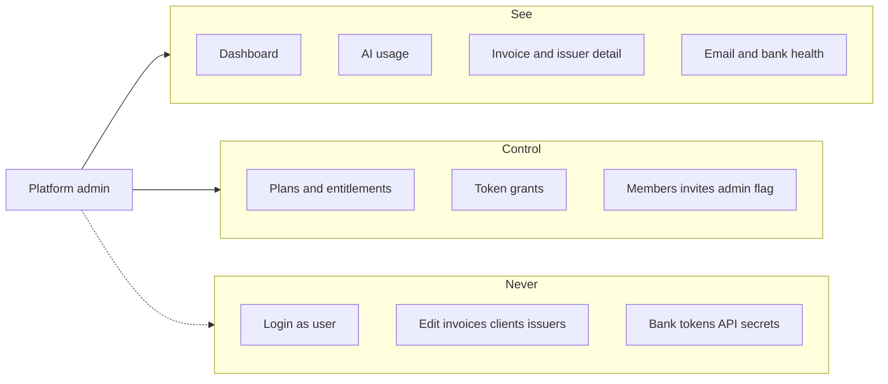

# Platform admin console

**Plans:** 18 (gate + lists) · **18b** (monitor) · later 18c (support control).
**ADR:** [0024](../decisions/0024-platform-admin-user-flag.md).

## Goal

Give a human operator a single `/admin` console that **sees every tenant and
every product signal**, and can **intervene on platform objects** (plans,
tokens, access). It does not operate a tenant’s books. Support happens as
read-only drill-down inside `/admin`, never by logging in as the user.

## See vs control vs never

|             | In `/admin`                                                                              | Not in `/admin`                                                                       |
| ----------- | ---------------------------------------------------------------------------------------- | ------------------------------------------------------------------------------------- |
| **See**     | Cross-tenant lists and details, product health (AI, email, banks), audit of admin writes | Infra logs (Better Stack / Vercel), raw secrets                                       |
| **Control** | Plans, token grants, members/invites, platform-admin flag, workspace rename/delete       | Invoice issue/cancel/edit, client/issuer mutations, look builder                      |
| **Never**   | —                                                                                        | Impersonation, MCP/Eve inheriting `platform_role`, bank ciphertext, API key plaintext |

Phase 2 (not this spec’s implementation) adds freeze, session/key revoke, email
suppression lift, community-look unpublish. Those need an ADR when they land.

## Inputs / outputs

- **Gate:** `users.platform_role = admin` via `requirePlatformAdmin()`. Layout
  of `app/(admin)` is the backstop. Env allowlist only promotes.
- **Reads:** `apps/web/lib/admin/*` only. Product code keeps `workspace_id`
  predicates.
- **Writes:** existing Plan 18/26 mutations; every write records
  `security_audit_events` with a `platform_*` type.
- **i18n:** `Admin.*` in `cs` / `en`. No hardcoded chrome.

## Approach

### Dashboard

SQL aggregates (never `select()` of every invoice). Cards for users,
workspaces, invoices, issuers, AI remaining vs 30-day LLM burn, plan mix,
7-day email bounce/complaint, bank connections in error. Monthly issued/paid
**counts** (currency-safe). 12-month issued volume **by currency** via
`formatMoneyByCurrency`. Status buckets are counts. Recent invoices link to
`/admin/invoices/[id]`.

### AI

`/admin/ai` — 30-day burn by product and day, remaining tokens by bucket, top
workspaces, grant ledger. Workspace detail shows the same facts for one tenant.

### Invoice / issuer detail

Read-only. Provenance, PDF/ISDOC links, email sends, import batch. No
issue/cancel/edit. Lists cap at `ADMIN_LIST_CAP` (2000) with an honest
“showing latest N” note.

### Audit

The platform log includes every `platform_*` type that mutations write,
including plan assign/update.

## Open questions / TODOs

- `TODO(plan-18c):` workspace freeze (`frozen_at`) and user disable — ADR
  required; fail closed on web/MCP/Eve writes, still readable.
- `TODO(plan-18c):` session list + revoke, API key prefix list + revoke
  (never show the secret).
- Infra cron last-run: Better Stack, not a Postgres job table, unless operators
  actually miss it.

## References

- [ADR 0024](../decisions/0024-platform-admin-user-flag.md)
- [ADR 0007](../decisions/0007-workspace-scoped-data-model.md)
- [plans-entitlements.md](./plans-entitlements.md)
- [ai-usage.md](./ai-usage.md)
- Roadmap Plan 18 / 18b
