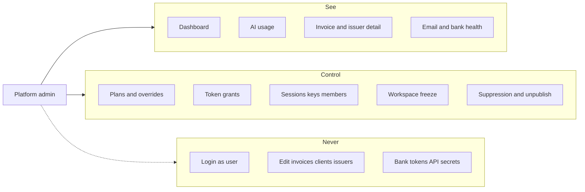

# Platform admin console

**Plans:** 18 (gate + lists) · **18b** (monitor) · **18c** (support control).
**ADR:** [0024](../decisions/0024-platform-admin-user-flag.md) ·
[0046](../decisions/0046-workspace-freeze.md).

## Goal

Give a human operator a single `/admin` console that **sees every tenant and
every product signal**, and can **intervene on platform objects** (plans,
tokens, access, occupancy). It does not operate a tenant’s books. Support
happens as read-only drill-down inside `/admin`, never by logging in as the
user.

## See vs control vs never

|             | In `/admin`                                                                                         | Not in `/admin`                                                                       |
| ----------- | --------------------------------------------------------------------------------------------------- | ------------------------------------------------------------------------------------- |
| **See**     | Cross-tenant lists and details, product health (AI, email, banks), audit of admin writes            | Infra logs (Better Stack / Vercel), raw secrets                                       |
| **Control** | Plans, overrides, token grants, members/invites, sessions/keys, freeze, suppression lift, unpublish | Invoice issue/cancel/edit, client/issuer mutations, look builder                      |
| **Never**   | —                                                                                                   | Impersonation, MCP/Eve inheriting `platform_role`, bank ciphertext, API key plaintext |

## Inputs / outputs

- **Gate:** `users.platform_role = admin` via `requirePlatformAdmin()`. Layout
  of `app/(admin)` is the backstop. Env allowlist only promotes.
- **Reads:** `apps/web/lib/admin/*` only. Product code keeps `workspace_id`
  predicates.
- **Writes:** `apps/web/lib/admin/*` mutations; every write records
  `security_audit_events` with a `platform_*` type. Tenant helpers
  (disconnect, unpublish, key delete) are reused, not forked.
- **i18n:** `Admin.*` in `cs` / `en`. No hardcoded chrome.

## Approach

### Dashboard (18b)

SQL aggregates (never `select()` of every invoice). Cards for users,
workspaces, invoices, issuers, AI remaining vs 30-day LLM burn, plan mix,
7-day email bounce/complaint, bank connections in error. Monthly issued/paid
**counts** (currency-safe). 12-month issued volume **by currency** via
`formatMoneyByCurrency`. Status buckets are counts. Recent invoices link to
`/admin/invoices/[id]`. Frozen workspace count may sit on the workspaces
card once 18c lands.

### AI (18b)

`/admin/ai` — 30-day burn by product and day, remaining tokens by bucket, top
workspaces, grant ledger. Workspace detail shows the same facts for one tenant.

### Invoice / issuer detail (18b)

Read-only. Provenance, PDF/ISDOC links, email sends, import batch. No
issue/cancel/edit. Lists cap at `ADMIN_LIST_CAP` (2000) with an honest
“showing latest N” note. 18c adds a suppression-lift control when the
recipient is on `email_suppressions`.

### Sessions and keys (18c)

On **user detail**, list:

- `sessions` — `id`, `ip_address`, `user_agent`, `created_at`, `updated_at`,
  `active_organization_id`. Never select `token`.
- `trusted_devices` — existing Plan 16 rows; revoke via
  `revokeTrustedDevice`.
- `api_keys` — `id`, `name`, `start` / `prefix`, `enabled`, `created_at`,
  `last_request`. Never select `key`.
- Drive devices — revoke via the existing Drive helper (same “cut a
  credential” job).

Revoke is delete/disable of that row. Actor is the platform admin;
`platform_session_revoke` / `platform_device_revoke` /
`platform_api_key_revoke` / `platform_drive_device_revoke` go on the
platform audit log.

### Entitlement overrides (18c)

`workspaces.entitlement_overrides` already merges over the plan
([ADR 0035](../decisions/0035-plans-are-shared-entitlement-rows.md)). The
workspace page already shows “Has overrides”. 18c adds a **sectioned form**
reusing the plan-entitlement fields, plus clear-overrides. Save parses
`EntitlementsSchema` / the override partial — no raw JSON. This is the
one-off; a shared exception belongs on the plan row.

### Workspace freeze (18c)

[ADR 0046](../decisions/0046-workspace-freeze.md). Occupancy column, not an
entitlement. `assertWorkspaceWritable` in `@invoicey/db` fails closed on
tenant writes across web, MCP/Eve, companion, Drive writes, and insert/email
crons. Reads and platform-admin mutations stay open. Members can still sign
in and see a banner. Issued artifacts stay reachable.

### Email suppression lift (18c)

`email_suppressions` is `(workspace_id, email, reason)`. Workspace detail
lists them; invoice detail can lift the To/Cc that blocked a send. Lift
deletes the row. Automated sends work again; this is not a global Resend
suppression editor.

### Community-look unpublish (18c)

`unpublishCommunityLookRows` already sets `unpublished_at` for the publisher
workspace. `/admin` lists live `community_looks` (look id, version,
publisher workspace) and calls the same helper. The look document in the
workspace is untouched.

### Bank disconnect (18c)

Workspace detail lists connections: provider, status, last error, last sync
— never `secret_ciphertext`. Disconnect calls `deleteFioConnection` /
`deleteMonetaConnection`, which already overwrite the secret with
`disconnected` and keep the ledger.

### Audit

The platform log includes every `platform_*` type that mutations write,
including 18c revoke / freeze / override / lift / unpublish / disconnect.

## Open questions / TODOs

- `TODO(plan-18d):` user disable (`users.disabled_at`) — fail closed on
  that user’s sessions and machine credentials; orthogonal to workspace
  freeze.
- Infra cron last-run: Better Stack, not a Postgres job table, unless
  operators actually miss it.

## References

- [ADR 0024](../decisions/0024-platform-admin-user-flag.md)
- [ADR 0046](../decisions/0046-workspace-freeze.md)
- [ADR 0007](../decisions/0007-workspace-scoped-data-model.md)
- [ADR 0035](../decisions/0035-plans-are-shared-entitlement-rows.md)
- [plans-entitlements.md](./plans-entitlements.md)
- [ai-usage.md](./ai-usage.md)
- [account-security.md](./account-security.md)
- [email.md](./email.md)
- [pdf-looks-community.md](./pdf-looks-community.md)
- Roadmap Plan 18 / 18b / 18c
