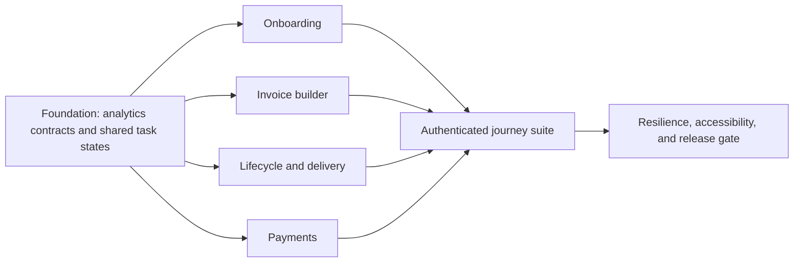

# Production UX finish program

> **Shipped, with one lane narrowed.** This program was merged to `main` on
> 2026-08-26. Incoming invoices were removed from the product the same day, so
> the incoming half of Lane 5 no longer applies — it is struck from the
> deliverables below rather than deleted, because the payments half shipped and
> the lane numbering is referenced elsewhere. See
> [roadmap](../roadmap.md), Plan 24.

**Status:** implementation verified; final independent review pending  
**Branch:** `codex/production-ux-finish`  
**Source evidence:** [current user-flow audit](../audit/invoicey-current-user-flow.md) and [seamless UX pass](./seamless-ux-pass.md)

## Goal

Make Invoicey fast and understandable for a Czech business to configure, issue and send invoices, understand their lifecycle, and reconcile payments. The work deepens existing product contracts; it does not replace the structured invoice model, accounting history, workspace isolation, or explicit human approval boundaries.

The only excluded recommendation is live research or acceptance by external users. Automated heuristics, consented product analytics, deterministic browser journeys, accessibility checks, and test-transport verification remain in scope.

## Product invariants

- The first issued invoice is the activation goal.
- The seller is always a real workspace issuer; no flow invents identity, UUID, IČO, address, or bank data.
- Issuing freezes snapshots and assigns the number. Draft recovery must not bypass server validation or issue automatically.
- Sending email, confirming bank matches, and cancellation remain explicit human actions.
- Active payment allocations block cancellation, with the invoice-row lock preserving the race invariant.
- Analytics requires measurement consent and never includes invoice text, customer identity, email address, invoice number, monetary amount, bank data, API keys, or document contents.
- All visible copy is present in Czech and English catalogs. Invoice document language remains independent from UI locale.
- Shared app routes retain the standard width shell and calm surface-based feedback.

## Delivery topology

The work is separated into merge-reviewable lanes even when a shared catalog or test fixture makes fully independent branch merges unsafe.

Recommended commit boundaries:

1. `feat(web): add consent-aware product journey analytics`
2. `feat(web): harden onboarding and recover invoice drafts`
3. `feat(web): clarify invoice delivery and lifecycle actions`
4. `feat(web): guide payment work`
5. `test(web): cover authenticated mobile and accessibility journeys`
6. `docs: record production UX verification`

## Lane 1 — measurable golden paths

### Deliverables

- Add one consent-aware client API for a small allowlist of journey events.
- Emit only state transitions: onboarding started/completed, invoice draft saved/recovered/issued, invoice email requested, and payment match confirmed.
- Keep properties low-cardinality and non-sensitive: route kind, creation entry (`structured`, `ai`, `json`, `duplicate`), document type, currency code, lifecycle status, and boolean readiness flags.
- Unit-test the allowlist, consent gate, and sensitive-property rejection.

### Evidence

- With measurement consent absent, no analytics call is made.
- An attempted property such as `email`, `invoiceNumber`, `amount`, or arbitrary free text is rejected by type/runtime validation.
- Events can be asserted through a test adapter without loading Vercel Analytics.

## Lane 2 — onboarding completion and recovery

### Deliverables

- Validate `?done=<issuerId>` against the active workspace before showing completion.
- Let a new local action or validation message replace a stale query-derived error and remove the stale query state after retry.
- Persist only the unfinished welcome form in session storage, scoped to workspace; restore it after reload and clear it on completion or explicit reset.
- Make the completion view show the next three useful actions: create the first invoice, review business settings, or open the dashboard.
- Keep ARES-first setup, embedded-ISDOC bootstrap, bank explanation, and skip behavior intact.

### Evidence

- A crafted or stale issuer ID cannot produce a false completion state.
- Reloading the wizard restores non-sensitive identity/bank inputs for the active workspace only.
- Completing or resetting onboarding removes the recovery record.
- Czech and English browser checks reach the first-invoice CTA without horizontal overflow.

## Lane 3 — fast structured invoice creation

### Deliverables

- Add local recovery for an unsaved new structured invoice, scoped to workspace and issuer context, with a visible recovered/saved-local state and an explicit discard control.
- Add keyboard submission for saving a draft (`Ctrl/Cmd+S`) without ever triggering issuance.
- Preserve and clarify last-invoice suggestions under the related inputs.
- Improve line-item speed: autofocus the new line description, expose an accessible duplicate-line action, and keep remove controls understandable on mobile.
- Keep field-level errors, first-invalid focus, server schemas, PDF preview, multi-currency, VAT modes, and per-invoice language unchanged.

### Evidence

- Reload recovers a new unsaved draft; successful server save/issue clears it.
- The shortcut submits the draft action only.
- Line duplication copies business values but creates no identifier.
- Keyboard and mobile Playwright paths can add, duplicate, and remove a line.

## Lane 4 — delivery and lifecycle clarity

### Deliverables

- Turn the email sheet into a preflight: validate recipient/Cc, summarize sender, reply-to, PDF and optional ISDOC, and block suppressed/invalid recipients before submission.
- Explain delivery states in the timeline and show a clear resend path for failed, bounced, delayed, or complained deliveries without hiding the prior attempt.
- Add one lifecycle guidance surface on invoice detail that explains the current accounting state and the most relevant safe next action.
- Use the same status and payment wording across detail, list, dashboard, email history, and bulk actions.

### Evidence

- Invalid/suppressed recipients cannot submit; a valid configured transport can.
- A resend creates a new email attempt while history remains visible.
- Draft, unpaid, partial, overdue, paid, overpaid, future, and cancelled states render localized guidance.
- Cancellation and allocation race tests continue to pass.

## Lane 5 — guided payments

### Deliverables

- Explain why each bank match was proposed (variable symbol, exact amount, account, date window) and what confirmation changes.
- Separate proposed matches, unmatched transactions, manual entry, and history with task-oriented empty states and mobile-safe layouts.
- Preserve confirm-first behavior; no suggestion silently allocates a payment.

### Evidence

- Match explanations are deterministic from stored proposal factors.
- Partial/overpayment and reversal history remain localized and inspectable.
- Workspace authorization and explicit accept/reject/confirm boundaries remain server-enforced.

## Lane 6 — mobile, accessibility, resilience, and UI consistency

### Deliverables

- Add authenticated Playwright coverage using the existing test-only agent session and deterministic seeded state.
- Cover desktop and Pixel 7 for onboarding, new invoice recovery/lines, invoice detail delivery, payments, and app navigation.
- Run axe on representative authenticated pages and assert one page-level heading, landmarks, accessible names, keyboard focus, and no horizontal overflow.
- Strengthen error recovery with actionable localized route errors and a privacy-safe structured reporting seam using the installed Next.js runtime contract; do not add an external vendor or log sensitive payloads.
- Reuse shared task-state, status, form-help, and feedback patterns instead of page-specific card variants.

### Evidence

- Targeted unit/integration suites pass.
- Public and authenticated Playwright suites pass in both configured projects.
- Axe reports no serious or critical violations on representative routes.
- Lint, typecheck, full tests, production build, and `git diff --check` pass.

## Autonomous acceptance matrix

| Requirement                       | Authoritative evidence                                                           |
| --------------------------------- | -------------------------------------------------------------------------------- |
| Measurement without personal data | analytics contract tests plus consent-off browser assertion                      |
| Reliable first run                | workspace-scoped server lookup, recovery tests, Czech/English browser journeys   |
| Fast invoice entry                | builder unit tests and keyboard/mobile browser journey                           |
| Understandable sending            | validation tests, test transport send/resend, delivery timeline browser evidence |
| Coherent lifecycle                | exhaustive status mapping tests and invoice detail snapshots/screenshots         |
| Explainable reconciliation        | proposal-factor tests and payment page browser evidence                          |
| Accessible responsive UI          | Playwright desktop/mobile plus axe                                               |
| Recoverable production behavior   | error-boundary/reporting tests, full CI gates, successful production build       |
| Consistent UI and wording         | CS/EN key parity, ICU validation, shared component inspection                    |

## Release gate

- [x] Every deliverable above has direct code or runtime evidence.
- [x] No external email, bank payment, production invoice, or live customer data was mutated during verification.
- [x] `bun run lint` — 0 errors; 12 unchanged warnings.
- [x] `bun run typecheck` — 9/9 tasks.
- [x] `bun run test` — 7/7 tasks. At the time this program shipped: web 37 files and 149 tests; invoice tools 11 files and 73 tests, including recipient suppression/transport guards, malformed onboarding query recovery, credit-note payment exclusion, and incomplete-draft recovery. After the incoming-invoice removal on 2026-08-26 the same gates pass at web 34 files and 136 tests; the difference is payment-run and incoming-queue coverage that went with the feature.
- [x] Production build — `next build --webpack` compiled, typechecked, and generated all 90 routes. The configured Turbopack command is separately blocked in this local sandbox when its MDX loader attempts an internal loopback bind.
- [x] Authenticated Playwright — 37/37 desktop and Pixel 7 checks, including agent-session bootstrap, seeded welcome redirect, sidebar navigation, seeded invoice lifecycle/email preflight, recovery/keyboard/line controls, public and authenticated axe checks, landmarks, and overflow.
- [x] `git diff --check`
- [x] Scoped Prettier check for all intended TypeScript, TSX, and JSON changes; the generated locale declaration remains generator-owned.
- [ ] Fresh Sol/High review returns `ship`.
- [x] Implementation branch is merged to `main` (PR #14, 2026-08-26).

Human follow-up after release remains limited to real-user usability sessions, legal/commercial approval, live-provider acceptance, and production branch-protection/edge configuration that cannot be changed from this repository alone.
