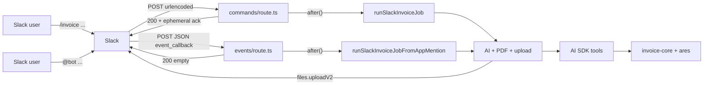

# Slack bot — stateless demo (Plan 13a)

## Goal

Let a user post a single Slack message and receive a rendered Czech invoice PDF + ISDOC XML in-thread, with **no** database persistence. The bot is a thin shell over [`@invoicey/invoice-core`](../../packages/invoice-core/) and [`@invoicey/ares`](../../packages/ares/); a Vercel AI SDK agent aggregates the message into an `InvoiceSchema`-valid payload via tool calls, and the deterministic core renders.

This is the **stateless demo** track — see also [`docs/roadmap.md`](../roadmap.md) Plan 13a vs. 13b.

## Scope

### In scope

- **`/invoice <free-text Cz/En>`** slash command in a Slack workspace.
- **`@YourBot <free-text>`** in a channel or thread (`app_mention` via Events API); leading `<@…>` tokens are stripped before the AI sees the text.
- AI agent (Vercel AI SDK) with a fixed tool surface: ARES lookup, totals computation, payload validation, PDF render, ISDOC render.
- Reply in-thread with the PDF and ISDOC as Slack file uploads.
- Single demo issuer, read from env (override) or a hard-coded sample.
- Czech-language failure messages with the offending fields.

### Out of scope (for 13a; revisit in 13b)

- DB writes, real numbering (`nextInvoiceNumber`), draft persistence.
- "Issue" / "Mark paid" / "Send by email" follow-up actions.
- Multi-issuer disambiguation or workspace lookup.
- MCP server (Plan 12) — tools are designed to be portable but **not** exposed as MCP yet.
- Auth / Slack-user → Invoicey-user mapping (Plan 14).

## References

- [Vercel AI SDK — generateText with tools](https://ai-sdk.dev/docs/foundations/tools)
- [Vercel AI Gateway](https://vercel.com/docs/ai-gateway)
- [`slack-edge`](https://github.com/seratch/slack-edge) — Slack receiver designed for Web Standard `Request`/`Response` (Vercel-compatible).
- [Slack — Slash commands](https://api.slack.com/interactivity/slash-commands)
- [Slack — `chat.postMessage`](https://api.slack.com/methods/chat.postMessage), [`files.uploadV2`](https://docs.slack.dev/reference/methods/files.uploadV2/)
- [`docs/architecture.md`](../architecture.md), [`docs/specs/ares.md`](./ares.md), [`docs/specs/isdoc.md`](./isdoc.md), [`docs/specs/pdf-rendering.md`](./pdf-rendering.md)

## Architecture



### Entry points

| Entry | Route | Ack | User feedback |
| ----- | ----- | --- | ------------- |
| Slash `/invoice` | [`apps/web/app/api/slack/commands/route.ts`](../../apps/web/app/api/slack/commands/route.ts) | JSON ephemeral in HTTP response | `response_url` + channel summary message |
| `@bot` mention | [`apps/web/app/api/slack/events/route.ts`](../../apps/web/app/api/slack/events/route.ts) | `200` with empty body | `chat.postEphemeral` + in-thread `chat.postMessage` + uploads |

### Where it lives

- **Slash command:** `apps/web/app/api/slack/commands/route.ts` (Node runtime — `@react-pdf/renderer` needs Node, see [`specs/pdf-rendering.md`](./pdf-rendering.md)).
- **Events API (`app_mention`):** `apps/web/app/api/slack/events/route.ts` (same runtime / `maxDuration`; verifies the same signing secret on JSON bodies).
- Shared worker logic: `apps/web/lib/slack/run-slack-invoice-job.ts` (`runSlackInvoiceJob` vs `runSlackInvoiceJobFromAppMention`).
- Optional later: extract to `apps/slack` when DB persistence (13b) lands; tools and worker move unchanged because they only depend on `@invoicey/invoice-core` + `@invoicey/ares`.

## Slack flow: slash command

1. **Incoming.** Slack POSTs `application/x-www-form-urlencoded` to `/api/slack/commands` with `command=/invoice`, `text=<user input>`, `user_id`, `team_id`, `channel_id`, `response_url`.
2. **Signature verification.** [`verifySlackRequest`](../../apps/web/lib/slack/verify-slack-request.ts) checks `X-Slack-Signature` + `X-Slack-Request-Timestamp` against `SLACK_SIGNING_SECRET`. Reject any timestamp older than 5 minutes.
3. **3-second ack.** Return `{ response_type: "ephemeral", text: "Generuji fakturu…" }`. Slack drops the connection if we don't ack in 3 s.
4. **Background work.** `after()` from `next/server` runs `runSlackInvoiceJob` after the response is sent.
5. **AI agent.** `generateText` with tools + user text in `prompt`. The model loops until `assemble_and_validate` returns `ok: true`, then calls `render_pdf` and `render_isdoc`.
6. **Reply.** `response_url` for progress/errors/ephemeral success; `chat.postMessage` + `files.uploadV2` on a new top-level message in the channel, files threaded under that summary.
7. **Failure.** Czech-language ephemeral message via `response_url`; details logged server-side.

## Slack flow: `app_mention`

1. **Incoming.** Slack POSTs JSON to `/api/slack/events` with `type: "event_callback"` and `event.type: "app_mention"` (`text`, `user`, `channel`, `ts`, optional `thread_ts`).
2. **`url_verification`.** On first install, Slack sends `type: "url_verification"` with a `challenge`; respond with `{ "challenge": "<value>" }` (same signature headers).
3. **Signature verification.** Same HMAC as slash commands on the **raw JSON body**.
4. **Fast ack.** Return `200` with an empty body immediately (no 3 s strict limit for events, but keep ack fast). Ignore non-`app_mention` callbacks (and events with `bot_id`).
5. **Background work.** `after()` runs `runSlackInvoiceJobFromAppMention` with `commandText` = [`stripLeadingSlackMentions`](../../apps/web/lib/slack/strip-leading-slack-mentions.ts)(`event.text`) and `thread_ts` = `event.thread_ts ?? event.ts` so replies stay in the correct thread.
6. **User feedback.** `chat.postEphemeral` to the mentioning user for "Generuji…", errors, and success hint; `chat.postMessage` + `files.uploadV2` in the thread (same PDF/ISDOC pattern as slash).

### Idempotency note

Slack may **retry** `event_callback` if delivery fails. This implementation does **not** dedupe by `event_id`; duplicate mentions can run the pipeline twice until a persistent dedupe store is added (13b+).

### Why `after()` and Node runtime

- Slack requires < 3 s ack; AI tool loops + PDF render exceed that.
- `after()` runs the continuation in the same Function invocation after the response is flushed (Vercel Functions support).
- `@react-pdf/renderer` requires the Node runtime (`export const runtime = "nodejs"` on the route).

## AI configuration

### Model selection

| Var                          | Default                  | Purpose                                                                    |
| ---------------------------- | ------------------------ | -------------------------------------------------------------------------- |
| `INVOICEY_AI_MODEL`          | `openai/gpt-4o-mini`     | Primary model via [Vercel AI Gateway](https://vercel.com/docs/ai-gateway). |
| `INVOICEY_AI_FALLBACK_MODEL` | `anthropic/claude-haiku` | Fallback if primary errors.                                                |
| `AI_GATEWAY_API_KEY`         | _(required)_             | Gateway API key.                                                           |

`generateText` is called with `model: gateway(process.env.INVOICEY_AI_MODEL ?? "openai/gpt-4o-mini")`.

### System prompt (skeleton)

```text
You are an invoicing assistant for a single Czech freelancer/company.

Rules:
- Always respond by calling tools, never by inventing fields.
- Currency is always CZK. Language is always cs. Date format YYYY-MM-DD.
- Doc type defaults to "invoice". Pick "proforma" only if the user says
  "proforma" / "zálohová" / "advance".
- Default issue date is today (Europe/Prague).
- Default due date is issue date + 14 days unless the user specifies.
- Default payment method is "transfer".
- For the client: if the user gives an IČO (8 digits), call lookup_business
  first. If no IČO, ask via the assemble_and_validate failure path.
- Never invent IČO, DIČ, IBAN, or account numbers.
- Compute line totals via compute_totals; do not arithmetic in your head.
- After assemble_and_validate returns ok:true, call render_pdf AND render_isdoc.

Issuer (locked, do not modify):
<inline JSON of IssuerSnapshot>
```

### Tool surface

Each tool is a thin wrapper around an existing function. Tool input/output is described as a Zod schema; the AI SDK turns it into a JSON Schema for the model.

| Tool                    | Input                                                                | Output                                                                                                                 | Wraps                                                                                               |
| ----------------------- | -------------------------------------------------------------------- | ---------------------------------------------------------------------------------------------------------------------- | --------------------------------------------------------------------------------------------------- |
| `lookup_business`       | `{ ico: string /* 8 digits */ }`                                     | `{ ok: true; draft: ClientSnapshotDraft } \| { ok: false; reason: "not_found" \| "invalid_response" \| "http_error" }` | `fetchAresEkonomickySubjekt` from [`@invoicey/ares`](../../packages/ares/src/client.ts)             |
| `parse_amount_cz`       | `{ input: string }`                                                  | `{ amount: number }`                                                                                                   | New helper; handles `"50 000 Kč"`, `"50.000,-"`, `"50000.50"`. Returns `amount` in CZK as a number. |
| `compute_due_date`      | `{ issueDate: string; daysFromIssue?: number }`                      | `{ dueDate: string }`                                                                                                  | `date-fns` `addDays`; default 14.                                                                   |
| `compute_totals`        | `{ items: InvoiceItem[]; vat: InvoiceVat; issuerVatPayer: boolean }` | `Totals`                                                                                                               | `calcTotals` from `@invoicey/invoice-core`                                                          |
| `assemble_and_validate` | `Invoice` (full payload)                                             | `{ ok: true; invoice: Invoice } \| { ok: false; issues: { path: string; message: string }[] }`                         | `InvoiceSchema.safeParse`                                                                           |
| `render_pdf`            | `{ invoice: Invoice }`                                               | `{ bytesBase64: string; filename: string }`                                                                            | `renderInvoicePdf`                                                                                  |
| `render_isdoc`          | `{ invoice: Invoice }`                                               | `{ xml: string; filename: string }`                                                                                    | `renderIsdoc`                                                                                       |

The AI **never** drafts ISDOC XML, never sums totals, never invents an invoice number. The number for the demo is a placeholder produced by `assemble_and_validate`'s caller before validation: `DRAFT-{yyyymmdd-hhmm}`. Real numbering ships with Plan 13b.

### Tool-call discipline

- `assemble_and_validate` is the loop's pivot. The model is expected to read `issues[*].path` and call other tools (e.g. `lookup_business`) to fix and retry.
- `maxSteps: 8` — six retries on validation, then a final render pair if `ok: true`. Tweakable via env later.
- Render tool outputs are returned to the model only as size + filename (not full bytes) to keep the context small. The worker keeps the bytes locally and uploads them to Slack after the loop finishes.

## Demo issuer

```ts
// apps/web/lib/demo-issuer.ts
import { IssuerSnapshotSchema } from "@invoicey/invoice-core/schema";

const FALLBACK = {
  /* hard-coded sample matching IssuerSnapshotSchema; mirrors
     packages/invoice-core/src/__fixtures__/invoices/proforma.json issuer */
};

export function getDemoIssuer() {
  const raw = process.env.INVOICEY_DEMO_ISSUER_JSON;
  return IssuerSnapshotSchema.parse(raw ? JSON.parse(raw) : FALLBACK);
}
```

The fallback is included in source so the bot works on a fresh deploy with only the Slack + AI Gateway env vars.

## Failure modes

| Source                                              | Detection                             | User-facing reply                                                                                                                      |
| --------------------------------------------------- | ------------------------------------- | -------------------------------------------------------------------------------------------------------------------------------------- |
| Bad signature / stale timestamp                     | HMAC verifier in `verifySlackRequest` | HTTP 401, no Slack reply                                                                                                               |
| Model exits without `assemble_and_validate ok:true` | `ok: false` after `maxSteps`          | "Nepodařilo se sestavit fakturu — chybí: <comma-separated `issues[*].path`>"                                                           |
| Tool throws                                         | try/catch around `generateText`       | "Interní chyba: <error.message>" + log full stack                                                                                      |
| ARES 404                                            | `lookup_business` returns `not_found` | The model is expected to ask the user via the next `assemble_and_validate` failure path; if it doesn't, surface "Nenalezeno IČO {ico}" |
| Render error                                        | `render_pdf` / `render_isdoc` throws  | "Chyba při generování PDF / ISDOC"                                                                                                     |
| Slack file upload fails                             | `files.uploadV2` non-OK               | Post the message anyway with text "(soubory se nepodařilo nahrát do Slacku)" + log                                                     |

All failure paths log structured JSON `{ event, traceId, slackTeamId, slackChannelId, error }` server-side; nothing PII-sensitive in the log.

## Environment variables

Add these to [`docs/architecture.md`](../architecture.md) env table when 13a ships and to repo `.env.example`.

| Var                          | Required | Default                  | Purpose                                                             |
| ---------------------------- | -------- | ------------------------ | ------------------------------------------------------------------- |
| `SLACK_BOT_TOKEN`            | yes      | —                        | `xoxb-…` bot OAuth: `commands`, `app_mentions:read`, `chat:write`, `files:write` |
| `SLACK_SIGNING_SECRET`       | yes      | —                        | HMAC verification                                                   |
| `AI_GATEWAY_API_KEY`         | yes      | —                        | Vercel AI Gateway key                                               |
| `INVOICEY_AI_MODEL`          | no       | `openai/gpt-4o-mini`     | Primary model                                                       |
| `INVOICEY_AI_FALLBACK_MODEL` | no       | `anthropic/claude-haiku` | Fallback model                                                      |
| `INVOICEY_DEMO_ISSUER_JSON`  | no       | hard-coded sample        | `IssuerSnapshot` JSON override                                      |

## Slack app manifest (sketch)

```yaml
display_information:
  name: Invoicey (demo)
features:
  bot_user:
    display_name: Invoicey
  slash_commands:
    - command: /invoice
      url: https://<deployment>/api/slack/commands
      description: Vygeneruj fakturu z popisu (demo)
      usage_hint: "NFCtron 50000 retainer splatnost 14"
oauth_config:
  scopes:
    bot:
      - commands
      - app_mentions:read
      - chat:write
      - files:write
settings:
  event_subscriptions:
    request_url: https://<deployment>/api/slack/events
    bot_events:
      - app_mention
  interactivity:
    is_enabled: false
```

Use the **same** `SLACK_SIGNING_SECRET` for slash commands and Events API. After changing scopes or event URLs, **reinstall** the app to the workspace.

Interactivity stays disabled for 13a — no buttons, no modals. 13b adds `interactive_components` for the "Issue" button.

## Test plan

| Layer                  | What                                                                                                           | How                                                                                                                                                                                                                                                                                         |
| ---------------------- | -------------------------------------------------------------------------------------------------------------- | ------------------------------------------------------------------------------------------------------------------------------------------------------------------------------------------------------------------------------------------------------------------------------------------- |
| Tool unit tests        | Each tool wrapper (`lookup_business`, `compute_totals`, `assemble_and_validate`, `render_pdf`, `render_isdoc`) | Vitest, mirroring [`packages/invoice-core/src/plan03-render.test.ts`](../../packages/invoice-core/src/plan03-render.test.ts). Network-dependent ARES test uses recorded fixture.                                                                                                            |
| Worker integration     | Replay a fake LLM transcript that exercises one happy path + one validation-retry path                         | Stub `generateText` with a deterministic step list; assert it ends with valid `Invoice` + non-empty PDF + ISDOC validating against the vendored XSD ([`packages/invoice-core/assets/schemas/isdoc-invoice-6.0.2.xsd`](../../packages/invoice-core/assets/schemas/isdoc-invoice-6.0.2.xsd)). |
| Signature verification | Reject stale timestamp / bad signature                                                                         | Vitest in [`apps/web/lib/slack/parse-verify.test.ts`](../../apps/web/lib/slack/parse-verify.test.ts)                                                                                                                                                                                        |
| Smoke                  | `/invoice …` and `@Invoicey …` in a workspace                        | Manual                                                                                                                                                                                                                                   |

## Open questions / TODOs

- `TODO(plan-13a-impl):` add `slack` to the `commitlint` `scope-enum` only if/when we extract `apps/slack`. Until then, all 13a commits use scope `web` or `docs`.
- `TODO(plan-13a-impl):` decide if the slash command should run on Vercel **Edge** runtime for the ack and hand off to a Node Function for the worker, or stay all-Node with `after()`. Default plan: all-Node with `after()` for simplicity.
- `TODO(plan-13b):` introduce DB persistence; replace `DRAFT-…` placeholder with `nextInvoiceNumber`; gate "Issue" behind a Slack interactivity button.
- `TODO(plan-12):` lift this exact tool surface into an MCP server (`apps/mcp`) so Cursor / Claude Desktop can use the same toolkit.
