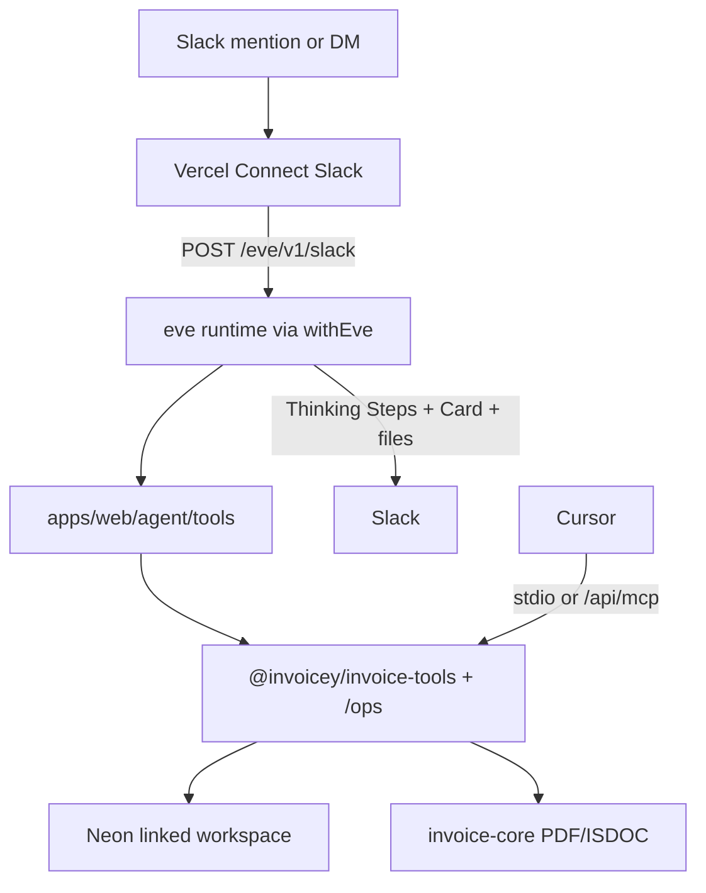

# Slack Eve agent (Plan 13b)

Durable Slack invoicing agent on [Vercel Eve](https://eve.dev/docs), mounted in `@invoicey/web` via `withEve()`. Supersedes the Plan 13a hand-rolled AI loop.

## Architecture



| Piece         | Location                                                                                                     |
| ------------- | ------------------------------------------------------------------------------------------------------------ |
| Agent root    | [`apps/web/agent/`](../../apps/web/agent/)                                                                   |
| Mount         | [`apps/web/next.config.ts`](../../apps/web/next.config.ts) — `withEve(nextConfig)` → `/eve/v1/*`             |
| Slack channel | `agent/channels/slack.ts` — Connect + **live feedback** event overrides (Thinking Steps + invoice Cards)     |
| HTTP channel  | `agent/channels/eve.ts` — Bearer ops key (`EVE_API_KEY` / `MCP_API_KEY`) **or** user PAT + OIDC + `localDev` |
| Domain ops    | `@invoicey/invoice-tools/ops` (`issueInvoiceById`, `markInvoicePaidById`, list/get)                          |
| Create/render | `@invoicey/invoice-tools` (`createAndRenderInvoice`, presets, ARES)                                          |

### Slack live feedback

Invoicey’s Slack channel overrides Eve defaults for richer UX (Linear-style progress):

| Phase        | Mechanism                                                                                                                                    |
| ------------ | -------------------------------------------------------------------------------------------------------------------------------------------- |
| Turn start   | Typing `Working…`; Thinking Steps stream opens on the **first tool batch** (clarify-only turns stay quiet)                                   |
| Tool calls   | `chat.appendStream` `task_update` chunks with domain labels (ARES, create draft, upload, …)                                                  |
| HITL         | Stream stops with “Waiting for approval…” **before** Eve Allow/Deny cards; `session.waiting` is a safety net                                 |
| Tool results | Stash invoice/list Card payload; mark tasks complete with a short result snippet (no View link on the step)                                  |
| Final reply  | Stop stream with **Card only** when a card exists (no model markdown, no extra View task); otherwise markdown. Fallback: `thread.post(Card)` |
| Artifacts    | PDF/ISDOC file uploads stay separate thread messages                                                                                         |

Helpers: `agent/lib/slack-thinking-stream.ts`, `slack-invoice-card.ts`, `slack-tool-labels.ts`, `slack-channel-extras.ts`.

**Auth policy**

| Surface                      | Gate                                                                                                                                                                                        |
| ---------------------------- | ------------------------------------------------------------------------------------------------------------------------------------------------------------------------------------------- |
| Slack                        | Vercel Connect, then **explicit identity link** (ADR 0020). Unlinked callers get a DM to `/slack/link/[code]` and no agent turn. Linked sessions overlay Invoicey `workspaceId` + `userId`. |
| HTTP `/eve/v1/*` (non-Slack) | Bearer ops key (`EVE_API_KEY` / `MCP_API_KEY`) — Eve channel cannot import server-only PAT verify; user PATs remain on remote MCP                                                           |
| Invoice data                 | Slack: confirmed workspace on `slack_identities`. Eve HTTP: `INVOICEY_DEFAULT_WORKSPACE_ID`                                                                                                 |

**Out of v1:** slash `/invoice`, calling remote `/api/mcp` from Eve, per-click HITL principal, migrating historical ops-workspace invoices. (Human auth is Better Auth OAuth — ADR 0018; HTTP machine auth is ops key or user PAT — ADR 0023; Slack tenancy is ADR 0020.)

### Slack identity linking

1. Unlinked mention/DM → mint or reuse a 15-minute `slack_link_codes` row. **Never post the URL in a channel.** DM it; ephemeral if DM fails; channel reply is only “I sent you a DM…”.
2. Signed-in user confirms at `/slack/link/[code]` against the **current** workspace (`activeOrganizationId`). No email matching.
3. Same Invoicey user may rebind workspace. A different user cannot take over until the original unlinks in Settings → Integrations.
4. Each turn: identity exists **and** a `members` row for `(userId, workspaceId)`. Tools fail closed (`not_linked`) without overlay attributes. `persistDraftInvoice` uses ALS `workspaceId`.
5. HITL Allow/Deny is still Slack-global. Keep the bot in a private channel; Allow is a second check, not identity. Membership is re-checked at tool execute.
6. AI usage meters against the linked Invoicey user/workspace. Slack principals are never stored as `users.id`.

## Tools

| Tool                                          | Notes                                                                                        |
| --------------------------------------------- | -------------------------------------------------------------------------------------------- |
| `search_business`                             | ARES by company name → matches with IČO + address                                            |
| `lookup_business`                             | ARES by IČO → full client draft                                                              |
| `list_presets` / `get_preset` / `save_preset` | Preset CRUD only when the user asks; never during invoice create. Placeholder UUIDs rejected |
| `create_invoice`                              | Draft persist + render; workspace issuer locked; no preset id args; auto-uploads in Slack    |
| `upload_invoice_files`                        | Explicit upload (by `invoiceId` or base64)                                                   |
| `list_invoices` / `get_invoice`               | Workspace-scoped follow-ups                                                                  |
| `issue_invoice`                               | `approval: always()` HITL; numbering + re-upload                                             |
| `mark_invoice_paid`                           | `approval: always()` HITL                                                                    |
| `send_invoice_email`                          | `approval: always()` HITL; PDF + optional ISDOC via Resend                                   |

Skill: `skills/create-czech-invoice.md`.

## You must (human-only setup)

The agent cannot complete these steps:

1. **Vercel CLI login** and link the Invoicey web project (`vercel link` from `apps/web` or the monorepo root that owns the project).
2. **Create Slack Connect client** and point the trigger at Eve:
   ```bash
   vercel connect create slack --triggers
   vercel connect detach <uid> --yes
   vercel connect attach <uid> --triggers --trigger-path /eve/v1/slack --yes
   ```
   UID must match `connectSlackCredentials("slack/invoicey")` in `agent/channels/slack.ts`.
3. In Connect **Advanced**: subscribe to `message.channels` (+ `message.groups` for private), scopes at least `channels:history` / `groups:history`, `files:write`, `files:read`, `chat:write`, `app_mentions:read`, `im:history`, `im:write`; **reinstall** the Slack app.
4. Deploy with experimental eve recognition:
   ```bash
   VERCEL_USE_EXPERIMENTAL_FRAMEWORKS=1 vercel deploy --prod
   ```
   (or `eve deploy` / ensure `withEve` generated services).
5. Set Vercel env: `DATABASE_URL`, `AI_GATEWAY_API_KEY` (or OIDC), `INVOICEY_DEFAULT_WORKSPACE_ID`, `EVE_API_KEY` and/or `MCP_API_KEY`, `NEXT_PUBLIC_APP_URL`, UploadThing if issuer assets needed. Optional: `INVOICEY_AI_MODEL`.
6. Invite the bot to the target channel; run the E2E checklist below once.
7. If Deployment Protection is on, supply a bypass secret for Connect / health checks.

**Runtime:** Node **24+** (eve engines). Local: `node -v` ≥ 24.

## What the agent implements

- `apps/web/agent/**`, `withEve`, domain API extract, Neon wiring, HITL tools, docs, `.env.example`, retirement of Plan 13a `/api/slack/*` routes.

## E2E checklist

| #   | Scenario                          | Pass                                                                                                                                                                                                                                                                                           |
| --- | --------------------------------- | ---------------------------------------------------------------------------------------------------------------------------------------------------------------------------------------------------------------------------------------------------------------------------------------------- |
| 1   | `@Invoicey` + NL invoice + IČO    | Draft in Neon; PDF+ISDOC in thread; reply has `invoiceId` + `/invoices/{id}`                                                                                                                                                                                                                   |
| 2   | Thread follow-up without `@`      | Session continues                                                                                                                                                                                                                                                                              |
| 3   | HITL **Issue**                    | Number from scheme; `issued_at`; new PDF                                                                                                                                                                                                                                                       |
| 4   | HITL **Mark paid**                | `paid_at` set                                                                                                                                                                                                                                                                                  |
| 5   | Unpaid list                       | `list_invoices` / `get_invoice` answer from Neon                                                                                                                                                                                                                                               |
| 6   | Presets                           | `save_preset` / `list_presets` hit Neon                                                                                                                                                                                                                                                        |
| 7   | Deploy                            | `GET /eve/v1/health` OK; Connect hits `/eve/v1/slack`                                                                                                                                                                                                                                          |
| 8   | Regression                        | Cursor MCP `create_invoice` + web Issue UI still work                                                                                                                                                                                                                                          |
| 9   | Live card / Thinking Steps        | One streamed progress message (or Card fallback) with domain task labels; final Card or stream includes **View in Invoicey**; PDF/ISDOC still upload as files. If streaming is unavailable, Vercel logs `[invoicey-slack] chat.startStream failed:` and the thread uses typing + a final Card. |
| 10  | List Card                         | `list_invoices` yields a compact multi-field Card (not a long prose table)                                                                                                                                                                                                                     |
| 12  | Unlinked Slack user               | No agent turn; DM with `/slack/link/…`; channel does not contain the URL                                                                                                                                                                                                                       |
| 13  | Confirm link in current workspace | Next Slack message creates invoices in that workspace; Settings shows the link                                                                                                                                                                                                                 |

## Deploy note

Production (`inveoiceyai-web` / https://invoicey.ditrich.me) builds with `VERCEL_USE_EXPERIMENTAL_FRAMEWORKS=1`. Eve requires **`ai` ^7** (peer of `eve@0.31.x`). Health probe:

```bash
curl -sS https://invoicey.ditrich.me/eve/v1/health
# {"ok":true,"status":"ready",...}
```

**Turbo remote cache:** `@invoicey/web` build must not be turbo-cached on Vercel. A cache hit can skip the `withEve` nitro packaging, leave `/eve/v1/*` as Next HTML, and make Slack Connect look “healthy” (HTTP 200 HTML) while Eve never runs. Guard: `apps/web/turbo.json` sets `build.cache: false` and includes `.eve/**` in outputs. Symptom of a bad deploy: `GET /eve/v1/health` returns marketing HTML/`404` instead of JSON `ready`, and `lambdaRuntimeStats.nodejs` drops (e.g. 4 instead of 7). Fix: promote the last Eve-good deployment or `vercel redeploy <id> --target production` (full rebuild).

**PDF fonts in Eve:** Next `outputFileTracingIncludes` does **not** ship into Eve’s nitro `__server.func`. Without assets, Slack `create_invoice` fails with `Missing invoice-core asset 'fonts/Inter-Regular.ttf'`. Guard: `withEve(..., { eveBuildCommand: "node ./scripts/eve-build-with-assets.mjs" })` copies `packages/invoice-core/assets` into the function after `eve build`, plus static `new URL(..., import.meta.url)` font refs in `register-fonts.ts`.

## Local smoke

```bash
# from apps/web (Node 24+)
bunx eve info
bunx eve build
curl -sS https://invoicey.ditrich.me/eve/v1/health
```

`bun dev` boots Next + eve via `withEve` when credentials allow.

## Related

- Historical Plan 13a: [`slack-bot.md`](./slack-bot.md)
- MCP toolkit: [`mcp.md`](./mcp.md)
- Slack identity: [ADR 0020](../decisions/0020-slack-identity-linking.md)
- Roadmap Plan 13b: [`../roadmap.md`](../roadmap.md)
