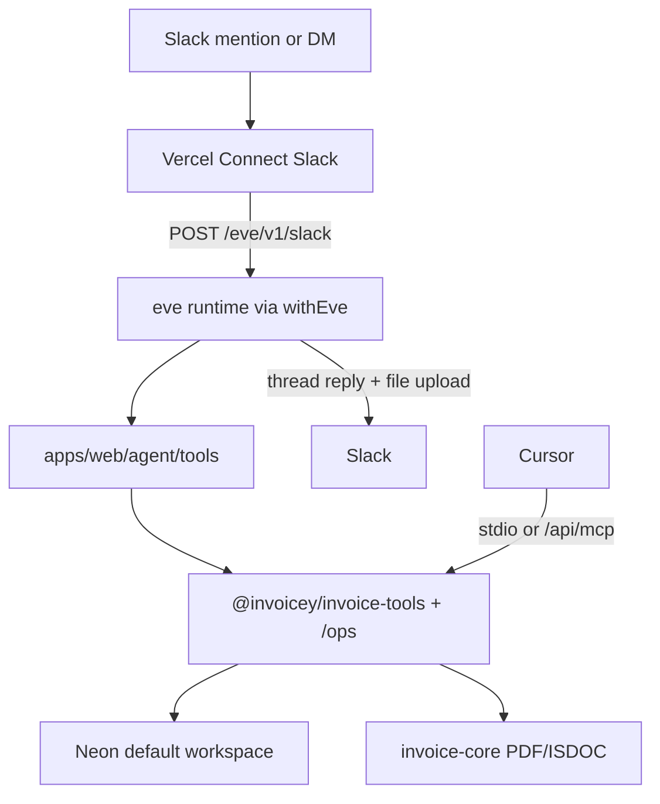

# Slack Eve agent (Plan 13b)

Durable Slack invoicing agent on [Vercel Eve](https://eve.dev/docs), mounted in `@invoicey/web` via `withEve()`. Supersedes the Plan 13a hand-rolled AI loop.

## Architecture



| Piece         | Location                                                                                                     |
| ------------- | ------------------------------------------------------------------------------------------------------------ |
| Agent root    | [`apps/web/agent/`](../../apps/web/agent/)                                                                   |
| Mount         | [`apps/web/next.config.ts`](../../apps/web/next.config.ts) — `withEve(nextConfig)` → `/eve/v1/*`             |
| Slack channel | `agent/channels/slack.ts` — `connectSlackCredentials("slack/invoicey")`                                      |
| HTTP channel  | `agent/channels/eve.ts` — Bearer ops key (`EVE_API_KEY` / `MCP_API_KEY`) **or** user PAT + OIDC + `localDev` |
| Domain ops    | `@invoicey/invoice-tools/ops` (`issueInvoiceById`, `markInvoicePaidById`, list/get)                          |
| Create/render | `@invoicey/invoice-tools` (`createAndRenderInvoice`, presets, ARES)                                          |

**Auth policy**

| Surface                      | Gate                                                     |
| ---------------------------- | -------------------------------------------------------- |
| Slack                        | Vercel Connect (no hand-managed `SLACK_*` once attached) |
| HTTP `/eve/v1/*` (non-Slack) | Bearer ops key or Better Auth user PAT (Plan 16)         |
| Invoice data                 | Single tenant: `INVOICEY_DEFAULT_WORKSPACE_ID`           |

**Out of v1:** per-Slack-user workspace scoping, slash `/invoice`, calling remote `/api/mcp` from Eve. (Human auth is Better Auth OAuth — ADR 0018; HTTP machine auth is ops key or user PAT — ADR 0023.)

## Tools

| Tool                                          | Notes                                                           |
| --------------------------------------------- | --------------------------------------------------------------- |
| `search_business`                             | ARES by company name → matches with IČO + address               |
| `lookup_business`                             | ARES by IČO → full client draft                                 |
| `list_presets` / `get_preset` / `save_preset` | Neon when `DATABASE_URL` set                                    |
| `create_invoice`                              | Draft persist + render; auto-uploads PDF/ISDOC in Slack threads |
| `upload_invoice_files`                        | Explicit upload (by `invoiceId` or base64)                      |
| `list_invoices` / `get_invoice`               | Workspace-scoped follow-ups                                     |
| `issue_invoice`                               | `approval: always()` HITL; numbering + re-upload                |
| `mark_invoice_paid`                           | `approval: always()` HITL                                       |
| `send_invoice_email`                          | `approval: always()` HITL; PDF + optional ISDOC via Resend      |

Skill: `skills/create-czech-invoice.md`.

## You must (human-only setup)

The agent cannot complete these steps:

1. **Vercel CLI login** and link the Invoicey web project (`vercel link` from `apps/web` or the monorepo root that owns the project).
2. **Create Slack Connect client** and point the trigger at Eve:
   ```bash
   vercel connect create slack --triggers
   vercel connect detach <uid> --yes
   vercel connect attach <uid> --triggers --trigger-path /eve/v1/slack --yes
   ```
   UID must match `connectSlackCredentials("slack/invoicey")` in `agent/channels/slack.ts`.
3. In Connect **Advanced**: subscribe to `message.channels` (+ `message.groups` for private), scopes at least `channels:history` / `groups:history`, `files:write`, `files:read`, `chat:write`, `app_mentions:read`, `im:history`, `im:write`; **reinstall** the Slack app.
4. Deploy with experimental eve recognition:
   ```bash
   VERCEL_USE_EXPERIMENTAL_FRAMEWORKS=1 vercel deploy --prod
   ```
   (or `eve deploy` / ensure `withEve` generated services).
5. Set Vercel env: `DATABASE_URL`, `AI_GATEWAY_API_KEY` (or OIDC), `INVOICEY_DEFAULT_WORKSPACE_ID`, `EVE_API_KEY` and/or `MCP_API_KEY`, `NEXT_PUBLIC_APP_URL`, UploadThing if issuer assets needed. Optional: `INVOICEY_AI_MODEL`.
6. Invite the bot to the target channel; run the E2E checklist below once.
7. If Deployment Protection is on, supply a bypass secret for Connect / health checks.

**Runtime:** Node **24+** (eve engines). Local: `node -v` ≥ 24.

## What the agent implements

- `apps/web/agent/**`, `withEve`, domain API extract, Neon wiring, HITL tools, docs, `.env.example`, retirement of Plan 13a `/api/slack/*` routes.

## E2E checklist

| #   | Scenario                       | Pass                                                                         |
| --- | ------------------------------ | ---------------------------------------------------------------------------- |
| 1   | `@Invoicey` + NL invoice + IČO | Draft in Neon; PDF+ISDOC in thread; reply has `invoiceId` + `/invoices/{id}` |
| 2   | Thread follow-up without `@`   | Session continues                                                            |
| 3   | HITL **Issue**                 | Number from scheme; `issued_at`; new PDF                                     |
| 4   | HITL **Mark paid**             | `paid_at` set                                                                |
| 5   | Unpaid list                    | `list_invoices` / `get_invoice` answer from Neon                             |
| 6   | Presets                        | `save_preset` / `list_presets` hit Neon                                      |
| 7   | Deploy                         | `GET /eve/v1/health` OK; Connect hits `/eve/v1/slack`                        |
| 8   | Regression                     | Cursor MCP `create_invoice` + web Issue UI still work                        |

## Deploy note

Production (`inveoiceyai-web` / https://invoicey.ditrich.me) builds with `VERCEL_USE_EXPERIMENTAL_FRAMEWORKS=1`. Eve requires **`ai` ^7** (peer of `eve@0.31.x`). Health probe:

```bash
curl -sS https://invoicey.ditrich.me/eve/v1/health
# {"ok":true,"status":"ready",...}
```

Connect is **not** attached yet — complete the **You must** steps above before Slack E2E.

## Local smoke

```bash
# from apps/web (Node 24+)
bunx eve info
bunx eve build
curl -sS https://invoicey.ditrich.me/eve/v1/health
```

`bun dev` boots Next + eve via `withEve` when credentials allow.

## Related

- Historical Plan 13a: [`slack-bot.md`](./slack-bot.md)
- MCP toolkit: [`mcp.md`](./mcp.md)
- Roadmap Plan 13b: [`../roadmap.md`](../roadmap.md)
