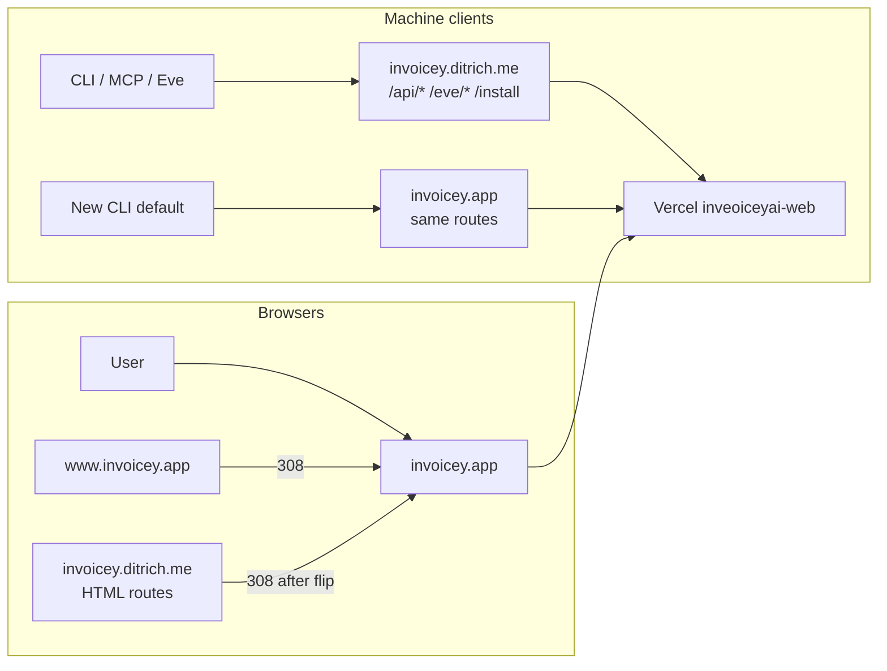

# Standalone domain cutover (`invoicey.app`)

## Goal

Move the public product origin from `https://invoicey.ditrich.me` to
`https://invoicey.app` without breaking OAuth, email, Slack, MCP, CLI, Drive
pairing, or already-issued artifacts.

This is an operator cutover, not a schema change. Neon, UploadThing object
URLs, PATs, Slack identities, and issued PDF/ISDOC bytes stay put. What
changes is the **canonical host**, the **From domain**, and every console that
allowlists a callback or homepage URL.

**Status:** spec only. Do not flip production env until the phased checklist
below is complete. Promote the recommended decisions into ADR 0045 when
execution starts.

## Inputs / outputs

| Surface                          | Input                                         | Output                                             |
| -------------------------------- | --------------------------------------------- | -------------------------------------------------- |
| Browser                          | `invoicey.app` (canonical)                    | Same Next app on Vercel project `inveoiceyai-web`  |
| OAuth                            | Google/GitHub redirect URIs on the new origin | Sign-in works; old origin kept during overlap      |
| Transactional email              | Resend domain `invoicey.app`                  | `invoices@` / `noreply@` on the new domain         |
| MCP / CLI / Eve                  | Bearer tokens (unchanged)                     | Old host keeps serving machine routes for a window |
| Docs, README, PDF footer, emails | Hardcoded `invoicey.ditrich.me`               | `invoicey.app`                                     |
| Already-issued PDFs              | Immutable artifacts (ADR 0021)                | Old footer URL stays; do not regenerate            |

## Recommended decisions

Write these into ADR 0045 when executing. Do not leave them implicit in env.

1. **Canonical origin is the apex:** `https://invoicey.app`.
   `www.invoicey.app` 308-redirects to the apex (path + query preserved).
2. **Keep `invoicey.ditrich.me` attached to the same Vercel project** for a
   deprecation window. Do **not** 308 `/api/mcp`, `/api/companion`,
   `/eve/v1/*`, or `/install` on day one — the CLI uses `redirect: "manual"`
   ([ADR 0044](../decisions/0044-invoicey-cli-companion.md)) and will treat a
   307/308 as a hard error.
3. **Browser routes on the old host 308 to the new host** after OAuth
   callbacks exist on `invoicey.app`. Machine routes keep answering on both
   hosts until a CLI/MCP default-URL release has shipped and users have
   rotated.
4. **Email From moves with the product:**
   `Invoicey <invoices@invoicey.app>` and
   `Invoicey <noreply@invoicey.app>`. Reply-To stays the issuer/user address.
   Keep the old Resend domain verified until the new one has sent real mail
   and webhooks have been observed.
5. **Sessions do not migrate.** Cookies are host-only (`better-auth.session_token`,
   `invoicey_did`, `invoicey_ref`, `NEXT_LOCALE`, `c15t-consent`). Everyone
   signs in again on `invoicey.app`. Database sessions remain valid if a cookie
   is presented; they simply will not be sent to the new host.
6. **Issued PDFs are not rewritten.** The renderer-owned footer on new issues
   links to `https://invoicey.app/`. Historical issued files keep
   `invoicey.ditrich.me` in the footer.

`.app` is on the HSTS preload list. Browsers will never speak HTTP to
`invoicey.app`. Attach the domain in Vercel and wait for a valid certificate
**before** pointing public DNS at it.



## What does not change

| Thing                                          | Why it is safe to leave alone                              |
| ---------------------------------------------- | ---------------------------------------------------------- |
| Vercel project `inveoiceyai-web`               | Same deployment; only hostnames are added                  |
| Neon `DATABASE_URL` / schema                   | No tenant or URL columns store the public host             |
| `BETTER_AUTH_SECRET`                           | Same app; do not rotate as part of this cutover            |
| UploadThing object URLs (`ufs.sh` / `utfs.io`) | Artifacts are on UT, not on our host                       |
| User PATs / `MCP_API_KEY` / `EVE_API_KEY`      | Bearer auth is host-agnostic                               |
| Slack Connect UID `slack/invoicey`             | Connect hits the Vercel deployment, not the marketing host |
| Bank token encryption keys                     | Unrelated                                                  |
| Cron entries in `apps/web/vercel.json`         | Vercel invokes the project, not a public hostname          |
| GitHub repo name `filipditrich/inveoiceyai`    | Installer already pins this                                |
| Drive bundle id `me.ditrich.invoicey.drive`    | Apple identity, not the web host                           |
| `INVOICEY_DRIVE_DMG_URL` (GitHub Releases)     | Stays on GitHub unless you later host the `.dmg` yourself  |

## Phase 0 — Prerequisites (operator, no deploy)

Do these before any DNS or env change.

1. Confirm `invoicey.app` is registered and you control the registrar DNS.
2. Decide the registrar nameservers stay put (add records there) vs move to
   Vercel DNS. Either works; Vercel DNS is simpler for apex + `www`.
3. Inventory who already has the old host hardcoded:
   - `~/.invoicey/cli.json` `apiUrl`
   - Cursor / Claude Code MCP `url`
   - Slack “View in Invoicey” links already posted
   - Invite / referral / Slack-link emails already sent
4. Pick a deprecation window for the old host (recommend **90 days** of
   dual-serve for machine routes).
5. Write ADR 0045 with the six decisions above.

## Phase 1 — Attach the domain, do not flip env

Goal: `invoicey.app` resolves and serves the **current** production deploy,
while `NEXT_PUBLIC_APP_URL` and `BETTER_AUTH_URL` still say
`https://invoicey.ditrich.me`. OAuth on the new host will not work yet. This
is a certificate + DNS rehearsal.

1. Vercel → project `inveoiceyai-web` → Domains:
   - add `invoicey.app`
   - add `www.invoicey.app` (redirect to apex)
   - keep `invoicey.ditrich.me`
2. At the registrar, add the records Vercel shows (apex `A` / `ALIAS`,
   `www` `CNAME`). Do not remove `invoicey.ditrich.me` records.
3. Wait until Vercel shows a valid certificate for both new names.
4. Probe without changing env:

   ```bash
   curl -sSI https://invoicey.app
   curl -sSI https://www.invoicey.app
   curl -sS https://invoicey.app/eve/v1/health
   ```

   Expect the same app. Sign-in on the new host will still bounce to the old
   `BETTER_AUTH_URL` until Phase 3.

## Phase 2 — Allowlist the new origin in every console

Add the new URLs **alongside** the old ones. Do not delete the old callbacks
until Phase 7.

| Console                   | What to add                                                                                                                                                                                                                                            |
| ------------------------- | ------------------------------------------------------------------------------------------------------------------------------------------------------------------------------------------------------------------------------------------------------ |
| Google Cloud OAuth client | Authorized JavaScript origin `https://invoicey.app`. Redirect `https://invoicey.app/api/auth/callback/google`. Homepage / privacy / terms on the consent screen (`docs/ui/brand-assets.md`).                                                           |
| GitHub OAuth App          | Callback `https://invoicey.app/api/auth/callback/github`. Homepage `https://invoicey.app`.                                                                                                                                                             |
| Resend                    | Add and verify domain `invoicey.app` (SPF, DKIM, DMARC). Keep `invoicey.ditrich.me` verified. Add a second webhook endpoint `https://invoicey.app/api/webhooks/resend` **or** keep the existing one on the old host until Phase 4.                     |
| UploadThing               | Allowed origins / CORS: add `https://invoicey.app`.                                                                                                                                                                                                    |
| Slack app (api.slack.com) | Redirect / event URLs only if they currently hardcode `ditrich.me`. Connect trigger path stays `/eve/v1/slack`. Update any “App website” / help URL to `https://invoicey.app`. Reinstall only if Slack says scopes or URLs changed.                    |
| Vercel                    | No Connect recreate. Confirm Deployment Protection bypass still covers Connect + health.                                                                                                                                                               |
| Google Search Console     | Add URL-prefix property `https://invoicey.app/`. Do not drop the old property.                                                                                                                                                                         |
| GitHub repo settings      | Website URL → `https://invoicey.app`.                                                                                                                                                                                                                  |
| Apple Developer (Drive)   | Associated Domains entitlement: `applinks:invoicey.app` (and keep the old host until the Mac app ships a build). Serve `/.well-known/apple-app-site-association` on the new host when the Team ID exists ([`invoicey-drive.md`](./invoicey-drive.md)). |

OAuth redirect URIs must exist **before** `BETTER_AUTH_URL` flips, or
production sign-in breaks for the duration of the deploy.

## Phase 3 — Code: stop hardcoding the old host

`NEXT_PUBLIC_APP_URL` already drives sitemap, robots, metadata, invite links,
Slack “View in Invoicey”, and most email links. The leftovers are the actual
code work.

### Runtime defaults (must change)

| File                                                   | Today                               | Change                                                                    |
| ------------------------------------------------------ | ----------------------------------- | ------------------------------------------------------------------------- |
| `apps/cli/src/config.ts`                               | `DEFAULT_API_URL`                   | `https://invoicey.app`                                                    |
| `apps/cli/src/help.ts`                                 | help text + docs URL                | same                                                                      |
| `apps/web/lib/drive/redirect.ts`                       | `PROD_ORIGIN`                       | `https://invoicey.app` (keep old origin in the allowlist for one release) |
| `packages/invoice-core/src/pdf/InvoicePdfDocument.tsx` | `INVOICEY_SITE_URL`                 | `https://invoicey.app/`                                                   |
| `packages/emails/src/components/email-shell.tsx`       | `DEFAULT_APP_ORIGIN` + footer label | origin + visible host `invoicey.app`                                      |
| `packages/invoice-tools/src/email/from.ts`             | `invoices@` / `noreply@` defaults   | `@invoicey.app`                                                           |
| `apps/web/lib/email/from.ts`                           | same defaults                       | `@invoicey.app`                                                           |
| `packages/env/src/schema.ts`                           | comments                            | new examples                                                              |
| `.env.example`                                         | `EMAIL_FROM` / `EMAIL_SYSTEM_FROM`  | new addresses                                                             |

Prefer deriving the public origin from `NEXT_PUBLIC_APP_URL` where a compile-time
constant is not required (PDF footer and CLI default still need a literal
because they run without the web env).

### Tests that pin the old host

Update fixtures, but keep **one** explicit test that the old Drive origin
remains an allowed redirect during the deprecation window.

- `apps/cli/src/config.test.ts`, `apps/cli/src/client.test.ts`
- `apps/web/lib/drive/redirect.test.ts`
- `apps/web/lib/email/from.test.ts`
- `apps/web/agent/lib/slack-invoice-card.test.ts`
- `packages/emails/src/render.test.ts`
- `packages/invoice-tools/src/email-transport.test.ts`
- `packages/invoice-tools/src/email/email-adapters.test.ts` (inbound example
  host is historical; inbound capture was removed 2026-08-26)

### Docs and marketing copy

User-facing URLs must not stay on `ditrich.me` after the flip.

| Area                      | Files                                                                                                                                                                                                                                                                                                              |
| ------------------------- | ------------------------------------------------------------------------------------------------------------------------------------------------------------------------------------------------------------------------------------------------------------------------------------------------------------------ |
| README + CLI README       | `README.md`, `apps/cli/README.md`                                                                                                                                                                                                                                                                                  |
| Marketing install command | `apps/web/app/(marketing)/page.tsx`                                                                                                                                                                                                                                                                                |
| Public docs               | `apps/web/content/docs/integrations/{cli,mcp,cursor,claude-code,api-keys,invoicey-drive}.mdx`, `guides/sending-email.mdx`, `reference/troubleshooting.mdx`                                                                                                                                                         |
| Internal docs             | `AGENTS.md`, `docs/architecture.md`, `docs/specs/email.md`, `docs/specs/slack-eve.md`, `docs/specs/invoicey-cli.md`, `docs/specs/invoicey-drive.md`, `docs/specs/pdf-rendering.md`, `docs/ui/brand-assets.md`, `docs/decisions/0022`, `0042`, `0044` (0044 body stays historical; new ADR records the new default) |
| Brand / Drive             | `docs/ui/brand-assets.md` Google homepage URLs                                                                                                                                                                                                                                                                     |

Do not rewrite `docs/audit/**` or `output/**` — those are snapshots.

### Auth hardening for two hosts

`apps/web/lib/auth/auth.ts` has no `trustedOrigins` today. During dual-serve,
set:

```ts
trustedOrigins: [
  "https://invoicey.app",
  "https://www.invoicey.app",
  "https://invoicey.ditrich.me",
];
```

`baseURL` stays `env.BETTER_AUTH_URL ?? env.NEXT_PUBLIC_APP_URL` and will
become `https://invoicey.app` in Phase 4.

Optional: a Next.js or Vercel redirect rule that 308s HTML routes from
`invoicey.ditrich.me` → `invoicey.app` while leaving `/api/*`, `/eve/*`,
`/install` alone. Implement this as a host-aware redirect (Vercel domain
redirect, or `next.config` `has.host` rule), not a blanket `/:path*`.

## Phase 4 — Flip production env (one deploy)

Order matters. Do not flip From addresses before Resend shows `invoicey.app`
as verified.

1. Confirm Phase 2 callbacks exist.
2. Deploy the Phase 3 commit (old env still works; new defaults are unused
   until env changes).
3. In Vercel Production env, set:
   - `NEXT_PUBLIC_APP_URL=https://invoicey.app`
   - `BETTER_AUTH_URL=https://invoicey.app`
   - `EMAIL_FROM=Invoicey <invoices@invoicey.app>`
   - `EMAIL_SYSTEM_FROM=Invoicey <noreply@invoicey.app>`
4. Redeploy production so the `NEXT_PUBLIC_*` values bake into the client
   bundle. Preview env can stay on localhost / `ditrich.me` until you want
   preview OAuth on the new host (separate Google/GitHub apps already).
5. Point the Resend **delivery** webhook at
   `https://invoicey.app/api/webhooks/resend` (or keep the old URL if the old
   host still serves it — both hit the same function).

Local `.env` / `.env.local` are operator machines; update when convenient.
Do not commit secrets.

## Phase 5 — Cutover smoke (same day)

Sign in on `https://invoicey.app` (expect a fresh session). Then:

| #   | Check                                                                | Pass                                                                                                        |
| --- | -------------------------------------------------------------------- | ----------------------------------------------------------------------------------------------------------- |
| 1   | Google sign-in                                                       | Lands on `/dashboard`, cookie host is `invoicey.app`                                                        |
| 2   | GitHub sign-in                                                       | Same                                                                                                        |
| 3   | Invite a member                                                      | Mail From is `@invoicey.app`; link is `https://invoicey.app/invite/…`                                       |
| 4   | New-device sign-in email                                             | `noreply@invoicey.app`, trust URL on the new host                                                           |
| 5   | Send an invoice                                                      | From `… via Invoicey <invoices@invoicey.app>`; PDF+ISDOC attached; Resend event hits `/api/webhooks/resend` |
| 6   | Issue a new invoice                                                  | PDF footer links to `https://invoicey.app/`                                                                 |
| 7   | Open an **already-issued** invoice                                   | Stored PDF still renders; do not regenerate                                                                 |
| 8   | `GET https://invoicey.app/eve/v1/health`                             | JSON `ready` (not marketing HTML)                                                                           |
| 9   | Slack: mention + “View in Invoicey”                                  | URL is `invoicey.app/invoices/…`                                                                            |
| 10  | `curl -X POST https://invoicey.app/api/mcp` with a PAT               | Tools still run                                                                                             |
| 11  | `curl -X POST https://invoicey.ditrich.me/api/mcp` with the same PAT | Still JSON (no redirect)                                                                                    |
| 12  | CLI against the **old** `apiUrl`                                     | Still works                                                                                                 |
| 13  | `invoicey login` with no `--api` after a new binary                  | Writes `https://invoicey.app` into `cli.json`                                                               |
| 14  | `/install` on both hosts                                             | Script downloads; does not depend on our host for GitHub Releases                                           |
| 15  | `https://invoicey.app/sitemap.xml` + `/robots.txt`                   | Host is `invoicey.app`                                                                                      |
| 16  | `www.invoicey.app`                                                   | 308 to apex                                                                                                 |
| 17  | Old-host HTML (`/sign-in`, `/docs`, `/r/…`)                          | 308 to the same path on `invoicey.app` once the redirect rule is live                                       |
| 18  | Referral `/r/[code]` on the old host                                 | 308; cookie is set on the **new** host after landing                                                        |
| 19  | Upload issuer logo                                                   | UploadThing CORS allows `invoicey.app`                                                                      |
| 20  | Drive pairing (when AASA exists)                                     | Callback allowlist accepts `https://invoicey.app/drive/oauth`                                               |

## Phase 6 — Client defaults and user notice

Machine clients that already stored the old URL keep working because Phase 1–5
left those routes live on `invoicey.ditrich.me`.

1. Ship a CLI release whose `DEFAULT_API_URL` is `https://invoicey.app`.
   Existing `cli.json` files are **not** rewritten — `resolveSession` prefers
   the saved `apiUrl`. Document `invoicey login` (or a one-line
   `invoicey login --api https://invoicey.app`) as the upgrade path.
2. Publish updated Cursor / Claude Code snippets in `/docs/integrations/*`.
3. If you have a short list of operators, tell them:
   - bookmarked app URL is now `https://invoicey.app`
   - they will be asked to sign in again
   - MCP `mcp.json` `url` should be updated when convenient
   - Slack and PATs do not need to be recreated

## Phase 7 — Deprecate `invoicey.ditrich.me`

After the window (recommend 90 days):

1. Confirm CLI/MCP traffic on the old host is near zero (Vercel logs).
2. 308 **everything** on `invoicey.ditrich.me` to `https://invoicey.app/:path*`.
3. Remove old Google/GitHub redirect URIs.
4. Remove `invoicey.ditrich.me` from `trustedOrigins` and the Drive allowlist.
5. Optionally keep the Resend domain verified forever (harmless) or delete it
   once no mail still references it.
6. Leave the Vercel domain attached as a redirect-only hostname so old
   invite/Slack/PDF links never 404.

Do not delete the `ditrich.me` DNS records until the Vercel redirect is
proven. A dangling apex with no target is worse than a long-lived 308.

## Code and console inventory

### Env (Vercel Production)

| Var                   | New value                          |
| --------------------- | ---------------------------------- |
| `NEXT_PUBLIC_APP_URL` | `https://invoicey.app`             |
| `BETTER_AUTH_URL`     | `https://invoicey.app`             |
| `EMAIL_FROM`          | `Invoicey <invoices@invoicey.app>` |
| `EMAIL_SYSTEM_FROM`   | `Invoicey <noreply@invoicey.app>`  |

Everything else (`DATABASE_URL`, `BETTER_AUTH_SECRET`, Resend API key, Slack
Connect, UploadThing, bank keys, cron secret, AI gateway) stays.

### Hardcoded host (runtime)

- `apps/cli/src/config.ts`, `apps/cli/src/help.ts`
- `apps/web/lib/drive/redirect.ts`
- `apps/web/lib/email/from.ts`
- `apps/web/app/(marketing)/page.tsx` (install curl)
- `packages/invoice-core/src/pdf/InvoicePdfDocument.tsx`
- `packages/emails/src/components/email-shell.tsx`
- `packages/invoice-tools/src/email/from.ts`

### Env-driven already (flip with Phase 4)

- `apps/web/lib/auth/auth.ts` (`baseURL`, invite URLs)
- `apps/web/app/layout.tsx` `metadataBase`
- `apps/web/app/robots.ts`, `apps/web/app/sitemap.ts`
- `apps/web/lib/email/send-invoice.ts`, `security.ts`, `invite.ts`
- `apps/web/lib/payments/send-auto-match-email.ts`
- `apps/web/agent/lib/slack-thread.ts` / invoice cards
- Settings pages that print origin (API keys, referrals, members)

### Docs / agent memory

- `AGENTS.md` production-host paragraph
- `README.md`, `apps/cli/README.md`
- `docs/architecture.md` env table
- `docs/specs/email.md`, `slack-eve.md`, `invoicey-cli.md`, `invoicey-drive.md`, `pdf-rendering.md`
- `docs/ui/brand-assets.md`
- `docs/decisions/0022-resend-and-react-email.md` (historical; new ADR supersedes the From-domain sentence)
- Public MDX under `apps/web/content/docs/`

### Sibling / out-of-repo

| Place                   | Action                                                         |
| ----------------------- | -------------------------------------------------------------- |
| `invoicey-mac`          | Associated Domains + any hardcoded pairing origin              |
| Cursor / Claude configs | Operators update `mcp.json` `url`                              |
| `~/.invoicey/cli.json`  | Operators re-login or pass `--api`                             |
| Slack message history   | Old links 308 once Phase 7 is on; fine during dual-serve       |
| Already-sent mail       | Old links 308; From address on those messages stays historical |

## Email DNS (Resend)

On `invoicey.app` (values come from the Resend domain screen):

| Record   | Name                           | Purpose                            |
| -------- | ------------------------------ | ---------------------------------- |
| MX / TXT | as Resend shows                | Domain verification                |
| TXT      | `resend._domainkey` (or given) | DKIM                               |
| TXT      | `@` SPF                        | `include:resend.com`               |
| TXT      | `_dmarc`                       | Start with `p=none`; tighten later |

Do not put product MX on the apex unless you later revive inbound capture.
Inbound was removed 2026-08-26; `inbox.invoicey.*` is not part of this
cutover. If it returns, prefer `inbox.invoicey.app`.

## Risks

| Risk                                         | Mitigation                                                                                                    |
| -------------------------------------------- | ------------------------------------------------------------------------------------------------------------- |
| OAuth callback mismatch                      | Add new redirect URIs before flipping `BETTER_AUTH_URL`                                                       |
| CLI/MCP 308 → “redirected to …” error        | Dual-serve machine routes; do not blanket-redirect `/api/*` on day one                                        |
| Everyone looks logged out                    | Expected. Tell operators. Soft device-trust cookies also reset                                                |
| Invite/referral/Slack-link mail already sent | Path-preserving 308 or dual-serve                                                                             |
| Eve health returns marketing HTML            | Same `withEve` / turbo-cache trap as today; probe JSON `ready`                                                |
| UploadThing CORS blocks logo upload          | Add origin in the UT dashboard before the first upload on the new host                                        |
| `.app` HSTS, no cert yet                     | Attach domain in Vercel and wait for the cert before advertising the host                                     |
| PDF footer on old invoices                   | Leave them. Regenerating would violate ADR 0021 for issued files                                              |
| Preview deployments                          | Keep preview OAuth apps on `*.vercel.app` / localhost; do not point `BETTER_AUTH_URL` production at a preview |

## Out of scope

- Renaming the GitHub repo or Vercel project
- Moving Neon, Resend, or UploadThing accounts
- Changing the Drive bundle id or CLI binary name
- Self-host / own-host guides
- Reviving inbound email
- Legal-entity copy on `/privacy` `/terms` (still [`launch-readiness.md`](../launch-readiness.md))

## Open questions

- Resolved: registrar is Vercel; nameservers are already `ns1`/`ns2.vercel-dns.com`.
- Resolved: `www.invoicey.app` is attached and should redirect to the apex.
- `TODO(plan-32):` Confirm the old-host machine-route window (90 days
  suggested).
- `TODO(plan-32):` Whether to host `/.well-known/apple-app-site-association`
  in this cutover or wait for the paid Apple team (Drive spec already parks
  this).

## References

- Production host today: `AGENTS.md`, [`architecture.md`](../architecture.md)
- Auth: [ADR 0018](../decisions/0018-better-auth-oauth-only.md),
  `apps/web/lib/auth/auth.ts`
- Email: [ADR 0022](../decisions/0022-resend-and-react-email.md),
  [`email.md`](./email.md)
- CLI no-follow-redirects: [ADR 0044](../decisions/0044-invoicey-cli-companion.md)
- Drive pairing: [ADR 0042](../decisions/0042-drive-device-pairing.md)
- Immutable issued artifacts: [ADR 0021](../decisions/0021-immutable-imported-invoice-artifacts.md)
- Slack: [`slack-eve.md`](./slack-eve.md)
- Brand consoles: [`ui/brand-assets.md`](../ui/brand-assets.md)
- Launch gate: [`launch-readiness.md`](../launch-readiness.md)
