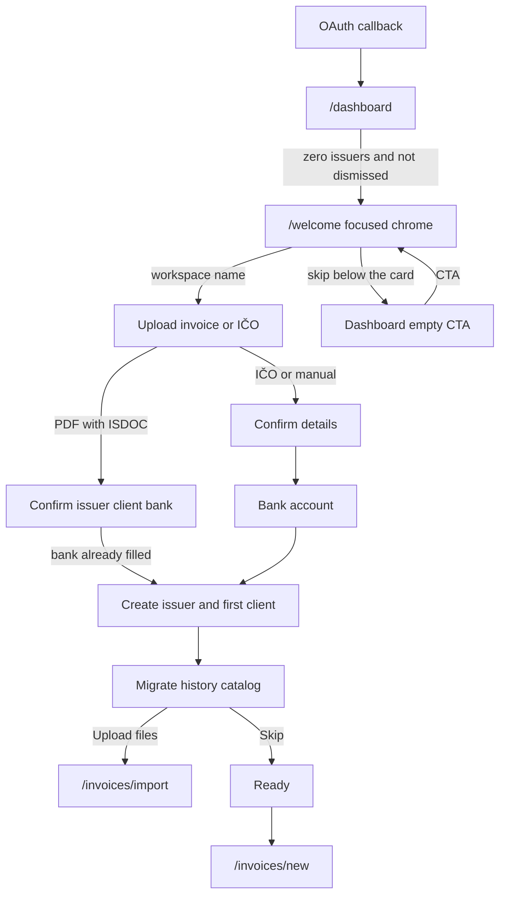

# First-run onboarding (issuer welcome)

**Intent:** After OAuth, a workspace with zero issuers should be guided to create the first issuer (ARES + bank) without blocking recovery paths or settings. Skipping leaves the dashboard empty state.

The welcome route is a **focused flow**: no app sidebar, breadcrumbs, New invoice, or assistant. One step is on screen at a time, with a single primary action.

Optional bootstrap: upload a recent issued PDF with embedded ISDOC. That fills the issuer, bank (Czech IBAN derived from the account number when missing), and first client. Historic bulk import is a later, skippable step — not the same as this one-file bootstrap.

Research for the migrate catalog: [`research/czech-invoicing-platform-migration.md`](../research/czech-invoicing-platform-migration.md).

## Routes

| Route                                                       | Role                                                                                                                                                              |
| ----------------------------------------------------------- | ----------------------------------------------------------------------------------------------------------------------------------------------------------------- |
| `/welcome`                                                  | First-issuer wizard (authenticated). Soft-gated from dashboard / invoices / clients when issuer count is 0 and welcome was not dismissed.                         |
| `/onboarding`                                               | **Workspace recovery only** — signed-in user with no membership. Unrelated to issuer setup or creating additional workspaces (use the sidebar switcher for that). |
| `/issuers/new`                                              | Additional issuer create (same minimum fields as welcome).                                                                                                        |
| `/issuers/[id]/edit/{identity,bank,assets,numbering,email}` | Sectioned issuer settings (Settings-nav pattern).                                                                                                                 |
| `/invoices/import`                                          | Historic file import (also the skip-for-later migrate entry). `?origin=` preselects the source.                                                                   |

## Welcome steps

1. **Workspace** — confirm or change the name created at sign-in. Logo upload stays in workspace settings.
2. **Business** — recommended: drop a recent issued PDF (`parseWelcomeInvoicePdf` → `parseIssuerFromIsdoc` + `parseClientFromIsdoc`). Alternative: IČO → `GET /api/ares/[ico]`, then confirm details. Compact review after a PDF hit; contact email stays required (never invented).
3. **Bank** — account number + IBAN (required by `IssuerSnapshotSchema`). IBAN is auto-suggested from the Czech account number (mod-97 validated). Skipped when the PDF already filled both. BIC is skipped here; it can be added in business settings.
4. **History** — skippable catalog of Czech invoicing tools. **Upload files** is live (`/invoices/import?origin=`). **Connect** tiles are locked. Same catalog appears later on the import page.
5. **Ready** — issuer persisted (and first client when the PDF had a customer); defaults for numbering and email. Primary CTA to create the first invoice; secondary to import history.

**Skip:** “Přeskočit pro teď” sits below the card (not next to Continue) until an issuer exists. It sets `workspaces.metadata.issuerWelcomeDismissedAt` (JSON text column) and redirects to `/dashboard` empty CTA. Creating any issuer clears the soft gate via count &gt; 0. After create, skip on the history step only hides the catalog (`?done=&migrate=1`).

## Soft gate

Implemented in [`apps/web/app/(app)/(gated)/layout.tsx`](<../../apps/web/app/(app)/(gated)/layout.tsx>) for the `(gated)` route group (`/dashboard`, `/invoices`, `/clients`). `/welcome` lives outside that group so RSC redirects cannot loop on a stale `x-pathname`.

Excluded (not gated): `/welcome`, `/issuers/*`, `/settings/*`.

App chrome for `/welcome` is [`OnboardingShell`](../../apps/web/components/onboarding/onboarding-shell.tsx), switched from [`AppShell`](<../../apps/web/app/(app)/app-shell.tsx>) when `isWelcomePath()` matches.

## Issuer edit sections

| Section   | Action                |
| --------- | --------------------- |
| Identita  | `saveIssuerIdentity`  |
| Banka     | `saveIssuerBank`      |
| Assety    | `saveIssuerAssets`    |
| Číslování | `saveIssuerNumbering` |
| E-mail    | `saveIssuerEmail`     |

Create path: `createIssuer` (identity + bank + defaults; optional welcome client).

## Empty / loading / error

- Welcome: pending labels on ARES lookup, PDF parse, save, and skip.
- Section forms: `useTransition` + “Ukládám…”.
- Invalid codes via `?invalid=` (Czech messages in shared lookup helper).
- Success via `?toast=issuer_saved`.

## Layout

## Components

- [`IssuerWelcomeWizard`](../../apps/web/components/issuers/issuer-welcome-wizard.tsx)
- [`issuer-welcome-steps.tsx`](../../apps/web/components/issuers/issuer-welcome-steps.tsx)
- [`MigrationProviderGrid`](../../apps/web/components/onboarding/migration-provider-grid.tsx)
- [`OnboardingShell`](../../apps/web/components/onboarding/onboarding-shell.tsx)
- [`IssuerCreateForm`](../../apps/web/components/issuers/issuer-create-form.tsx)
- Section forms under `apps/web/components/issuers/`
- [`IssuerEditNav`](../../apps/web/components/issuers/issuer-edit-nav.tsx)
