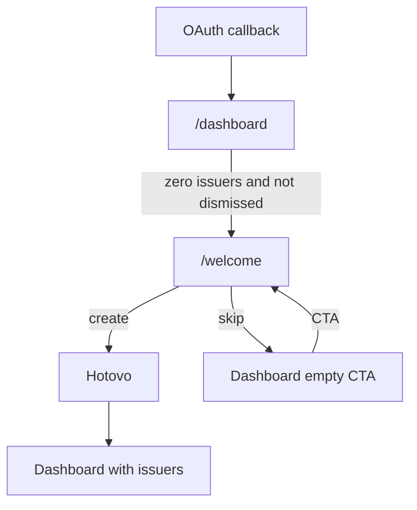

# First-run onboarding (issuer welcome)

**Intent:** After OAuth, a workspace with zero issuers should be guided to create the first issuer (ARES + bank) without blocking recovery paths or settings. Skipping leaves the dashboard empty state.

## Routes

| Route                                                       | Role                                                                                                                                                              |
| ----------------------------------------------------------- | ----------------------------------------------------------------------------------------------------------------------------------------------------------------- |
| `/welcome`                                                  | First-issuer wizard (authenticated). Soft-gated from dashboard / invoices / clients when issuer count is 0 and welcome was not dismissed.                         |
| `/onboarding`                                               | **Workspace recovery only** — signed-in user with no membership. Unrelated to issuer setup or creating additional workspaces (use the sidebar switcher for that). |
| `/issuers/new`                                              | Additional issuer create (same minimum fields as welcome).                                                                                                        |
| `/issuers/[id]/edit/{identity,bank,assets,numbering,email}` | Sectioned issuer settings (Settings-nav pattern).                                                                                                                 |

## Welcome steps

1. **Identita** — IČO → `GET /api/ares/[ico]` → confirm name / address / contact email / VAT.
2. **Banka** — account number + IBAN (required by `IssuerSnapshotSchema`); optional BIC.
3. **Hotovo** — issuer persisted with default numbering schemes and email settings; links to dashboard and edit sections.

**Skip:** “Přeskočit pro teď” sets `workspaces.metadata.issuerWelcomeDismissedAt` (JSON text column) and redirects to `/dashboard` empty CTA. Creating any issuer clears the soft gate via count &gt; 0.

## Soft gate

Implemented in [`apps/web/app/(app)/(gated)/layout.tsx`](<../../apps/web/app/(app)/(gated)/layout.tsx>) for the `(gated)` route group (`/dashboard`, `/invoices`, `/clients`). `/welcome` lives outside that group so RSC redirects cannot loop on a stale `x-pathname`.

Excluded (not gated): `/welcome`, `/issuers/*`, `/settings/*`.

## Issuer edit sections

| Section   | Action                |
| --------- | --------------------- |
| Identita  | `saveIssuerIdentity`  |
| Banka     | `saveIssuerBank`      |
| Assety    | `saveIssuerAssets`    |
| Číslování | `saveIssuerNumbering` |
| E-mail    | `saveIssuerEmail`     |

Create path: `createIssuer` (identity + bank + defaults).

## Empty / loading / error

- Welcome: pending labels on ARES lookup, create, and skip.
- Section forms: `useTransition` + “Ukládám…”.
- Invalid codes via `?invalid=` (Czech messages in shared lookup helper).
- Success via `?toast=issuer_saved`.

## Layout

## Components

- [`IssuerWelcomeWizard`](../../apps/web/components/issuers/issuer-welcome-wizard.tsx)
- [`IssuerCreateForm`](../../apps/web/components/issuers/issuer-create-form.tsx)
- Section forms under `apps/web/components/issuers/`
- [`IssuerEditNav`](../../apps/web/components/issuers/issuer-edit-nav.tsx)
