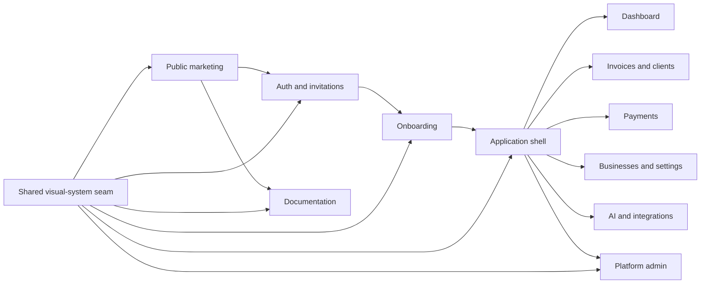

# Invoicey visual system — Structured confidence

## Intent

Invoicey is maturing from a friendly invoicing experiment into a serious
financial operating system. The interface must communicate precision, control,
and trust without becoming sterile. The visual system is dark-first, neutral,
and product-led; orange is a signal for action and state, not a background wash.

The reference set contributes principles rather than assets:

- **xAI:** near-black foundations, sparse chrome, high contrast, and disciplined
  typography;
- **Raycast:** controlled warm light, dimensional product framing, and polished
  navigation;
- **Tembo:** generous composition, direct product storytelling, and confident
  application previews.

Invoicey's own expression is **structured confidence**: clear financial data,
quiet surfaces, exact alignment, intentional motion, and a single orange signal
moving a document from brief to paid.

## Brand hierarchy

1. The product and its data are the hero.
2. The Invoicey mark identifies the system.
3. Orange identifies the next action, active location, or important signal.
4. The document mascot is optional supporting delight on a secondary marketing
   or assistant empty-state surface. It is never the primary logo or the main
   product explanation.

The mature identity must not use peach/chocolate backgrounds, inflated 3D
lettering, glossy skeuomorphism, or mascot-led application chrome.

## Identity system

### Product mark

Create one geometric, code-native SVG mark that evolves the existing
document/check idea into a simple signal:

- a folded document or invoice structure;
- a forward/check gesture that reads as validated and moving toward payment;
- one-color construction that works in orange, white, or black;
- recognizable at 16 px and balanced at 512 px;
- no gradients, shadows, embedded bitmap, word, or enclosing background in the
  canonical SVG.

The wordmark is `Invoicey` in the product typeface with deliberate optical
spacing. Provide mark-only and horizontal lockup SVGs. App icons may place the
mark on a near-black rounded-square field with a restrained orange edge light.

### Product icons

- Use Lucide consistently for interface actions and navigation.
- Default icon size is 16 px with a consistent 1.75 px visual stroke.
- Navigation icons are neutral until active; orange is reserved for the active
  indicator, primary action, or semantic state.
- Do not use emoji, glossy illustrations, or mixed filled/outlined icon families
  for product controls.

## Tokens

Tokens live in `apps/web/app/globals.css`. Callers consume semantic names and do
not introduce route-local copies of the palette.

### Dark mode — default

| Role            | Target character                                         |
| --------------- | -------------------------------------------------------- |
| Canvas          | near-black neutral graphite, approximately `#0b0b0c`     |
| Raised canvas   | approximately `#101012`                                  |
| Card            | approximately `#151517`, with a fine light edge          |
| Popover         | approximately `#19191c`, visibly above cards             |
| Primary text    | soft white, approximately `#f5f5f4`                      |
| Secondary text  | neutral gray, approximately `#a1a1aa`                    |
| Border          | white at 8–12% opacity                                   |
| Input           | inset graphite with a stronger edge than cards           |
| Brand / primary | confident orange, approximately `#f97316`                |
| Brand hover     | a lighter, warmer orange without neon saturation         |
| Focus           | orange ring with enough separation from the control edge |

Orange is limited to roughly ten percent of any application viewport. Large
orange fields are allowed only for an intentional marketing graphic, never for
routine app chrome.

### Light mode — supported

Light mode uses clean cool/off-white neutrals, charcoal text, white cards, and
the same orange signal. It must not restore the old peach/chocolate theme.

### Geometry and depth

- Base radius: 10 px; compact controls: 8 px; large composed surfaces: 14 px.
- Cards use a one-pixel edge and subtle top highlight. Shadows are black/neutral,
  never brown.
- Avoid nested rounded rectangles when spacing or a separator communicates the
  relationship more clearly.
- Use blur and orange glow only for marketing atmosphere and focus, not every
  card.

## Typography

- Continue using Geist Sans and Geist Mono; do not add a second webfont payload.
- Display headings use medium weight, tight tracking, and balanced line breaks.
- Application headings are compact and sentence case.
- Financial amounts, invoice numbers, token counts, dates in dense tables, and
  code/JSON use tabular numerals; use mono only where it improves scanning.
- Uppercase labels are small and sparse. Avoid wide tracking on full sentences.

## Motion

Motion explains cause and progression:

- route progress is a thin orange signal;
- hover/focus transitions are 140–200 ms;
- entering marketing sections may use short opacity/translate reveals;
- the hero may animate a signal through brief → schema → invoice → paid;
- buttons may move at most one pixel on press;
- ambient effects pause when off-screen;
- all non-essential motion stops under `prefers-reduced-motion`.

Do not add continuous animation to authenticated application surfaces, financial
figures, data tables, or primary navigation.

## Experience architecture

The shared seam comprises semantic tokens, `BrandLogo`, core UI primitives,
page headers, app/admin/auth/marketing/docs shells, motion primitives, and
consistent data-display conventions. Route-specific pages may compose these
modules but must not redefine the system.

## Surface requirements

### Marketing

- Use a restrained near-black canvas and framed 64 px navigation.
- Lead with the data-first automation promise and a credible product preview,
  not the mascot.
- The hero graphic demonstrates brief → validated structure → PDF/ISDOC → bank
  match using real product language and representative data.
- Use one controlled orange light/signal across the page.
- Keep the optimized GLB and image fallbacks only as a secondary, non-blocking
  moment. Preserve pointer, touch, reduced-motion, WebGL-failure, and lost-context
  behavior.
- Product screenshots/previews must look populated and operational, not like
  wireframes or empty states.

### Auth, invitations, referrals, and Slack linking

- Use a calm split composition on large screens and a focused single column on
  mobile.
- Present OAuth and trust language directly; do not make the brand art compete
  with the task.
- Invalid/expired states use the same shell, icon language, and recovery CTA.

### Onboarding

- Preserve ARES-first business setup, bank explanation, optional invoice import,
  and the first-invoice activation goal.
- Progress is explicit and linear. The active step uses orange; completed steps
  use neutral success treatment rather than celebration art.

### Application and admin shells

- Use a quiet graphite sidebar without the old peach/chocolate glow.
- Keep `New invoice` visually primary. AI and workspace controls are visible but
  subordinate.
- Active navigation uses a precise orange indicator and neutral selected surface.
- Page chrome aligns to one shared width system; payments must not narrow itself.
- Collapse, mobile sheet, keyboard focus, workspace switching, and settings
  routes retain their behavior.

### Page headers and cards

- Page headers are flat hierarchy, not gradient hero cards on every route.
- Use icon + eyebrow only when it adds orientation.
- Primary actions align with the title; filters remain in list-page headers.
- Cards group decisions or data. A card is not a default wrapper for every text
  block.

### Forms and builders

- Inputs are compact but reach comfortable touch size on phones.
- Required, invalid, disabled, focus, and loading states are unambiguous.
- Preserve the structured invoice builder, line-item operations, local recovery,
  suggestions, and full-height PDF previews.
- Destructive actions remain quiet until invoked, then become unmistakable.

### Tables, ledgers, and charts

- Sticky headers, aligned numeric columns, restrained row hover, and tabular
  numerals are the default.
- Status uses a small dot/badge plus text; color never carries meaning alone.
- Charts use orange as the primary series and neutral secondary series.
- Empty/loading/error states keep the same dimensions to reduce layout shift.

### Documentation and email

- Documentation inherits the neutral dark-first tokens and identity, while
  preserving English content and Fumadocs structure/search.
- Transactional email uses the new rasterized product mark and neutral surfaces;
  customer/issuer branding remains separate from Invoicey product branding.

## Responsive and accessibility contract

- WCAG 2.2 AA contrast for text, controls, focus, and semantic states.
- One `h1` and one `main` landmark per route.
- No horizontal page overflow at Desktop Chrome and Pixel 7 viewports.
- Focus remains visible without relying on hover.
- Icon-only controls have accessible names.
- Mobile controls remain at least 40 px where they are primary actions or form
  inputs; dense desktop tables may stay compact.
- `prefers-reduced-motion` removes non-essential transitions and animation.
- Dark is the default for a fresh visitor; account settings may still select
  light, dark, or system.

## Screenshot acceptance matrix

The new evidence set lives under `docs/audit/rebrand/screenshots/`. Capture both
desktop and representative mobile states where noted. The audit is organized by
shared visual-system family: it demonstrates the common public, authenticated,
form, data, settings, and access-gate treatments without duplicating every route
or transient error state.

| Group        | Required evidence                                                                                                       |
| ------------ | ----------------------------------------------------------------------------------------------------------------------- |
| Public       | desktop and mobile home; docs index; privacy/legal; representative invalid auth/referral state                    |
| Core app     | populated dashboard; invoice list; structured draft builder; issued detail; clients; businesses; mobile navigation |
| Money        | payments ledger with representative history; bank connections; status treatment                                 |
| Automation   | recurring invoices; historical import; JSON entry; integrations; AI usage                                          |
| Settings     | workspace and document appearance                                                                                       |
| Access gates | completed-onboarding redirect and non-admin platform gate                                                              |

Screenshots must contain synthetic or seeded data. Never place credentials,
tokens, private customer data, or production-only identifiers in committed
evidence.

## Completion gates

- Fresh-session default theme is dark; light and system selections still work.
- New mark and lockup are used across web, docs, auth, app/admin chrome, email,
  PWA/browser/social assets, and prepared external-provider PNGs.
- No old peach/chocolate UI treatment remains outside deliberately retained
  historical audit screenshots.
- Representative public and authenticated routes pass existing landmark,
  overflow, and axe checks on desktop and mobile.
- Formatting, lint, typecheck, tests, and production build pass, or any genuine
  environment-only blocker is recorded with an alternate compile check.
- Browser review covers every listed screenshot family and fixes material
  inconsistency before the pull request is opened.
- The pull request includes the screenshot index and the provider-hosted branding
  update checklist.
